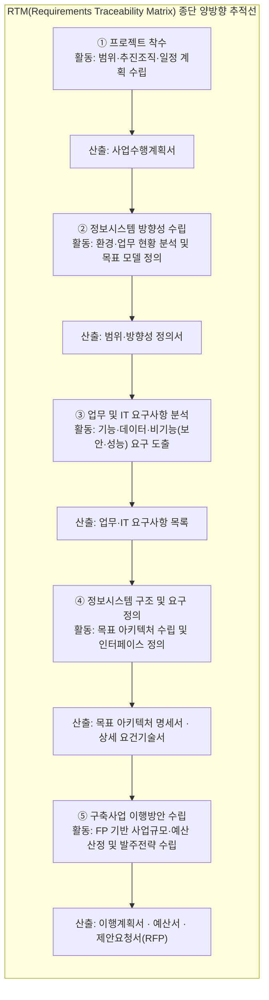
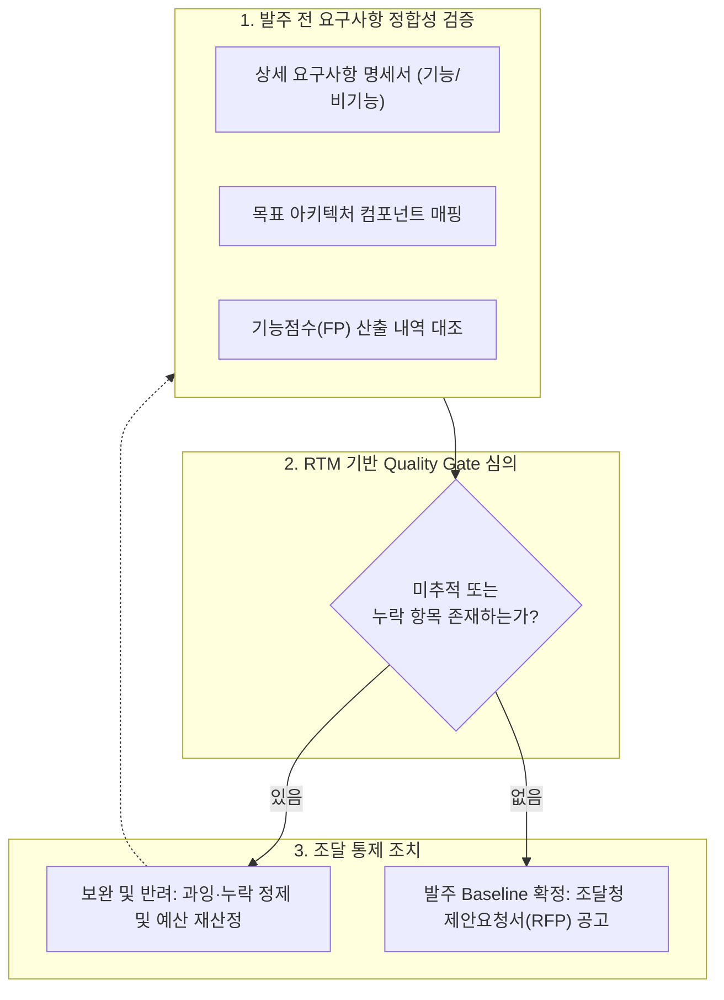

## 지식 로드맵 내 현재 위치

지식 위치: IT 전략·관리 → 정보화 기획·발주 → **ISMP**

## 30초 인출

- 본질: **ISMP(Information System Master Plan)** 는 **ISP(Information Strategy Planning)** 가 선정한 정보화 과제를 조달 가능한 **Baseline** 으로 구체화한다.
- 메커니즘: 요구사항 분석 → 아키텍처 정의 → 규모·예산 산정 → **RFP(Request for Proposal)** 도출 과정을 **RTM(Requirements Traceability Matrix)** 으로 연결한다.
- 산출물: 요구사항 명세서 · 목표 아키텍처 · **FP(Function Point)** 기반 예산서 · **RFP** 이다.

핵심 용어

- **ISMP(Information System Master Plan)** : 선정된 시스템의 요구사항·구조·예산을 발주 가능한 수준으로 구체화한 조달 기준 계획
- **ISP(Information Strategy Planning)** : 조직의 비전과 현황을 바탕으로 정보화 방향과 투자 과제를 선정하는 중장기 전략 계획
- **Baseline(기준선)** : 승인된 범위·요구사항·비용을 변경 관리 및 통제 기준으로 삼는 공식 기준선
- **RTM(Requirements Traceability Matrix)** : 요구사항을 설계·비용·계약 산출물과 양방향으로 연결해 누락과 과잉 반영을 검증하는 추적표
- **FP(Function Point)** : 사용자에게 제공되는 논리적 기능을 측정하여 소프트웨어 규모와 대가를 산정하는 기법
- **RFP(Request for Proposal)** : 발주자가 제안사에 구축 범위·요구사항·평가 기준·계약 조건을 제시해 제안을 요청하는 문서

## 예상문제

> ISMP(Information System Master Plan)의 개념과 방법론 체계를 설명하고, 단계별 활동·산출물, ISP와의 차이 및 구축사업 이행방안의 실효성 확보 방안을 제시하시오.

## Ⅰ. ISMP의 개요

- 정의: 특정 정보시스템의 **요구사항** 을 **FP(Function Point) 산정 수준** 으로 상세화하여 **RFP(Request for Proposal)** 와 발주 **Baseline** 을 수립하는 활동
- 목적: 과업 범위 기준선을 확정하고 요구사항 추적성을 확보해 조달 분쟁·과업 변경을 방지하는 것

## Ⅱ. ISMP 구성체계 및 5단계 방법론

> 각 단계는 입력 → 활동 → 산출물로 전개되며, 최초 업무 요구사항이 최종 RFP까지 단절 없이 이어져야 함.

## Ⅲ. ISP와 ISMP의 차이점

> ISP는 전사 관점의 투자 과제를 선정하고, ISMP는 선택된 개별 시스템을 발주 Baseline으로 구체화함.

| 비교축 | ISP | ISMP |
|---|---|---|
| 목적 | 정보화 과제·투자 우선순위 선정 | 발주 범위·비용 기준선(Baseline) 확정 |
| 대상 범위 | 전사 조직 및 업무 전반 | 특정 정보시스템 구축 사업 |
| 분석 상세도 | 전략 및 개념적 아키텍처 수준 | 상세 요구사항 및 **FP 산정 가능 수준** |
| 핵심 산출물 | 정보화 과제 목록 · 우선순위 · 중장기 로드맵 | 상세 요구사항 명세서 · 목표 아키텍처 · 예산서 · **RFP** |
| 종료 기준 | 최적 투자 과제 선정 및 경영진 승인 | 발주 Baseline 확정 |

## Ⅳ. 구축사업 이행방안의 문제점·대응책

> 조달 전 Quality Gate에서 범위·비용·계약의 연결성을 선제적으로 검증해야 구축 단계의 예산 초과 및 과업 변경을 방지할 수 있음.

| 위험 | 대책 | 효과 |
|---|---|---|
| 잦은 과업 변경 | **RTM** 기반 요구사항 전수 점검 | 미반영 요구사항 및 과잉 설계 제거 |
| 예산 왜곡 및 초과 | **FP** 와 인프라·운영 비용 분리 산정 | 기능 규모와 예산 일치 확보 |
| 구조적 불일치 | 요구사항별 아키텍처 구성요소 1:1 매핑 | 누락 및 중복 제거 |
| 발주·계약 분쟁 | RFP 내 검수조건 및 발주단위 명시 | 명확한 검수 및 책임 소재 확정 |

## Ⅴ. Traceability 중심의 기술사적 제언

### 실전 답안용 기술사적 제언

- 문제: 산출물별(요구사항-설계-비용-RFP) 검토가 분절되어 구축 단계에서 미반영 요구사항 분쟁과 예산 부족 사태가 반복됨.
- 해결 방안: 발주 전 RTM 기반 Quality Gate 심의를 의무화하여, 모든 상세 기능 요구사항이 목표 아키텍처 및 FP 예산 항목과 1:1로 매핑되었는지 검증하고 미추적 항목이 존재할 경우 발주를 보완·반려함.

## 1교시 10점 답안 발췌

### 1. 정의·목적

- 정의: 특정 정보시스템의 요구사항을 **FP 산정 수준** 으로 구체화하여 발주 **Baseline** 을 수립하는 활동
- 목적: 과업 범위 기준선 확정을 통한 조달 분쟁 방지 및 과업 변경 최소화

### 2. ISMP 5단계 방법론·RTM 추적체계

### 3. ISP와 ISMP 비교

| 비교축 | ISP | ISMP |
|---|---|---|
| 목적 | 정보화 과제·투자 우선순위 선정 | 발주 범위·비용 기준선(Baseline) 확정 |
| 대상 범위 | 전사 조직 및 업무 전반 | 특정 정보시스템 구축 사업 |
| 분석 상세도 | 전략 및 개념적 아키텍처 수준 | 상세 요구사항 및 FP 산정 가능 수준 |
| 핵심 산출물 | 정보화 과제 목록 · 우선순위 · 로드맵 | 요구사항 명세서 · 아키텍처 · 예산서 · RFP |
| 종료 기준 | 최적 투자 과제 선정 및 경영진 승인 | 발주 Baseline 확정 |

## 출제 이력과 검증 출처

- 제138회 정보관리기술사 2교시: ISP 정의·목적, 수행방법론, ISP·ISMP 비교
- 한국지능정보사회진흥원(NIA), [ISP·ISMP 수립 공통가이드 제9판](https://nia.or.kr/site/nia_kor/ex/bbs/View.do?bcIdx=28088&cbIdx=99835&parentSeq=28088)

## 학습 체크

- [ ] Ⅰ 개요: ISMP를 `특정 시스템 · FP 산정 수준 · 발주 Baseline`으로 정의하고 목적을 말할 수 있는가?
- [ ] Ⅱ 방법론: 5단계를 순서대로 쓰고, 각 단계의 **활동과 산출물** 을 한 쌍으로 재현할 수 있는가?
- [ ] Ⅲ 비교: ISP와 ISMP를 `목적 · 대상 범위 · 분석 상세도 · 핵심 산출물 · 종료 기준` 5개 축으로 비교할 수 있는가?
- [ ] Ⅳ 통제: `위험 · 대책 · 효과`를 기준으로 구축사업 이행방안의 조달 위험 통제 방안을 설명할 수 있는가?
- [ ] Ⅴ 제언: 문서 분량이 아닌 Traceability 중심의 RTM 기반 Quality Gate를 통과 조건으로 제시할 수 있는가?

## 연결 토픽

- 이전 토픽: [IT 전략·관리 개요](./index.md)
- 연관 토픽: [ISP](./003_isp.md), [과업심의](./091_public_sw_cost_and_scope_change_criteria.md)
- 다음 토픽: [ISO/IEC 38500](./002_iso_iec_38500.md)
