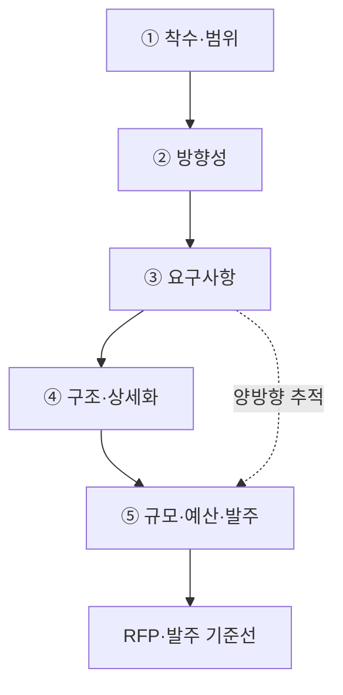
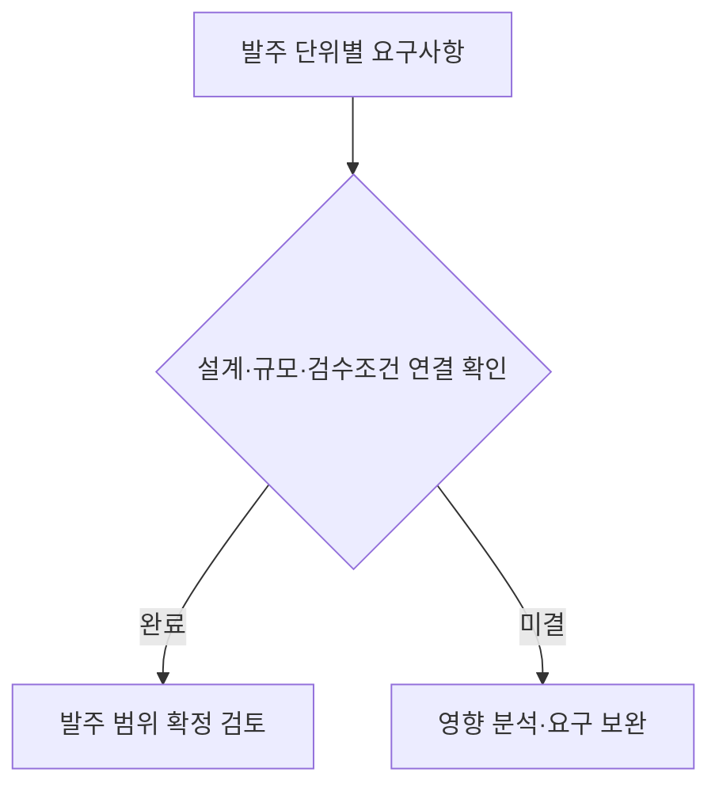

## 지식 로드맵 내 현재 위치

지식 위치: IT 전략·관리 → 정보화 기획·발주 → **ISMP**

## 30초 인출

- 본질: ISMP(Information System Master Plan, 정보시스템 마스터플랜)는 이미 선정한 정보화 사업의 기능·시스템 구조·비용을 발주 가능한 수준으로 구체화하는 정보화 계획
- 메커니즘: 요구사항 분석에 따른 아키텍처·규모·예산·**RFP(Request for Proposal)** 구체화와 **RTM(Requirements Traceability Matrix)** 기반 반영 여부 추적

핵심 용어

- **ISMP(Information System Master Plan)** : 선정된 시스템의 요구사항·구조·예산을 발주 가능한 수준으로 구체화한 조달 기준 계획
- **ISP(Information Strategy Planning)** : 조직의 비전과 현황을 바탕으로 정보화 방향과 투자 과제를 선정하는 중장기 전략 계획
- **Baseline(기준선)** : 승인된 범위·요구사항·비용을 변경 관리 및 통제 기준으로 삼는 공식 기준선
- **RTM(Requirements Traceability Matrix)** : 요구사항을 설계·비용·계약 산출물과 양방향으로 연결해 누락과 과잉 반영을 검증하는 추적표
- **FP(Function Point)** : 사용자에게 제공되는 논리적 기능을 측정하여 소프트웨어 규모와 대가를 산정하는 기법
- **RFP(Request for Proposal)** : 발주자가 제안사에 구축 범위·요구사항·평가 기준·계약 조건을 제시해 제안을 요청하는 문서

---

## 1교시 예상문제 (10점)

> ISMP에 관하여 설명하시오. (예상·10점)

---

## 1교시 10점 답안

### Ⅰ. 개요

| 구분 | 핵심 |
|---|---|
| 정의 | **ISMP** 는 특정 정보시스템의 요구사항·구조·규모·비용을 발주 가능한 수준으로 구체화하는 정보화 계획 |
| 목적 | 발주 범위·비용 기준의 명확화와 누락·변경 분쟁 감소 |

### Ⅱ. ISMP 5단계 방법론·RTM 추적체계

### Ⅲ. ISP와 ISMP 비교

| 비교축 | ISP | ISMP |
|---|---|---|
| 목적 | 정보화 과제·투자 우선순위 선정 | 발주 범위·비용 기준선(Baseline) 확정 |
| 대상 범위 | 전사 조직 및 업무 전반 | 특정 정보시스템 구축 사업 |
| 분석 상세도 | 전략 및 개념적 아키텍처 수준 | 상세 요구사항 및 FP 산정 가능 수준 |
| 핵심 산출물 | 정보화 과제 목록 · 우선순위 · 로드맵 | 요구사항 명세서 · 아키텍처 · 예산서 · RFP |
| 종료 기준 | 최적 투자 과제 선정 및 경영진 승인 | 발주 Baseline 확정 |

- 한 줄 제언: 발주 전 요구사항·설계·규모산정·RFP 간 추적성 확인을 통한 누락 감소

---

## 2~4교시 예상문제 (25점)

> ISMP(Information System Master Plan)의 개념과 방법론 체계를 설명하고, 단계별 활동·산출물, ISP와의 차이 및 구축사업 이행방안의 실효성 확보 방안을 제시하시오. (예상·25점)

---

## 2~4교시 25점 답안

## Ⅰ. ISMP의 개요

| 구분 | 핵심 |
|---|---|
| 정의 | **ISMP** 는 특정 정보시스템의 요구사항·구조·규모·비용을 발주 가능한 수준으로 구체화하는 정보화 계획 |
| 목적 | 발주 범위·비용 기준의 명확화와 누락·변경 분쟁 감소 |

## Ⅱ. ISMP 구성체계 및 5단계 방법론

> 요구사항의 조달 가능한 기준선 구체화와 추적성에 기반한 누락 방지

## Ⅲ. ISP와 ISMP의 차이점

> ISP의 전사 투자 과제 선정과 ISMP의 개별 시스템 발주 기준선 구체화

| 비교축 | ISP | ISMP |
|---|---|---|
| 목적 | 정보화 과제·투자 우선순위 선정 | 발주 범위·비용 기준선(Baseline) 확정 |
| 대상 범위 | 전사 조직 및 업무 전반 | 특정 정보시스템 구축 사업 |
| 분석 상세도 | 전략 및 개념적 아키텍처 수준 | 상세 요구사항·규모·비용 산정 수준 |
| 핵심 산출물 | 정보화 과제 목록 · 우선순위 · 중장기 로드맵 | 상세 요구사항 명세서 · 목표 아키텍처 · 예산서 · **RFP** |
| 종료 기준 | 최적 투자 과제 선정 및 경영진 승인 | 발주 Baseline 확정 |

## Ⅳ. 구축사업 이행방안의 한계·대응책

> 조달 전 Quality Gate를 통한 범위·비용·계약 간 연결성 확인과 구축 단계의 예산 초과·과업 변경 예방

| 위험 | 대책 | 효과 |
|---|---|---|
| 잦은 과업 변경 | **RTM** 기반 요구사항 전수 점검 | 미반영 요구사항 및 과잉 설계 제거 |
| 예산 왜곡 및 초과 | **FP** 와 인프라·운영 비용 분리 산정 | 기능 규모와 예산 일치 확보 |
| 구조적 불일치 | 요구사항별 아키텍처 구성요소 1:1 매핑 | 누락 및 중복 제거 |
| 발주·계약 분쟁 | RFP 내 검수조건 및 발주단위 명시 | 명확한 검수 및 책임 소재 확정 |

## Ⅴ. 기술사적 제언 — 미결 요구가 있는 발주 단위는 분리 검토

> 제안: 발주 단위 확정 전 설계·규모·검수조건 미결 항목의 별도 표시와 영향도에 따른 확정 우선순위 결정

Ⅳ절의 발주 위험·대책 비교와 구분되는 **미결 요구의 발주 범위 반영 여부 판단 절차**. 미결 항목의 일괄 제외나 자동 승인이 아닌 영향도별 검토

## 출제 이력과 검증 출처

- 제138회 정보관리기술사 2교시: ISP 정의·목적, 수행방법론, ISP·ISMP 비교
- 한국지능정보사회진흥원(NIA), [ISP·ISMP 수립 공통가이드 제9판](https://nia.or.kr/site/nia_kor/ex/bbs/View.do?bcIdx=28088&cbIdx=99835&parentSeq=28088)

## 연결 토픽

- 이전 토픽: [IT 전략·관리 개요](./index.md)
- 연관 토픽: [ISP](./003_isp.md), [과업심의](./091_public_sw_cost_and_scope_change_criteria.md)
- 다음 토픽: [ISO/IEC 38500](./002_iso_iec_38500.md)
