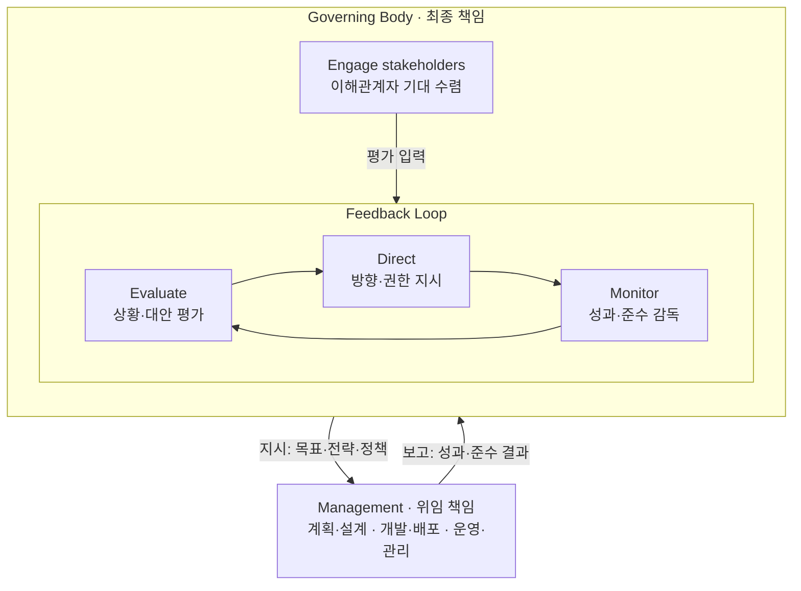
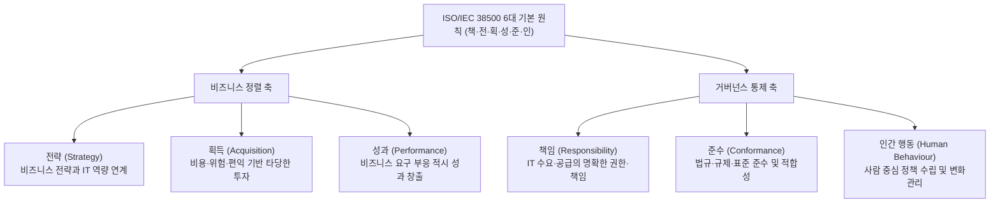
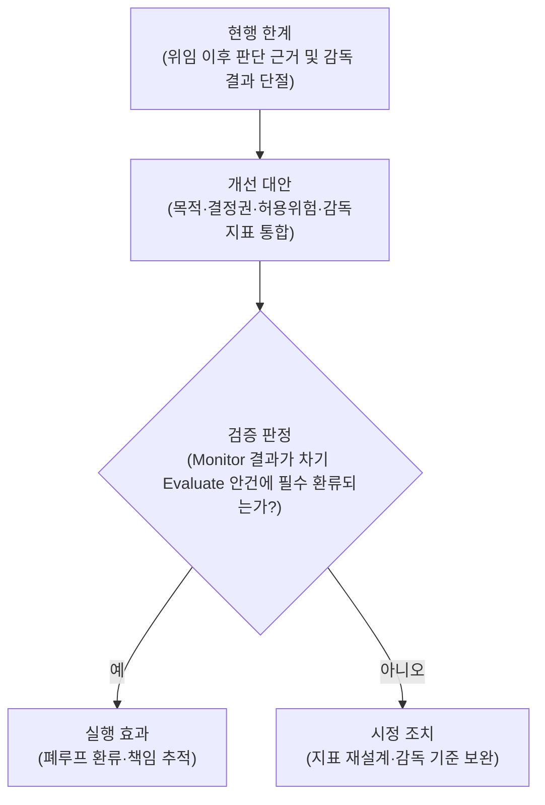

## 지식 로드맵 내 현재 위치

IT 전략·관리IT 거버넌스<strong>ISO/IEC 38500</strong>

## 30초 인출

- 본질: **ISO/IEC 38500**은 IT를 IT 전담 부서에만 맡기지 않고 거버넌스 기구(이사회·경영진)가 IT 사용을 직접 판단·감독하게 하는 최상위 IT 거버넌스 원칙 표준
- 메커니즘: 이해관계자 요구 수렴 → **EDM(Evaluate, Direct and Monitor)** 폐루프 순환 → 6대 원칙 준수 감독
- 산출물: IT 거버넌스 기본 방침 · 위임 기준 · 성과·준수 평가 보고서

핵심 용어

- **EDM(Evaluate, Direct and Monitor)**: 평가(Evaluate)·지시(Direct)·모니터링(Monitor) 결과를 다음 평가에 지속 환류하는 IT 거버넌스 순환
- **6대 기본 원칙(책·전·획·성·준·인)**: 책임(Responsibility), 전략(Strategy), 획득(Acquisition), 성과(Performance), 준수(Conformance), 인간 행동(Human Behaviour)
- **Governing Body**: 조직의 IT 사용 방향과 통제에 최종 책임을 지는 거버넌스 기구(이사회·경영진)
- **Feedback Loop**: 모니터링 결과를 다음 평가의 근거로 되돌리는 폐루프 통제 체계
- **거버넌스 프레임워크 6요소**: Direction, Capability, Policy, Delegation, Performance, Accountability

## 예상문제

> ISO/IEC 38500의 개념과 EDM 거버넌스 모델을 설명하고, 거버넌스와 경영관리의 역할, 6대 기본 원칙(책·전·획·성·준·인) 및 프레임워크 요소, 현장 적용 시 문제점과 대응책을 제시하시오. (25점)

## Ⅰ. IT 사용의 판단 책임을 정립하는 ISO/IEC 38500

> ISO/IEC 38500은 IT 부서의 운영 절차가 아니라 거버넌스 기구의 판단 기준이며, 권한은 위임해도 최종 책임은 이전되지 않음

- 정의: 조직의 IT 사용을 위한 **거버넌스 원칙·모델·프레임워크**를 제시하는 국제표준
- 목적: **Effective performance · Responsible stewardship · Ethical behaviour**의 3대 거버넌스 성과

## Ⅱ. EDM 순환과 거버넌스·경영관리의 역할

> 거버넌스 기구의 EDM은 경영관리의 실행을 대신하지 않으며, 지시는 목표·전략·정책으로 내려가고 보고는 성과·준수 결과로 올라와 다음 평가에 환류됨

## Ⅲ. ISO/IEC 38500 6대 기본 원칙과 거버넌스 프레임워크

> 6대 원칙(책·전·획·성·준·인)은 의사결정의 판단 기준을, 6개 프레임워크 요소는 이를 조직 안에서 작동시키는 통제 구조를 제공함

### 1. 6대 기본 원칙 (책·전·획·성·준·인) 구조 체계

### 2. 6대 기본 원칙 상세

| 원칙 | 영문 명칭 | 핵심 내용 및 실무 점검 기준 |
|---|---|---|
| **책임** | Responsibility | IT 자원의 공급과 수요에 대해 개인이 권한과 책임을 명확히 인지하고 수용 |
| **전략** | Strategy | 비즈니스 전략과 IT 역량의 전략적 정렬 및 지속적인 경쟁 우위 확보를 위한 IT 활용 |
| **획득** | Acquisition | 유효한 비즈니스 케이스(비용, 위험, 기대효과) 분석에 기반한 합리적 IT 투자 |
| **성과** | Performance | 비즈니스 요구사항을 적시에 충족하며 목표한 서비스 품질과 비즈니스 가치 제공 |
| **준수** | Conformance | 법률, 규제, 계약, 조직 내 정책 및 표준에 대한 엄격한 준수와 적합성 보장 |
| **인간 행동** | Human Behaviour | 모든 이해관계자의 인간적 행동 특성, 역량, 조직 문화를 고려한 변화관리 |

### 3. 거버넌스 프레임워크 6요소

| 요소 | 역할 | 확인 |
|---|---|---|
| **Direction** | IT 사용 방향 | 조직 목표·외부 요구 반영 |
| **Capability** | 디지털 역량 | 역량 식별·확보·조정 |
| **Policy** | IT 사용 경계 | 전략 결정의 정책화 |
| **Delegation** | 권한·책임 위임 | 위임 범위·감독 기준 |
| **Performance** | 기대성과 | 성과 기준·개선 환류 |
| **Accountability** | 책임·준수 입증 | 결정권자·증적 추적 |

## Ⅳ. ISO/IEC 38500 적용 문제점·대응책

> 선언적 원칙을 의사결정 증적과 측정 가능한 감독 기준으로 전환해야 거버넌스가 회의체 운영에 머물지 않음

| 위험 | 대책 | 효과 |
|---|---|---|
| IT 의사결정의 실무부서 편중 | 투자·위험 의사결정권 명문화 | 책임 소재 추적 |
| 운영지표 중심 성과 보고 | 조직 목적·가치·위험 지표 연결 | 가치 중심 감독 |
| 위임 후 감독 공백 | 정기 보고·예외 상향 기준 설정 | 잔여위험 조기 노출 |

## Ⅴ. 의사결정 환류 중심의 기술사적 제언

> 거버넌스 성숙도는 회의체 수가 아니라 판단 근거·위임·감독 결과가 하나의 Feedback Loop로 이어지는가로 판정함

### 학습자 통찰 메모 — 답안 밖

- `[핵심 통찰]`: ISO/IEC 38500의 핵심은 IT 의사결정을 경영진에게 떠넘기는 것이 아니라, 누가 어떤 근거로 판단했고 결과를 어떻게 다시 평가했는지 책임의 고리를 닫는 데 있음.
- `나라면`: 주요 IT 투자마다 목적·결정권자·허용위험·감독지표를 한 장에 묶고, Monitor 결과를 다음 Evaluate 안건의 필수 입력으로 사용하겠음.

### 실전 답안용 기술사적 제언

- 판정: IT 투자 판단의 목적·결정권·허용위험·감독 결과가 EDM 순환으로 연결되는지 확인
- 대안: 거버넌스 기구의 지시(목표·전략·정책)와 경영관리층의 보고(성과·준수)를 의사결정 기록으로 연결
- 검증: Monitor 결과가 차기 Evaluate 안건의 입력으로 환류되는지 점검
- 효과: 중복 투자·섀도우 IT·책임 공백 축소

## 1교시 10점 답안 발췌

### 1. 정의·목적

- 정의: **ISO/IEC 38500**은 거버넌스 기구가 조직의 IT 사용을 판단·감독하도록 원칙·모델·프레임워크를 제시하는 국제표준
- 목적: Effective performance · Responsible stewardship · Ethical behaviour의 3대 거버넌스 성과

### 2. **EDM(Evaluate, Direct and Monitor)** 모델과 역할 경계

### 3. 6대 기본 원칙·프레임워크와 결론

- 원칙: **6대 기본 원칙(책·전·획·성·준·인)** → 책임, 전략, 획득, 성과, 준수, 인간 행동
- 프레임워크: Direction · Capability · Policy · Delegation · Performance · **Accountability**
- 결론: 위임은 실행 권한을 나누지만 최종 책임을 이전하지 않음

## 출제 이력과 검증 출처

- 공식 문제지 원문을 확인한 직접 기출 없음
- [ISO, ISO/IEC 38500:2024](https://www.iso.org/standard/81684.html)
- [ISO/IEC 38500:2024 미리보기(목차·용어 정의·거버넌스 성과)](https://cdn.standards.iteh.ai/samples/81684/61bc5f7eee154e2cad5dbdb72f95d208/ISO-IEC-38500-2024.pdf)
- [ISO/IEC JTC 1/SC 40, ISO/IEC 38500:2015와 2024의 차이](https://committee.iso.org/sites/jtc1sc40/home/projects/wg-1/published-wg1/content-left-area/isoiec-sc-40-wg-1-develops-the-s/white-paper-on-the-differences-b.html)
- [AS 8015, Australian Standard for Corporate Governance of Information and Communication Technology (ISO 38500의 모태)](https://standards.org.au)

## 학습 체크

- [ ] Ⅰ: 정의 1줄과 3대 거버넌스 성과를 쓰고, 위임해도 최종 책임이 남는 이유를 말할 수 있는가?
- [ ] Ⅱ: Governing Body의 Engage stakeholders·EDM·Feedback과 Management를 두 상자로 그리고, 지시(목표·전략·정책)·보고(성과·준수 결과) 화살표를 방향대로 넣을 수 있는가?
- [ ] Ⅲ: 6대 기본 원칙(책·전·획·성·준·인)을 비즈니스 정렬과 거버넌스 통제의 2축으로 그리고, 6개 프레임워크 요소를 재현할 수 있는가?
- [ ] Ⅳ: 위험·대책·효과 세 쌍을 재현할 수 있는가?
- [ ] Ⅴ: Monitor 결과를 Evaluate에 환류하는 통제안을 제시할 수 있는가?

## 연결 토픽

- [ISP](./003_isp.md) · [PMO](./004_pmo.md) · [ITSM](./044_itsm.md)
