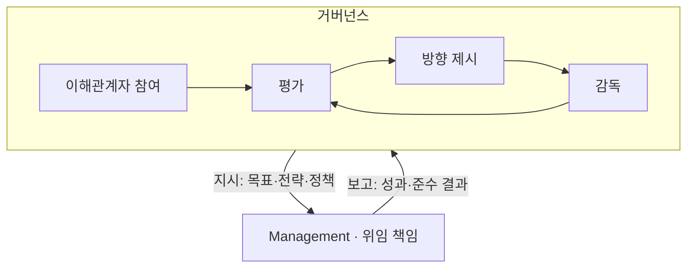

## 지식 로드맵 내 현재 위치

지식 위치: IT 전략·관리 → IT 거버넌스 → **ISO/IEC 38500**

## 30초 인출

- 본질: **ISO/IEC 38500** 은 조직의 현재·미래 IT 사용에 관한 거버넌스 지침을 제시하는 국제표준이다.
- 메커니즘: 이해관계자를 참여시키고 IT 사용을 평가·지시·감독해 조직 거버넌스에 연결한다.

핵심 용어

- **EDM(Evaluate, Direct and Monitor)** : IT 성과와 요구를 평가하고 방향을 지시하며 실행 결과를 모니터링하는 거버넌스 통제 순환
- **6대 기본 원칙(2015판)** : 책임·전략·획득·성과·준수·인간 행동으로 구성된 이전 판의 원칙
- **Governing Body** : 조직의 IT 사용 방향과 통제에 최종 책임을 지는 이사회·경영진 등 최고 거버넌스 기구
- **Feedback Loop** : 모니터링 결과를 다음 평가의 근거로 되돌려 통제 의사결정을 갱신하는 폐루프
- **거버넌스 프레임워크** : 조직의 IT 거버넌스와 경영관리가 함께 작동하도록 하는 정책·의사결정·책임 체계

## 예상문제

> ISO/IEC 38500:2024의 목적과 거버넌스 모델을 설명하고, IT 거버넌스 적용 시 문제점과 대응책을 제시하시오. (25점)

## Ⅰ. ISO/IEC 38500의 개요

- 정의: 조직의 현재·미래 IT 사용을 효과적·효율적·수용 가능하게 거버넌스하는 지침 표준
- 목적: 조직 목적과 이해관계자 요구에 맞게 IT 사용을 책임 있게 이끄는 것

## Ⅱ. EDM 순환과 거버넌스·경영관리의 역할

> 거버넌스는 방향과 감독을 정하고 경영관리는 그 범위 안에서 실행한다. 이해관계자 참여와 **Feedback Loop** 가 두 역할을 잇는다.

## Ⅲ. 판본에 따른 원칙의 구분

> 책임·전략·획득·성과·준수·인간 행동은 2015판의 여섯 원칙이다. 2024판은 ISO 37000의 조직 거버넌스 원칙을 IT 맥락에 적용하므로 판본을 표시해 혼용을 막는다.

### 2015판의 여섯 원칙

| 원칙 | 핵심 내용 및 실무 점검 기준 |
|---|---|
| **책임** Responsibility | IT 자원의 공급과 수요에 대해 개인이 권한과 책임을 명확히 인지하고 수용 |
| **전략** Strategy | 비즈니스 전략과 IT 역량의 전략적 정렬 및 지속적인 경쟁 우위 확보를 위한 IT 활용 |
| **획득** Acquisition | 유효한 비즈니스 케이스(비용, 위험, 기대효과) 분석에 기반한 합리적 IT 투자 |
| **성과** Performance | 비즈니스 요구사항을 적시에 충족하며 목표한 서비스 품질과 비즈니스 가치 제공 |
| **준수** Conformance | 법률, 규제, 계약, 조직 내 정책 및 표준에 대한 엄격한 준수와 적합성 보장 |
| **인간 행동** Human Behaviour | 모든 이해관계자의 인간적 행동 특성, 역량, 조직 문화를 고려한 변화관리 |

2024판은 **효과적 성과**, **책임 있는 청지기 역할**, **윤리적 행동**이라는 조직 거버넌스 성과를 IT 거버넌스에 연결한다. 2015판의 여섯 원칙을 현행판의 원칙으로 그대로 제시하지 않는다.

2024판 거버넌스 프레임워크의 요소는 원칙을 조직의 의사결정과 관리에 연결한다.

| 요소 | 역할 |
|---|---|
| **Direction** | IT 사용 방향을 조직 목표·이해관계자 요구와 정렬 |
| **Capability** | 필요한 디지털 역량을 식별·조정·관리 |
| **Policy** | IT 사용에 관한 지침과 관리 경계를 설정 |
| **Delegation** | 권한과 책임의 위임·감독을 명확히 함 |
| **Performance** | 기대성과를 정하고 실적을 점검·개선 |
| **Accountability** | IT 사용의 책임과 준수 여부를 입증 |

## Ⅳ. ISO/IEC 38500 적용 문제점·대응책

> 선언적 원칙을 의사결정 증적과 측정 가능한 감독 기준으로 전환해야 거버넌스가 회의체 운영에 머물지 않음

| 위험 | 대책 | 효과 |
|---|---|---|
| IT 의사결정의 실무부서 편중 | 투자·위험 의사결정권 명문화 | 책임 소재 추적 |
| 운영지표 중심 성과 보고 | 조직 목적·가치·위험 지표 연결 | 가치 중심 감독 |
| 위임 후 감독 공백 | 정기 보고·예외 상향 기준 설정 | 잔여위험 조기 노출 |

## Ⅴ. 의사결정 환류 중심의 기술사적 제언

> 거버넌스 성숙도는 회의체 수가 아니라 판단 근거·위임·감독 결과가 하나의 Feedback Loop로 이어지는가로 판정함

### 실전 답안용 기술사적 제언

문제: 원칙만 선언하고 의사결정 권한과 보고 책임을 정하지 않으면 IT 거버넌스가 실무 통제로 이어지지 않는다. 제언: 거버넌스 기구의 평가·방향 제시·감독 책임과 경영관리의 실행 책임을 명시하고, 이해관계자 요구와 성과 보고가 다음 판단에 반영되도록 운영한다.

| 문제 | 해결 방안 |
|---|---|
| IT 사용 결정과 결과의 책임자가 불명확함 | 평가·방향 제시·감독 권한과 실행·보고 책임을 구분하고 결과를 다음 평가에 반영 |

## 1교시 10점 답안 발췌

### 1. 정의·목적

- 정의: **ISO/IEC 38500** 은 거버넌스 기구가 조직의 IT 사용을 판단·감독하도록 원칙·모델·프레임워크를 제시하는 국제표준
- 목적: Effective performance · Responsible stewardship · Ethical behaviour의 3대 거버넌스 성과 달성

### 2. 거버넌스 모델과 역할 경계

### 3. 판본 구분과 결론

2015판은 여섯 원칙(책임·전략·획득·성과·준수·인간 행동)을 제시하고, 2024판은 ISO 37000 원칙을 IT 거버넌스에 적용한다. 본문 표의 여섯 원칙은 구판을 설명할 때만 사용한다.

- 결론: 위임은 실행 권한을 나눌 뿐 최종 책임은 이전하지 않음
- 한 줄 제언: IT 의사결정 권한과 실행·보고 책임을 구분하고 감독 결과를 다음 판단에 반영한다.

## 출제 이력과 검증 출처

- 기존 판본의 원칙을 다룰 때는 판본을 함께 표시할 것
- [ISO, ISO/IEC 38500:2024](https://www.iso.org/standard/81684.html)
- [ISO/IEC JTC 1/SC 40, 2015판과 2024판 차이](https://committee.iso.org/sites/jtc1sc40/home/projects/wg-1/published-wg1/content-left-area/isoiec-sc-40-wg-1-develops-the-s/white-paper-on-the-differences-b.html)

## 학습 체크

- [ ] Ⅰ: 정의 1줄과 3대 거버넌스 성과를 쓰고, 위임해도 최종 책임이 남는 이유를 말할 수 있는가?
- [ ] Ⅱ: Governing Body의 Engage stakeholders·EDM·Feedback과 Management를 두 상자로 그리고, 지시(목표·전략·정책)·보고(성과·준수 결과) 화살표를 방향대로 넣을 수 있는가?
- [ ] Ⅲ: 2015판의 여섯 원칙과 2024판의 프레임워크 요소를 판본과 역할에 맞춰 구분할 수 있는가?
- [ ] Ⅳ: 위험·대책·효과 세 쌍을 재현할 수 있는가?
- [ ] Ⅴ: Monitor 결과를 Evaluate에 환류하는 통제안을 제시할 수 있는가?

## 연결 토픽

- 이전 토픽: [ISMP](./001_ismp.md)
- 연관 토픽: [PMO](./004_pmo.md), [ITSM](./044_itsm.md)
- 다음 토픽: [ISP](./003_isp.md)
