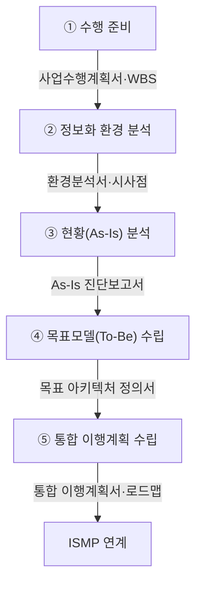

## 지식 로드맵 내 현재 위치

지식 위치: IT 전략·관리 → 정보화 기획·발주 → **ISP**

## 30초 인출

- 본질: **ISP(Information Strategy Planning)**는 경영 목표를 전사 정보화 과제와 투자 순서로 바꾸는 중장기 기획 활동이다.
- 메커니즘: 기관 여건에 따라 범위 설정 → 환경·현황 분석 → 목표모델·과제 → 이행계획의 대표 흐름으로 수행한다.
- 산출물: 현황 진단 · 목표 아키텍처 · 정보화 과제 · 투자 우선순위 · 이행 로드맵이다.

핵심 용어

- **ISP(Information Strategy Planning)**: 경영 전략에 정렬된 전사 IT 비전과 중장기 투자 과제 로드맵을 수립하는 기획이다.
- **CSF(Critical Success Factors)**: 경영 목표를 달성하려면 반드시 성공시켜야 하는 핵심 성공 요인이다.
- **PEST(Political, Economic, Social, Technological)**: 외부 거시환경을 정치·경제·사회·기술 관점에서 진단하는 기법이다.
- **EA(Enterprise Architecture)**: 업무·데이터·응용·기술 자원을 종합해 현재와 목표 구조의 연계를 설계하는 아키텍처다.
- **ISMP(Information System Master Plan)**: ISP에서 선정한 시스템의 요구사항과 예산을 발주 가능한 수준으로 상세화하는 계획이다.
- **Shelfware**: 계획은 수립됐지만 예산·실행·의사결정으로 이어지지 못해 활용되지 않는 산출물이다.

## 예상문제

> 다음 내용을 설명하시오. 가. ISP(Information Strategy Planning)의 정의 및 목적 나. ISP 수행방법론 체계와 절차 다. ISP, ISMP(Information System Master Plan) 비교 (25점)

## Ⅰ. 경영전략과 IT의 정렬을 실현하는 ISP의 개요

> ISP는 전사 경영 목표를 **To-Be 아키텍처**와 중장기 과제 로드맵으로 전환하며, 완성도는 **전략적 정렬**과 **실행력(Actionability)**으로 판정함

- 정의: 조직의 경영 목표와 중장기 사업 전략을 지원하기 위해 IT 현황을 분석하고 To-Be 아키텍처와 중장기 과제 로드맵을 수립하는 **전사 전략 기획**
- 목적: 경영전략·IT 정렬 · 정보화 투자 우선순위 확립

## Ⅱ. ISP의 일반 수행영역·대표 흐름 및 우선순위 메커니즘

> 기관별 방법론의 명칭·단계 수는 다를 수 있으나 현황 진단을 목표모델·과제·이행 로드맵으로 연결하는 공통 수행영역을 가짐

| 단계 | 대표 활동 |
|---|---|
| ① 수행 준비 | 사업 목적·**WBS**·추진 조직 정의 |
| ② 환경 분석 | **PEST** 거시환경 · 5-Force · 벤치마킹 |
| ③ 현황(As-Is) 분석 | **CSF** 도출 · 업무·데이터·기술 진단 |
| ④ 목표모델(To-Be) 수립 | 정보화 비전·To-Be **EA** 아키텍처 수립 |
| ⑤ 통합 이행계획 수립 | 과제 우선순위 4분면 평가·중장기 로드맵 수립 |

### 과제 우선순위 매트릭스 — 전략적 중요도 vs 실행 용이도

| 분류 | 판정 기준 | 이행 전략 |
|---|---|---|
| 우선 추진 | 높은 전략적 중요도 · 높은 실행 용이도 | 후속 **ISMP** 연계·예산 검토 |
| 단기 실행 | 낮은 전략적 중요도 · 높은 실행 용이도 | 작은 범위로 효과 확인 |
| 단계 추진 | 높은 전략적 중요도 · 낮은 실행 용이도 | 선행 조건 확보·단계 분할 |
| 보류·재검토 | 낮은 전략적 중요도 · 낮은 실행 용이도 | 범위·타당성 재검토 |

## Ⅲ. ISP와 ISMP의 차이점

> ISP는 전사 관점에서 무엇을 왜 할 것인지를 정하고, ISMP는 특정 시스템을 어떻게 조달할 것인지 기준선을 확정함

| 비교축 | ISP | ISMP |
|---|---|---|
| 목적 | 정보화 과제·투자 우선순위 선정 | 발주 범위·비용 **기준선(Baseline)** 확정 |
| 범위 | 전사 업무·**정보화 포트폴리오** | 선정된 특정 정보시스템 |
| 산출 | 정보화 비전 · **목표모델** · 과제 로드맵 | 구축 범위 · 요구사항 · 예산 · 발주 기초자료 |

## Ⅳ. ISP 실행력 확보의 문제점·대응책

> 계획이 실행으로 이어지려면 우선순위·예산·책임 주체를 같은 이행계획에서 연결해야 함

| 위험 | 대책 | 효과 |
|---|---|---|
| 보고서 사장(**Shelfware**) | 재정 부서의 이행계획 참여·조기 평가 | 우선 과제 예산·책임자 확정 |
| 백화점식 과제 남발 | 전사 **CSF(핵심성공요인)** 매핑·유사 과제 통합 | 전략 미정렬·중복 과제 감소 |
| 조달 단절·발주 지연 | 선행 조건을 충족한 과제부터 **ISMP** 연계 | 실행 준비도 기반 착수 |

## Ⅴ. 결론 — 실행력 중심의 ISP 완성

> 화려한 청사진보다 우선 과제의 예산·책임자·후속 ISMP를 함께 확정해야 ISP가 실제 정보화 혁신을 이끄는 마스터플랜으로 작동함

### 학습자 통찰 메모 — 답안 밖

- `[핵심 통찰]`: ISP의 가치는 산출물 보고서의 두께가 아니라, 도출된 IT 전략 과제들이 실제 예산과 연결되어 현업 업무 프로세스 혁신으로 실현되는가에 달려 있다. 재정 계획과 분리된 ISP는 서랍 속 Shelfware로 전락한다.
- `나라면`: 도출된 모든 과제를 일괄 추진하지 않고, 우선 과제마다 비즈니스 가치·위험·소요자원을 함께 평가하여 상위 핵심 과제만 ISMP로 상세화함으로써 중복 투자와 과잉 설계를 선제적으로 방지하겠다.

### 실전 답안용 기술사적 제언

- 판정: 정보화 과제가 경영전략·예산·책임자·착수 조건과 연결되는지 확인
- 대안: 전략적 중요도와 실행 용이도로 과제를 분류하고 우선 과제만 후속 ISMP에 연결
- 검증: 재정계획 반영 여부와 사업 이행 준비도를 예산 담당·현업·IT 전담 부서가 교차 점검
- 효과: Shelfware·중복 투자·준비되지 않은 사업 착수 감소

## 1교시 10점 답안 발췌

### 1. ISP의 정의·목적

- 정의: **ISP(Information Strategy Planning)**는 조직의 경영 목표를 지원하기 위해 전사 IT 현황을 진단하고 **To-Be 아키텍처**와 중장기 과제 로드맵을 수립하는 **전사 전략 기획**
- 목적: 경영전략·IT 정렬 · 전사 정보화 투자 우선순위 선정

### 2. 수행 체계와 5단계 절차

- 결론: ISP는 전사 투자 방향을 정하고, 선정 과제는 **ISMP(Information System Master Plan)**에서 발주 가능한 수준으로 상세화함

## 출제 이력과 검증 출처

- 제138회 정보관리기술사 2교시: "다음 내용을 설명하시오. 가. ISP(Information Strategy Planning)의 정의 및 목적 나. ISP 수행방법론 체계와 절차 다. ISP, ISMP(Information System Master Plan) 비교"
- 한국지능정보사회진흥원(NIA), [ISP·ISMP 수립 공통가이드 제7판](https://www.nia.or.kr/site/nia_kor/ex/bbs/View.do?bcIdx=25566&cbIdx=99835)

## 학습 체크

- [ ] Ⅰ 개요: ISP를 `전사 전략 기획 · To-Be 아키텍처 · 투자 우선순위`로 정의하고 목적을 제시할 수 있는가?
- [ ] Ⅱ 방법론: 수행 준비부터 이행계획까지 활동·산출을 연결할 수 있는가?
- [ ] Ⅲ 비교: ISP와 ISMP를 목적·범위·산출의 세 축으로 비교할 수 있는가?
- [ ] Ⅳ 통제: 실무 위험 현상인 Shelfware에 대한 통제 대책과 검증 효과를 설명할 수 있는가?
- [ ] Ⅴ 제언: 전략 적합성 기반 우선순위 평가와 핵심 과제의 ISMP 즉시 연계를 개선 대안으로 제시할 수 있는가?

## 연결 토픽

- 이전 토픽: [ISO/IEC 38500](./002_iso_iec_38500.md)
- 연관 토픽: [ISMP](./001_ismp.md), [BPR](./010_bpr.md), [EA/ITA](./107_ea_ita.md)
- 다음 토픽: [PMO](./004_pmo.md)
