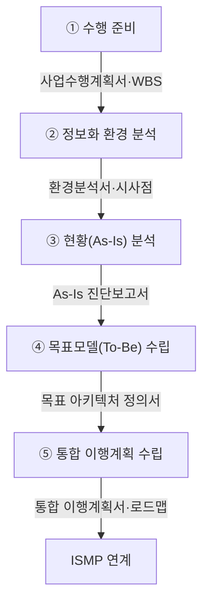

## 지식 로드맵 내 현재 위치

지식 위치: IT 전략·관리 → 정보화 기획·발주 → **ISP**

## 30초 인출

- 본질: ISP(Information Strategy Planning, 정보화 전략 계획)는 조직의 목표를 이루기 위해 어떤 IT 사업을 추진할지 정하고, 무엇부터 할지 계획하는 일이다.
- 메커니즘: 기관 여건에 따라 범위 설정 → 환경·현황 분석 → 목표모델·과제 → 이행계획의 대표 흐름으로 수행한다.

핵심 용어

- **ISP(Information Strategy Planning)** : 경영 전략에 정렬된 전사 IT 비전과 중장기 투자 과제 로드맵을 수립하는 전략 기획
- **CSF(Critical Success Factors)** : 경영 목표를 달성하기 위해 반드시 성공시켜야 하는 핵심 성공 요인
- **PEST(Political, Economic, Social, Technological)** : 거시적 외부환경을 정치·경제·사회·기술 관점에서 체계적으로 분석하는 기법
- **EA(Enterprise Architecture)** : 업무·데이터·응용·기술 관점에서 정보자원의 현재와 목표 구조 연계를 설계하는 청사진
- **ISMP(Information System Master Plan)** : ISP에서 선정한 시스템의 요구사항과 예산을 발주 가능한 수준으로 상세화한 조달 기준 계획
- **Shelfware** : 수립 후 예산 미확보나 실행력 부재로 인해 서랍 속에 사장되는 무용화 산출물

## 예상문제

> 다음 내용을 설명하시오. 가. ISP(Information Strategy Planning)의 정의 및 목적 나. ISP 수행방법론 체계와 절차 다. ISP, ISMP(Information System Master Plan) 비교 (25점)

## Ⅰ. ISP의 개요

- 정의: 조직의 경영 목표와 중장기 사업 전략을 지원하기 위해 IT 현황을 분석하고 To-Be 아키텍처와 중장기 과제 로드맵을 수립하는 **전사 전략 기획**
- 목적: 경영 목표에 맞는 정보화 과제를 고르고 투자 순서와 실행 경로를 정한다.

## Ⅱ. ISP의 일반 수행영역·대표 흐름 및 우선순위 메커니즘

> 수행 방법론은 기관별로 다를 수 있다. 답안에서는 현황 진단을 목표모델·과제·이행계획으로 잇는 흐름을 보인다.

| 단계 | 대표 활동 |
|---|---|
| ① 수행 준비 | 사업 목적· **WBS** ·추진 조직 정의 |
| ② 환경 분석 | **PEST** 거시환경 · 5-Force · 벤치마킹 |
| ③ 현황(As-Is) 분석 | **CSF** 도출 · 업무·데이터·기술 진단 |
| ④ 목표모델(To-Be) 수립 | 정보화 비전·To-Be **EA** 아키텍처 수립 |
| ⑤ 통합 이행계획 수립 | 전략 부합성·선행조건·예산을 고려해 과제 순서와 로드맵 수립 |

과제 우선순위는 기대효과만으로 정하지 않는다. 전략 부합성·업무 효과·비용·위험과 함께 데이터·조직·예산의 선행조건을 확인해 착수 가능한 순서를 정한다.

## Ⅲ. ISP와 ISMP의 차이점

> ISP는 전사 관점에서 무엇을 왜 할 것인지를 정하고, ISMP는 특정 시스템을 어떻게 조달할 것인지 기준선을 확정함

| 비교축 | ISP | ISMP |
|---|---|---|
| 목적 | 정보화 과제·투자 우선순위 선정 | 발주 범위·비용 **기준선(Baseline)** 확정 |
| 범위 | 전사 업무· **정보화 포트폴리오** | 선정된 특정 정보시스템 |
| 산출 | 정보화 비전 · **목표모델** · 과제 로드맵 | 구축 범위 · 요구사항 · 예산 · 발주 기초자료 |

## Ⅳ. ISP 실행력 확보의 문제점·대응책

> 계획이 실행으로 이어지려면 우선순위·예산·책임 주체를 같은 이행계획에서 연결해야 함

| 위험 | 대책 | 효과 |
|---|---|---|
| 보고서 사장( **Shelfware** ) | 재정 부서의 이행계획 참여·조기 평가 | 우선 과제 예산·책임자 확정 |
| 백화점식 과제 남발 | 전사 **CSF(핵심성공요인)** 매핑·유사 과제 통합 | 전략 미정렬·중복 과제 감소 |
| 조달 단절·발주 지연 | 선행 조건을 충족한 과제부터 **ISMP** 연계 | 실행 준비도 기반 착수 |

## Ⅴ. 결론 — 실행력 중심의 ISP 완성

> 화려한 청사진보다 우선 과제의 예산·책임자·후속 ISMP를 함께 확정해야 ISP가 실제 정보화 혁신을 이끄는 마스터플랜으로 작동함

### 실전 답안용 기술사적 제언

문제: ISP가 재정계획과 분리되면 우선 과제를 선정해도 예산과 실행 책임자를 확보하지 못할 수 있다. 제언: 과제 우선순위 검토에 재정·현업 책임자를 참여시키고, 선정 과제의 예산·책임자·후속 ISMP 착수 조건을 이행계획에 함께 확정한다.

| 문제 | 해결 방안 |
|---|---|
| 우선 과제에 예산·책임자가 배정되지 않음 | 재정·현업 책임자가 과제 우선순위와 예산·책임자를 함께 확정 |
| 전략계획에서 발주로 연결되지 않음 | 시스템 구축이 필요한 과제를 후속 ISMP에 연결 |

## 1교시 10점 답안 발췌

### 1. 정의·목적

- 정의: **ISP(Information Strategy Planning)** 는 조직의 경영 목표를 지원하기 위해 전사 IT 현황을 진단하고 **To-Be 아키텍처** 와 중장기 과제 로드맵을 수립하는 **전사 전략 기획**
- 목적: 경영전략·IT 정렬 · 전사 정보화 투자 우선순위 확립

### 2. 수행 체계와 5단계 절차

### 3. ISP와 ISMP 비교

| 비교축 | ISP | ISMP |
|---|---|---|
| 목적 | 정보화 과제·투자 우선순위 선정 | 발주 범위·비용 기준선(Baseline) 확정 |
| 대상 범위 | 전사 조직 및 업무 전반 | 특정 정보시스템 구축 사업 |
| 분석 상세도 | 전략 및 개념적 아키텍처 수준 | 상세 요구사항 및 FP 산정 가능 수준 |
| 핵심 산출물 | 정보화 과제 목록 · 우선순위 · 로드맵 | 요구사항 명세서 · 아키텍처 · 예산서 · RFP |

- 한 줄 제언: 우선 과제는 예산과 책임자를 함께 정하고 필요한 경우 후속 ISMP로 연결한다.

## 출제 이력과 검증 출처

- 제138회 정보관리기술사 2교시: "다음 내용을 설명하시오. 가. ISP(Information Strategy Planning)의 정의 및 목적 나. ISP 수행방법론 체계와 절차 다. ISP, ISMP(Information System Master Plan) 비교"
- 한국지능정보사회진흥원(NIA), [ISP·ISMP 수립 공통가이드 제7판](https://www.nia.or.kr/site/nia_kor/ex/bbs/View.do?bcIdx=25566&cbIdx=99835)

## 연결 토픽

- 이전 토픽: [ISO/IEC 38500](./002_iso_iec_38500.md)
- 연관 토픽: [ISMP](./001_ismp.md), [BPR](./010_bpr.md), [EA/ITA](./107_ea_ita.md)
- 다음 토픽: [PMO](./004_pmo.md)
