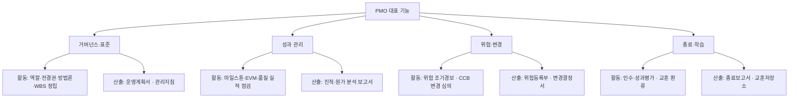
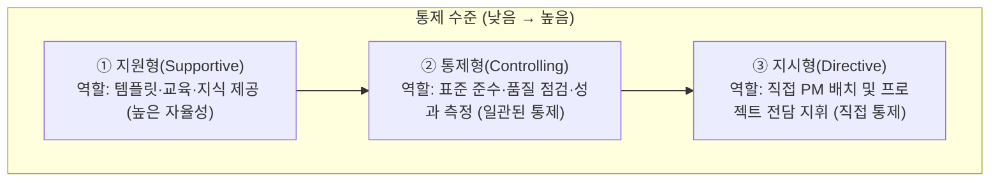
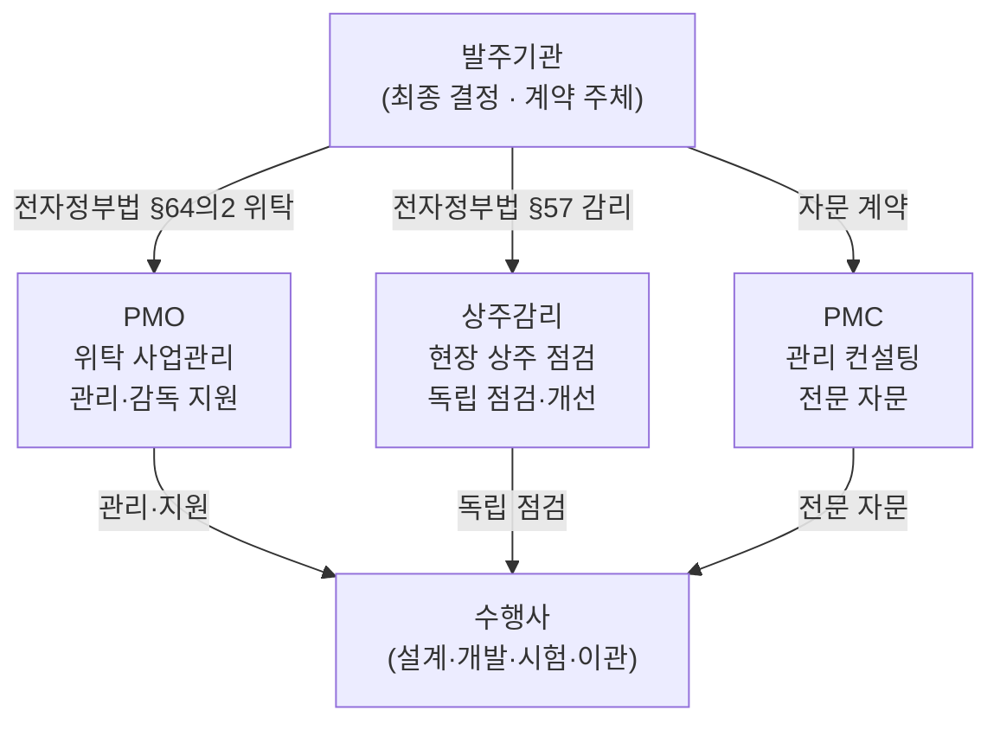
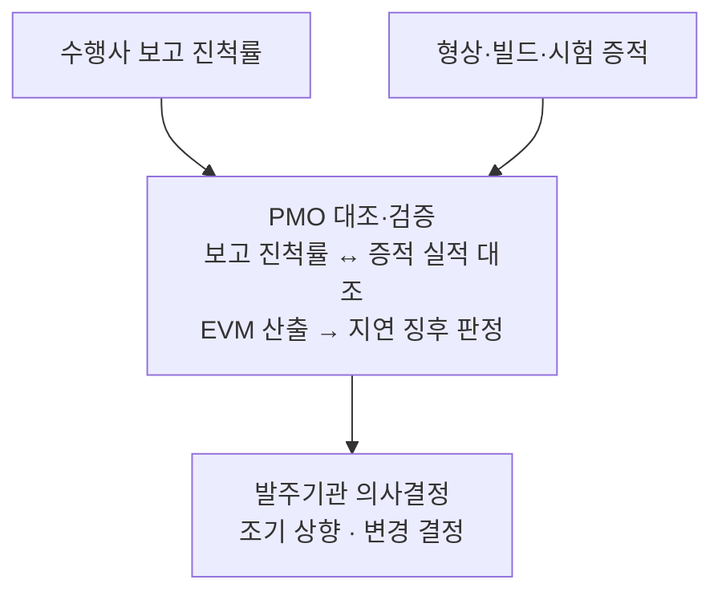
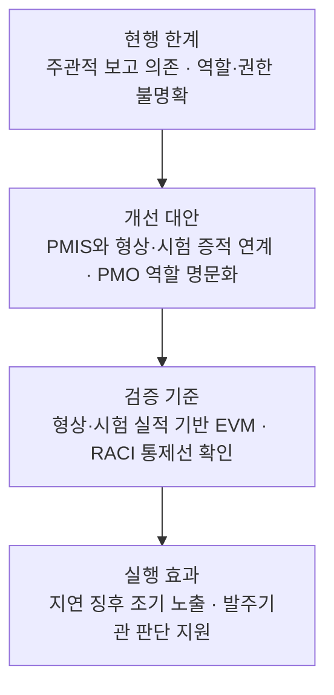

## 지식 로드맵 내 현재 위치

  IT 전략·관리
  프로젝트 관리
  <strong>PMO</strong>

## 큰 그림과 30초 인출

- 본질: **PMO(Project Management Office)**는 전사 또는 대규모 프로젝트의 관리 표준을 확립하고 일정·비용·품질·위험을 상시 통제·지원하는 전문 사업관리 조직
- 메커니즘: 프로젝트 특성에 맞춘 지원·통제 수준 설정 → 공통 기준선 수립 → 일정·비용·위험·변경 통제 → 의사결정 상향
- 산출물: 사업관리계획 · 기준선 · 성과 분석 · 위험·이슈 등록부 · 변경 결정 기록

핵심 용어

- **PMO(Project Management Office)**: 프로젝트 관리 표준화, 자원 배분, 위험 조기 탐지를 수행하는 전담 사업관리 조직
- **PMC(Project Management Consultancy)**: 프로젝트 관리에 관한 전문 자문·지원 용역으로, 계약 범위에 따라 역할이 달라짐
- **EVM(Earned Value Management)**: 계획 가치(PV), 획득 가치(EV), 실제 원가(AC)를 비교하여 일정과 원가를 정량 측정하는 기법
- **CCB(Change Control Board)**: 과업 범위, 일정, 예산 변경 요청(CR)의 타당성을 심의·의결하는 변경통제위원회
- **RACI(Responsible, Accountable, Consulted, Informed)**: 구성원별 책임 소재와 승인 권한을 명확화하는 책임 할당 매트릭스
- **전자정부법 제64조의2**: 전자정부사업관리의 위탁에 관한 공공부문 법적 근거
- **SPI(Schedule Performance Index)**: 일정 성과 지수(EV/PV)로 1.0 미만 시 공정 지연을 나타냄
- **CPI(Cost Performance Index)**: 원가 성과 지수(EV/AC)로 1.0 미만 시 예산 초과를 나타냄

## 예상문제

> 정보시스템 구축 사업의 성공적인 수행을 위해 정보시스템 감리와 PMO(전자정부사업관리 위탁)를 활용하여 사업관리를 수행하고 있다. 다음을 설명하시오. 가. 정보시스템 감리의 법적 근거 나. PMO의 정의와 역할 다. PMO 대상 사업의 범위 라. PMO와 상주감리의 비교 (25점)

- 1교시 변형: PMC(Project Management Consultancy)와 PMO(Project Management Office) 비교

## 딸려 나오는 하위 토픽

| 하위 토픽 | 핵심 내용 | 본문 답안 위치 |
|---|---|---|
| **PMC(Project Management Consultancy)** | 발주자 관점에서 기술적 타당성·설계·사업관리를 전문 자문하는 컨설팅 체계 | Ⅳ. PMO와 상주감리·PMC의 역할 비교 |

## Ⅰ. 대형 프로젝트 성공의 컨트롤타워, PMO의 개요

> PMO는 여러 프로젝트의 관리 기준과 의사결정 정보를 일관되게 만들며, 권한은 조직 필요와 설계된 통제 수준에 맞춰야 함

- 정의: 조직의 프로젝트, **프로그램**, **포트폴리오**를 전사적 관점에서 조율하고 **표준 방법론**, **WBS(Work Breakdown Structure)**, 품질 기준, 위험 관리를 일상적으로 수행하는 전담 사업관리 조직
- 목적: 관리 기준 불일치 제거 · 의사결정 지연 감소 · 위험 조기 노출

## Ⅱ. PMO 대표 기능 구조

> PMO 기능은 고정 시간 절차가 아니라 사업 특성에 맞춰 조합하며, 성과 통제는 **EVM(Earned Value Management)** 실적, 변경 통제는 **CCB(Change Control Board)** 의결, 종료는 교훈 환류로 실체가 확인됨

## Ⅲ. 권한 수준별 PMO 운영 유형

> 조직 거버넌스 성숙도와 프로젝트 위험도에 따라 **지원형(Supportive)**, **통제형(Controlling)**, **지시형(Directive)** 세 유형으로 사업 통제 수준을 차등화하며, 유형을 잘못 고르면 권한 없는 PMO에 결과 책임을 묻거나 수행사 자율이 지시형에 흡수됨

## Ⅳ. PMO와 상주감리·PMC의 역할 비교

> PMO·**상주감리**·**PMC**의 권한은 명칭만으로 정해지지 않으며 법령·계약·과업 범위로 구분해야 하고, 특히 PMO가 상주감리의 점검까지 흡수하면 감리 독립성이 무너짐

| 비교축 | PMO (사업관리조직) | 상주감리 (정보시스템 감리) | PMC (프로젝트 관리 컨설팅) |
|---|---|---|---|
| 목적 | 발주기관의 관리·감독 업무 지원 | 독립적 점검·개선 | 계약된 전문 사업관리 자문 |
| 근거 | **전자정부법 제64조의2**·계약 | **전자정부법 제57조**·감리 기준 | 계약·과업내용서 |
| 권한 | 위탁된 범위 안에서 수행 | 법령·감리계약 범위 | 자문계약 범위 |

- 공공부문 적용 범위는 전자정부법 제64조의2와 하위 규정이 정한 대상, 위탁계약·과업내용서로 판정함

## Ⅴ. PMO 실효성 확보의 문제점·대응책

> 형식적 보고 전담 조직으로의 전락은 계약서상 실질적 통제 권한을 명문화하고 진척을 증적 데이터로 측정할 때만 끊기며, 권한 없는 PMO는 수행사 보고서를 옮겨 적는 중계자로 남음

| 위험 | 대책 | 효과 |
|---|---|---|
| 형식적 보고 조직 전락 | 계약상 검토·보고·상향 범위 명문화 | 책임·결정 이력 추적 |
| 공정 진척 왜곡 보고 | **PMIS(Project Management Information System)** 증적 데이터와 **EVM** 직접 연계 | 증적 기반 실적과 보고 진척률 일치 |
| 발주처-PMO 책임 전가 | **RACI 매트릭스** 기반 실무·승인 권한 명문화 | 책임 충돌·승인 지연 감소 |

## Ⅵ. 결론 — 증적 기반 PMO 정착

> 무거운 관제 도구의 신규 구축보다 기존 형상·빌드·테스트 증적을 PMO의 의사결정 판단 지표로 직접 연계해야 보고 작성 비용을 줄이면서 보고 진척률과 실제 증적의 괴리를 없앨 수 있음

### 학습자 통찰 메모 — 답안 밖

- `[핵심 통찰]`: PMO의 실질적인 가치는 회의록이나 주간 보고서의 숫자를 늘리는 것이 아니라, 수면 아래 숨겨진 일정 지연과 품질 결함 위험을 팩트 기반으로 조기에 수면 위로 끌어올려 경영진의 의사결정 지연 시간을 단축하는 데 있다.
- `나라면`: 새 양식을 늘리기보다 기존 일정·형상·시험 증적을 PMO 보고 기준과 연결해 진척 판단의 근거를 남기겠다.

### 실전 답안용 기술사적 제언

- 판정: 주관적 진척 보고와 형상·빌드·시험 증적이 일치하는지 확인
- 대안: PMO 권한·전결 규정을 계약에 명시하고 범위 변경을 CCB에서 심의
- 검증: PMIS의 일정·원가 실적과 개발·시험 증적을 대조하고 상주감리와의 역할 중복 점검
- 효과: 일정 지연·품질 결함의 조기 노출과 의사결정 지연 감소

## 1교시 10점 답안 발췌

### 1. PMO·PMC 정의

- **PMO(Project Management Office)**: 조직 내부 또는 발주기관 관점에서 관리 표준·성과·위험을 상시 통제하는 사업관리 조직
- **PMC(Project Management Consultancy)**: 계약된 범위의 프로젝트 관리 전문역량을 제공하는 자문·용역

### 2. 발주기관을 중심으로 한 PMO·상주감리·PMC의 관계

### 3. PMO·PMC 비교

| 비교축 | PMO | PMC |
|---|---|---|
| 성격 | 상시 사업관리 조직·기능 | 계약 기반 전문 컨설팅 |
| 책임 | 표준·성과·위험·변경 통제 | 계약 범위의 자문·관리 지원 |
| 지속성 | 조직·사업 생명주기에 따라 운영 | 용역기간·과업범위에 한정 |

- 결론: 명칭보다 조직 내 권한과 계약상 책임 범위로 구분함

## 출제 이력과 검증 출처

- 제136회 정보관리기술사 2교시: "정보시스템 구축 사업의 성공적인 수행을 위해 정보시스템 감리와 PMO(전자정부사업관리 위탁)를 활용하여 사업관리를 수행하고 있다. 이와 관련하여 다음을 설명하시오. 가. 정보시스템 감리의 법적 근거 나. PMO의 정의와 역할 다. PMO 대상 사업의 범위 라. PMO와 상주감리의 비교"
- 제140회 정보관리기술사 1교시: "PMC(Project Management Consultancy)와 PMO(Project Management Office) 비교"
- [국가법령정보센터, 전자정부법 제64조의2](https://www.law.go.kr/LSW/lsLinkCommonInfo.do?chrClsCd=010202&lsJoLnkSeq=1028496021)
- 한국지능정보사회진흥원(NIA), [전자정부사업관리 위탁(PMO) 도입·운영 가이드 2.0](https://www.nia.or.kr/site/nia_kor/ex/bbs/View.do?bcIdx=19542&cbIdx=99852)

## 학습 체크

- [ ] Ⅰ 개요: PMO를 `표준화 · 상시 관제 · 발주자 지원 전문 조직`으로 정의하고 발주기관·PMO·수행사의 위탁·보고 방향을 그릴 수 있는가?
- [ ] Ⅱ 기능: 거버넌스·표준, 성과 관리, 위험·변경, 종료·학습의 대표 기능과 각 활동·산출을 한 쌍으로 재현할 수 있는가?
- [ ] Ⅲ 유형: 지원형·통제형·지시형을 통제 수준 축 위에 배치하고 역할·적용 환경을 구분할 수 있는가?
- [ ] Ⅳ 비교: 발주기관을 중심으로 PMO·상주감리·PMC의 연결 관계를 그리고 `목적 · 근거 · 권한` 축으로 비교할 수 있는가?
- [ ] Ⅴ 문제점·대응책: 형식적 보고 전락·진척 왜곡·책임 전가의 위험·대책·효과를 연결하고 증적 대조 경로를 그릴 수 있는가?
- [ ] Ⅵ 결론: PMIS·형상·시험 증적과 EVM·RACI를 연결한 판정·대안·검증·효과를 제시할 수 있는가?

## 연결 토픽

- 이전 토픽: [ISP](./003_isp.md)
- 연관 토픽: [WBS](./007_wbs.md), [IT 감리](./008_it_audit.md), [프로젝트 위험관리](./009_project_risk_management_negative.md)
- 다음 토픽: [SCM](./005_scm.md)
