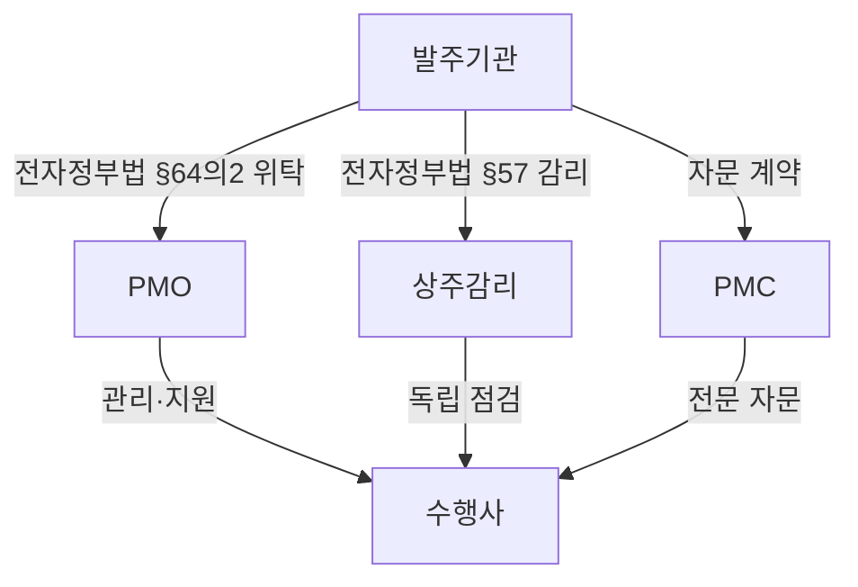
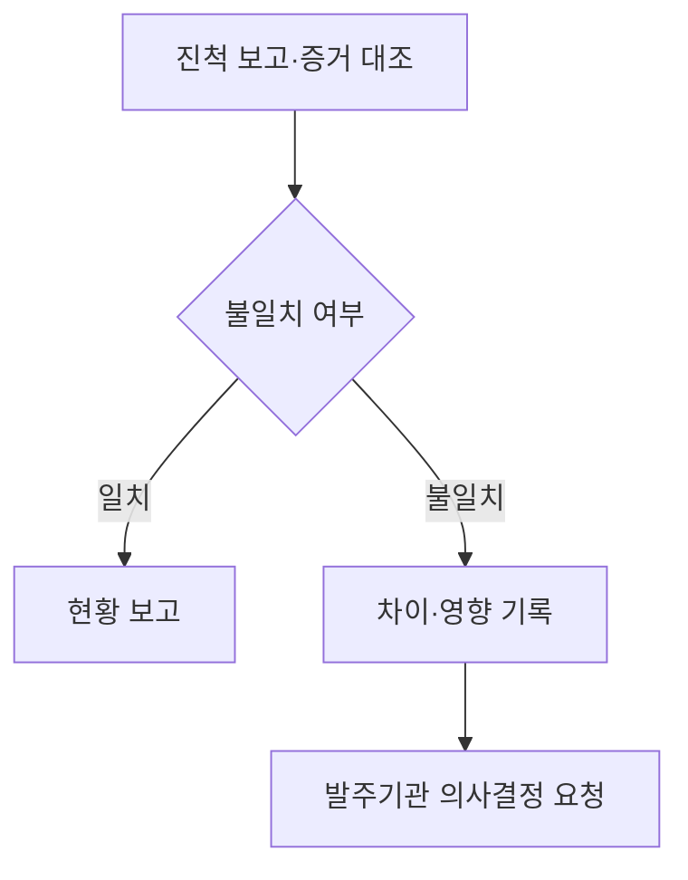

## 지식 로드맵 내 현재 위치

지식 위치: IT 전략·관리 → 프로젝트 관리 → **PMO**

## 30초 인출

- 본질: PMO(Project Management Office, 프로젝트 관리 조직)는 프로젝트에 공통 관리 기준과 자원을 제공하고 관리·조정을 지원하거나 통제하는 조직
- 메커니즘: 사업 특성에 맞춘 지원·통제 수준 설정과 일정·비용·위험·변경의 공통 기준 관리

핵심 용어

- **PMO(Project Management Office)** : 프로젝트 관리 표준을 정립하고 자원·일정·위험을 전사적으로 통제·지원하는 전담 조직
- **PMC(Project Management Consultancy)** : 발주자를 대신하거나 보좌하여 프로젝트 관리 전문 자문 및 감독을 수행하는 용역 체계
- **EVM(Earned Value Management)** : PV·EV·AC를 기준으로 프로젝트의 일정과 원가 성과를 정량 분석하는 관리 기법
- **CCB(Change Control Board)** : 과업 범위·일정·예산 변경 요청의 영향도를 평가하고 승인 여부를 심의·의결하는 협의체
- **RACI(Responsible, Accountable, Consulted, Informed)** : 업무별 실무자·책임자·자문자·통보자를 정의하는 역할 책임 매트릭스
- **PMIS(Project Management Information System)** : 프로젝트 일정·원가·실적 자료의 기록·보고를 지원하는 정보시스템
- **전자정부법 제64조의2** : 공공부문 전자정부사업관리(PMO) 위탁의 법적 근거 조항

---

## 1교시 예상문제 (10점)

> PMO에 관하여 설명하시오. (예상·10점)

---

## 1교시 10점 답안

### Ⅰ. PMO의 개요

| 구분 | 핵심 |
|---|---|
| 정의 | **PMO** 는 여러 프로젝트에 공통 관리 기준과 자원을 제공하고 일정·비용·위험 관리를 지원하거나 통제하는 조직 |
| 목적 | 프로젝트별 관리 기준의 일관된 적용과 위험·성과의 통합 관리 |

### Ⅱ. 대표 기능

| 기능 | 핵심 역할 |
|---|---|
| 거버넌스·표준 | 역할·방법론·관리 기준 수립 |
| 성과 관리 | 일정·비용·품질 실적과 편차 점검 |
| 위험·변경 관리 | 조기경보와 변경 심의 지원 |
| 종료·학습 | 인수·성과 검토와 교훈 정리 |

### Ⅲ. 운영 유형

| 유형 | 권한·지원 수준 |
|---|---|
| 지원형 | 템플릿·교육·지식 제공, 프로젝트 자율성 유지 |
| 통제형 | 표준 준수·품질 점검·성과 측정 |
| 지시형 | PM 배치와 프로젝트 직접 지휘 |

- 한 줄 제언: 사업 위험과 조직 권한에 맞는 PMO 유형을 정하고 승인 범위·보고 책임을 명확히 설정

---

## 2~4교시 예상문제 (25점)

> PMO의 개념과 주요 기능·운영 유형을 설명하고, 정보시스템 사업에 적용할 때 고려할 사항을 제시하시오. (예상·25점)

---

## 2~4교시 25점 답안

## Ⅰ. PMO의 개요

| 구분 | 핵심 |
|---|---|
| 정의 | **PMO** 는 여러 프로젝트에 공통 관리 기준과 자원을 제공하고 일정·비용·위험 관리를 지원하거나 통제하는 조직 |
| 목적 | 프로젝트별 관리 기준의 일관된 적용과 위험·성과의 통합 관리 |

## Ⅱ. PMO 대표 기능 구조

> PMO 기능의 사업 특성별 조합, 성과 통제의 **EVM(Earned Value Management)** 실적 활용, 변경 통제의 **CCB(Change Control Board)** 의결, 종료 단계의 교훈 반영

| 기능 | 활동 | 산출 |
|---|---|---|
| 거버넌스·표준 | 역할·전결권·방법론· **WBS** 정립 | 운영계획서·관리지침 |
| 성과 관리 | 마일스톤·EVM·품질 실적 점검 | 진척·원가 분석 보고서 |
| 위험·변경 | 위험 조기경보·CCB 변경 심의 | 위험등록부·변경결정서 |
| 종료·학습 | 인수·성과평가·교훈 환류 | 종료보고서·교훈저장소 |

## Ⅲ. 권한 수준별 PMO 운영 유형

> 조직 거버넌스 성숙도·프로젝트 위험도에 따른 **지원형(Supportive)** ·**통제형(Controlling)** ·**지시형(Directive)**의 차등 적용. 유형 오판에 따른 권한 없는 PMO의 결과 책임 또는 수행사 자율성 축소 위험

| 유형 | 대표 역할 |
|---|---|
| 지원형 | 템플릿·교육·지식 제공, 높은 자율성 |
| 통제형 | 표준 준수·품질 점검·성과 측정, 일관된 통제 |
| 지시형 | PM 직접 배치·프로젝트 전담 지휘, 직접 통제 |

PMO 유형의 권한 강도 구분. 관리 대상은 개별 프로젝트·프로그램·포트폴리오 중 사업 맥락에 따라 설정하고, 대상 범위·승인권을 정한 뒤 지원·통제·지시 기능을 선택하는 절차

## Ⅳ. 전자정부사업관리 위탁 대상 사업

「전자정부법」 제64조의2의 위탁 가능 요건과 시행령 제78조의2의 구체 범위. 아래 유형에 해당해도 위탁은 선택 사항이며, 사업 여건에 따른 발주기관의 판단

| 시행령 | 위탁 대상 범위 | 대표 사업·판단 |
|---|---|---|
| 제1호 | 국민 편의·안전에 필요한 정보시스템 구축·고도화 | 전자민원창구·재난안전관리 시스템 |
| 제2호 | 여러 행정기관의 공통 사용으로 행정 효율에 큰 영향을 미치는 시스템 구축·고도화 | 행정기관 간 전자문서 유통 시스템 |
| 제3호 | 복수 정보시스템의 통합·연계로 높은 사업관리 역량이 필요한 사업 | 행정정보 공동이용 시스템 등 |
| 제4호 가·나목 | 기관의 관리 경험·전문성·인력이 부족하거나 제1~3호에 준하는 중요·고난도 사업 | 중앙행정기관등의 장이 위탁 필요성을 인정 |

## Ⅴ. PMO와 상주감리·PMC의 역할 비교

> PMO·**상주감리**·**PMC** 권한의 법령·계약·과업 범위별 구분과 PMO의 감리 점검 흡수에 따른 감리 독립성 훼손 위험

| 비교축 | PMO (사업관리조직) | 상주감리 (정보시스템 감리) | PMC (프로젝트 관리 컨설팅) |
|---|---|---|---|
| 목적 | 발주기관의 관리·감독 업무 지원 | 독립적 점검·개선 | 계약된 전문 사업관리 자문 |
| 근거 | **전자정부법 제64조의2** ·계약 | **전자정부법 제57조** ·감리 기준 | 계약·과업내용서 |
| 권한 | 위탁된 범위 안에서 수행 | 법령·감리계약 범위 | 자문계약 범위 |

- 공공부문 적용 범위의 확인 근거: 전자정부법 제64조의2·하위 규정의 대상, 위탁계약·과업내용서

## Ⅵ. PMO 실효성 확보의 한계·대응책

> 계약상 실질적 통제 권한의 명문화와 증적 데이터에 기반한 진척 측정의 필요성. 권한 없는 PMO의 수행사 보고서 전달 역할 고착 위험

| 위험 | 대책 | 효과 |
|---|---|---|
| 형식적 보고 조직 전락 | 계약상 검토·보고·상향 범위 명문화 | 책임·결정 이력 추적 |
| 공정 진척 왜곡 보고 | **PMIS(Project Management Information System)** 증적 데이터와 **EVM** 직접 연계 | 증적 기반 실적과 보고 진척률 일치 |
| 발주처-PMO 책임 전가 | **RACI 매트릭스** 기반 실무·승인 권한 명문화 | 책임 충돌·승인 지연 감소 |

## Ⅶ. 기술사적 제언 — 보고와 증거가 다를 때의 상향 기준

> 제안: 수행사 진척 보고와 산출물·시험 증거 간 불일치 기록 및 계약상 의사결정권자에 대한 검토 요청. PMO 자체의 검수 승인권 부여와는 별개

Ⅴ절의 권한·증거 관리 위험과 구분되는 **불일치 발생 시 판단 주체와 요청 절차**

## 출제 이력과 검증 출처

- 제136회 정보관리기술사 2교시: "정보시스템 구축 사업의 성공적인 수행을 위해 정보시스템 감리와 PMO(전자정부사업관리 위탁)를 활용하여 사업관리를 수행하고 있다. 이와 관련하여 다음을 설명하시오. 가. 정보시스템 감리의 법적 근거 나. PMO의 정의와 역할 다. PMO 대상 사업의 범위 라. PMO와 상주감리의 비교"
- 제140회 정보관리기술사 1교시: "PMC(Project Management Consultancy)와 PMO(Project Management Office) 비교"
- [국가법령정보센터, 전자정부법 제64조의2](https://www.law.go.kr/LSW/lsLinkCommonInfo.do?chrClsCd=010202&lsJoLnkSeq=1028496021)
- [국가법령정보센터, 전자정부법 시행령 제78조의2](https://law.go.kr/LSW/lsLinkCommonInfo.do?lspttninfSeq=81211)
- 한국지능정보사회진흥원(NIA), [전자정부사업관리 위탁(PMO) 도입·운영 가이드 2.0](https://www.nia.or.kr/site/nia_kor/ex/bbs/View.do?bcIdx=19542&cbIdx=99852)

## 연결 토픽

- 이전 토픽: [ISP](./003_isp.md)
- 연관 토픽: [WBS](./007_wbs.md), [IT 감리](./008_it_audit.md), [프로젝트 위험관리](./009_project_risk_management_negative.md)
- 다음 토픽: [SCM](./005_scm.md)
