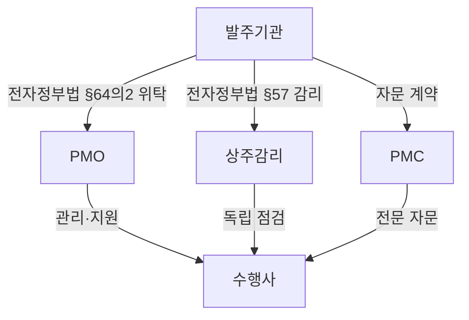

## 지식 로드맵 내 현재 위치

지식 위치: IT 전략·관리 → 프로젝트 관리 → **PMO**

## 30초 인출

- 본질: PMO(Project Management Office, 프로젝트 관리 조직)는 프로젝트가 계획대로 진행되도록 공통 기준을 세우고 발주기관의 관리와 조정을 돕는다.
- 메커니즘: 사업에 맞는 지원·통제 수준을 정하고 공통 기준으로 일정·비용·위험·변경을 관리한다.

핵심 용어

- **PMO(Project Management Office)** : 프로젝트 관리 표준을 정립하고 자원·일정·위험을 전사적으로 통제·지원하는 전담 조직
- **PMC(Project Management Consultancy)** : 발주자를 대신하거나 보좌하여 프로젝트 관리 전문 자문 및 감독을 수행하는 용역 체계
- **EVM(Earned Value Management)** : PV·EV·AC를 기준으로 프로젝트의 일정과 원가 성과를 정량 분석하는 관리 기법
- **CCB(Change Control Board)** : 과업 범위·일정·예산 변경 요청의 영향도를 평가하고 승인 여부를 심의·의결하는 협의체
- **RACI(Responsible, Accountable, Consulted, Informed)** : 업무별 실무자·책임자·자문자·통보자를 정의하는 역할 책임 매트릭스
- **전자정부법 제64조의2** : 공공부문 전자정부사업관리(PMO) 위탁의 법적 근거 조항

---

## 1교시 예상문제 (10점)

> PMC(Project Management Consultancy)와 PMO(Project Management Office)를 비교하시오. (예상·10점)

---

## 1교시 10점 답안

### 1. 정의·목적

- 정의: 조직 내부 또는 발주기관 관점에서 관리 표준·성과·위험을 상시 통제하는 전문 사업관리 조직
- 목적: 관리 기준 일관성 확보 · 위험 조기 식별 · 프로젝트 성공률 제고

### 2. 발주기관 중심 PMO·상주감리·PMC 역할 관계

### 3. PMO·PMC 비교

| 비교축 | PMO | PMC |
|---|---|---|
| 성격 | 상시 사업관리 조직·기능 | 계약 기반 전문 컨설팅 |
| 책임 | 표준·성과·위험·변경 통제 | 계약 범위의 자문·관리 지원 |
| 지속성 | 조직·사업 생명주기에 따라 운영 | 용역기간·과업범위에 한정 |

- 결론: 명칭보다 조직 내 권한과 계약상 책임 범위로 구분함
- 한 줄 제언: PMO의 역할과 권한을 정하고 객관적인 사업 증거로 진척·위험을 확인한다.

---

## 2~4교시 예상문제 (25점)

> 정보시스템 구축 사업의 성공적인 수행을 위해 정보시스템 감리와 PMO(전자정부사업관리 위탁)를 활용하여 사업관리를 수행하고 있다. 다음을 설명하시오. 가. 정보시스템 감리의 법적 근거 나. PMO의 정의와 역할 다. PMO 대상 사업의 범위 라. PMO와 상주감리의 비교 (25점)

---

## 2~4교시 25점 답안

## 딸려 나오는 하위 토픽

| 하위 토픽 | 핵심 내용 | 본문 답안 위치 |
|---|---|---|
| **PMC(Project Management Consultancy)** | 발주자 관점에서 기술적 타당성·설계·사업관리를 전문 자문하는 컨설팅 체계 | Ⅳ. PMO와 상주감리·PMC의 역할 비교 |

## Ⅰ. PMO의 개요

- 정의: 프로젝트 관리 기준과 자원을 공유하고 사업별 일정·비용·위험 관리를 지원하거나 통제하는 조직
- 목적: 관리 기준 불일치 제거 · 의사결정 지연 감소 · 위험 조기 노출

## Ⅱ. PMO 대표 기능 구조

> PMO 기능은 고정 시간 절차가 아니라 사업 특성에 맞춰 조합하며, 성과 통제는 **EVM(Earned Value Management)** 실적, 변경 통제는 **CCB(Change Control Board)** 의결, 종료는 교훈 환류로 실체가 확인됨

| 기능 | 활동 | 산출 |
|---|---|---|
| 거버넌스·표준 | 역할·전결권·방법론· **WBS** 정립 | 운영계획서·관리지침 |
| 성과 관리 | 마일스톤·EVM·품질 실적 점검 | 진척·원가 분석 보고서 |
| 위험·변경 | 위험 조기경보·CCB 변경 심의 | 위험등록부·변경결정서 |
| 종료·학습 | 인수·성과평가·교훈 환류 | 종료보고서·교훈저장소 |

## Ⅲ. 권한 수준별 PMO 운영 유형

> 조직 거버넌스 성숙도와 프로젝트 위험도에 따라 **지원형(Supportive)** , **통제형(Controlling)** , **지시형(Directive)** 세 유형으로 사업 통제 수준을 차등화하며, 유형을 잘못 고르면 권한 없는 PMO에 결과 책임을 묻거나 수행사 자율이 지시형에 흡수됨

| 유형 | 대표 역할 |
|---|---|
| 지원형 | 템플릿·교육·지식 제공, 높은 자율성 |
| 통제형 | 표준 준수·품질 점검·성과 측정, 일관된 통제 |
| 지시형 | PM 직접 배치·프로젝트 전담 지휘, 직접 통제 |

유형은 권한의 강도를 설명한다. 실제 PMO의 관리 대상은 개별 프로젝트부터 프로그램·포트폴리오까지 달라질 수 있으므로, 대상 범위와 승인권을 먼저 정한 뒤 지원·통제·지시 기능을 선택한다.

## Ⅳ. PMO와 상주감리·PMC의 역할 비교

> PMO· **상주감리** · **PMC** 의 권한은 명칭만으로 정해지지 않으며 법령·계약·과업 범위로 구분해야 하고, 특히 PMO가 상주감리의 점검까지 흡수하면 감리 독립성이 무너짐

| 비교축 | PMO (사업관리조직) | 상주감리 (정보시스템 감리) | PMC (프로젝트 관리 컨설팅) |
|---|---|---|---|
| 목적 | 발주기관의 관리·감독 업무 지원 | 독립적 점검·개선 | 계약된 전문 사업관리 자문 |
| 근거 | **전자정부법 제64조의2** ·계약 | **전자정부법 제57조** ·감리 기준 | 계약·과업내용서 |
| 권한 | 위탁된 범위 안에서 수행 | 법령·감리계약 범위 | 자문계약 범위 |

- 공공부문 적용 범위는 전자정부법 제64조의2와 하위 규정이 정한 대상, 위탁계약·과업내용서로 판정함

## Ⅴ. PMO 실효성 확보의 문제점·대응책

> 형식적 보고 전담 조직으로의 전락은 계약서상 실질적 통제 권한을 명문화하고 진척을 증적 데이터로 측정할 때만 끊기며, 권한 없는 PMO는 수행사 보고서를 옮겨 적는 중계자로 남음

| 위험 | 대책 | 효과 |
|---|---|---|
| 형식적 보고 조직 전락 | 계약상 검토·보고·상향 범위 명문화 | 책임·결정 이력 추적 |
| 공정 진척 왜곡 보고 | **PMIS(Project Management Information System)** 증적 데이터와 **EVM** 직접 연계 | 증적 기반 실적과 보고 진척률 일치 |
| 발주처-PMO 책임 전가 | **RACI 매트릭스** 기반 실무·승인 권한 명문화 | 책임 충돌·승인 지연 감소 |

## Ⅵ. 결론 — 증적 기반 PMO 정착

> 무거운 관제 도구의 신규 구축보다 기존 형상·빌드·테스트 증적을 PMO의 의사결정 판단 지표로 직접 연계해야 보고 작성 비용을 줄이면서 보고 진척률과 실제 증적의 괴리를 없앨 수 있음

### 실전 답안용 기술사적 제언

문제: 보고자료 취합에 치우친 PMO는 실제 진행상황과 위험을 제때 파악하기 어렵다. 제언: PMO의 역할·권한을 사업 특성에 맞게 정하고, 일정·품질·위험 관련 객관적 증거를 검토해 발주자 의사결정에 연결한다.

| 문제 | 해결 방안 |
|---|---|
| 수행사 보고만으로 진척을 판단 | 산출물·시험 결과 등 확인 가능한 증거와 보고를 대조 |
| PMO 권한과 책임이 불명확 | 발주자·PMO·수행자의 의사결정 및 보고 경계를 사전에 정함 |

## 출제 이력과 검증 출처

- 제136회 정보관리기술사 2교시: "정보시스템 구축 사업의 성공적인 수행을 위해 정보시스템 감리와 PMO(전자정부사업관리 위탁)를 활용하여 사업관리를 수행하고 있다. 이와 관련하여 다음을 설명하시오. 가. 정보시스템 감리의 법적 근거 나. PMO의 정의와 역할 다. PMO 대상 사업의 범위 라. PMO와 상주감리의 비교"
- 제140회 정보관리기술사 1교시: "PMC(Project Management Consultancy)와 PMO(Project Management Office) 비교"
- [국가법령정보센터, 전자정부법 제64조의2](https://www.law.go.kr/LSW/lsLinkCommonInfo.do?chrClsCd=010202&lsJoLnkSeq=1028496021)
- 한국지능정보사회진흥원(NIA), [전자정부사업관리 위탁(PMO) 도입·운영 가이드 2.0](https://www.nia.or.kr/site/nia_kor/ex/bbs/View.do?bcIdx=19542&cbIdx=99852)

## 연결 토픽

- 이전 토픽: [ISP](./003_isp.md)
- 연관 토픽: [WBS](./007_wbs.md), [IT 감리](./008_it_audit.md), [프로젝트 위험관리](./009_project_risk_management_negative.md)
- 다음 토픽: [SCM](./005_scm.md)
