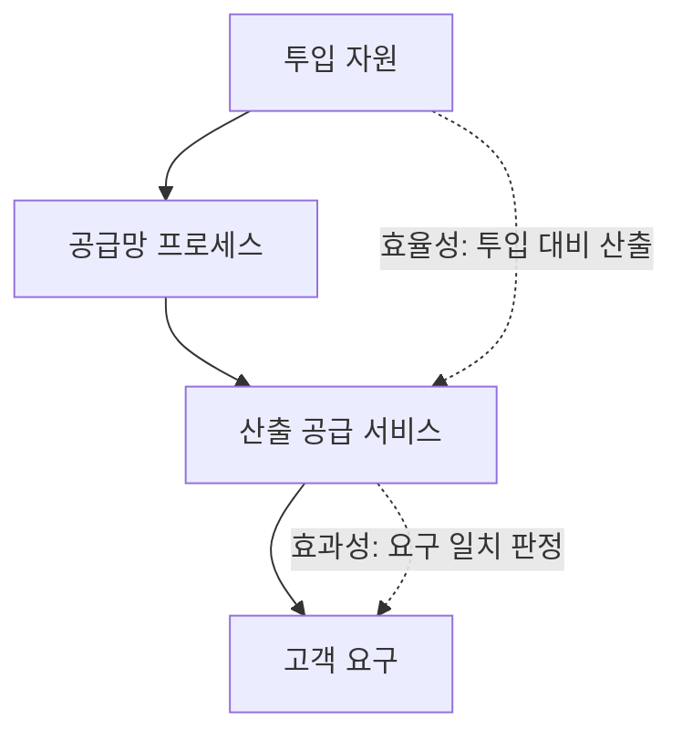
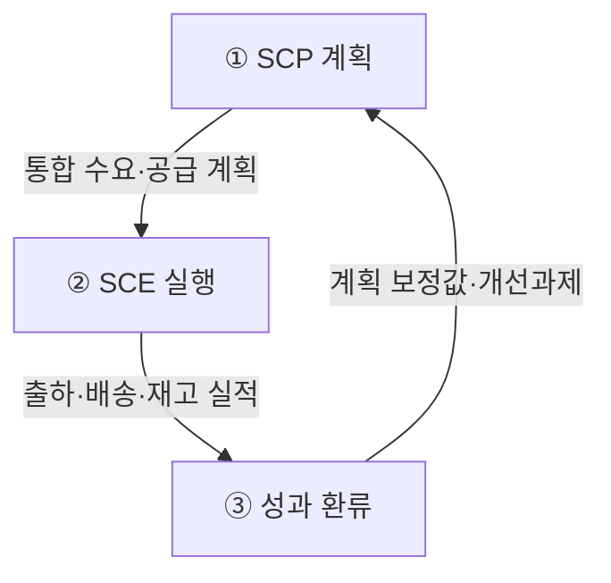
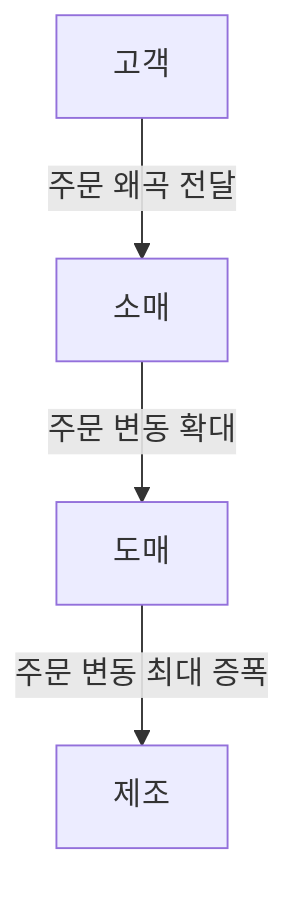

## 지식 로드맵 내 현재 위치

지식 위치: IT 전략·관리 → 엔터프라이즈 솔루션 → **SCM**

## 30초 인출

- 본질: **SCM(Supply Chain Management)**은 최종 고객 수요를 기준으로 공급자부터 고객까지 조달·생산·재고·물류를 하나의 계획으로 연결하고 실행 결과를 다시 계획에 반영하는 공급망 통합 관리 체계이다.
- 메커니즘: 판매·재고 정보를 공유해 수요를 예측하고, 계획 → 실행 → 실적 반영을 반복한다.
- 판정 기준: 고객에게 필요한 상품을 필요한 시점과 수량에 공급하면서 재고·리드타임·물류비를 통제한다.

핵심 용어

- **SCP(Supply Chain Planning)**: 수요와 공급능력 데이터를 바탕으로 생산·조달·재고의 시점과 수량을 결정하는 계획 기능이다.
- **SCE(Supply Chain Execution)**: 확정된 계획을 주문·구매·생산·창고·운송 작업으로 실행하고 진행 상태를 통제하는 기능이다.
- **POS(Point of Sale)**: 매장에서 발생한 판매 시점과 수량을 기록해 공급망에 실수요를 제공하는 시스템이다.
- **Bullwhip Effect(채찍효과)**: 소비자 수요의 작은 변동이 상류로 전달되면서 발주량 변동이 단계마다 커지는 현상이다.
- **VMI(Vendor Managed Inventory)**: 공급자가 고객의 재고·소비량을 확인하고 보충 시점과 수량을 직접 관리하는 방식이다.
- **CPFR(Collaborative Planning, Forecasting and Replenishment)**: 참여 기업이 판매·재고 정보를 공유해 수요예측과 보충계획을 함께 수립·조정하는 방식이다.

## 예상문제

> 공급망관리(SCM, Supply Chain Management)에 대하여 다음을 설명하시오. 가. 공급망관리의 정의와 배경 나. 공급망관리에서 효과성과 효율성 (25점)

## Ⅰ. SCM의 정의·배경

> 개별 기업의 부분 최적화가 아니라 최종 고객 수요를 기준으로 공급망 전체를 통합 운영함

- 정의: **SCM(Supply Chain Management)**은 최종 고객 수요를 기준으로 공급자부터 고객까지 조달·생산·재고·물류를 하나의 계획으로 연결하고 실행 결과를 다시 계획에 반영하는 공급망 통합 관리 체계이다.
- 목적: 고객에게 필요한 상품을 필요한 시점과 수량에 공급하고, 공급망 전체의 **재고·리드타임·총비용**을 최적화
공급망이 길어지고 수요가 불확실해지며 기업 간 정보가 단절되면 **결품·과잉재고·납기 지연**이 함께 발생하므로 통합 관리가 필요하다.

## Ⅱ. SCM의 효과성·효율성

> **효과성**은 산출된 공급 서비스가 고객 요구와 일치하는가로, **효율성**은 같은 산출을 만드는 데 투입한 자원 수준으로 판정하므로 측정 구간 자체가 다름

| 비교축 | 효과성(Effectiveness) | 효율성(Efficiency) |
|---|---|---|
| 판정 | 적시·적소·적량 공급 | 재고·리드타임·물류비 절감 |
| 대표 지표 | **주문 충족률** · 납기 준수율 | **재고회전율** · 주문주기 · 물류비 |

## Ⅲ. SCM 구성체계·운영 메커니즘

> SCP 계획과 SCE 실행을 실적 데이터로 연결하여 수요·공급 오차를 지속 보정함

| 영역 | 활동 |
|---|---|
| ① SCP(Supply Chain Planning) | 수요·공급·생산·재고 계획 |
| ② SCE(Supply Chain Execution) | 주문·창고·운송 실행 |
| ③ 성과 환류 | 판매·재고·납기 편차 분석 |

## Ⅳ. 문제점·대응책

> 정보 지연과 개별 최적화가 주문 변동을 단계마다 키우는 **채찍 효과(Bullwhip Effect)**를 만들므로, 실수요 공유와 협업 보충으로 증폭 고리를 끊어야 함

| 위험 | 대책 | 효과 |
|---|---|---|
| 수요 정보 지연 | **POS** 실판매 정보 공유 | 예측 오차 축소 |
| 일괄·과다 주문 | 소량 빈번 발주 · **VMI** | 주문 변동 완화 |
| 기업별 계획 불일치 | **CPFR** 공동 계획·보충 | 공급망 동기화 |

## Ⅴ. 결론·기술사적 제언

> 비용만 줄이는 공급망은 충격에 취약하므로 핵심 품목은 **회복탄력성**을 함께 설계해야 함

### 학습자 통찰 메모 — 답안 밖

- `[핵심 통찰]`: SCM의 성과는 재고 최소화만으로 판단할 수 없다. 고객 요구를 지키는 효과성과 비용을 낮추는 효율성을 함께 관리해야 부분 최적화를 막을 수 있다.
- `나라면`: 모든 품목의 재고를 일률적으로 늘리지 않고 중단 영향과 대체 가능성으로 품목을 구분한 뒤, 핵심 품목에만 다중 소싱·안전재고를 적용하겠다.

### 실전 답안용 기술사적 제언

- 판정: 주문 충족률과 재고회전율을 함께 보아 효과성·효율성의 균형을 확인
- 대안: POS 실수요 공유·CPFR·VMI로 주문 왜곡을 줄이고 핵심 자재에 다중 소싱 적용
- 검증: 리드타임 편차·결품·재고회전 추세와 대체 조달 전환 가능성 점검
- 효과: 일괄 재고 증설 없이 납기 대응력·공급 중단 회복력 강화

## 1교시 10점 답안 발췌

### 1. 정의·배경

- 정의: **SCM(Supply Chain Management)**은 최종 고객 수요를 기준으로 공급자부터 고객까지 조달·생산·재고·물류를 하나의 계획으로 연결하고 실행 결과를 다시 계획에 반영하는 공급망 통합 관리 체계이다.
- 공급망 확장과 정보 단절은 결품·과잉재고·납기 지연을 키우므로 실수요 공유와 계획·실행 연계가 필요하다.

### 2. 효과성(Effectiveness)·효율성(Efficiency)의 측정 구간

- 지표: 효과성은 주문 충족률 · 납기 준수율, 효율성은 재고회전율 · 주문주기 · 물류비

### 3. 통제

- POS 실수요 공유 · VMI·CPFR 협업으로 **Bullwhip Effect(채찍 효과)** 완화

## 출제 이력과 검증 출처

- 제136회 정보관리기술사 2교시: “공급망관리(SCM, Supply Chain Management)에 대하여 다음을 설명하시오. 가. 공급망관리의 정의와 배경 나. 공급망관리에서 효과성과 효율성”
- [Q-Net, 제136회 정보관리기술사 문제지](https://www.q-net.or.kr/cst006.do?artlSeq=5234951&brdId=Q006&gSite=Q&id=cst00602)
- [ASCM, Supply Chain Management](https://www.ascm.org/topics/supply-chain-management/)
- [ASCM, Cracking the Bullwhip Effect](https://www.ascm.org/ascm-insights/cracking-the-bullwhip-effect/)

## 학습 체크

- [ ] Ⅰ: SCM의 정의·배경을 공급자에서 고객으로 가는 자재, 고객에서 공급자로 가는 자금, 양방향 정보의 세 흐름과 연결해 설명할 수 있는가?
- [ ] Ⅱ: 투입 자원 → 공급망 프로세스 → 산출 공급 서비스 → 고객 요구의 세로 흐름을 그리고, 효율성·효과성의 측정 구간과 각 판정 기준·대표 지표를 짝지을 수 있는가?
- [ ] Ⅲ: SCP 계획·SCE 실행·성과 환류를 활동·산출로 연결하고, 계획 보정값이 다음 SCP 계획으로 되돌아가는 보정 루프를 말할 수 있는가?
- [ ] Ⅳ: 고객에서 제조로 갈수록 주문 변동폭이 커지는 Bullwhip Effect 구조를 그리고 POS·VMI·CPFR 대책과 효과를 1:1로 쓸 수 있는가?
- [ ] Ⅴ: 판정·대안·검증·효과 순으로 품목 위험도 기반 다중 소싱·안전재고 차등 전략을 제시할 수 있는가?

## 연결 토픽

- 이전 토픽: [PMO](./004_pmo.md)
- 연관 토픽: [BPR](./010_bpr.md), [ERP](./068_erp.md), [ESG 경영과 IT](./011_esg.md)
- 다음 토픽: [SLA](./006_sla.md)
