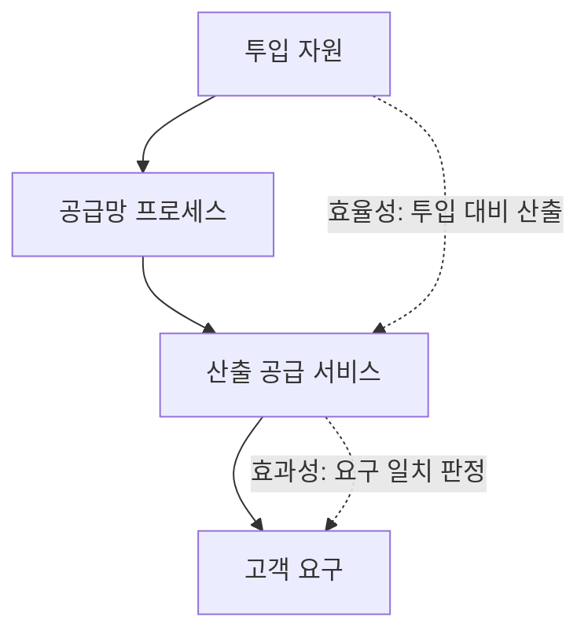
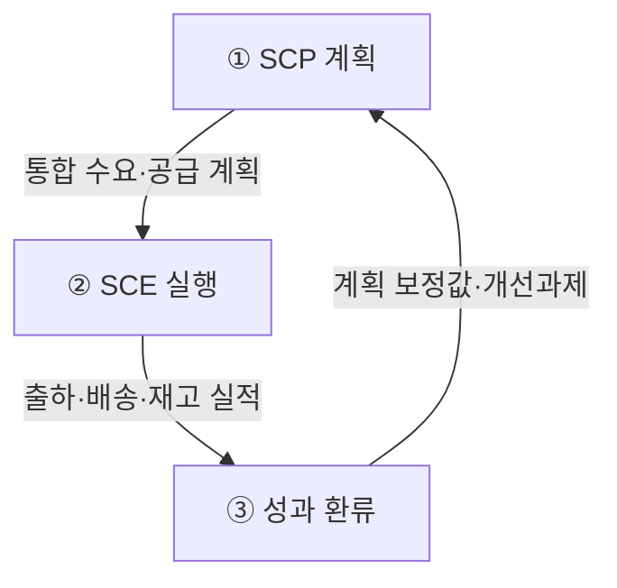

## 지식 로드맵 내 현재 위치

지식 위치: IT 전략·관리 → 엔터프라이즈 솔루션 → **SCM**

## 30초 인출

- 본질: **SCM(Supply Chain Management)** 은 최종 고객 수요를 기준으로 공급자부터 고객까지 조달·생산·재고·물류를 하나의 계획으로 연결하고 실행 결과를 다시 계획에 반영하는 공급망 통합 관리 체계이다.
- 메커니즘: 판매·재고 정보를 공유해 수요를 예측하고, 계획 → 실행 → 실적 반영을 반복한다.

핵심 용어

- **SCP(Supply Chain Planning)** : 수요와 가용 역량을 바탕으로 조달·생산·물류 계획을 동기화하여 수립하는 계획 체계
- **SCE(Supply Chain Execution)** : 수립된 계획에 따라 주문·창고·운송의 실제 물류 실행을 통제하는 실행 관리 시스템
- **POS(Point of Sale)** : 매장 판매 시점에 실시간 거래 데이터를 수집하여 공급망에 전달하는 판매정보관리 시스템
- **Bullwhip Effect(채찍효과)** : 공급망 하류의 미세한 수요 변동이 상류로 갈수록 증폭되어 주문 변동성이 왜곡되는 현상
- **VMI(Vendor Managed Inventory)** : 공급자가 유통사의 재고·소비 데이터를 모니터링하여 발주와 보충을 직접 수행하는 재고관리 방식
- **CPFR(Collaborative Planning, Forecasting and Replenishment)** : 공급망 참여사들이 협력하여 공동으로 수요를 예측하고 재고 보충 계획을 수립하는 프로세스

## 예상문제

> 공급망관리(SCM, Supply Chain Management)에 대하여 다음을 설명하시오. 가. 공급망관리의 정의와 배경 나. 공급망관리에서 효과성과 효율성 (25점)

## Ⅰ. SCM의 개요

- 정의: **SCM(Supply Chain Management)** 은 최종 고객 수요를 기준으로 공급자부터 고객까지 조달·생산·재고·물류를 하나의 계획으로 연결하고 실행 결과를 다시 계획에 반영하는 공급망 통합 관리 체계이다.
- 목적: 고객에게 필요한 상품을 적시·적소에 공급하고 공급망 전체의 **재고·리드타임·총비용** 을 최적화하는 것

공급망이 길어지고 수요가 불확실해지며 기업 간 정보가 단절되면 **결품·과잉재고·납기 지연** 이 함께 발생하므로 통합 관리가 필요하다.

## Ⅱ. SCM의 효과성·효율성

> **효과성** 은 산출된 공급 서비스가 고객 요구와 일치하는가로, **효율성** 은 같은 산출을 만드는 데 투입한 자원 수준으로 판정하므로 측정 구간 자체가 다름

| 비교축 | 효과성(Effectiveness) | 효율성(Efficiency) |
|---|---|---|
| 판정 | 적시·적소·적량 공급 | 재고·리드타임·물류비 절감 |
| 대표 지표 | **주문 충족률** · 납기 준수율 | **재고회전율** · 주문주기 · 물류비 |

## Ⅲ. SCM 구성체계·운영 메커니즘

> SCP 계획과 SCE 실행을 실적 데이터로 연결하여 수요·공급 오차를 지속 보정함

| 영역 | 활동 |
|---|---|
| ① SCP(Supply Chain Planning) | 수요·공급·생산·재고 계획 |
| ② SCE(Supply Chain Execution) | 주문·창고·운송 실행 |
| ③ 성과 환류 | 판매·재고·납기 편차 분석 |

## Ⅳ. 문제점·대응책

> 정보 지연과 개별 최적화가 주문 변동을 단계마다 키우는 **채찍 효과(Bullwhip Effect)** 를 만들므로, 실수요 공유와 협업 보충으로 증폭 고리를 끊어야 함

| 위험 | 대책 | 효과 |
|---|---|---|
| 수요 정보 지연 | **POS** 실판매 정보 공유 | 예측 오차 축소 |
| 일괄·과다 주문 | 소량 빈번 발주 · **VMI** | 주문 변동 완화 |
| 기업별 계획 불일치 | **CPFR** 공동 계획·보충 | 공급망 동기화 |

## Ⅴ. 결론·기술사적 제언

> 비용만 줄이는 공급망은 충격에 취약하므로 핵심 품목은 **회복탄력성** 을 함께 설계해야 함

### 실전 답안용 기술사적 제언

문제: 각 공급망 단계가 서로 다른 수요정보로 계획하면 주문 변동이 상류로 증폭되어 재고와 납기 불안정이 커진다. 제언: 참여 기업이 실제 수요와 재고정보를 공유하고 공동 계획을 수립해 공급량을 조정한다.

| 문제 | 해결 방안 |
|---|---|
| 단계별 수요·재고정보가 분절됨 | 실수요·재고 정보를 공유하고 공동 예측·보충계획 수립 |
| 공급 변동에 대응할 여력이 부족 | 핵심 품목의 대체 공급과 적정 재고를 검토 |

## 1교시 10점 답안 발췌

### 1. 정의·목적

- 정의: 최종 고객 수요를 기준으로 공급자부터 고객까지 조달·생산·재고·물류를 하나의 계획으로 연결하고 실행 결과를 다시 계획에 반영하는 공급망 통합 관리 체계
- 목적: 결품 방지 및 공급망 총비용 최적화

### 2. 효과성(Effectiveness)·효율성(Efficiency)의 측정 구간

- 지표: 효과성은 주문 충족률 · 납기 준수율, 효율성은 재고회전율 · 주문주기 · 물류비

### 3. 공급망 채찍효과 완화 방안

- 한 줄 제언: 공급망 단계 간 실수요 정보를 공유하고 공동 계획으로 재고·납기를 조정한다.

## 출제 이력과 검증 출처

- 제136회 정보관리기술사 2교시: “공급망관리(SCM, Supply Chain Management)에 대하여 다음을 설명하시오. 가. 공급망관리의 정의와 배경 나. 공급망관리에서 효과성과 효율성”
- [Q-Net, 제136회 정보관리기술사 문제지](https://www.q-net.or.kr/cst006.do?artlSeq=5234951&brdId=Q006&gSite=Q&id=cst00602)
- [ASCM, Supply Chain Management](https://www.ascm.org/topics/supply-chain-management/)
- [ASCM, Cracking the Bullwhip Effect](https://www.ascm.org/ascm-insights/cracking-the-bullwhip-effect/)

## 학습 체크

- [ ] Ⅰ: SCM의 정의·배경을 공급자에서 고객으로 가는 자재, 고객에서 공급자로 가는 자금, 양방향 정보의 세 흐름과 연결해 설명할 수 있는가?
- [ ] Ⅱ: 투입 자원 → 공급망 프로세스 → 산출 공급 서비스 → 고객 요구의 세로 흐름을 그리고, 효율성·효과성의 측정 구간과 각 판정 기준·대표 지표를 짝지을 수 있는가?
- [ ] Ⅲ: SCP 계획·SCE 실행·성과 환류를 활동·산출로 연결하고, 계획 보정값이 다음 SCP 계획으로 되돌아가는 보정 루프를 말할 수 있는가?
- [ ] Ⅳ: 고객에서 제조로 갈수록 주문 변동폭이 커지는 Bullwhip Effect 구조를 그리고 POS·VMI·CPFR 대책과 효과를 1:1로 쓸 수 있는가?
- [ ] Ⅴ: 실수요 공유 및 협업 보충(CPFR·VMI)을 적용한 기술사적 문제 해결 방안을 제시할 수 있는가?

## 연결 토픽

- 이전 토픽: [PMO](./004_pmo.md)
- 연관 토픽: [BPR](./010_bpr.md), [ERP](./068_erp.md), [ESG 경영과 IT](./011_esg.md)
- 다음 토픽: [SLA](./006_sla.md)
