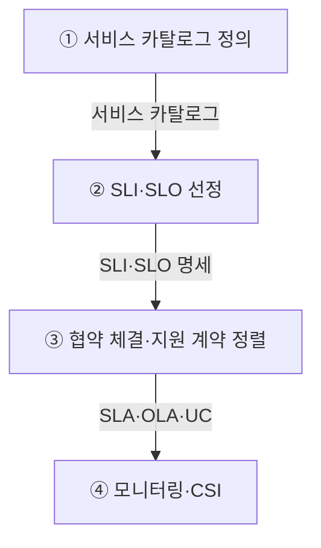
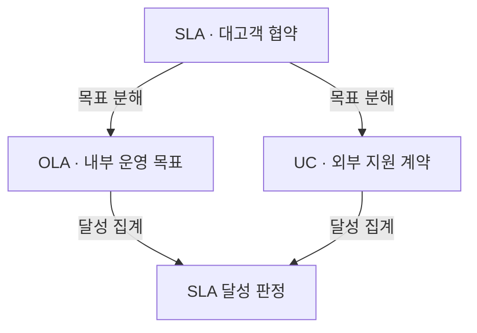
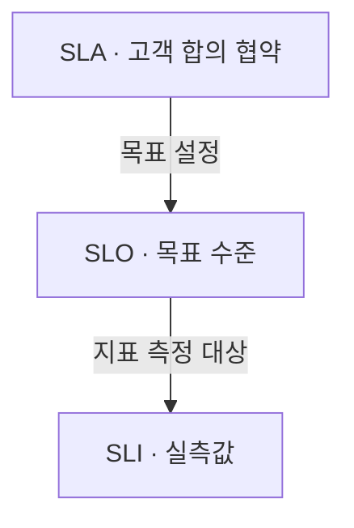
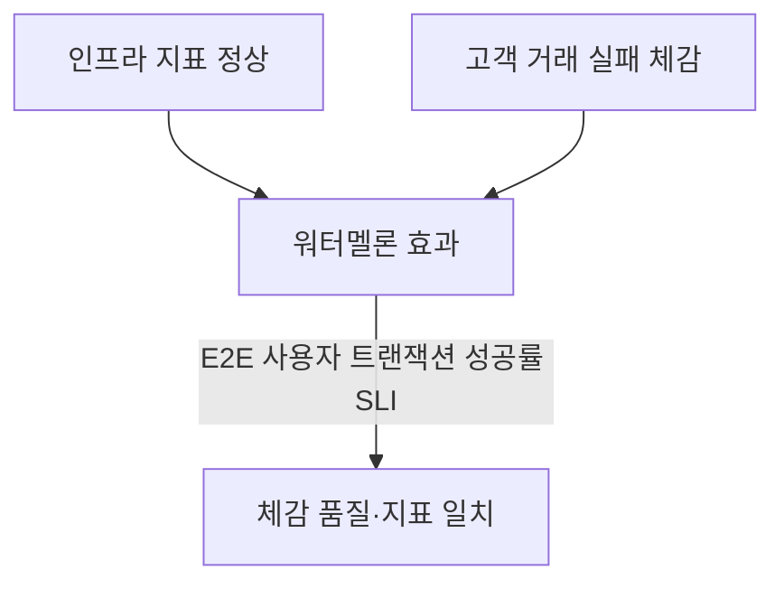
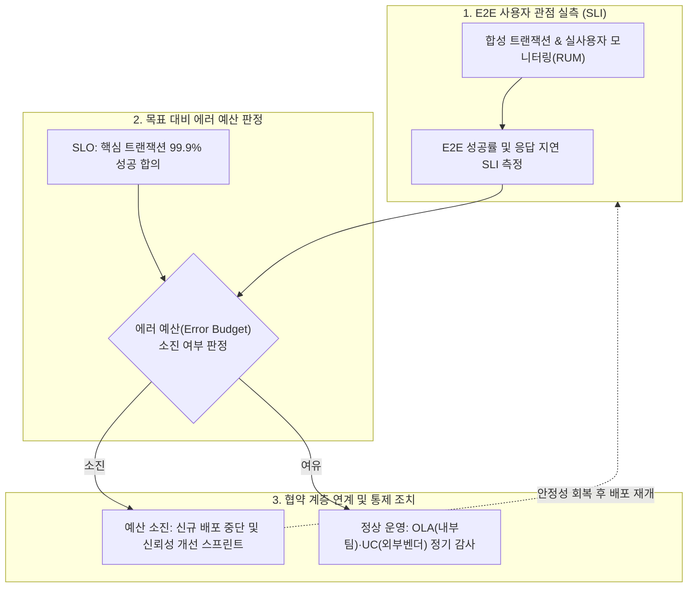

## 지식 로드맵 내 현재 위치

지식 위치: IT 전략·관리 → IT 서비스 관리 → **SLA**

## 30초 인출

- 본질: **SLA(Service Level Agreement)** 는 고객과 제공자가 서비스 수준·측정·책임을 합의한 협약이다.
- 메커니즘: **SLI** 실측 → **SLO** 목표 설정 → **SLA** 합의 → **OLA** · **UC** 정렬 → 측정·개선한다.
- 산출물: 서비스 카탈로그 · **SLA** · **OLA** · **UC** · 서비스 보고서 · 개선계획이다.

핵심 용어

- **SLA(Service Level Agreement)** : 고객과 제공자가 서비스 범위·수준·측정 방법·책임을 합의한 협약이다.
- **OLA(Operational Level Agreement)** : SLA를 지키기 위해 내부 지원 조직 간 처리·조치 기준을 정한 운영수준협약이다.
- **UC(Underpinning Contract)** : SLA 이행에 필요한 지원 서비스를 외부 공급자가 제공하도록 체결하는 계약이다.
- **SLI(Service Level Indicator)** : 실제 서비스 품질을 성공 응답률·지연시간처럼 측정한 지표다.
- **SLO(Service Level Objective)** : SLI에 대해 합의하거나 설정한 목표 수준으로, 적용 범위는 운영 맥락에 따라 정한다.
- **에러 예산(Error Budget)** : SLO 목표 수준을 유지하면서 허용되는 최대 실패량이다.
- **워터멜론 효과(Watermelon Effect)** : 내부 지표는 정상인데 실제 사용자의 업무 트랜잭션은 장애를 겪는 측정 괴리다.
- **CSI(Continual Service Improvement)** : 측정된 성과를 분석해 서비스 품질과 운영 프로세스를 지속적으로 개선하는 ITIL 실천 체계다.
- **ITSM(IT Service Management)** : 합의한 서비스 수준을 운영 프로세스로 이행하고 관리하는 서비스 관리 영역이다.

## 예상문제

> 디지털 서비스의 SLA(Service Level Agreement) 개념·구성요소·수립 절차를 설명하고, OLA(Operational Level Agreement)·UC(Underpinning Contract) 연계와 SLI·SLO 적용 방안을 제시하시오. (25점)

## Ⅰ. SLA의 개요

- 정의: 고객과 제공자가 서비스 범위, **목표 수준** , **측정·보고 방법** , 역할·책임을 합의한 **서비스 수준 협약**
- 목적: 서비스 기대수준 명료화 · 책임 분쟁 예방 · 측정 기반 개선

## Ⅱ. SLA 구성체계·4단계 수립·운영 프로세스

> 서비스 정의부터 모니터링·지속 개선까지 측정 결과를 환류함

| 단계 | 활동 |
|---|---|
| ① 서비스 카탈로그 정의 | 사용자 중심 서비스 목록·중요도 분류 |
| ② SLI·SLO 선정 | 측정 가능한 SLI 선정·비즈니스 SLO 합의 |
| ③ 협약 체결·지원 계약 정렬 | 책임·예외 조항 합의·OLA·UC 정렬 |
| ④ 모니터링·CSI | SLI 측정 수집·달성도 검토·개선점 발굴 |

## Ⅲ. SLA·OLA·UC 3계층 정렬 — 목표 분해와 달성 집계

> 대고객 SLA 목표를 내부 **OLA** ·외부 **UC** 목표로 분해하고 구간 실적을 다시 모아 대조해야 종단 서비스 수준이 한 기준으로 관리됨

- **법적 구속력** ·위약금은 명칭만으로 정해지지 않고 실제 계약·조직 규정에 따름

## Ⅳ. SLI-SLO-SLA 지표 계층 체계

> **SLI** 는 측정값, **SLO** 는 합의하거나 설정한 목표, SLA는 당사자 간 협약이며 SLO의 공개·내부 사용 여부는 운영 맥락에 따라 달라짐

### 영역별 평가지표·측정 사례

| 영역 | 평가지표 | 측정방법 |
|---|---|---|
| HW | 가용성 · 장애복구시간 | 가동시간 로그 · 장애 티켓 |
| SW | **거래 성공률** · 응답시간 | APM · **합성 트랜잭션** |
| NW | 지연 · 손실률 | 구간별 RTT · 패킷 측정 |

## Ⅴ. SLA 실효성 확보의 문제점·대응책

> 겉만 정상인 워터멜론 효과를 극복하기 위해 사용자 트랜잭션 종단 실측과 부서 간 OLA 명문화가 결합되어야 함

| 위험 | 대책 | 효과 |
|---|---|---|
| **워터멜론 효과** | **E2E 사용자 트랜잭션 성공률** 중심 SLI 전면 개편 | 체감 품질과 모니터링 지표 일치 |
| 팀 간 책임 전가 | 핸드오프 경계 OLA 명문화 · **RACI** 확립 | 평균장애복구시간(MTTR) 단축 |
| 외부 공급 수준 불일치 | UC 목표·측정법을 SLA와 정렬 | 공급자 장애 영향·책임 가시화 |

## Ⅵ. 결론 — 에러 예산 기반 서비스 거버넌스

> 처벌을 위한 정적 계약을 탈피하여 비즈니스 배포 속도와 시스템 신뢰성을 균형 제어하는 **에러 예산(Error Budget)** 체계로 전환해야 함

### 실전 답안용 기술사적 제언

- 문제: 인프라 가동률 99.9% 지표는 정상이지만 사용자 트랜잭션 오류가 발생하는 워터멜론 효과와 내부 팀/외부 벤더 간 책임 전가가 반복됨.
- 해결 방안: 사용자 종단 거래 성공률 중심의 E2E SLI를 전면 도입하고, 대고객 SLA를 내부 OLA(운영수준협약) 및 외부 UC(지원계약)와 직결하며, 에러 예산(Error Budget) 소진 시 신규 기능 배포를 자동 동결하는 거버넌스를 구축함.

## 1교시 10점 답안 발췌

### 1. 정의·목적

- 정의: **SLA(Service Level Agreement)** 는 고객과 제공자가 서비스 범위·목표 수준·측정·책임을 합의한 협약
- 목적: 서비스 기대수준 명료화 · 분쟁 예방 · 지속 개선

### 2. 구성체계·운영 방법론

| 단계 | 활동 |
|---|---|
| ① 서비스 카탈로그 정의 | 사용자 중심 서비스 목록·중요도 분류 |
| ② SLI·SLO 선정 | 측정 가능한 SLI 선정·비즈니스 SLO 합의 |
| ③ 협약 체결·지원 계약 정렬 | 책임·예외 조항 합의·OLA·UC 정렬 |
| ④ 모니터링·CSI | SLI 측정 수집·달성도 검토·개선점 발굴 |

### 3. 협약 계층과 결론

- 협약 계층: **SLA(Service Level Agreement)** 대고객 · **OLA(Operational Level Agreement)** 내부 팀 · **UC(Underpinning Contract)** 외부 공급자
- 결론: 인프라 가동 지표가 아니라 고객 종단 거래 성공률을 **SLI(Service Level Indicator)** 로 삼아야 SLA가 체감 품질과 일치함

## 출제 이력과 검증 출처

- 제134회 정보관리기술사 2교시: "국가기관, 지방자치단체 및 공공기관이 안전하고 효율적으로 SaaS(Software as a Service)를 이용하기 위해 공공부문 SaaS 이용 가이드라인을 발표하였다. 다음에 대하여 설명하시오. 가. 클라우드 서비스 위험 관리원칙 및 기준 나. 보안대책 수립 및 보안성 검토 다. 서비스 수준 협약"
- 제137회 정보관리기술사 2교시: "(A)기업은 전자상거래 정보시스템 개발 프로젝트를 완료하고, 운영으로 전환하고자 한다. 각 항목을 설명하시오. 가. SLA(Service Level Agreement) 구성요소와 절차 나. (A)기업의 특성을 고려하여 하드웨어, 소프트웨어, 네트워크 영역별 SLA 평가지표와 측정방법에 대한 사례"
- [Google SRE, Service Level Objectives](https://sre.google/sre-book/service-level-objectives/)
- [Google SRE, Implementing SLOs](https://sre.google/workbook/implementing-slos/)

## 학습 체크

- [ ] Ⅰ 개요: SLA를 서비스 항목, SLI, SLO, 책임의 정량 협약으로 정의할 수 있는가?
- [ ] Ⅱ 절차: 카탈로그 정의부터 CSI까지 4단계의 활동과 산출물을 연결할 수 있는가?
- [ ] Ⅲ 정렬: SLA 목표가 OLA·UC로 분해되고 구간 실적이 다시 모여 달성 판정에 이르는 그림을 그리고, 법적 성격은 실제 계약에 따라 판단할 수 있는가?
- [ ] Ⅳ 계층: SLA·SLO·SLI의 포함 관계를 트리로 그리고 HW·SW·NW 영역별 평가지표와 측정방법을 한 쌍으로 제시할 수 있는가?
- [ ] Ⅴ 문제점·대응책: 워터멜론 효과의 발생 구조를 그리고 팀 간 책임 전가·외부 공급 수준 불일치까지 위험·대책·효과로 연결할 수 있는가?
- [ ] Ⅵ 제언: 핵심 비즈니스 여정 SLI와 에러 예산을 이용한 기술사적 문제 해결 방안을 제시할 수 있는가?

## 연결 토픽

- 이전 토픽: [SCM](./005_scm.md)
- 연관 토픽: [ITSM](./044_itsm.md), [BCP/DRS](./018_rpo.md), [클라우드 네이티브](./021_public_cloud_native_transition.md)
- 다음 토픽: [WBS](./007_wbs.md)
