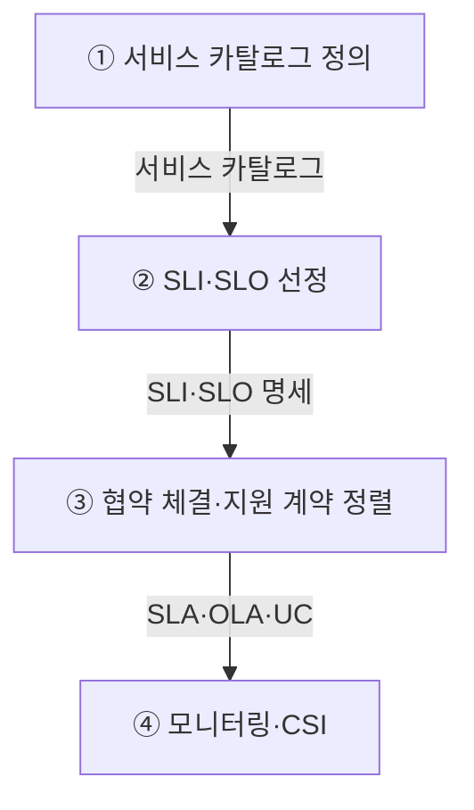
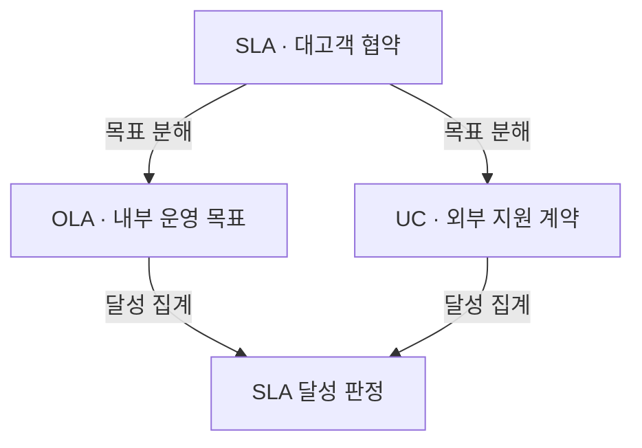
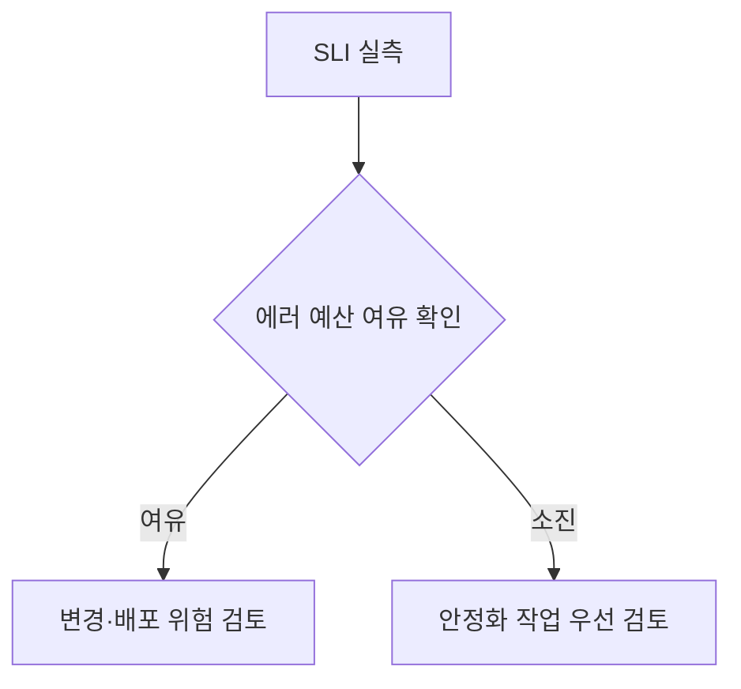

## 지식 로드맵 내 현재 위치

지식 위치: IT 전략·관리 → IT 서비스 관리 → **SLA**

## 30초 인출

- 본질: SLA(Service Level Agreement, 서비스 수준 협약)는 제공자와 고객이 서비스 범위·수준·측정·책임을 미리 합의한 문서
- 메커니즘: 고객 서비스·측정 범위 정의 → **SLI·SLO** 선정 → **SLA** 합의 → **OLA·UC** 정렬 → 실측·개선

핵심 용어

- **SLA(Service Level Agreement)** : 고객과 제공자가 서비스 범위·수준·측정 방법·책임을 합의한 협약
- **OLA(Operational Level Agreement)** : SLA 이행을 위한 내부 지원 조직 간 처리·조치 기준 협약
- **UC(Underpinning Contract)** : SLA 이행에 필요한 지원 서비스를 외부 공급자가 제공하도록 체결하는 계약
- **SLI(Service Level Indicator)** : 성공 응답률·지연시간처럼 실제 서비스 품질을 측정하는 지표
- **SLO(Service Level Objective)** : SLI에 대해 합의하거나 설정한 목표 수준으로, 적용 범위는 운영 맥락에 따라 결정
- **RTO(Recovery Time Objective)** : 업무·서비스 복구까지 허용하는 목표시간으로, 재해복구 설계와 SLA 복구수준에 사용하는 기준
- **RPO(Recovery Point Objective)** : 장애·재해 시 복구할 데이터의 기준시점으로 허용 가능한 데이터 손실 범위를 나타내는 기준
- **MTTR(Mean Time to Repair/Restore)** : 실제 장애 발생 후 복구까지 걸린 평균시간으로, 사전 복구 목표인 RTO와 구별되는 운영 실적
- **에러 예산(Error Budget)** : SLO 에서 허용하는 최대 실패량
- **워터멜론 효과(Watermelon Effect)** : 내부 지표는 정상이나 실제 사용자 업무 트랜잭션은 장애를 겪는 측정 괴리
- **CSI(Continual Service Improvement)** : 측정된 성과를 분석해 서비스 품질과 운영 프로세스를 지속 개선하는 ITIL 실천 체계
- **ITSM(IT Service Management)** : 합의한 서비스 수준을 운영 프로세스로 이행·관리하는 서비스 관리 영역
- **RACI(Responsible, Accountable, Consulted, Informed)** : 장애 대응 업무의 수행·승인·자문·통보 책임을 구분하는 역할표

---

## 1교시 예상문제 (10점)

> SLA에 관하여 설명하시오. (예상·10점)

---

## 1교시 10점 답안

### Ⅰ. 개요

| 구분 | 핵심 |
|---|---|
| 정의 | **SLA** 는 고객과 제공자가 서비스 범위·목표 수준·측정 방법·책임을 합의한 협약 |
| 목적 | 합의한 서비스 수준의 측정·관리와 책임 명확화 |

### Ⅱ. 구성체계·운영 방법론

| 단계 | 활동 |
|---|---|
| ① 서비스 카탈로그 정의 | 사용자 중심 서비스 목록·중요도 분류 |
| ② SLI·SLO 선정 | 측정 가능한 SLI 선정·비즈니스 SLO 합의 |
| ③ 협약 체결·지원 계약 정렬 | 책임·예외 조항 합의·OLA·UC 정렬 |
| ④ 모니터링·CSI | SLI 측정 수집·달성도 검토·개선점 발굴 |

### Ⅲ. 협약 계층과 결론

| 통제 축 | 확인할 관계 |
|---|---|
| 협약 | **SLA** 대고객 · **OLA** 내부 팀 · **UC** 외부 공급자 |
| 복구 | **RTO·RPO** 는 사전 목표, **MTTR** 은 실제 복구 성과 |
| 체감 품질 | 고객 거래 성공률을 **SLI** 로 측정 |

**제언:** 고객 관점 지표와 내부·외부 지원 책임의 연결을 통한 서비스 수준 관리

---

## 2~4교시 예상문제 (25점)

> 디지털 서비스의 SLA(Service Level Agreement) 개념·구성요소·수립 절차를 설명하고, OLA(Operational Level Agreement)·UC(Underpinning Contract) 연계와 SLI·SLO 적용 방안을 제시하시오. (25점)

---

## 2~4교시 25점 답안

## Ⅰ. SLA의 개요

| 구분 | 핵심 |
|---|---|
| 정의 | **SLA** 는 고객과 제공자가 서비스 범위·목표 수준·측정 방법·책임을 합의한 협약 |
| 목적 | 합의한 서비스 수준의 측정·관리와 책임 명확화 |

## Ⅱ. SLA 구성체계·4단계 수립·운영 프로세스

> 서비스 정의부터 모니터링·지속 개선까지의 측정 결과 반영

| 단계 | 활동 |
|---|---|
| ① 서비스 카탈로그 정의 | 사용자 중심 서비스 목록·중요도 분류 |
| ② SLI·SLO 선정 | 측정 가능한 SLI 선정·비즈니스 SLO 합의 |
| ③ 협약 체결·지원 계약 정렬 | 책임·예외 조항 합의·OLA·UC 정렬 |
| ④ 모니터링·CSI | SLI 측정 수집·달성도 검토·개선점 발굴 |

## Ⅲ. SLA·OLA·UC 3계층 정렬 — 목표 분해와 달성 집계

> 대고객 SLA 목표의 내부 **OLA**·외부 **UC** 목표 분해와 구간 실적 집계를 통한 종단 서비스 수준 관리

- **법적 구속력**·위약금의 계약·조직 규정에 따른 결정(명칭만으로 결정되지 않음)

## Ⅳ. SLI·SLO와 RTO·RPO의 SLA 지표 예

> **SLI**의 실측 지표 역할과 **SLO**의 목표 수준 역할, 복구 목표인 **RTO**·**RPO**와 실제 장애복구 성과인 **MTTR**의 구분

### 영역별 평가지표·측정 사례

| 영역 | 평가지표 | 측정방법 |
|---|---|---|
| 서비스 가용성 | 가용률 · 중단시간 | 사용자 요청·가동시간 로그 |
| 업무 복구 | **RTO** · **RPO** | 업무 재개 시각 · 복구 데이터 기준시점·정합성 확인 |
| SW | 장애율 · **MTTR** (평균 복구시간) | 장애 티켓의 감지·복구 시각 · 운영 기록 |
| SW | **거래 성공률** · 응답시간 | APM · **합성 트랜잭션** |
| NW | 지연 · 손실률 | 구간별 RTT · 패킷 측정 |

서비스 재개까지 허용하는 시간인 RTO와 장애 직전 대비 복구 데이터의 허용 시점인 RPO. 두 값의 업무별 BIA·복구 설계 결정 후 SLA 복구 수준 반영. 장애 복구 평균 실적인 MTTR과 RTO 목표 달성 여부의 별도 관리

## Ⅴ. SLA 실효성 확보의 한계·대응책

> 워터멜론 효과 해소를 위한 사용자 트랜잭션 종단 실측과 부서 간 OLA 명문화

| 위험 | 대책 | 효과 |
|---|---|---|
| **워터멜론 효과** | **E2E 사용자 트랜잭션 성공률** 중심 SLI 전면 개편 | 체감 품질과 모니터링 지표 일치 |
| 팀 간 책임 전가 | 핸드오프 경계 OLA 명문화 · **RACI** 확립 | 실제 **MTTR** (평균 복구시간) 단축 및 **RTO** 달성 지원 |
| 외부 공급 수준 불일치 | UC 목표·측정법을 SLA와 정렬 | 공급자 장애 영향·책임 가시화 |

## Ⅵ. 기술사적 제언 — SLO 위반 허용량을 배포 판단에 활용

> 제안: 사용자 거래 성공률 등 합의한 SLI를 통한 SLO 달성도 측정과 **에러 예산** 소진도에 따른 배포 위험 검토. Ⅴ절의 지표·조직별 책임 개선과 구분되는 **변경 우선순위 결정** 용도

에러 예산의 성격: 모든 SLA의 법정 구성요소가 아닌 운영 방안. 장애 시 **RTO·RPO** 달성 여부의 별도 검증

## 출제 이력과 검증 출처

- 제134회 정보관리기술사 2교시: "국가기관, 지방자치단체 및 공공기관이 안전하고 효율적으로 SaaS(Software as a Service)를 이용하기 위해 공공부문 SaaS 이용 가이드라인을 발표하였다. 다음에 대하여 설명하시오. 가. 클라우드 서비스 위험 관리원칙 및 기준 나. 보안대책 수립 및 보안성 검토 다. 서비스 수준 협약"
- 제137회 정보관리기술사 2교시: "(A)기업은 전자상거래 정보시스템 개발 프로젝트를 완료하고, 운영으로 전환하고자 한다. 각 항목을 설명하시오. 가. SLA(Service Level Agreement) 구성요소와 절차 나. (A)기업의 특성을 고려하여 하드웨어, 소프트웨어, 네트워크 영역별 SLA 평가지표와 측정방법에 대한 사례"
- [Google SRE, Service Level Objectives](https://sre.google/sre-book/service-level-objectives/)
- [Google SRE, Implementing SLOs](https://sre.google/workbook/implementing-slos/)

## 연결 토픽

- 이전 토픽: [SCM](./005_scm.md)
- 연관 토픽: [ITSM](./044_itsm.md), [BCP/DRS](./018_rpo.md), [클라우드 네이티브](./021_public_cloud_native_transition.md)
- 다음 토픽: [WBS](./007_wbs.md)
