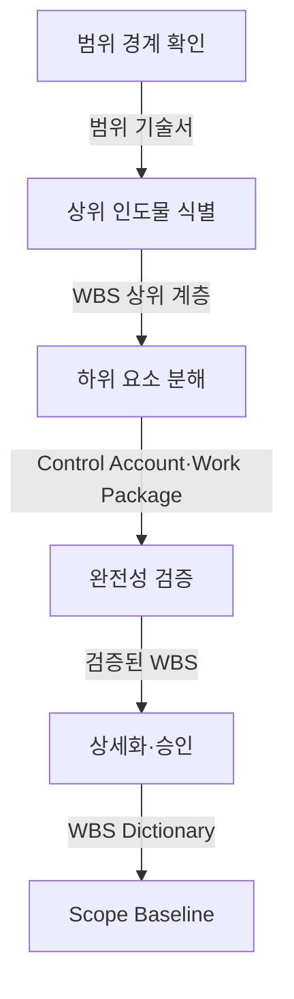
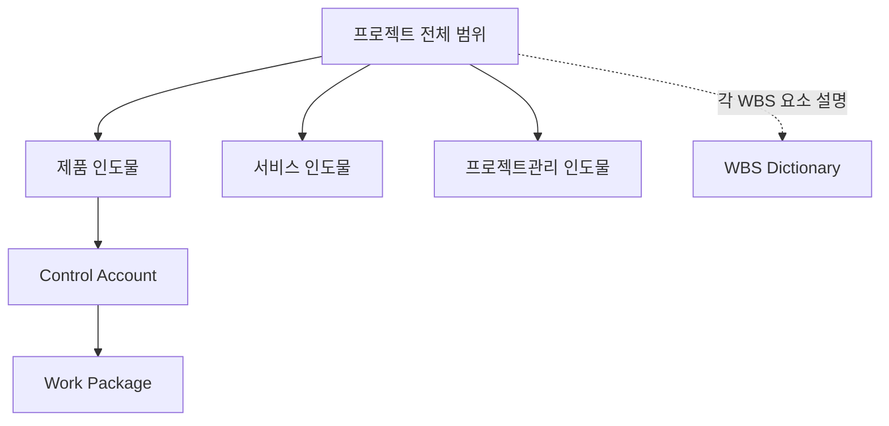
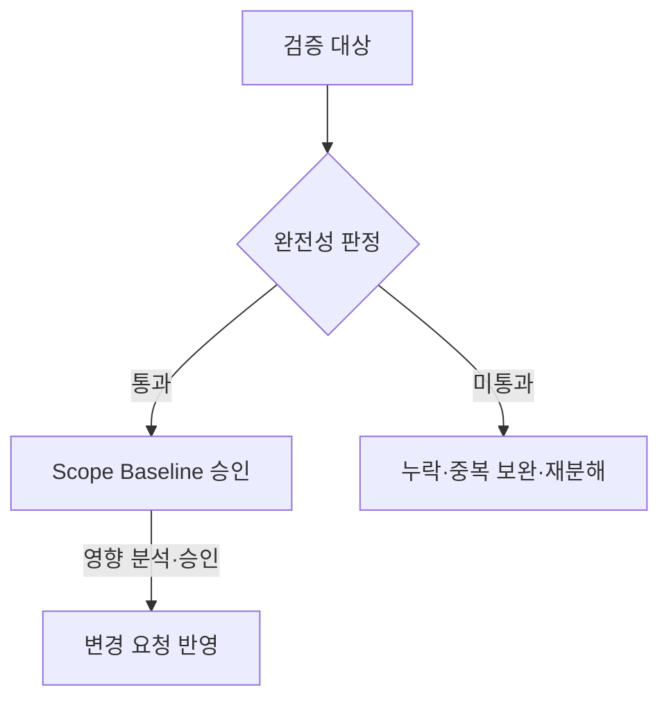
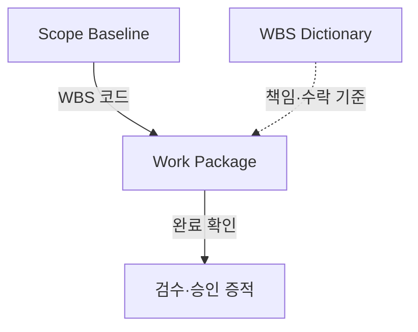
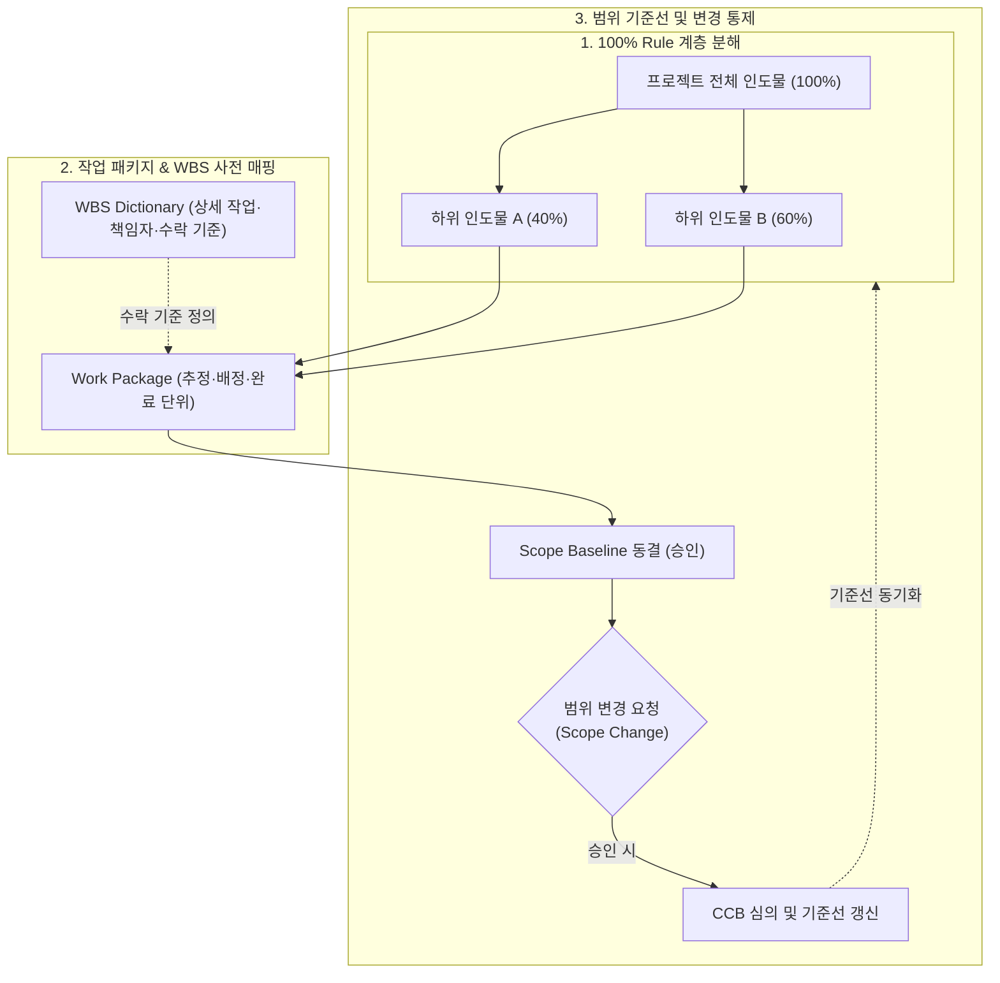

## 지식 로드맵 내 현재 위치

지식 위치: IT 전략·관리 → 프로젝트 범위관리 → **WBS**

## 30초 인출

- 본질: **WBS(Work Breakdown Structure)**는 프로젝트 전체 범위를 인도물 중심으로 분해해 추정·배정·검수가 가능한 **Work Package**까지 내리는 계층 구조이다.
- 메커니즘: 범위 경계 확정 → 인도물 분해 → 상위 범위를 빠짐없이 포함하는지 검증 → 책임·수락 기준 상세화 → **Scope Baseline** 승인한다.
- 산출물: **WBS** · **WBS Dictionary** · 프로젝트 범위 기술서로 구성된 **Scope Baseline**이다.

핵심 용어

- **WBS(Work Breakdown Structure)**: 전체 프로젝트 범위를 하위 인도물과 Work Package로 분해해 연결하는 계층 구조다.
- **범위 완전성 원칙**: 하위 요소의 합이 상위 범위를 빠짐없이 포함하고 범위 밖 작업은 포함하지 않도록 검증하는 원칙이다.
- **Work Package**: 비용·노력·기간·자원과 담당자·완료 기준을 추정하고 관리하는 작업 단위다.
- **Control Account**: 특정 범위의 일정·원가 성과를 통합해 관리하는 통제점이다.
- **WBS Dictionary**: 각 WBS 요소의 작업 내용·책임·가정·수락 기준을 상세히 기록하는 문서다.
- **Scope Baseline(범위 기준선)**: 승인된 범위 기술서·WBS·WBS Dictionary를 묶어 변경을 비교하는 기준이다.

## 예상문제

> WBS(Work Breakdown Structure) 작성방법을 설명하시오. (10점)

- 논술 변형: WBS의 개념·작성방법과 완전성 검증·범위 변경 통제방안을 설명하시오.

## Ⅰ. WBS의 개요

- 정의: **WBS(Work Breakdown Structure)**는 프로젝트 **범위**를 인도물 중심으로 **Work Package(작업 패키지)**까지 계층 분해해 **Scope Baseline**을 만드는 범위관리 도구
- 목적: 범위 누락·중복과 무승인 작업을 예방하고 일정·원가 추정의 기준을 제공하는 것

## Ⅱ. 범위 경계에서 Scope Baseline까지의 작성 흐름

> 분해는 인도물별 범위를 완전하게 닫고 추정·책임·수락 판정이 가능한 수준에서 멈춰야 함

| 단계 | 활동 |
|---|---|
| 범위 경계 확인 | 목표·인도물·제외 범위 확인 |
| 상위 인도물 식별 | 제품·서비스·관리 인도물 구분 |
| 하위 요소 분해 | 추정·배정·완료 가능 수준까지 분해 |
| 완전성 검증 | 하위 요소의 누락·중복 점검 |
| 상세화·승인 | 책임·가정·수락 기준 기록 |

## Ⅲ. WBS 계층과 분해 중단 기준

> 상위 범위는 누락·중복이 없도록 검증하고, Work Package는 추정·배정·완료 판정이 가능할 때 분해를 멈추며 수락 기준은 WBS Dictionary에 남김

## Ⅳ. 완전성 판정과 변경 통제

> Scope Baseline은 승인 이후 변경 요청을 영향 분석·승인과 연결할 때 통제 기준으로 작동함

## Ⅴ. 형식적 WBS의 문제점·대응책

> WBS 실패는 분해 개수보다 Work Package의 승인 범위·책임·완료 증적이 끊길 때 발생하므로 같은 WBS 코드로 추적해야 함

| 위험 | 대책 | 효과 |
|---|---|---|
| **Scope Creep** | 제외 범위 명시·변경 요청 승인 | 무승인 작업 식별 |
| 누락·중복 | 상위 요소별 하위 항목 교차 검토 | 범위 완전성 확인 |
| 분해 수준 부적정 | 추정·배정·완료 판정 가능 수준에서 중단 | 관리 과부하·통제 공백 완화 |

## Ⅵ. 결론 — 검수 증적과 연결하는 WBS

> WBS의 성패는 Work Package별 승인 범위와 실제 완료 증적을 같은 코드로 추적할 수 있는가로 판정함

### 실전 답안용 기술사적 제언

- 문제: WBS가 일정 액티비티 나열식으로 작성되거나 WBS 사전(Dictionary)이 누락되어, 프로젝트 중반 범위 크립(Scope Creep)과 수락 기준 분쟁이 발생함.
- 해결 방안: 100% Rule 기반의 인도물 중심 계층 분해와 작업 패키지별 WBS 사전(작업 범위, 책임자, 수락 기준) 의무화를 적용하고, 범위 변경 시 CCB 승인을 거쳐 범위 기준선(Scope Baseline)을 엄격히 통제함.

## 1교시 10점 답안 발췌

### 1. 정의·목적

- 정의: **WBS(Work Breakdown Structure)**는 프로젝트 전체 범위를 인도물 중심의 **Work Package(작업 패키지)**까지 계층 분해한 범위관리 도구
- 목적: 범위 누락·중복·무승인 작업 예방 및 일정·원가 기준선 확립

### 2. 작성방법

- 결론: 승인된 **Scope Baseline(범위 기준선)**과 Work Package별 완료 증적이 연결될 때 WBS가 범위 통제 도구로 작동함

## 출제 이력과 검증 출처

- 제139회 정보관리기술사 1교시: "WBS(Work Breakdown Structure) 작성방법"
- [PMI Lexicon of Project Management Terms, Version 5.0](https://www.pmi.org/-/media/pmi/documents/registered/pdf/pmbok-standards/pmi-lexicon-pm-terms.pdf)
- [PMI, Practice Standard for Work Breakdown Structures — Third Edition](https://www.pmi.org/standards/work-breakdown-structures-third-edition)

## 학습 체크

- [ ] Ⅰ 개요: WBS를 전체 범위·인도물 중심·Work Package의 세 요소로 정의할 수 있는가?
- [ ] Ⅱ 작성: 범위 경계부터 Scope Baseline 승인까지 활동·산출을 연결할 수 있는가?
- [ ] Ⅲ 계층: 전체 범위 → 인도물 → Control Account → Work Package 계층과, 각 WBS 요소를 설명하는 별도 WBS Dictionary 참조선을 그리고 분해 중단 기준을 말할 수 있는가?
- [ ] Ⅳ~Ⅴ 통제: 범위 완전성 판정 분기와 WBS 코드 기반 증적 추적을 재현할 수 있는가?
- [ ] Ⅵ 제언: 100% Rule 및 WBS 사전을 활용한 기술사적 문제 해결 방안을 제시할 수 있는가?

## 연결 토픽

- 이전 토픽: [SLA](./006_sla.md)
- 연관 토픽: [PMO](./004_pmo.md), [프로젝트 위험관리](./009_project_risk_management_negative.md), [EVM](./032_evm.md)
- 다음 토픽: [정보시스템 감리](./008_it_audit.md)
