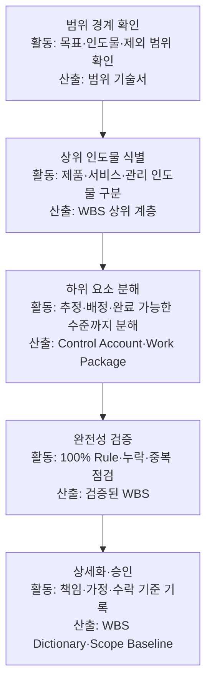
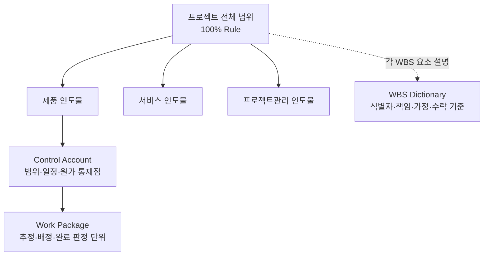
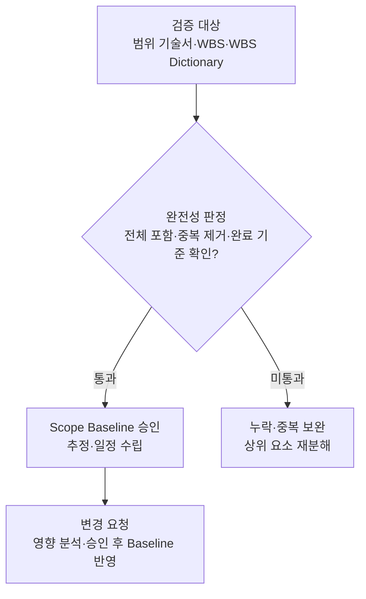
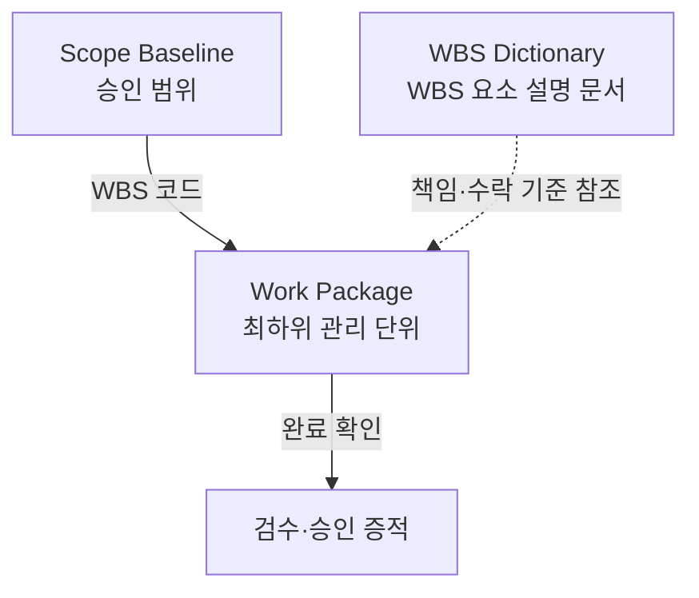
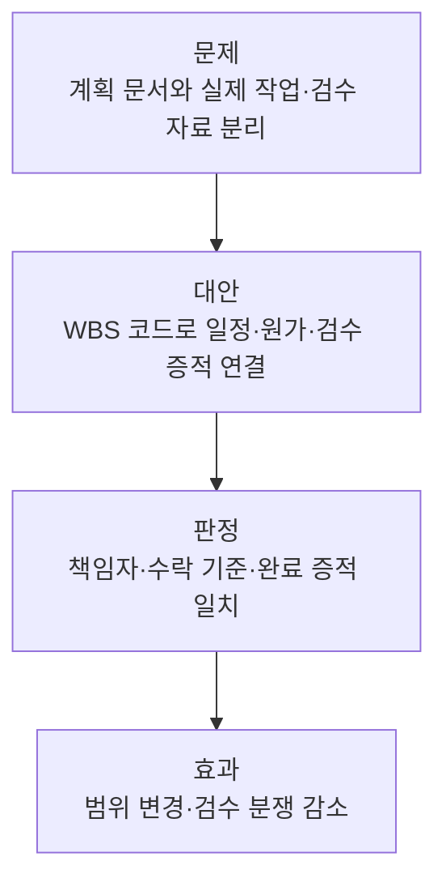

## 지식 로드맵 내 현재 위치

IT 전략·관리프로젝트 범위관리<strong>WBS</strong>

## 30초 인출

- 본질: **WBS(Work Breakdown Structure)**는 프로젝트 전체 범위를 인도물 중심으로 분해해 추정·배정·검수가 가능한 **Work Package**까지 내리는 계층 구조
- 메커니즘: 범위 경계 확정 → 인도물 분해 → **100% Rule** 검증 → 책임·수락 기준 상세화 → **Scope Baseline** 승인
- 산출물: WBS · WBS Dictionary · 프로젝트 범위 기술서로 구성된 Scope Baseline

## 핵심 용어

핵심 용어

- **WBS(Work Breakdown Structure)**: 전체 프로젝트 범위를 하위 인도물과 Work Package로 연결하는 계층 구조
- **100% Rule**: 하위 요소의 합이 상위 범위를 빠짐없이 포함하고 범위 밖 작업을 포함하지 않게 하는 완전성 원칙
- **Work Package**: 비용·노력·기간·자원을 추정하고 책임과 완료를 관리하는 WBS 최하위 수준
- **Control Account**: 범위·일정·원가 성과를 통합 관리하는 통제점
- **WBS Dictionary**: WBS 요소별 작업 내용·책임·가정·수락 기준을 상세화하는 문서
- **Scope Baseline(범위 기준선)**: 승인된 범위 기술서·WBS·WBS Dictionary를 묶은 변경 비교 기준

## 예상문제

> WBS(Work Breakdown Structure) 작성방법을 설명하시오. (10점)

- 논술 변형: WBS의 개념·작성방법과 완전성 검증·범위 변경 통제방안을 설명하시오.

## Ⅰ. 전체 범위를 관리 단위로 바꾸는 WBS

> WBS는 일정표가 아니라 프로젝트의 ‘무엇’을 정의하는 인도물 중심 분해이며, 품질은 작업 수가 아닌 범위 완전성과 관리 가능성으로 판정함

- 정의: **WBS(Work Breakdown Structure)**는 프로젝트 전체 범위를 **Work Package(작업 패키지)**까지 계층 분해한 범위관리 도구
- 목적: 범위 누락·중복·무승인 작업 예방

## Ⅱ. 범위 경계에서 Scope Baseline까지의 작성 흐름

> 분해는 인도물별 범위를 완전하게 닫고 추정·책임·수락 판정이 가능한 수준에서 멈춰야 함

## Ⅲ. WBS 계층과 분해 중단 기준

> 상위 범위는 100% Rule로 닫고, Work Package는 추정·배정·완료 판정이 가능할 때 분해를 멈추며 수락 기준은 WBS Dictionary에 남김

## Ⅳ. 완전성 판정과 변경 통제

> Scope Baseline은 승인 이후 변경 요청을 영향 분석·승인과 연결할 때 통제 기준으로 작동함

## Ⅴ. 형식적 WBS의 문제점·대응책

> WBS 실패는 분해 개수보다 Work Package의 승인 범위·책임·완료 증적이 끊길 때 발생하므로 같은 WBS 코드로 추적해야 함

| 위험 | 대책 | 효과 |
|---|---|---|
| **Scope Creep** | 제외 범위 명시·변경 요청 승인 | 무승인 작업 식별 |
| 누락·중복 | 상위 요소별 **100% Rule** 교차 검토 | 범위 완전성 확인 |
| 분해 수준 부적정 | 추정·배정·완료 판정 가능 수준에서 중단 | 관리 과부하·통제 공백 완화 |

## Ⅵ. 결론 — 검수 증적과 연결하는 WBS

> WBS의 성패는 Work Package별 승인 범위와 실제 완료 증적을 같은 코드로 추적할 수 있는가로 판정함

### 학습자 통찰 메모 — 답안 밖

- `[핵심 통찰]`: WBS는 일을 작게 쪼개는 목록이 아니라 전체 범위를 추정·책임·검수 가능한 동일 언어로 바꾸는 구조다.
- `나라면`: 핵심 Work Package부터 일정·원가·검수 증적을 WBS 코드로 연결하고, 승인 전 변경 요청은 실행 항목에 편입하지 않겠다.

### 실전 답안용 기술사적 제언

- 판정: Work Package마다 책임자·수락 기준·완료 증적이 연결되는지 확인
- 대안: WBS Dictionary와 고유 WBS 코드로 일정·원가·검수 자료 연결
- 검증: 변경 요청 승인 여부와 완료 증적을 Scope Baseline에 대조
- 효과: 범위 변경·진척·검수 해석 충돌 감소

## 1교시 10점 답안 발췌

### 1. 정의·목적

- 정의: **WBS(Work Breakdown Structure)**는 프로젝트 전체 범위를 **Work Package(작업 패키지)**까지 계층 분해한 범위관리 도구
- 목적: 범위 누락·중복·무승인 작업 예방

### 2. 작성방법

- 결론: 승인된 **Scope Baseline(범위 기준선)**과 Work Package별 완료 증적이 연결될 때 WBS가 범위 통제 도구로 작동함

## 출제 이력과 검증 출처

- 제139회 정보관리기술사 1교시: "WBS(Work Breakdown Structure) 작성방법"
- [PMI Lexicon of Project Management Terms, Version 5.0](https://www.pmi.org/-/media/pmi/documents/registered/pdf/pmbok-standards/pmi-lexicon-pm-terms.pdf)
- [PMI, Practice Standard for Work Breakdown Structures — Third Edition](https://www.pmi.org/standards/work-breakdown-structures-third-edition)

## 학습 체크

- [ ] Ⅰ 개요: WBS를 전체 범위·인도물 중심·Work Package의 세 요소로 정의할 수 있는가?
- [ ] Ⅱ 작성: 범위 경계부터 Scope Baseline 승인까지 활동·산출을 연결할 수 있는가?
- [ ] Ⅲ 계층: 전체 범위 → 인도물 → Control Account → Work Package 계층과, 각 WBS 요소를 설명하는 별도 WBS Dictionary 참조선을 그리고 분해 중단 기준을 말할 수 있는가?
- [ ] Ⅳ~Ⅴ 통제: 100% Rule 판정 분기와 WBS 코드 기반 증적 추적을 재현할 수 있는가?
- [ ] Ⅵ 제언: 판정·대안·검증·효과를 WBS 고유 맥락으로 제시할 수 있는가?

## 연결 토픽

- 이전 토픽: [SLA](./006_sla.md)
- 연관 토픽: [PMO](./004_pmo.md), [프로젝트 위험관리](./009_project_risk_management_negative.md), [EVM](./032_evm.md)
- 다음 토픽: [정보시스템 감리](./008_it_audit.md)
