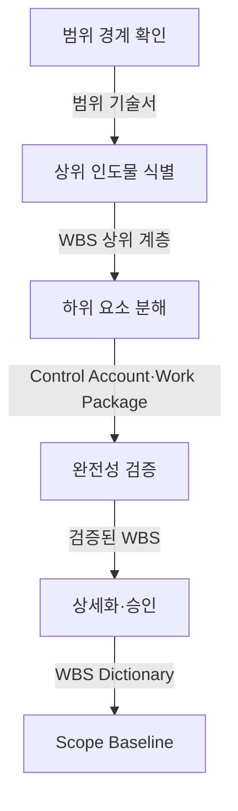

## 지식 로드맵 내 현재 위치

지식 위치: IT 전략·관리 → 프로젝트 범위관리 → **WBS**

## 30초 인출

- 본질: **WBS(Work Breakdown Structure)** 는 프로젝트 전체 범위를 인도물 중심으로 분해해 추정·배정·검수가 가능한 **Work Package** 까지 내리는 계층 구조이다.
- 메커니즘: 범위 경계 확정 → 인도물 분해 → 상위 범위를 빠짐없이 포함하는지 검증 → 책임·수락 기준 상세화 → **Scope Baseline** 승인한다.

핵심 용어

- **WBS(Work Breakdown Structure)** : 프로젝트 전체 범위를 인도물 중심으로 분해하여 정의한 계층적 작업 분할 구조
- **범위 완전성 원칙(100% Rule)** : 하위 요소의 합이 상위 범위를 빠짐없이 충족하며 범위 밖 작업을 배제하는 완전성 원칙
- **Work Package** : 비용·일정 추정과 담당자 배정 및 완료 기준 통제가 가능한 WBS 최하위 작업 단위
- **Control Account** : 범위·일정·원가를 통합하여 EVM 성과를 측정하고 통제하는 관리 기준점
- **WBS Dictionary** : 각 WBS 요소의 작업 설명·책임 조직·수락 기준을 명시한 세부 명세서
- **Scope Baseline(범위 기준선)** : 승인된 범위 기술서·WBS·WBS Dictionary로 구성된 공식 통제 기준선

## 예상문제

> WBS(Work Breakdown Structure) 작성방법을 설명하시오. (10점)

- 논술 변형: WBS의 개념·작성방법과 완전성 검증·범위 변경 통제방안을 설명하시오.

## Ⅰ. WBS의 개요

- 정의: **WBS(Work Breakdown Structure)** 는 프로젝트 **범위** 를 인도물 중심으로 **Work Package(작업 패키지)** 까지 계층 분해해 **Scope Baseline** 을 만드는 범위관리 도구
- 목적: 범위 누락·중복과 무승인 작업을 예방하고 일정·원가 추정의 기준을 제공하는 것

## Ⅱ. 범위 경계에서 Scope Baseline까지의 작성 흐름

> 분해는 인도물별 범위를 완전하게 닫고 추정·책임·수락 판정이 가능한 수준에서 멈춰야 함

| 단계 | 활동 |
|---|---|
| 범위 경계 확인 | 목표·인도물·제외 범위 확인 |
| 상위 인도물 식별 | 제품·서비스·관리 인도물 구분 |
| 하위 요소 분해 | 추정·배정·완료 가능 수준까지 분해 |
| 완전성 검증 | 하위 요소의 누락·중복 점검 |
| 상세화·승인 | 책임·가정·수락 기준 기록 |

## Ⅲ. 완전성 판정과 변경 통제

> Scope Baseline은 승인 이후 변경 요청을 영향 분석·승인과 연결할 때 통제 기준으로 작동함

## Ⅳ. 형식적 WBS의 문제점·대응책

> WBS 실패는 분해 개수보다 Work Package의 승인 범위·책임·완료 증적이 끊길 때 발생하므로 같은 WBS 코드로 추적해야 함

| 위험 | 대책 | 효과 |
|---|---|---|
| **Scope Creep** | 제외 범위 명시·변경 요청 승인 | 무승인 작업 식별 |
| 누락·중복 | 상위 요소별 하위 항목 교차 검토 | 범위 완전성 확인 |
| 분해 수준 부적정 | 추정·배정·완료 판정 가능 수준에서 중단 | 관리 과부하·통제 공백 완화 |

## Ⅴ. 결론 — 검수 증적과 연결하는 WBS

> WBS의 성패는 Work Package별 승인 범위와 실제 완료 증적을 같은 코드로 추적할 수 있는가로 판정함

### 실전 답안용 기술사적 제언

문제: 작업 나열식 WBS에 작업 범위와 수락기준이 빠지면 범위 누락과 완료 판정 분쟁이 생길 수 있다. 제언: 전체 범위를 인도물 중심으로 분해하고 작업 패키지별 범위·책임·수락기준을 WBS 사전에 기록한 뒤 승인된 변경만 기준선에 반영한다.

| 문제 | 해결 방안 |
|---|---|
| WBS가 활동 목록이 되어 인도물 누락 발생 | 전체 범위를 인도물 기준으로 분해하고 상하위 범위를 대조 |
| 작업 범위와 완료 조건이 모호함 | 작업 패키지별 범위·책임·수락기준을 사전에 기록 |

## 1교시 10점 답안 발췌

### 1. 정의·목적

- 정의: **WBS(Work Breakdown Structure)** 는 프로젝트 전체 범위를 인도물 중심의 **Work Package(작업 패키지)** 까지 계층 분해한 범위관리 도구
- 목적: 범위 누락·중복·무승인 작업 예방 및 일정·원가 기준선 확립

### 2. 작성방법

- 결론: 승인된 **Scope Baseline(범위 기준선)** 과 Work Package별 완료 증적이 연결될 때 WBS가 범위 통제 도구로 작동함
- 한 줄 제언: 인도물별 작업 범위·책임·수락기준을 명시해 범위 변경을 통제한다.

## 출제 이력과 검증 출처

- 제139회 정보관리기술사 1교시: "WBS(Work Breakdown Structure) 작성방법"
- [PMI Lexicon of Project Management Terms, Version 5.0](https://www.pmi.org/-/media/pmi/documents/registered/pdf/pmbok-standards/pmi-lexicon-pm-terms.pdf)
- [PMI, Practice Standard for Work Breakdown Structures — Third Edition](https://www.pmi.org/standards/work-breakdown-structures-third-edition)

## 학습 체크

- [ ] WBS 작성 흐름에서 전체 범위, 인도물 분해, 완전성 검증, Work Package, Scope Baseline의 관계를 재현할 수 있는가?
- [ ] Work Package별 책임·수락기준을 정하고 승인된 변경만 반영하는 통제 방안을 설명할 수 있는가?

## 연결 토픽

- 이전 토픽: [SLA](./006_sla.md)
- 연관 토픽: [PMO](./004_pmo.md), [프로젝트 위험관리](./009_project_risk_management_negative.md), [EVM](./032_evm.md)
- 다음 토픽: [정보시스템 감리](./008_it_audit.md)
