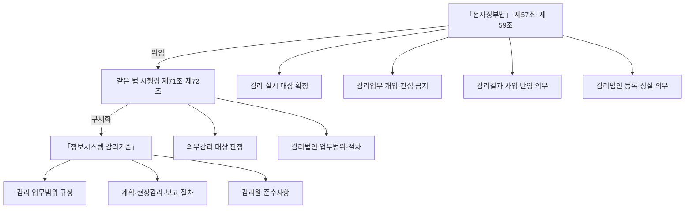
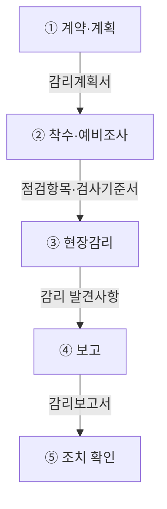
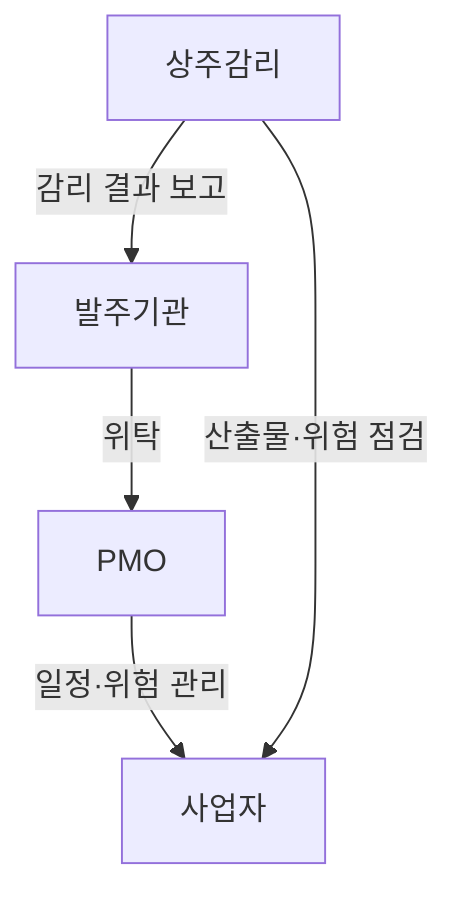
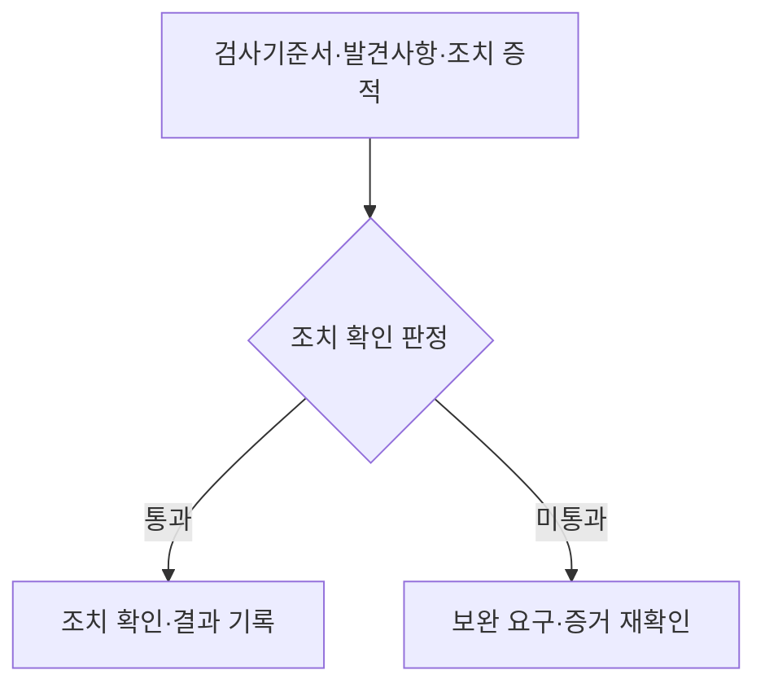
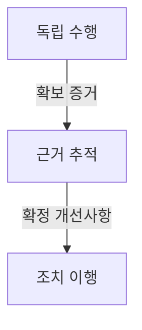
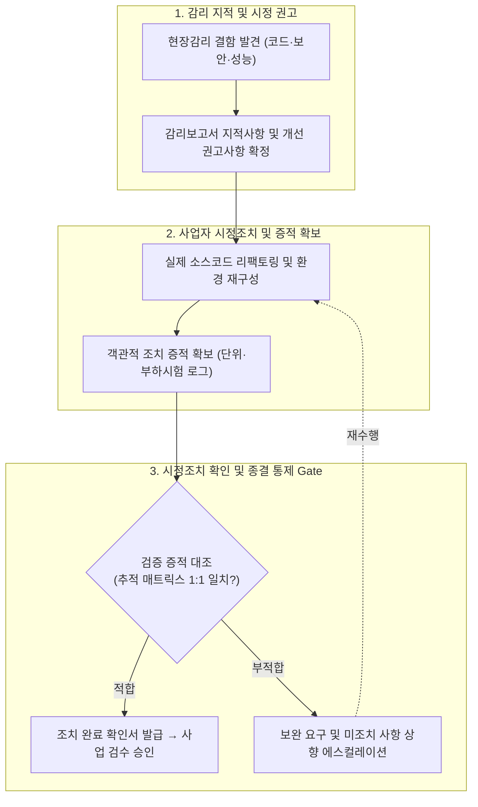

## 지식 로드맵 내 현재 위치

지식 위치: IT 전략·관리 → 사업 품질·독립 통제 → **정보시스템 감리**

## 30초 인출

- 본질: **정보시스템 감리** 는 발주자·사업자와 독립된 제3자가 공공 정보시스템의 구축·운영을 기준에 맞춰 점검하고 문제를 실제로 고치게 만드는 법정 통제한다.
- 메커니즘: 법정 대상 판정 → 독립 **감리법인** 선정 → 계획· **현장감리** → 감리보고서 → 사업자 개선 반영·조치 확인한다.
- 산출물: 감리계획서 · 감리보고서 · 시정조치 결과와 증적이다.

핵심 용어

- **정보시스템 감리** : 발주자·사업자로부터 독립된 제3자가 구축·운영 과정의 효율성과 안전성을 종합 점검하는 법정 제도
- **감리법인** : 「전자정부법」 제58조 등록 요건을 갖추고 감리업무를 전문으로 수행하는 법인
- **상주감리** : 사업 전 기간 또는 특정 기간 현장에 상주하여 품질 및 위험 요소를 실시간 점검·자문하는 감리 방식
- **현장감리** : 감리 계획에 따라 현장에서 산출물 검토·인터뷰·시험을 통해 적합성을 실사하는 점검 활동
- **감리 검사기준서** : 대상 사업의 과업 내용에 맞춰 점검 기준·항목·검증 방법을 구체화한 점검 기준 문서

## 예상문제

> 정보시스템 구축 사업의 성공적인 수행을 위해 정보시스템 감리와 PMO(전자정부사업관리 위탁)를 활용하여 사업관리를 수행하고 있다. 이와 관련하여 다음을 설명하시오. 가. 정보시스템 감리의 법적 근거 나. PMO의 정의와 역할 다. PMO 대상 사업의 범위 라. PMO와 상주감리의 비교 (제136회 정보관리기술사 2교시)

## Ⅰ. 정보시스템 감리의 개요

- 정의: **정보시스템 감리** 는 발주자·사업자 등의 이해관계로부터 독립된 자가 정보시스템의 **효율성·안전성** 을 위해 구축·운영을 종합 점검하고 문제점을 개선하도록 하는 활동
- 목적: 사업 위험 조기 발견, 결함 잔존·재작업 감소

## Ⅱ. 전자정부법령과 감리기준의 통제 구조

> 법은 감리 대상·독립성· **감리결과 반영 의무** 를 정하고, 고시 「 **정보시스템 감리기준** 」은 감리의 업무범위·절차·준수사항을 구체화하여 점검의 실효성을 닫음

- 적용관계: 「전자정부법」 제64조의2에 따라 전자정부사업관리를 위탁한 경우에도 모든 사업이 감리에서 제외되는 것은 아니며, 같은 법 **제57조제1항 단서** 와 **시행령 제71조제2항** 이 정한 사업만 **의무감리** 예외에 해당함
- 예외범위: 대국민·기관 공동사용 사업 중 사업비 1억 원 이상 5억 원 미만인 사업 · 사업기간 5개월 미만인 정보시스템 구축사업

## Ⅲ. 계약에서 조치 확인까지의 감리 수행체계

> 아래 흐름은 NIA 2022 감리 수행가이드를 압축한 대표 수행 흐름이며, 모든 사업에 동일한 공식 5단계 명칭을 강제하는 절차가 아님

| 단계 | 활동 |
|---|---|
| ① 계약·계획 | 대상·범위·일정·감리원 편성 |
| ② 착수·예비조사 | 사업 현황·산출물·위험 분석 |
| ③ 현장감리 | 자료검토·인터뷰·시험·증거 확보 |
| ④ 보고 | 발견사항 검토·개선사항 확정 |
| ⑤ 조치 확인 | 사업자 반영 결과·증적 재검토 |

## Ⅳ. PMO와 상주감리의 역할 경계

> PMO는 발주기관의 사업관리·의사결정을 계속 지원하고, 상주감리는 독립된 관점에서 위험·산출물을 점검하므로 두 역할을 섞으면 **감리 독립성** 이 약해짐

| 비교축 | **PMO(Project Management Office)** | **상주감리** |
|---|---|---|
| 목적 | 발주기관 사업관리·의사결정 지원 | 독립적 점검·개선 권고 |
| 업무 | 일정·위험·품질관리 · 보고·조정 | 위험요소·산출물 검토 · 자문 |
| 위치 | 발주기관 관리·감독 지원 | 발주자·사업자와 독립된 제3자 |

- 법적 적용: **전자정부사업관리 위탁** 은 감리와 같은 제도가 아니며, 의무감리 제외 여부는 사업별로 「전자정부법」 제57조제1항 단서와 시행령 제71조제2항의 조건을 확인함

## Ⅴ. 검사기준서와 조치 증적의 확인 판정

> **검사기준서** 가 계약·법령·기술기준과 연결되고 각 개선사항에 **조치 증적** 이 대응해야 감리가 문서 검토를 넘어 실제 품질 통제로 작동함

## Ⅵ. 감리 실효성의 문제점·대응책

> 독립성 훼손·검사기준 부실·미조치 종결을 각각 책임 분리·근거 추적·증적 확인으로 통제해야 함

| 위험 | 대책 | 효과 |
|---|---|---|
| 감리업무 개입 | **감리법인 독립성** ·보고 경로 명시 | 점검 결과 왜곡 방지 |
| 형식적 점검 | **검사기준** ·발견사항·증거 연결 | 누락·자의적 판정 감소 |
| 미조치 종결 | 개선사항별 담당자·기한· **증적** 확인 | 결함의 운영 전이 감소 |

## Ⅶ. 결론 — 증거 기반 조치 확인으로 닫는 감리

> **감리보고서** 작성이 종료점이 아니라 **개선사항** 과 실제 시스템·산출물의 대응을 확인하는 것이 최종 품질 판정임

### 실전 답안용 기술사적 제언

- 문제: 감리 지적사항에 대한 시정조치가 형식적 문서 수정에 그쳐, 운영 단계에서 동일 결함이 재발하거나 잔존 위험이 누적됨.
- 해결 방안: 감리기준 기반의 '지적사항-시정조치-검증증적' 1:1 양방향 추적 매트릭스를 운영하고, 코드·성능·보안 실측 데이터 검증을 통과해야만 감리 종결 및 최종 검수가 이루어지도록 통제 게이트를 제도화함.

## 1교시 10점 답안 발췌

### 1. 정의·목적

- 정의: **정보시스템 감리** 는 발주자·사업자와 독립된 제3자가 정보시스템 구축·운영을 종합 점검하고 문제점을 개선하도록 하는 활동
- 목적: 사업 위험 조기 발견, 결함 잔존·재작업 감소

### 2. 법적 통제 구조

### 3. 핵심 판정

- 독립성: 발주자·사업자의 업무 개입 배제
- 실효성: 감리 발견사항과 시정조치 증적의 대응 확인

## 출제 이력과 검증 출처

- 제136회 정보관리기술사 2교시: "정보시스템 구축 사업의 성공적인 수행을 위해 정보시스템 감리와 PMO(전자정부사업관리 위탁)를 활용하여 사업관리를 수행하고 있다. 이와 관련하여 다음을 설명하시오."
  - 가. 정보시스템 감리의 법적 근거
  - 나. PMO의 정의와 역할
  - 다. PMO 대상 사업의 범위
  - 라. PMO와 상주감리의 비교
- [국가법령정보센터, 「전자정부법」 제57조~제59조](https://www.law.go.kr/법령/전자정부법) — 2026년 8월 28일 시행, 법률 제21394호
- [국가법령정보센터, 「전자정부법 시행령」 제71조](https://www.law.go.kr/법령/전자정부법시행령) — 의무감리 대상·전자정부사업관리 위탁 시 예외 범위
- [국가법령정보센터, 「정보시스템 감리기준」](https://www.law.go.kr/LSW/admRulLsInfoP.do?admRulSeq=2100000243290)
- [한국지능정보사회진흥원, 2022년 정보시스템 감리 발주·관리 가이드·감리 수행 가이드 개정본](https://www.nia.or.kr/site/nia_kor/ex/bbs/View.do?bcIdx=24365&cbIdx=99860)
- [한국지능정보사회진흥원, PMO 도입·운영 가이드 2.1](https://nia.or.kr/site/nia_kor/ex/bbs/View.do?bcIdx=23222&cbIdx=99852)

## 학습 체크

- [ ] Ⅰ 개요: 정보시스템 감리를 독립된 제3자·구축·운영 종합 점검·문제 개선의 네 요소로 정의할 수 있는가?
- [ ] Ⅱ 법적 근거: 법 → 시행령 → 감리기준의 3계층 트리에 감리 대상·독립성·결과 반영·자격 통제를 배치하고 PMO 위탁 시 의무감리 예외 조건을 설명할 수 있는가?
- [ ] Ⅲ 수행체계: 대표 수행 흐름에서 계약·계획부터 조치 확인까지 활동·산출을 연결할 수 있는가?
- [ ] Ⅳ 역할 경계: 발주기관·PMO·상주감리·사업자 사이의 위탁·보고·관리·점검 화살표를 그리고, PMO와 상주감리를 목적·업무·위치의 3축으로 비교할 수 있는가?
- [ ] Ⅴ 확인 판정: 개선사항과 조치 증적의 대응 여부를 통과·미통과로 판정할 수 있는가?
- [ ] Ⅵ 문제점·대응책: 독립 수행·근거 추적·조치 이행 통제 체인의 각 지점에 감리업무 개입·형식적 점검·미조치 종결 위험을 대응시키고 대책·효과를 연결할 수 있는가?
- [ ] Ⅶ 제언: 근거·검증방법·발견 증거·조치 증적을 연결한 기술사적 문제 해결 방안을 제시할 수 있는가?

## 연결 토픽

- 이전 토픽: [WBS](./007_wbs.md)
- 연관 토픽: [PMO](./004_pmo.md), [시스템 운영·유지보수 감리](./059_system_operation_audit.md), [클라우드 전환사업 감리](./104_cloud_migration_project_audit.md)
- 다음 토픽: [프로젝트 위험관리](./009_project_risk_management_negative.md)
