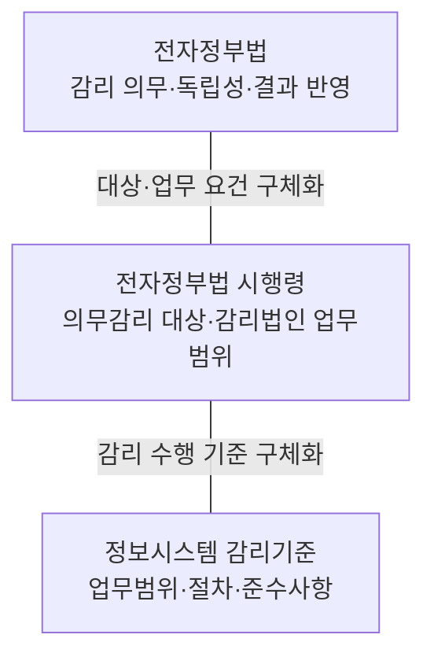
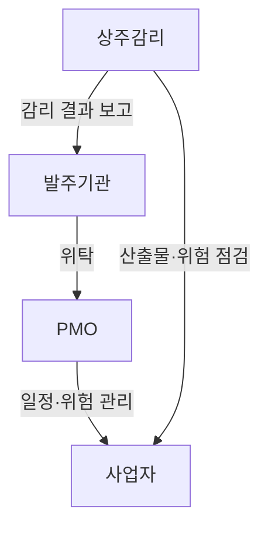
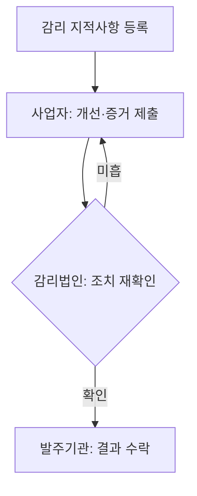

## 지식 로드맵 내 현재 위치

지식 위치: IT 전략·관리 → 사업 품질·독립 통제 → **정보시스템 감리**

## 30초 인출

- 본질: 정보시스템 감리는 독립된 전문가가 시스템 구축·운영의 기준 준수와 문제 개선을 점검하는 절차
- 메커니즘: 법정 대상 여부 확인 → 독립 감리법인의 점검 → 사업자 조치 결과 확인

핵심 용어

- **정보시스템 감리** : 발주자·사업자로부터 독립된 제3자가 구축·운영 과정의 효율성과 안전성을 종합 점검하는 법정 제도
- **감리법인** : 「전자정부법」 제58조 등록 요건을 갖추고 감리업무를 전문으로 수행하는 법인
- **상주감리** : 사업 전 기간 또는 특정 기간 현장에 상주하여 품질 및 위험 요소를 실시간 점검·자문하는 감리 방식
- **현장감리** : 감리 계획에 따라 현장에서 산출물 검토·인터뷰·시험을 통해 적합성을 실사하는 점검 활동
- **감리 검사기준서** : 대상 사업의 과업 내용에 맞춰 점검 기준·항목·검증 방법을 구체화한 점검 기준 문서
- **PMO(Project Management Office)** : 이 문항에서 발주기관의 일정·위험·품질 관리와 의사결정을 지원하는 전자정부사업관리 위탁 수행 조직으로, 독립적 감리와 구분되는 역할

---

## 1교시 예상문제 (10점)

> 정보시스템 감리의 법적 통제 구조와 PMO·상주감리의 역할 차이를 설명하시오. (예상·10점)

---

## 1교시 10점 답안

### Ⅰ. 정보시스템 감리의 개요

| 구분 | 핵심 |
|---|---|
| 정의 | **정보시스템 감리** 는 독립된 제3자가 정보시스템 구축·운영을 점검하고 발견한 문제의 개선을 확인하는 활동 |
| 목적 | 사업 위험의 조기 발견과 결함·재작업 감소 |

### Ⅱ. 법적 통제 구조

감리기준의 직접 근거: 「전자정부법」 제57조제5항

### Ⅲ. PMO·상주감리의 역할

### Ⅳ. 핵심 판정

| 판정축 | 확인할 내용 |
|---|---|
| 독립성 | 발주자·사업자의 감리업무 개입 여부 |
| 실효성 | 발견사항별 시정조치와 증적의 일치 여부 |

**제언:** 지적사항별 조치 결과와 실제 산출물·증거의 대조

---

## 2~4교시 예상문제 (25점)

> 정보시스템 구축 사업의 성공적인 수행을 위해 정보시스템 감리와 PMO(전자정부사업관리 위탁)를 활용하여 사업관리를 수행하고 있다. 이와 관련하여 다음을 설명하시오. 가. 정보시스템 감리의 법적 근거 나. PMO의 정의와 역할 다. PMO 대상 사업의 범위 라. PMO와 상주감리의 비교 (제136회 정보관리기술사 2교시)

---

## 2~4교시 25점 답안

## Ⅰ. 정보시스템 감리의 개요

| 구분 | 핵심 |
|---|---|
| 정의 | **정보시스템 감리** 는 독립된 제3자가 정보시스템 구축·운영을 점검하고 발견한 문제의 개선을 확인하는 활동 |
| 목적 | 사업 위험의 조기 발견과 결함·재작업 감소 |

## Ⅱ. 전자정부법령과 감리기준의 통제 구조

> 전자정부법의 감리 의무·독립성·결과 반영 기준, 시행령의 대상 요건·업무범위, 감리기준의 점검 절차·방법

- 감리기준의 직접 근거인 「전자정부법」 제57조제5항과 시행령의 관련 세부 사항 반영

- 적용관계: 「전자정부법」 제64조의2에 따라 전자정부사업관리를 위탁한 경우에도 모든 사업이 감리에서 제외되는 것은 아니며, 같은 법 **제57조제1항 단서** 와 **시행령 제71조제2항** 이 정한 사업만 **의무감리** 예외에 해당함
- 예외범위: 대국민·기관 공동사용 사업 중 사업비 1억 원 이상 5억 원 미만인 사업 · 사업기간 5개월 미만인 정보시스템 구축사업

## Ⅲ. PMO와 상주감리의 역할 경계

> PMO의 발주기관 사업관리·의사결정 지원과 상주감리의 독립적 위험·산출물 점검. 두 역할 혼합 시 **감리 독립성** 약화 위험

| 비교축 | **PMO(Project Management Office)** | **상주감리** |
|---|---|---|
| 목적 | 발주기관 사업관리·의사결정 지원 | 독립적 점검·개선 권고 |
| 업무 | 일정·위험·품질관리 · 보고·조정 | 위험요소·산출물 검토 · 자문 |
| 위치 | 발주기관 관리·감독 지원 | 발주자·사업자와 독립된 제3자 |

- 법적 적용: **전자정부사업관리 위탁**은 감리와 구분되는 제도이며, 의무감리 제외 여부는 사업별 「전자정부법」 제57조제1항 단서와 시행령 제71조제2항의 조건에 따라 확인

## Ⅳ. 감리 실효성의 한계와 대응 방향

> 감리 수행만으로 사업 위험이 해소되지 않는다는 점과 독립성·점검 근거·개선 이행의 개별 확인 필요성

| 한계 | 발생 원인 | 대응 방향 |
|---|---|---|
| 독립성 약화 | 사업관리 지원과 독립 점검의 책임이 섞임 | PMO와 감리법인의 역할·보고 경로를 구분 |
| 형식적 점검 | 발견사항의 판단 근거가 불분명함 | 점검 기준과 객관적 증거를 함께 남김 |
| 조치 지연 | 지적사항이 담당자·기한 없이 보고서에만 남음 | 개선 과제의 이행 상태를 관리 |

## Ⅴ. 기술사적 제언 — 지적사항의 종료 조건을 분리

> 제안: 감리 지적사항의 `사업자 조치 완료`와 감리법인 재확인·발주기관 수락의 단계별 분리. PMO의 일정·미해결 건 추적과 감리 재확인의 역할 구분

이는 일반적인 위험 목록과 구분되는 **지적사항의 종료 책임자·조건을 정하는 운영 제안**. 재확인 대상·수락 조건은 사업 계약·감리 범위에 따른 설정

## 출제 이력과 검증 출처

- 제136회 정보관리기술사 2교시: "정보시스템 구축 사업의 성공적인 수행을 위해 정보시스템 감리와 PMO(전자정부사업관리 위탁)를 활용하여 사업관리를 수행하고 있다. 이와 관련하여 다음을 설명하시오."
  - 가. 정보시스템 감리의 법적 근거
  - 나. PMO의 정의와 역할
  - 다. PMO 대상 사업의 범위
  - 라. PMO와 상주감리의 비교
- [국가법령정보센터, 「전자정부법」 제57조~제59조](https://www.law.go.kr/법령/전자정부법) — 2026년 8월 28일 시행, 법률 제21394호
- [국가법령정보센터, 「전자정부법 시행령」 제71조](https://www.law.go.kr/법령/전자정부법시행령) — 의무감리 대상·전자정부사업관리 위탁 시 예외 범위
- [국가법령정보센터, 「정보시스템 감리기준」](https://www.law.go.kr/LSW/admRulLsInfoP.do?admRulSeq=2100000243290)
- [한국지능정보사회진흥원, 2022년 정보시스템 감리 발주·관리 가이드·감리 수행 가이드 개정본](https://www.nia.or.kr/site/nia_kor/ex/bbs/View.do?bcIdx=24365&cbIdx=99860)
- [한국지능정보사회진흥원, PMO 도입·운영 가이드 2.1](https://nia.or.kr/site/nia_kor/ex/bbs/View.do?bcIdx=23222&cbIdx=99852)

## 연결 토픽

- 이전 토픽: [WBS](./007_wbs.md)
- 연관 토픽: [PMO](./004_pmo.md), [시스템 운영·유지보수 감리](./059_system_operation_audit.md), [클라우드 전환사업 감리](./104_cloud_migration_project_audit.md)
- 다음 토픽: [프로젝트 위험관리](./009_project_risk_management_negative.md)
