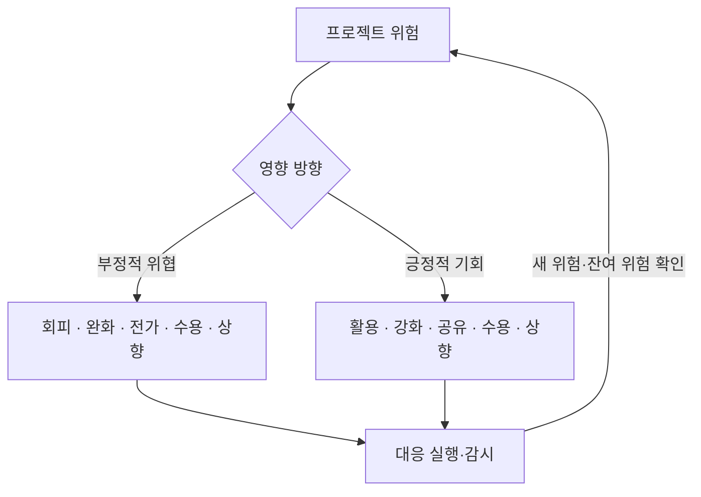
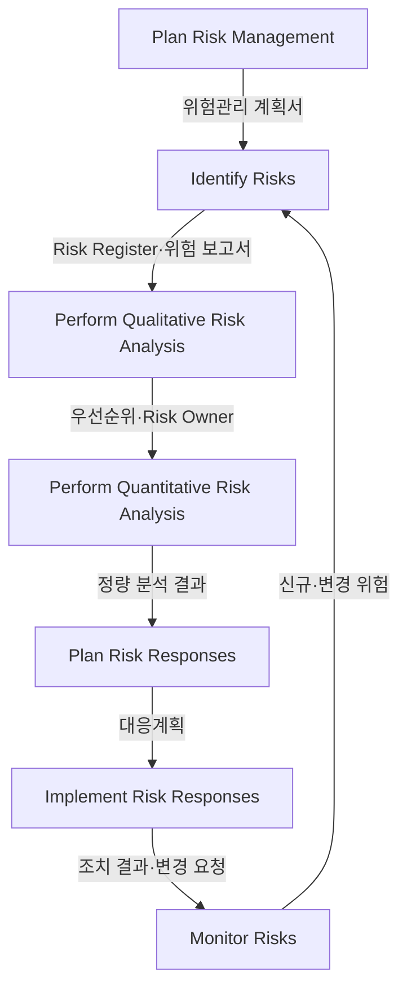

## 지식 로드맵 내 현재 위치

지식 위치: IT 전략·관리 → 프로젝트 통제 → **프로젝트 위험관리**

## 30초 인출

- 본질: 프로젝트 위험관리는 앞으로 생길지 모르는 일을 미리 살펴보고, 목표에 나쁜 영향을 줄이거나 좋은 기회를 살릴 방법을 정하는 일이다.
- 메커니즘: 식별 → 분석 → 대응계획·실행 → 감시 → 신규·잔여· **2차 위험** 재식별한다.

핵심 용어

- **Risk Register(위험 등록부)** : 식별된 위험의 원인·우선순위·대응 전략·담당자를 기록하고 추적하는 핵심 관리 문서
- **Residual Risk(잔여 위험)** : 위험 대응 조치를 실행한 후에도 수용 또는 잔존하여 지속 관리해야 하는 위험
- **Secondary Risk(2차 위험)** : 특정 위험 대응 전략을 실행한 결과 부수적으로 파생되어 발생하는 새로운 위험
- **Risk Owner(위험 책임자)** : 특정 위험의 발생 징후를 모니터링하고 대응 조치 실행을 전담 관리하는 책임자
- **Trigger(트리거)** : 사전 정의된 위험 대응 조치나 우발 계획의 실행을 유발하는 조기 경보 사건

---

## 1교시 예상문제 (10점)

> 프로젝트 위험관리의 개념과 위협·기회 대응전략을 설명하시오. (예상·10점)

---

## 1교시 10점 답안

### 1. 정의·목적

- 정의: 프로젝트 위험은 발생 여부와 영향이 불확실한 사건·조건이며, 위협은 목표에 부정적 영향을 주는 위험이다.
- 목적: 위협의 가능성·영향을 줄이고 기회를 활용해 프로젝트 목표를 달성한다.

### 2. 위협·기회 대응전략

### 3. 핵심 통제 방안

- 대응전략을 위험의 방향과 권한 범위에 맞게 선택함
- 대응 실행 후 Residual Risk(잔여 위험) 및 Secondary Risk(2차 위험)를 재평가하여 폐루프 관리
- 한 줄 제언: 위험별 책임자와 대응 시점을 정하고 조치 후 잔여·신규 위험을 다시 평가한다.

---

## 2~4교시 예상문제 (25점)

> 리스크 대응계획 수립 절차와 위협·기회 대응전략을 설명하시오. (예상·25점)

---

## 2~4교시 25점 답안

## Ⅰ. 프로젝트 위험관리의 개요

| 구분 | 핵심 |
|---|---|
| 정의 | 프로젝트 위험관리는 목표에 미치는 불확실한 사건의 영향을 식별·분석·대응·감시하는 활동이다. |
| 목적 | 위협의 영향을 줄이고 기회를 활용해 프로젝트 목표 달성을 돕는다. |

## Ⅱ. PMBOK 6판의 위험관리 프로세스

> 7개 프로세스는 일회성 직선 절차가 아니며, Monitor Risks에서 발견한 변화가 식별·분석·대응으로 환류되고 정량 분석은 프로젝트 필요에 따라 선택함

| 프로세스 | 활동 |
|---|---|
| Plan Risk Management | 방법·역할·기준 정의 |
| Identify Risks | 원인·사건·영향 식별 |
| Perform Qualitative Risk Analysis | 확률·영향·우선순위 평가 |
| Perform Quantitative Risk Analysis | 비용·일정 목표 영향 분석 |
| Plan Risk Responses | 전략·트리거·조치 결정 |
| Implement Risk Responses | 합의된 대응 실행 |
| Monitor Risks | 대응 효과·잔여·2차 위험 감시 |

## Ⅲ. 실행 가능한 위험 기술 구조

> ‘일정 지연’처럼 결과만 쓰지 않고 원인·불확실 사건·목표 영향을 분리한 뒤 Risk Owner와 트리거를 붙여야 대응이 시작됨

| 구조 요소 | 예시 |
|---|---|
| 원인 | 공급 지연·기술 미성숙·결정 지체 |
| 불확실 사건 | 납품 실패·결함 급증·승인 지연 |
| 목표 영향 | 일정·원가·범위·품질 편차 |

## Ⅳ. 위협·기회 대응전략

> 대응전략은 위험의 성격에 따라 다르다. 위협은 부정적 영향을 줄이고 기회는 긍정적 영향을 높이거나 실현한다.

| 구분 | 대응전략 | 핵심 의미 |
|---|---|---|
| 위협 | 회피·완화·전가·수용·상향 | 위협을 제거하거나 확률·영향을 줄이고, 책임을 이전하거나 수용·상향 |
| 기회 | 활용·강화·공유·수용·상향 | 기회를 실현하거나 확률·효과를 높이고, 공동 추구 또는 수용·상향 |

## Ⅴ. IT 프로젝트 위험의 문제점·대응책

> 대응 전략 이름보다 Risk Owner·트리거·실행 조치가 연결되고 대응 후 잔여·2차 위험이 재평가되는지가 중요함

| 위험 | 대책 | 효과 |
|---|---|---|
| 핵심 기술 검증 실패 | **PoC(Proof of Concept)** ·대체 기술 전환 기준 | 전면 재작업 가능성 감소 |
| 외부 서비스 중단 | 다중 공급자 검토·복구 절차 시험 | 단일 의존 장애 영향 완화 |
| 요구사항 변경 누적 | 변경 영향 분석·승인된 **Baseline** 반영 | 무승인 범위 확대 억제 |
| 개인정보 유출 | 최소수집·접근통제·침해 대응훈련 | 노출 가능성·피해 범위 축소 |

## Ⅵ. 결론 — 트리거와 책임으로 작동시키는 위험관리

> 좋은 위험관리는 모든 위협을 제거하는 것이 아니라 어떤 신호에서 누가 어떤 대응을 시작할지 정하고 대응 효과를 재평가하는 것임

### 실전 답안용 기술사적 제언

| 문제 | 해결 방안 |
|---|---|
| 위험 등록부가 착수 시점에 고정됨 | 위험별 책임자·대응시점을 지정하고 상태 변화와 실행 결과를 갱신 |
| 대응 후 잔여·신규 위험을 놓침 | 조치 결과를 확인하고 잔여·2차 위험을 재평가 |

## 출제 이력과 검증 출처

- 제134회 정보관리기술사 4교시: "IT 프로젝트 관리에서 리스크 대응에 대하여 설명하시오."
  - 가. 리스크 대응 계획 수립 절차
  - 나. 위협에 대한 대응 전략
  - 다. 기회에 대한 대응 전략
- 제138회 정보관리기술사 1교시: "프로젝트 위험관리"
- 제139회 정보관리기술사 1교시: "IT 프로젝트에서 발생할 수 있는 부정적 위험(Negative Risk)과 대응 전략"
- [PMI, PMBOK Guide Sixth Edition](https://www.pmi.org/-/media/pmi/documents/public/pdf/pmbok-standards/pmbok-guide-6th-edition-5th-printing.pdf)
- [PMI Lexicon of Project Management Terms, Version 5.0](https://www.pmi.org/-/media/pmi/documents/registered/pdf/pmbok-standards/pmi-lexicon-pm-terms.pdf)

## 연결 토픽

- 이전 토픽: [정보시스템 감리](./008_it_audit.md)
- 연관 토픽: [WBS](./007_wbs.md), [PMO](./004_pmo.md), [위험 대응 전략](./040_negative_risk_response_strategy.md), [ISO 31000](./069_iso_31000.md)
- 다음 토픽: [BPR](./010_bpr.md)
