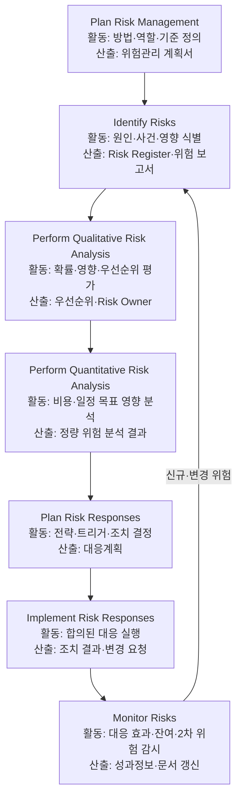
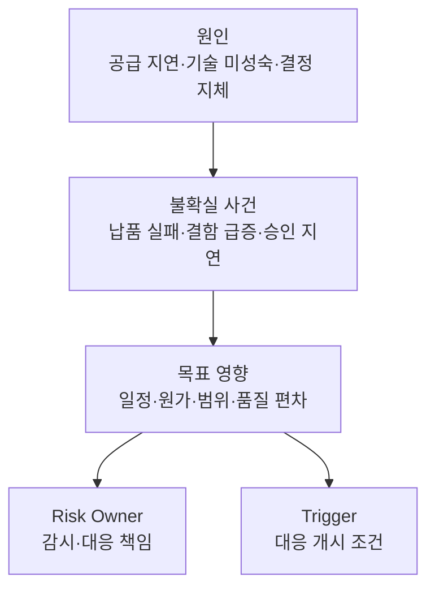
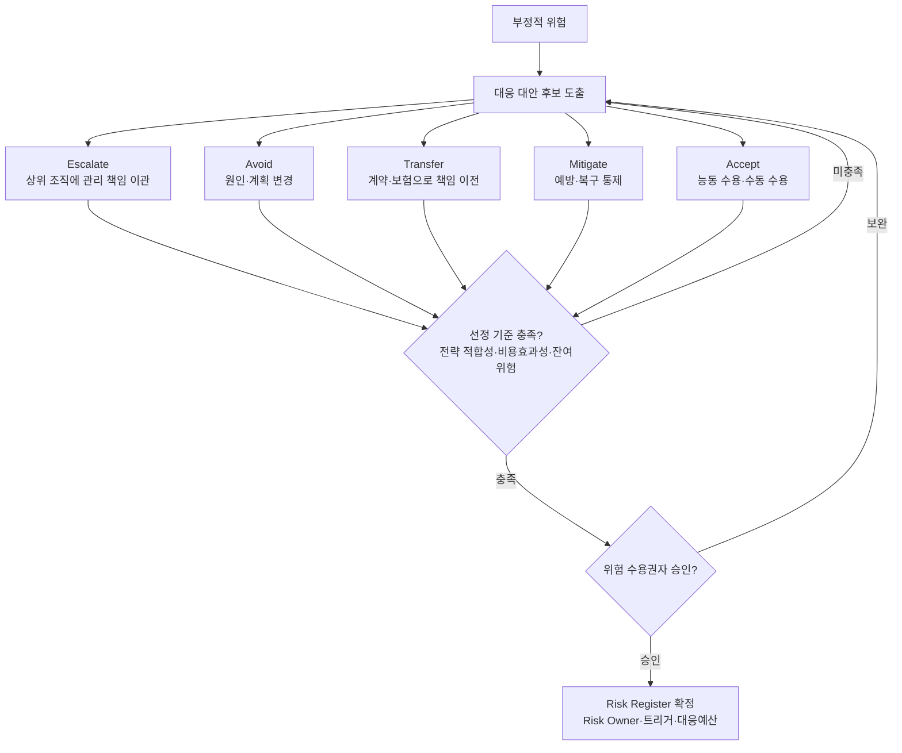
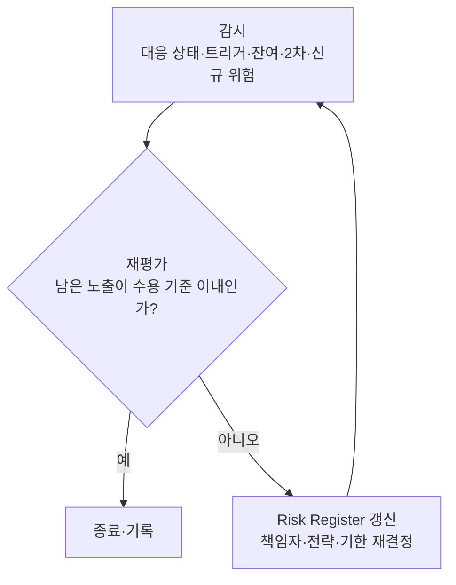
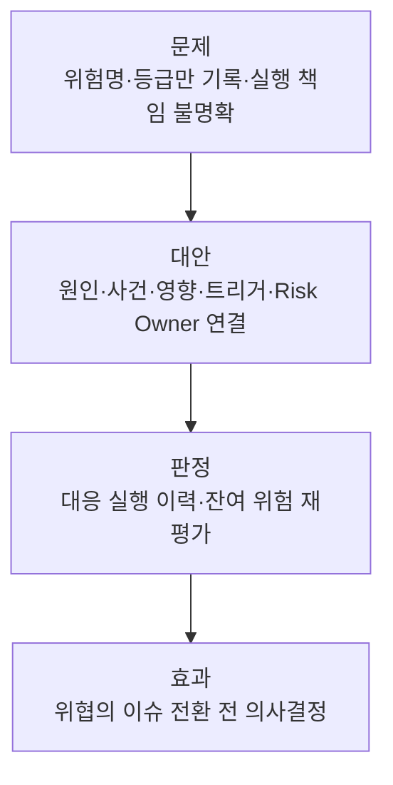

## 지식 로드맵 내 현재 위치

IT 전략·관리프로젝트 통제<strong>프로젝트 위험관리</strong>

## 30초 인출

- 본질: **Project Risk Management(프로젝트 위험관리)**는 아직 발생하지 않은 불확실성을 찾아 위협은 줄이고 기회는 키우는 반복 통제
- 메커니즘: 식별 → 분석 → 대응계획·실행 → 감시 → 신규·잔여·2차 위험 재식별
- 산출물: 위험관리 계획서 · **Risk Register** · 위험 보고서 · 대응 결과

## 핵심 용어

핵심 용어

- **Risk Register(위험 등록부)**: 식별된 위험·책임자·분석 결과·대응·상태를 추적하는 프로젝트 문서
- **Residual Risk(잔여 위험)**: 대응 후에도 남아 계속 감시해야 하는 위험
- **Secondary Risk(2차 위험)**: 위험 대응을 실행한 결과 새로 생기는 위험
- **Risk Owner(위험 책임자)**: 위험을 감시하고 대응전략과 조치를 관리하는 책임자
- **Trigger(트리거)**: 대응을 시작하거나 위험 상태를 재평가하게 하는 관측 가능한 조건

## 예상문제

> IT 프로젝트에서 발생할 수 있는 부정적 위험(Negative Risk)과 대응 전략을 설명하시오. (10점)

- 논술 변형: 리스크 대응계획 수립 절차와 위협·기회 대응전략을 설명하시오.

## Ⅰ. 불확실성을 의사결정 대상으로 바꾸는 위험관리

> 위험은 이미 발생한 이슈가 아니라 발생 여부가 불확실한 사건·조건이며, 성패는 목록 수가 아닌 목표 영향과 대응 책임의 명확성으로 판정함

- 정의: 프로젝트 목표에 긍정적·부정적 영향을 줄 수 있는 불확실한 사건·조건을 식별·분석·대응·감시하는 관리 활동
- 목적: 위협 노출 감소·기회 실현 가능성 증대
- 구분: 위험은 미래의 불확실성, 이슈는 이미 발생해 해결이 필요한 현재 문제

## Ⅱ. PMBOK 6판의 위험관리 프로세스

> 7개 프로세스는 일회성 직선 절차가 아니며, Monitor Risks에서 발견한 변화가 식별·분석·대응으로 환류되고 정량 분석은 프로젝트 필요에 따라 선택함

## Ⅲ. 실행 가능한 위험 기술 구조

> ‘일정 지연’처럼 결과만 쓰지 않고 원인·불확실 사건·목표 영향을 분리한 뒤 Risk Owner와 트리거를 붙여야 대응이 시작됨

## Ⅳ. 부정적 위험 대응전략과 선택 기준

> 5대 대응전략을 기계적으로 순차 적용하지 않고, 프로젝트 맥락에 대한 적합성·비용효과성과 대응 후 잔여위험을 비교한 뒤 위험 수용권자의 승인을 받아 선택함

| 전략 | 판단 | 실행 |
|---|---|---|
| **Avoid(회피)** | 위협 제거·목표 보호 가능 | 원인·계획 변경 |
| **Mitigate(완화)** | 확률·영향 감소 가능 | 예방·복구 통제 |
| **Transfer(전가)** | 제3자 관리 적합 | 계약·보험으로 책임 이전 |
| **Accept(수용)** | 잔여위험이 수용 기준 이내이며 수용권자 승인 | 예비조치를 둔 능동 수용 또는 수동 관찰 |
| **Escalate(상향)** | 프로젝트 권한 밖 | 상위 조직 이관 |

모든 후보는 전략 적합성·비용효과성·대응 후 잔여위험을 함께 비교하며, 선택 결과와 수용권자 승인을 Risk Register에 남김.

## Ⅴ. IT 프로젝트 위험의 문제점·대응책

> 대응 전략 이름보다 Risk Owner·트리거·실행 조치가 연결되고 대응 후 잔여·2차 위험이 재평가되는지가 중요함

| 위험 | 대책 | 효과 |
|---|---|---|
| 핵심 기술 검증 실패 | **PoC(Proof of Concept)**·대체 기술 전환 기준 | 전면 재작업 가능성 감소 |
| 외부 서비스 중단 | 다중 공급자 검토·복구 절차 시험 | 단일 의존 장애 영향 완화 |
| 요구사항 변경 누적 | 변경 영향 분석·승인된 **Baseline** 반영 | 무승인 범위 확대 억제 |
| 개인정보 유출 | 최소수집·접근통제·침해 대응훈련 | 노출 가능성·피해 범위 축소 |

## Ⅵ. 결론 — 트리거와 책임으로 작동시키는 위험관리

> 좋은 위험관리는 모든 위협을 제거하는 것이 아니라 어떤 신호에서 누가 어떤 대응을 시작할지 정하고 대응 효과를 재평가하는 것임

### 학습자 통찰 메모 — 답안 밖

- `[핵심 통찰]`: 위험 등록부의 핵심은 위험 개수가 아니라 의사결정 가능성이다. 원인·사건·영향·트리거·책임자가 연결되지 않은 항목은 실행을 만들지 못한다.
- `나라면`: 핵심 위험부터 관측 가능한 트리거와 Risk Owner를 지정하고 정기 점검에서 대응 실행·잔여 위험을 함께 검토하겠다.

### 실전 답안용 기술사적 제언

- 판정: 원인·사건·영향·트리거·Risk Owner가 하나의 위험 항목으로 연결되는지 확인
- 대안: 위험별 주 대응전략과 비상 대응을 정하고 실행 책임·기한 명시
- 검증: 대응 실행 이력과 잔여·2차 위험 재평가 여부 점검
- 효과: 잠재 위협이 이슈로 전환되기 전 의사결정 가능

## 1교시 10점 답안 발췌

### 1. 정의·목적

- 정의: **Negative Risk(부정적 위험)**는 발생하면 프로젝트 목표에 부정적 영향을 주는 불확실한 사건·조건
- 목적: 위협 노출·프로젝트 목표 편차 가능성 감소

### 2. 부정적 위험 대응전략

- 통제: 전략 적합성·비용효과성·잔여위험 평가와 수용권자 승인 후 Risk Owner·트리거를 지정하고, 대응 후 Residual Risk·Secondary Risk 재식별

## 출제 이력과 검증 출처

- 제134회 정보관리기술사 4교시: "IT 프로젝트 관리에서 리스크 대응에 대하여 설명하시오."
  - 가. 리스크 대응 계획 수립 절차
  - 나. 위협에 대한 대응 전략
  - 다. 기회에 대한 대응 전략
- 제138회 정보관리기술사 1교시: "프로젝트 위험관리"
- 제139회 정보관리기술사 1교시: "IT 프로젝트에서 발생할 수 있는 부정적 위험(Negative Risk)과 대응 전략"
- [PMI, PMBOK Guide Sixth Edition](https://www.pmi.org/-/media/pmi/documents/public/pdf/pmbok-standards/pmbok-guide-6th-edition-5th-printing.pdf)
- [PMI Lexicon of Project Management Terms, Version 5.0](https://www.pmi.org/-/media/pmi/documents/registered/pdf/pmbok-standards/pmi-lexicon-pm-terms.pdf)

## 학습 체크

- [ ] Ⅰ: 위험을 불확실한 사건·조건으로 정의하고 이슈와 구분할 수 있는가?
- [ ] Ⅱ: PMBOK 6판의 7개 프로세스와 Monitor Risks의 환류를 그릴 수 있는가?
- [ ] Ⅲ: 원인 → 사건 → 영향에 Risk Owner·Trigger를 연결할 수 있는가?
- [ ] Ⅳ: 5개 위협 대응전략의 선택 기준과 실행 방향을 재현할 수 있는가?
- [ ] Ⅴ~Ⅵ: 잔여·2차 위험 재평가와 판정·대안·검증·효과를 제시할 수 있는가?

## 연결 토픽

- 이전 토픽: [정보시스템 감리](./008_it_audit.md)
- 연관 토픽: [WBS](./007_wbs.md), [PMO](./004_pmo.md), [위험 대응 전략](./040_negative_risk_response_strategy.md), [ISO 31000](./069_iso_31000.md)
- 다음 토픽: [BPR](./010_bpr.md)
