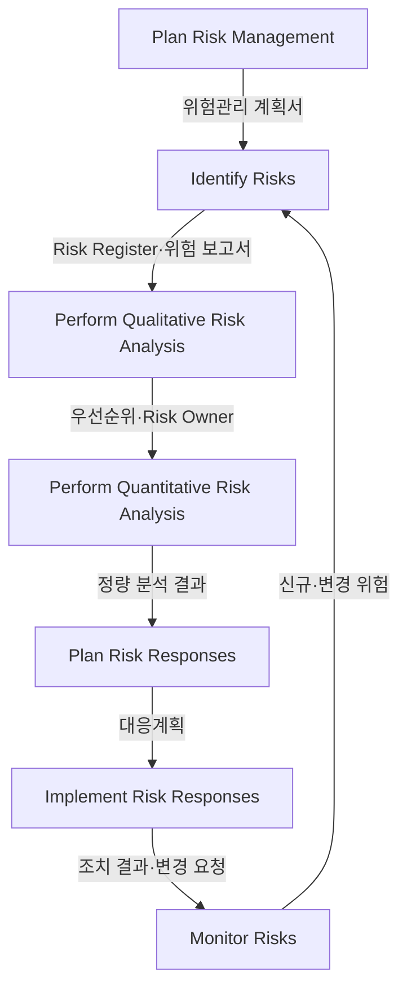
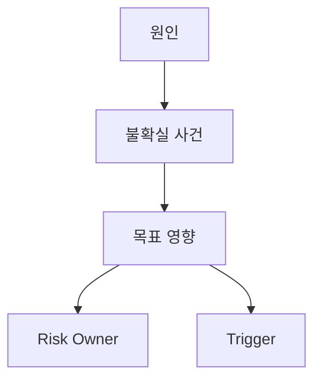
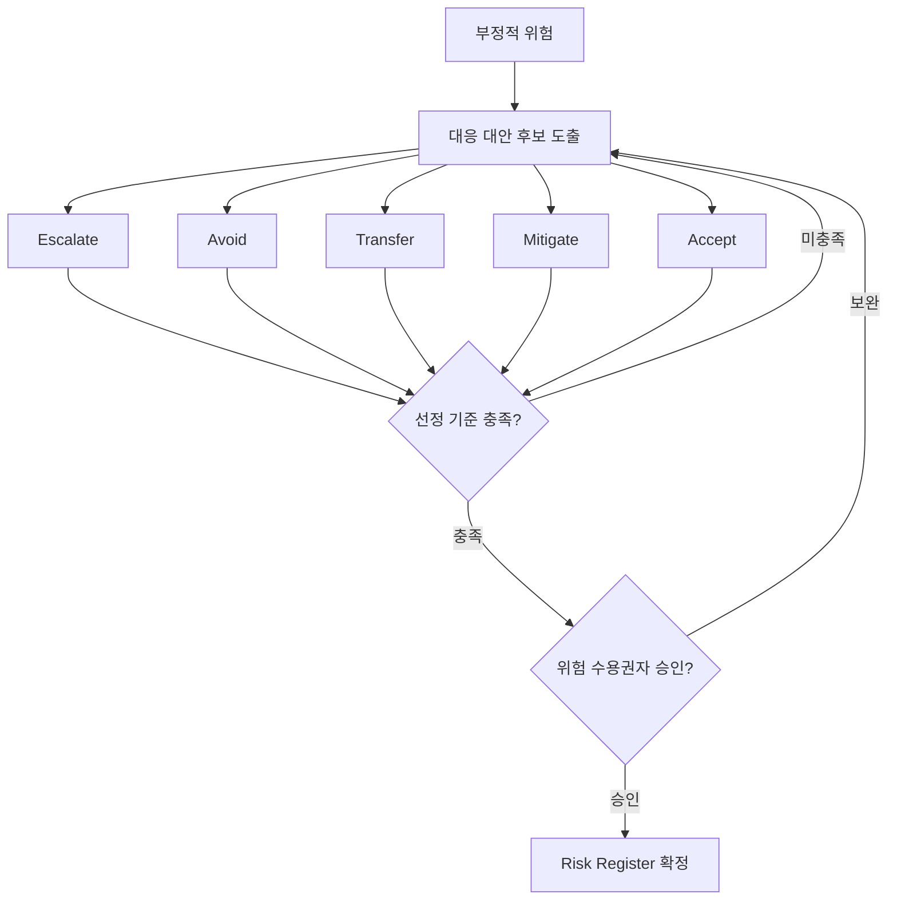
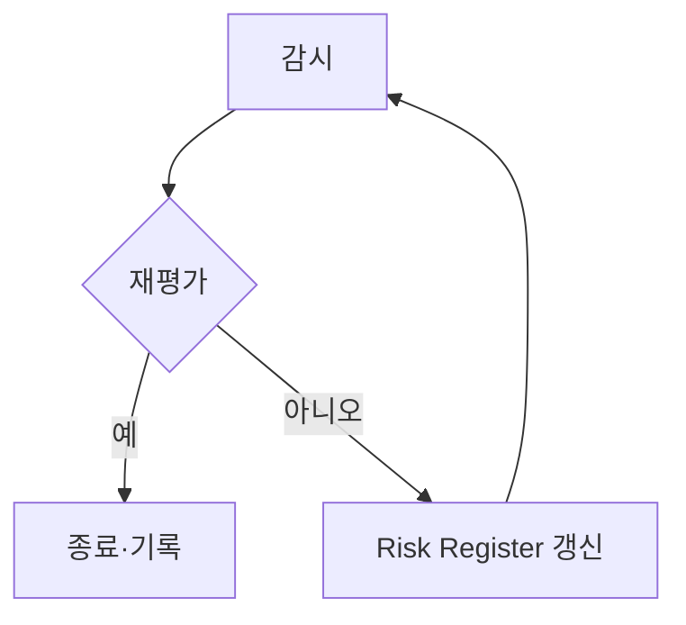
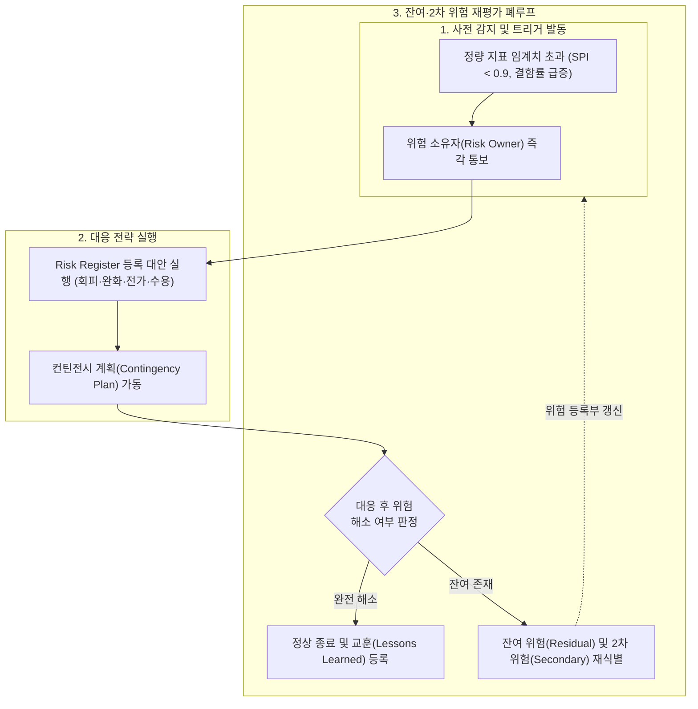

## 지식 로드맵 내 현재 위치

지식 위치: IT 전략·관리 → 프로젝트 통제 → **프로젝트 위험관리**

## 30초 인출

- 본질: **Project Risk Management(프로젝트 위험관리)** 는 아직 발생하지 않은 불확실성을 찾아 위협은 줄이고 기회는 키우는 반복 통제한다.
- 메커니즘: 식별 → 분석 → 대응계획·실행 → 감시 → 신규·잔여· **2차 위험** 재식별한다.
- 산출물: 위험관리 계획서 · **Risk Register** · 위험 보고서 · 대응 결과이다.

핵심 용어

- **Risk Register(위험 등록부)** : 식별된 위험의 원인·우선순위·대응 전략·담당자를 기록하고 추적하는 핵심 관리 문서
- **Residual Risk(잔여 위험)** : 위험 대응 조치를 실행한 후에도 수용 또는 잔존하여 지속 관리해야 하는 위험
- **Secondary Risk(2차 위험)** : 특정 위험 대응 전략을 실행한 결과 부수적으로 파생되어 발생하는 새로운 위험
- **Risk Owner(위험 책임자)** : 특정 위험의 발생 징후를 모니터링하고 대응 조치 실행을 전담 관리하는 책임자
- **Trigger(트리거)** : 사전 정의된 위험 대응 조치나 우발 계획의 실행을 유발하는 조기 경보 사건

## 예상문제

> IT 프로젝트에서 발생할 수 있는 부정적 위험(Negative Risk)과 대응 전략을 설명하시오. (10점)

- 논술 변형: 리스크 대응계획 수립 절차와 위협·기회 대응전략을 설명하시오.

## Ⅰ. 프로젝트 위험관리의 개요

- 정의: 프로젝트 목표에 영향을 줄 수 있는 **불확실성** 을 **위험 등록부(Risk Register)** 에 식별하고 분석·대응·감시하는 체계적 통제 활동
- 목적: 부정적 위협의 발생 확률과 영향을 최소화하고 기회를 실현하여 프로젝트 성공률을 극대화하는 것

## Ⅱ. PMBOK 6판의 위험관리 프로세스

> 7개 프로세스는 일회성 직선 절차가 아니며, Monitor Risks에서 발견한 변화가 식별·분석·대응으로 환류되고 정량 분석은 프로젝트 필요에 따라 선택함

| 프로세스 | 활동 |
|---|---|
| Plan Risk Management | 방법·역할·기준 정의 |
| Identify Risks | 원인·사건·영향 식별 |
| Perform Qualitative Risk Analysis | 확률·영향·우선순위 평가 |
| Perform Quantitative Risk Analysis | 비용·일정 목표 영향 분석 |
| Plan Risk Responses | 전략·트리거·조치 결정 |
| Implement Risk Responses | 합의된 대응 실행 |
| Monitor Risks | 대응 효과·잔여·2차 위험 감시 |

## Ⅲ. 실행 가능한 위험 기술 구조

> ‘일정 지연’처럼 결과만 쓰지 않고 원인·불확실 사건·목표 영향을 분리한 뒤 Risk Owner와 트리거를 붙여야 대응이 시작됨

| 구조 요소 | 예시 |
|---|---|
| 원인 | 공급 지연·기술 미성숙·결정 지체 |
| 불확실 사건 | 납품 실패·결함 급증·승인 지연 |
| 목표 영향 | 일정·원가·범위·품질 편차 |

## Ⅳ. 부정적 위험 대응전략과 선택 기준

> 5대 대응전략을 기계적으로 순차 적용하지 않고, 프로젝트 맥락에 대한 적합성·비용효과성과 대응 후 잔여위험을 비교한 뒤 위험 수용권자의 승인을 받아 선택함

| 전략 | 판단 | 실행 |
|---|---|---|
| **Avoid(회피)** | 위협 제거·목표 보호 가능 | 원인·계획 변경 |
| **Mitigate(완화)** | 확률·영향 감소 가능 | 예방·복구 통제 |
| **Transfer(전가)** | 제3자 관리 적합 | 계약·보험으로 책임 이전 |
| **Accept(수용)** | 잔여위험이 수용 기준 이내이며 수용권자 승인 | 예비조치를 둔 능동 수용 또는 수동 관찰 |
| **Escalate(상향)** | 프로젝트 권한 밖 | 상위 조직 이관 |

모든 후보는 전략 적합성·비용효과성·대응 후 잔여위험을 함께 비교하며, 선택 결과와 수용권자 승인을 Risk Register에 남김.

## Ⅴ. IT 프로젝트 위험의 문제점·대응책

> 대응 전략 이름보다 Risk Owner·트리거·실행 조치가 연결되고 대응 후 잔여·2차 위험이 재평가되는지가 중요함

| 위험 | 대책 | 효과 |
|---|---|---|
| 핵심 기술 검증 실패 | **PoC(Proof of Concept)** ·대체 기술 전환 기준 | 전면 재작업 가능성 감소 |
| 외부 서비스 중단 | 다중 공급자 검토·복구 절차 시험 | 단일 의존 장애 영향 완화 |
| 요구사항 변경 누적 | 변경 영향 분석·승인된 **Baseline** 반영 | 무승인 범위 확대 억제 |
| 개인정보 유출 | 최소수집·접근통제·침해 대응훈련 | 노출 가능성·피해 범위 축소 |

## Ⅵ. 결론 — 트리거와 책임으로 작동시키는 위험관리

> 좋은 위험관리는 모든 위협을 제거하는 것이 아니라 어떤 신호에서 누가 어떤 대응을 시작할지 정하고 대응 효과를 재평가하는 것임

### 실전 답안용 기술사적 제언

- 문제: 위험 식별이 착수기 형식적 문서 작성에 그쳐 사전 감시가 부재하고, 잠재 위험이 프로젝트 중후반 통제 불능 이슈로 폭발함.
- 해결 방안: 위험 등록부(Risk Register)에 위험 소유자(Risk Owner)와 사전 관측 트리거(Trigger)를 필수 지정하고, 대응 후 발생하는 잔여 위험(Residual Risk) 및 2차 위험(Secondary Risk)을 정기 재평가하는 폐루프 거버넌스를 구축함.

## 1교시 10점 답안 발췌

### 1. 정의·목적

- 정의: **Negative Risk(부정적 위험)** 는 프로젝트 목표(일정·원가·품질)에 손실을 끼치는 불확실한 사건·조건
- 목적: 위협 발생 확률과 손실 영향을 최소화하여 프로젝트 목표를 보호하는 것

### 2. 부정적 위험 대응전략

### 3. 핵심 통제 방안

- 전략 적합성·비용효과성·잔여위험 평가와 수용권자 승인 후 Risk Owner·트리거를 지정함
- 대응 실행 후 Residual Risk(잔여 위험) 및 Secondary Risk(2차 위험)를 재평가하여 폐루프 관리

## 출제 이력과 검증 출처

- 제134회 정보관리기술사 4교시: "IT 프로젝트 관리에서 리스크 대응에 대하여 설명하시오."
  - 가. 리스크 대응 계획 수립 절차
  - 나. 위협에 대한 대응 전략
  - 다. 기회에 대한 대응 전략
- 제138회 정보관리기술사 1교시: "프로젝트 위험관리"
- 제139회 정보관리기술사 1교시: "IT 프로젝트에서 발생할 수 있는 부정적 위험(Negative Risk)과 대응 전략"
- [PMI, PMBOK Guide Sixth Edition](https://www.pmi.org/-/media/pmi/documents/public/pdf/pmbok-standards/pmbok-guide-6th-edition-5th-printing.pdf)
- [PMI Lexicon of Project Management Terms, Version 5.0](https://www.pmi.org/-/media/pmi/documents/registered/pdf/pmbok-standards/pmi-lexicon-pm-terms.pdf)

## 학습 체크

- [ ] Ⅰ: 위험을 불확실한 사건·조건으로 정의하고 이슈와 구분할 수 있는가?
- [ ] Ⅱ: PMBOK 6판의 7개 프로세스와 Monitor Risks의 환류를 그릴 수 있는가?
- [ ] Ⅲ: 원인 → 사건 → 영향에 Risk Owner·Trigger를 연결할 수 있는가?
- [ ] Ⅳ: 5개 위협 대응전략의 선택 기준과 실행 방향을 재현할 수 있는가?
- [ ] Ⅴ~Ⅵ: 잔여·2차 위험 재평가 및 폐루프 통제를 적용한 기술사적 문제 해결 방안을 제시할 수 있는가?

## 연결 토픽

- 이전 토픽: [정보시스템 감리](./008_it_audit.md)
- 연관 토픽: [WBS](./007_wbs.md), [PMO](./004_pmo.md), [위험 대응 전략](./040_negative_risk_response_strategy.md), [ISO 31000](./069_iso_31000.md)
- 다음 토픽: [BPR](./010_bpr.md)
