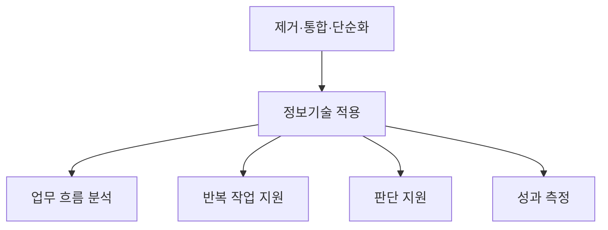
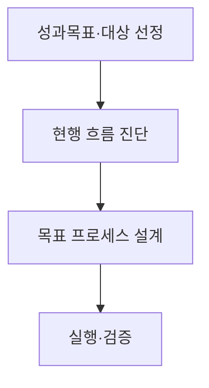
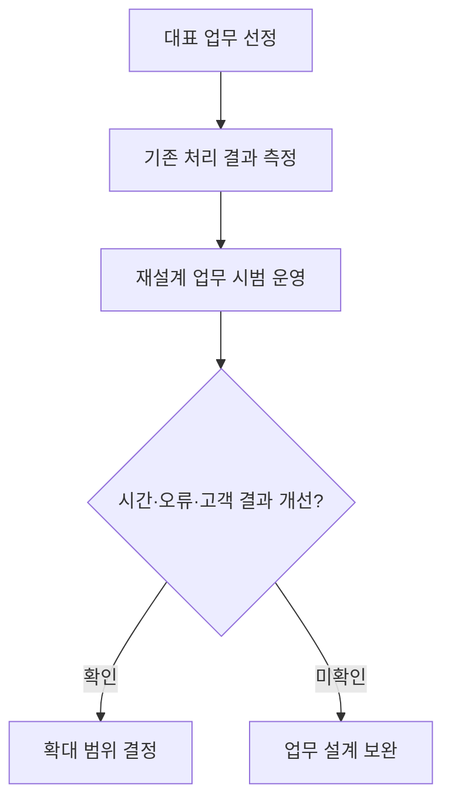

## 지식 로드맵 내 현재 위치

지식 위치: IT 전략·관리 → 프로세스 혁신 → **BPR**

## 30초 인출

- 본질: BPR(Business Process Reengineering, 업무 프로세스 재설계)은 기존 업무를 조금 빠르게 하는 데 그치지 않고, 고객에게 더 나은 결과를 주도록 일의 순서와 역할을 근본적으로 다시 짜는 방법이다.
- 메커니즘: 고객가치·성과 목표 설정 → 현행 업무 분석 → 근본 재설계 → 전환·성과 검증.

핵심 용어

- **E2E(End-to-End)** : 부서별 일부 단계가 아니라 고객 요청부터 결과 제공까지 이어지는 업무 전체 범위다.
- **Fundamental(근본적 재고)** : 업무 수행 방식의 모든 기존 전제를 배제하고 프로세스의 근본 목적을 재정의하는 관점
- **Radical(급진적 재설계)** : 점진적 개선을 넘어 업무 구조·역할·권한을 뿌리부터 완전히 재구성하는 관점
- **Dramatic(극적인 개선)** : 비용·품질·서비스·속도 등 핵심 성과지표에서 획기적인 도약을 목표로 하는 관점
- **Process(종단 간 프로세스)** : 고객 가치 창출을 위해 투입물을 결과물로 변환하는 일련의 유기적 활동 체계
- **Process Owner** : 개별 부서의 이해관계를 초월하여 프로세스 전 과정의 성과와 개선을 총괄 책임지는 관리자
- **Process Mining(프로세스 마이닝)** : 정보시스템의 이벤트 로그에서 실제 업무 흐름과 병목·변형을 찾아내는 분석 기법
- **HITL(Human-in-the-Loop)** : 자동화 프로세스 중 위험 판단 및 최종 승인 단계에 인간의 개입과 통제권을 보장하는 운영 구조

---

## 1교시 예상문제 (10점)

> AI 기반의 업무 프로세스 재설계(BPR, Business Process Reengineering) 도입 효과를 설명하시오. (10점)

---

## 1교시 10점 답안

### Ⅰ. 개요

| 구분 | 핵심 |
|---|---|
| 정의 | **BPR** 은 핵심 업무 프로세스를 근본적으로 재검토하고 재설계하는 경영 혁신 기법이다. |
| 목적 | 고객가치를 높이고 업무의 대기·중복을 줄인다. |

### Ⅱ. AI 적용과 기대 효과

### Ⅲ. 핵심 통제 방안

- 자동화 전 불필요 절차를 제거하고, 고위험 판단에는 **HITL(Human-in-the-Loop)** 검토와 사람 승인 절차를 둔다.
- 한 줄 제언: 자동화 전에 고객가치에 기여하지 않는 절차를 제거·재설계한다.

---

## 2~4교시 예상문제 (25점)

> AI 기반 BPR의 개념·재설계 원칙·도입 효과·통제방안을 설명하시오. (예상·25점)

---

## 2~4교시 25점 답안

## Ⅰ. BPR의 개요

| 구분 | 핵심 |
|---|---|
| 정의 | **BPR** 은 핵심 업무 프로세스를 근본적으로 재검토하고 재설계하는 경영 혁신 기법이다. |
| 목적 | 고객가치를 높이고 업무의 대기·중복을 줄인다. |

## Ⅱ. BPR 대표 수행 흐름과 산출물

> BPR 방법론은 조직마다 달라질 수 있지만 성과 목표·현행 병목·목표 프로세스·전환 검증을 잇는 흐름은 유지됨

| 단계 | 활동 | 산출 |
|---|---|---|
| 성과목표·대상 선정 | 고객가치·성과격차 평가 | 목표지표·대상 프로세스 |
| 현행 흐름 진단 | 대기·중복·재작업·예외 분석 | 현행 흐름·핵심 병목 |
| 목표 프로세스 설계 | 제거·통합·재배치·역할 재정의 | 목표 흐름·역할·요구사항 |
| 실행·검증 | 시범 적용·교육·전환·성과 측정 | 전환계획·검증 결과 |

- 책임: Process Owner가 부서 경계를 넘어 목표 프로세스의 성과·변경을 관리
- 검증: 현행 Baseline과 목표값을 정하고 시범 적용의 처리시간·오류·재작업·고객경험을 비교

## Ⅲ. AI 적용 지점과 도입 효과

> 업무를 먼저 단순하게 다시 짠 뒤, AI로 줄일 반복 업무와 도울 판단을 정해 효과를 확인한다.

| 적용 | 효과 | 통제 |
|---|---|---|
| Process Mining | 로그에서 실제 흐름·병목 분석 | 로그 품질·분석 범위 확인 |
| 반복 업무 자동화 | 입력·검토 대기와 수작업 감소 | 예외 기준·수동 전환 경로 |
| AI 판단 지원 | 문서 분류·요약·예측으로 검토 지원 | 근거를 남기고 사람이 승인 |
| 운영 성과 | 처리시간·오류·재작업 변화 파악 | 현행 기준과 비교 |

## Ⅳ. BPR 전환의 문제점·대응책

> 부서별 최적화와 변화 저항을 관리하고, 목표 프로세스의 책임·통제·전환 영향을 함께 검증한다.

| 위험 | 대책 | 효과 |
|---|---|---|
| 불필요 절차의 고속 자동화 | 자동화 전 제거·통합·단순화 판정 | 낭비 확산 방지 |
| AI 오류·편향·불투명성 | **HITL(Human-in-the-Loop)** 검토·승인·이력 관리 | 고위험 오판 통제·책임 추적 |
| 역할·권한 충돌 | Process Owner 지정·역할 합의·교육 | 종단 간 책임 확립 |

## Ⅴ. 기술사적 제언 — 재설계 효과를 한 업무에서 먼저 검증

> 제안: 재설계한 업무를 전 조직에 바로 확대하지 말고, 대표 업무 하나에서 **처리시간·오류·고객 결과** 를 기존 방식과 비교한 뒤 확대 여부를 결정한다.

Ⅳ절은 전환 위험을 비교했다. 이 제안은 **실제 개선 여부를 보고 확대를 결정하는 방법** 이며, 개선 기준과 측정 기간은 업무 특성에 맞게 정한다.

## 출제 이력과 검증 출처

- 제140회 정보관리기술사 1교시: “AI 기반의 업무 프로세스 재설계(BPR, Business Process Reengineering) 도입 효과를 설명하시오.”
- Michael Hammer, [Reengineering Work: Don’t Automate, Obliterate](https://hbr.org/1990/07/reengineering-work-dont-automate-obliterate), Harvard Business Review, 1990

## 연결 토픽

- 이전 토픽: [프로젝트 위험관리](./009_project_risk_management_negative.md)
- 연관 토픽: [ISP](./003_isp.md), [SCM](./005_scm.md), [ERP](./068_erp.md)
- 다음 토픽: [ESG 경영과 IT](./011_esg.md)
