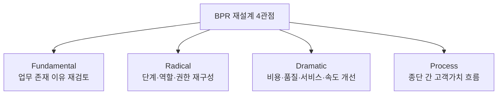
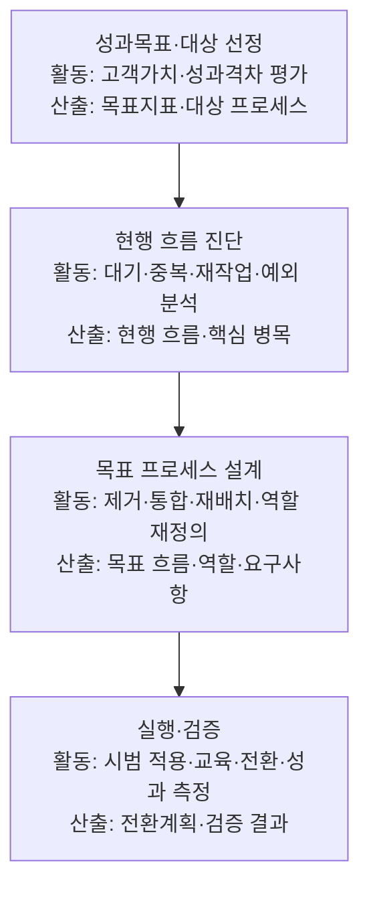
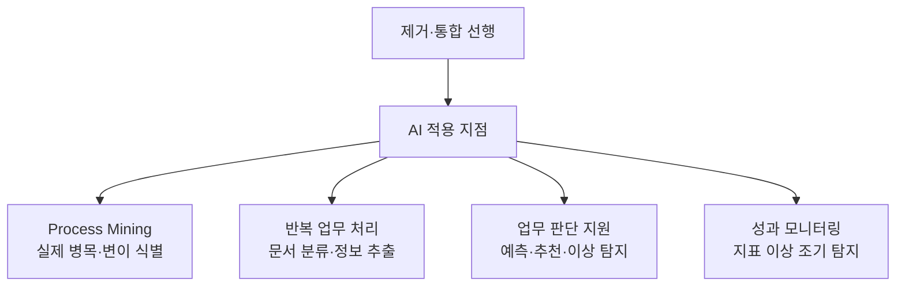
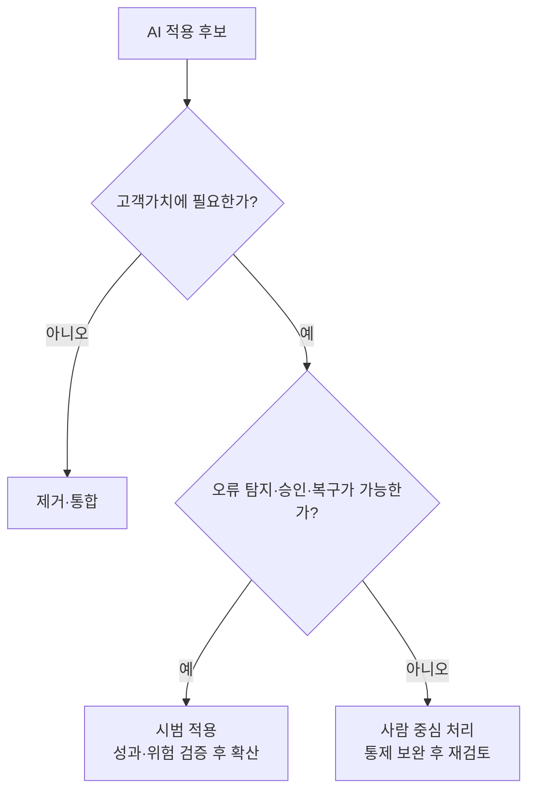
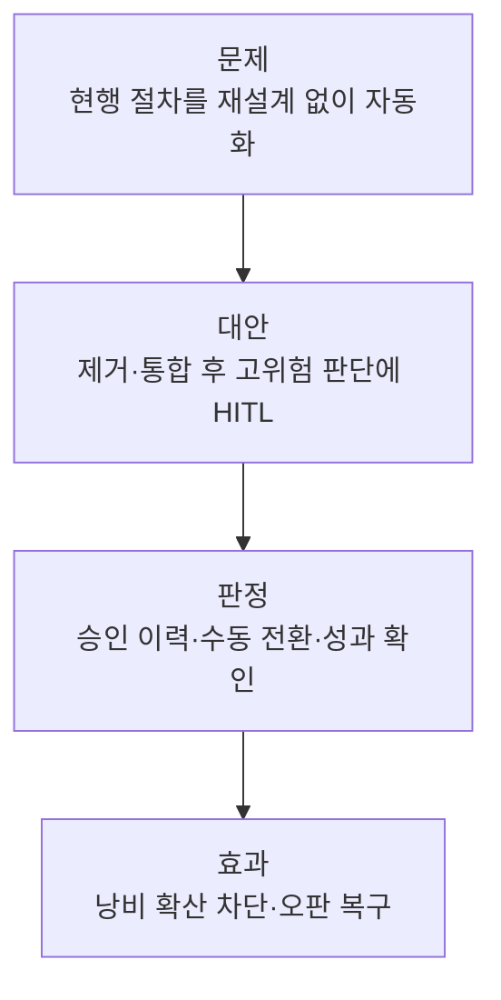

## 지식 로드맵 내 현재 위치

IT 전략·관리프로세스 혁신<strong>BPR</strong>

## 30초 인출

- 본질: **BPR(Business Process Reengineering)**은 현재 절차의 자동화가 아니라 고객가치를 만드는 종단 간 업무를 근본적으로 다시 설계하는 혁신 기법
- 메커니즘: 고객가치·성과 목표 설정 → 대기·중복·재작업 제거 → 역할·권한·흐름 재설계 → 필요한 지점에 AI 적용 → 성과 검증
- 산출물: 목표 프로세스 · 역할·권한 · 구현 요구사항 · 전환계획 · 성과지표

## 핵심 용어

핵심 용어

- **Fundamental**: 현재 방식의 전제를 두지 않고 업무의 존재 이유부터 다시 묻는 관점
- **Radical**: 기존 구조의 부분 보완이 아니라 단계·역할·권한을 뿌리부터 재구성하는 관점
- **Dramatic**: 비용·품질·서비스·속도의 큰 폭 개선을 지향하는 관점
- **Process**: 투입을 고객가치 있는 산출로 바꾸는 종단 간 활동의 묶음
- **Process Owner**: 부서 경계를 넘어 프로세스 성과·변경을 책임지는 역할
- **Process Mining**: 이벤트 로그로 실제 업무 흐름·변이·병목을 분석하는 기법
- **HITL(Human-in-the-Loop)**: AI 판단 과정에 사람의 검토·승인·개입을 두는 통제 구조

## 예상문제

> AI 기반의 업무 프로세스 재설계(BPR, Business Process Reengineering) 도입 효과를 설명하시오. (10점)

- 논술 변형: AI 기반 BPR의 개념·재설계 원칙·도입 효과·통제방안을 설명하시오.

## Ⅰ. 기존 절차 자동화가 아닌 종단 간 재설계

> BPR의 본질은 현재 업무를 더 빠르게 실행하는 것이 아니라 고객가치 관점에서 업무의 존재 이유와 연결 방식을 다시 설계하는 것임

- 정의: 비용·품질·서비스·속도의 큰 폭 개선을 위해 업무 프로세스를 근본적으로 재고하고 급진적으로 재설계하는 경영혁신 기법
- 목적: 부서 경계의 대기·중복·재작업 제거·종단 간 처리시간 단축

## Ⅱ. BPR 대표 수행 흐름과 산출물

> BPR 방법론은 조직마다 달라질 수 있지만 성과 목표·현행 병목·목표 프로세스·전환 검증을 잇는 흐름은 유지됨

- 책임: Process Owner가 부서 경계를 넘어 목표 프로세스의 성과·변경을 관리
- 검증: 현행 Baseline과 목표값을 정하고 시범 적용의 처리시간·오류·재작업·고객경험을 비교

## Ⅲ. AI 기반 BPR 적용 지점·도입 효과

> 불필요한 업무를 먼저 제거한 뒤 흐름 분석·반복 처리·판단 지원·성과 감시 중 효과와 통제가 함께 성립하는 지점에 AI를 배치함

| 적용 | 효과 | 통제 |
|---|---|---|
| 현행 흐름 파악 | 병목·변이·재작업 후보 식별 | 데이터 품질·분석 범위 확인 |
| 반복 업무 처리 | 입력·검토 대기와 수작업 오류 감소 | 예외 기준·수동 전환 경로 |
| 업무 판단 지원 | 판단 지연·담당자별 편차 감소 | 근거·승인 권한·이력 유지 |
| 성과 모니터링 | 성과 저하 조기 발견 | Baseline·오탐·편향 검증 |

## Ⅳ. AI 기반 BPR의 문제점·대응책

> 고객가치가 없는 절차는 제거하고, 필요한 절차라도 오류 탐지·사람 승인·복구가 불가능하면 AI 자동화를 보류해야 함

| 위험 | 대책 | 효과 |
|---|---|---|
| 불필요 절차의 고속 자동화 | 자동화 전 제거·통합·단순화 판정 | 낭비 확산 방지 |
| AI 오류·편향·불투명성 | **HITL** 승인·근거 기록·수동 전환 | 오판 추적·복구 경로 유지 |
| 역할·권한 충돌 | Process Owner 지정·역할 합의·교육 | 종단 간 책임 확립 |

## Ⅴ. 결론 — 고객가치와 통제 가능성 중심의 BPR

> BPR의 종료점은 AI 적용이 아니라 목표 프로세스가 고객가치와 핵심 성과를 개선했는지 증거로 판정하는 것임

### 학습자 통찰 메모 — 답안 밖

- `[핵심 통찰]`: 자동화 속도보다 제거할 단계와 사람이 책임질 판단을 먼저 정해야 한다.
- `나라면`: 고객가치가 낮은 단계는 제거하고 AI 후보는 오류 탐지·승인·복구 가능성을 확인한 뒤 시범 적용하겠다.

### 실전 답안용 기술사적 제언

- 판정: 제거·통합을 먼저 수행했고 고위험 판단에 HITL·복구 경로가 있는지 확인
- 대안: Process Mining으로 병목을 찾고 필요한 업무만 AI 후보로 선정
- 검증: 시범 적용에서 판정 기록·승인 이력·수동 전환 동작 점검
- 효과: 낭비 절차 확산과 AI 오판의 운영 전이 감소

## 1교시 10점 답안 발췌

### 1. 정의·목적

- 정의: **BPR(Business Process Reengineering)**은 비용·품질·서비스·속도의 큰 폭 개선을 위해 종단 간 업무 프로세스를 근본적으로 재고하고 급진적으로 재설계하는 기법
- 목적: 부서 단절·대기·중복·재작업 제거·종단 간 처리시간 단축

### 2. AI 적용 지점과 효과

- 통제: **HITL(Human-in-the-Loop)** 승인·근거 기록·수동 전환 경로·정기 검증
- 결론: 제거·통합·재배치 후 AI를 선택 적용해야 처리시간·오류·재작업이 실제로 줄어듦

## 출제 이력과 검증 출처

- 제140회 정보관리기술사 1교시: “AI 기반의 업무 프로세스 재설계(BPR, Business Process Reengineering) 도입 효과”
- Michael Hammer, [Reengineering Work: Don’t Automate, Obliterate](https://hbr.org/1990/07/reengineering-work-dont-automate-obliterate), Harvard Business Review, 1990

## 학습 체크

- [ ] Ⅰ: BPR의 정의와 Fundamental·Radical·Dramatic·Process의 4관점을 재현할 수 있는가?
- [ ] Ⅱ: 대표 수행 흐름 4단계의 활동·산출을 연결할 수 있는가?
- [ ] Ⅲ: 제거·통합 선행 아래 AI 적용 지점 4개와 효과·통제를 연결할 수 있는가?
- [ ] Ⅳ: 고객가치와 오류 탐지·승인·복구 가능성으로 자동화 여부를 분기할 수 있는가?
- [ ] Ⅴ: 판정·대안·검증·효과를 BPR 고유 맥락으로 제시할 수 있는가?

## 연결 토픽

- 이전 토픽: [프로젝트 위험관리](./009_project_risk_management_negative.md)
- 연관 토픽: [ISP](./003_isp.md), [SCM](./005_scm.md), [ERP](./068_erp.md)
- 다음 토픽: [ESG 경영과 IT](./011_esg.md)
