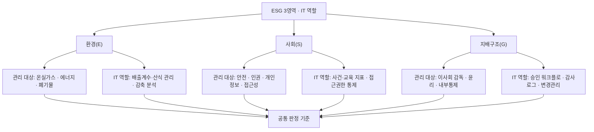
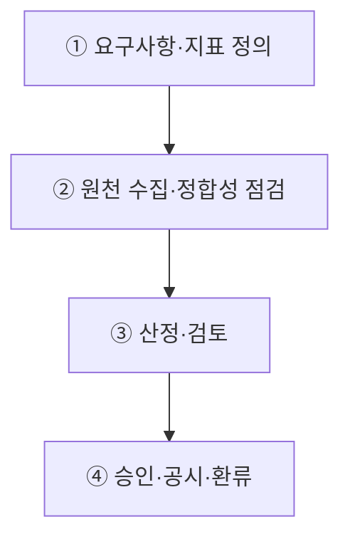
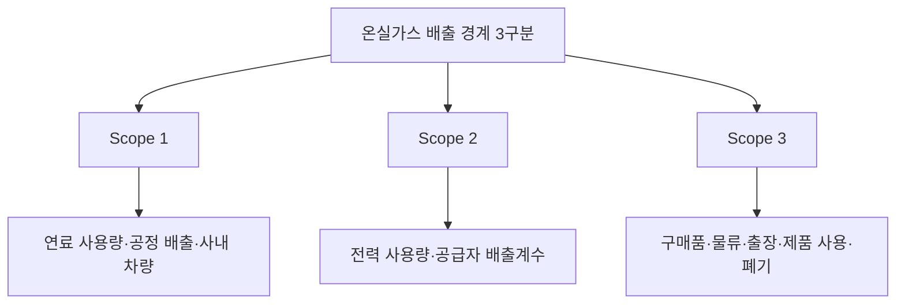
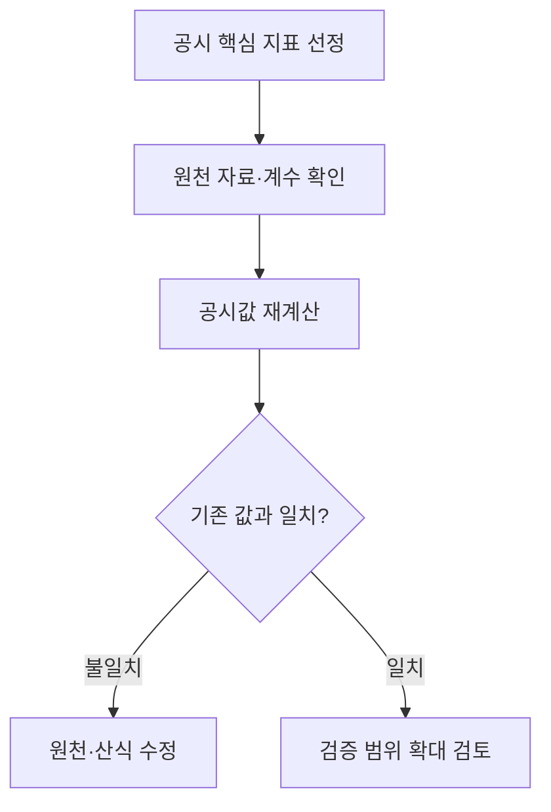

## 지식 로드맵 내 현재 위치

지식 위치: IT 전략·관리 → 지속가능 경영 → **ESG 경영과 IT**

## 30초 인출

- 본질: ESG(Environmental, Social, Governance)는 기업이 환경과 사회에 미치는 영향, 그리고 회사를 책임 있게 운영하는 방식을 경영 판단에 함께 반영하는 관점이다.
- 메커니즘: 공시 요구사항 정의 → 원천 데이터 수집 → 산정·검증 → 승인·공시 → 목표·통제 환류한다.
- 산출물: **ESG** 지표 사전 · 온실가스 인벤토리 · 증빙·승인 이력 · 지속가능성 공시한다.

핵심 용어

- **ESG(Environmental, Social, Governance)** : 기업의 비재무적 요소인 환경·사회·지배구조 위험과 기회를 경영 및 투자 의사결정에 반영하는 지속가능 경영 프레임워크
- **ISSB(International Sustainability Standards Board)** : 전 세계 통용 지속가능성 공시기준(IFRS S1·S2)을 제정하는 국제기구
- **IFRS S1** : 지속가능성 관련 재무정보 공시를 위한 일반 요구사항 기준서
- **IFRS S2** : 기후 관련 물리적·전환 위험 및 기회 공시를 위한 세부 요구사항 기준서
- **GHG Protocol(Greenhouse Gas Protocol)** : 기업의 온실가스 배출량을 산정·분류·보고하기 위한 글로벌 회계·보고 표준 체계
- **Scope 1·2·3** : 온실가스 직접 배출(Scope 1), 에너지 구매 간접 배출(Scope 2), 가치사슬 전반의 기타 간접 배출(Scope 3) 분류 체계

---

## 1교시 예상문제 (10점)

> ESG의 E·S·G 영역별 IT 역할과 공시 데이터 통제방안을 설명하시오. (예상·10점)

---

## 1교시 10점 답안

### 1. 정의·목적

- 정의: **ESG(Environmental, Social, Governance)** 는 환경·사회·지배구조 위험과 기회를 경영 의사결정과 공시에 반영하는 비재무적 경영 관점
- 목적: 기후·사회적 규제 리스크 선제 대응 및 데이터 신뢰성 확보를 통한 기업 가치 제고

### 2. E·S·G 영역별 IT 역할

### 3. 핵심 공시 및 데이터 통제 방안

- **공시 표준 준수** : ISSB IFRS S1·S2 및 GHG Protocol 기반 Scope 1·2·3 경계 정의
- **데이터 계보(Data Lineage)** : 원천 데이터 수집부터 산출·공시까지 전 구간 감사 추적성 확보
- 한 줄 제언: 공시 지표의 책임자·원천·산정근거와 변경 이력을 추적 가능하게 관리한다.

---

## 2~4교시 예상문제 (25점)

> ESG(Environment, Social, Governance) 경영에 대하여 설명하시오. 가. ESG 경영의 정의 및 목표 나. ESG 경영의 주요 지표 다. ESG 경영 목표 달성을 지원하기 위한 정보기술(IT) (제134회 정보관리기술사 2교시)

---

## 2~4교시 25점 답안

## Ⅰ. ESG 경영과 IT의 개요

| 구분 | 핵심 |
|---|---|
| 정의 | 환경·사회·지배구조의 위험과 기회를 경영 의사결정과 성과 관리에 반영하는 활동 |
| 목적 | 지속가능성과 이해관계자 신뢰를 높이고 관련 위험을 관리한다. |

## Ⅱ. E·S·G 영역별 IT 역할

> 영역별 데이터와 통제 대상은 다르지만 공통 판정 기준은 **원천 근거** ·책임자· **산식** · **변경 이력** 을 추적할 수 있는지 여부임.

## Ⅲ. ESG 데이터 관리 흐름

> 공시 수치의 신뢰성은 최신 대시보드보다 원천에서 공시 항목까지 이어지는 데이터 계보와 재수행 가능한 산식으로 판정함.

| 단계 | 활동 | 산출 |
|---|---|---|
| ① 요구사항·지표 정의 | 적용 기준·중요 정보·조직경계/산정경계 결정 | 지표 사전·책임자·보고경계 |
| ② 원천 수집·정합성 점검 | 설비·업무시스템·협력사 자료 수집·누락/중복 점검 | 원천 데이터·품질 결과·증빙 링크 |
| ③ 산정·검토 | 배출계수·단위·환산식 적용·이전 기간 대비 변동 분석 | 지표 집계값·산식 버전·검토 이력 |
| ④ 승인·공시·환류 | 책임자 승인·공시 항목 연결·편차 원인 반영 | 공시 정보·감사증빙·개선 과제 |

## Ⅳ. 온실가스 Scope와 공시기준 적용

> Scope 분류는 배출원의 위치가 아니라 보고기업의 소유·통제와 **가치사슬** 관계로 구분하며, 공시 의무는 각 관할권의 채택 범위를 별도로 확인해야 함.

- **IFRS S1·S2** : **ISSB** 기준 자체의 효력일과 국내 의무 적용 시기는 구분하며, 적용 대상·시점은 관할권 결정 확인
- **GHG Protocol** : 조직경계·운영경계와 배출계수의 출처·버전을 함께 관리

## Ⅴ. ESG 데이터의 문제점·대응책

> 자동 수집만으로 신뢰성이 생기지 않으므로 경계·산식·증빙·승인의 통제를 함께 설계해야 함.

| 위험 | 대책 | 효과 |
|---|---|---|
| **경계·원천 누락** | 법인·사업장·가치사슬 범위와 책임자 등록 | 누락 식별 · 재집계 범위 명확화 |
| **산식·배출계수 불일치** | 단위·계수 출처·유효기간·버전 통제 | 기간·조직 간 수치 불일치 제거 |
| **협력사 자료 품질 편차** | 입력 규칙·증빙 첨부·표본 검토 | Scope 3 추정 근거 강화 |

## Ⅵ. 기술사적 제언 — 공시 핵심 지표부터 검증 범위 선정

> 제안: 모든 ESG 데이터를 한꺼번에 정비하기보다 공시에 쓰이고 원천이 여러 조직에 걸친 지표부터 골라 **원천 자료에서 공시값까지** 한 건을 재계산해 본다.

Ⅴ절은 데이터 오류의 종류와 통제를 설명했다. 이 제안은 **어떤 지표부터 실제로 검증할지** 우선순위를 정한다.

## 출제 이력과 검증 출처

- 한국산업인력공단 Q-Net, [제134회 정보관리기술사 문제지](https://www.q-net.or.kr/cst006.do?artlSeq=5213580&brdId=Q006&gSite=Q&id=cst00602)
- IFRS Foundation, [IFRS S1 General Requirements for Disclosure of Sustainability-related Financial Information](https://www.ifrs.org/issued-standards/ifrs-sustainability-standards-navigator/ifrs-s1-general-requirements/)
- IFRS Foundation, [IFRS S2 Climate-related Disclosures](https://www.ifrs.org/issued-standards/ifrs-sustainability-standards-navigator/ifrs-s2-climate-related-disclosures/)
- GHG Protocol, [Corporate Value Chain (Scope 3) Accounting and Reporting Standard](https://ghgprotocol.org/corporate-value-chain-scope-3-standard)

## 연결 토픽

- 이전 토픽: [BPR](./010_bpr.md)
- 연관 토픽: [ISO/IEC 38500](./002_iso_iec_38500.md), [FinOps](./012_finops.md)
- 다음 토픽: [FinOps](./012_finops.md)
