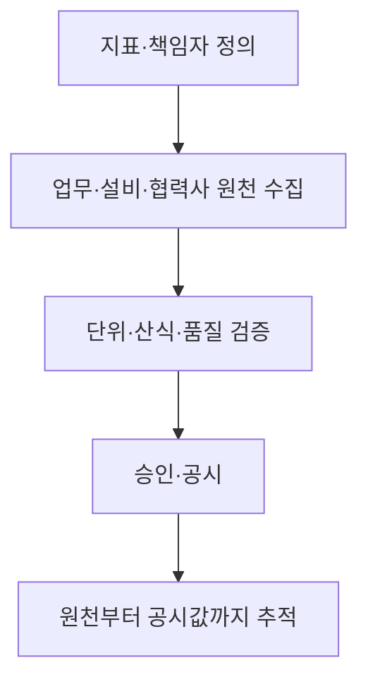

## 지식 로드맵 내 현재 위치

지식 위치: IT 전략·관리 → 지속가능 경영의 정보화 → **ESG 경영과 IT**

## 30초 인출

- 본질: **ESG 데이터 관리**는 환경·사회·지배구조 지표의 원천 자료를 모으고 검증해 경영 판단과 공시에 사용할 수 있게 하는 정보관리 활동
- 메커니즘: 지표·책임자 정의 → 원천 데이터 수집 → 산식·품질 검증 → 승인·공시 → 근거 추적

핵심 용어

- **ESG 경영** : 환경·사회·지배구조의 위험과 성과를 경영 의사결정에 반영하는 활동
- **ESG(Environmental, Social, Governance)** : 환경·사회·지배구조를 뜻하는 경영·공시 관점
- **ESG 데이터 관리** : ESG 지표의 원천·산식·품질·승인 이력을 관리하는 정보관리 활동
- **공시 지표** : 외부 보고나 내부 의사결정에 사용할 항목과 계산 기준
- **데이터 계보(Data Lineage)** : 공시값이 어떤 원천·변환·산식·승인을 거쳤는지 잇는 기록
- **데이터 품질(Data Quality)** : 수집값의 정확성·완전성·일관성·적시성 등 사용 적합성
- **감사 추적(Audit Trail)** : 값·산식·승인의 변경 주체와 시점을 확인할 수 있는 이력
- **IFRS(International Financial Reporting Standards)** : 국제재무보고기준의 영문 명칭; 이 문서의 IFRS S1·S2는 재단 산하 ISSB가 제정한 지속가능성 공시기준
- **ISSB(International Sustainability Standards Board)** : IFRS 재단의 지속가능성 공시기준 제정 기구

---

## 1교시 예상문제 (10점)

> ESG 경영을 지원하는 정보시스템의 핵심 기능을 설명하시오. (예상)

---

## 1교시 10점 답안

### Ⅰ. ESG 데이터 관리의 개요

| 구분 | 핵심 |
|---|---|
| 정의 | **ESG 데이터 관리** 는 ESG 지표의 원천·산식·품질·승인 이력을 관리하는 정보관리 활동 |
| 목적 | 경영 판단과 공시에 쓰는 지표의 신뢰성·추적성 확보 |

### Ⅱ. 정보시스템의 핵심 기능

| 기능 | IT 역할 |
|---|---|
| 수집·표준화 | 원천·기간·단위를 맞추고 누락 확인 |
| 산정·검증 | 산식 버전과 검토 결과 보존 |
| 승인·추적 | 책임자 승인과 변경 이력 연결 |

**제언:** 공시값마다 원천·산식·책임자·승인 이력을 연결해 재계산 가능하게 관리

---

## 2~4교시 예상문제 (25점)

> ESG 공시 데이터 관리 체계의 구성과 처리 흐름을 설명하고, 데이터 품질·추적성 확보 방안을 제시하시오. (예상)

---

## 2~4교시 25점 답안

## Ⅰ. ESG 데이터 관리의 개요

| 구분 | 핵심 |
|---|---|
| 정의 | **ESG 데이터 관리** 는 ESG 지표의 원천·산식·품질·승인 이력을 관리하는 정보관리 활동 |
| 목적 | 경영 판단과 공시에 쓰는 지표의 신뢰성·추적성 확보 |

| 관리 대상 | 확인할 질문 |
|---|---|
| 지표 | 무엇을 어떤 경계·기간·단위로 계산하는가? |
| 증빙 | 어느 원천 자료와 승인 결과로 값을 설명하는가? |

## Ⅱ. 정보시스템의 핵심 기능

| 기능 | IT 역할 |
|---|---|
| 수집·표준화 | 원천·기간·단위를 맞추고 누락 확인 |
| 산정·검증 | 산식 버전과 검토 결과 보존 |
| 승인·추적 | 책임자 승인과 변경 이력 연결 |

## Ⅲ. 데이터 품질과 계보 관리

| 단계 | 품질·추적 통제 | 남길 증거 |
|---|---|---|
| 원천 수집 | 데이터 소유자·수집 주기·단위 등록 | 원천 식별자·수집 시점 |
| 산정 | 변환·배출계수 등 산식 버전 기록 | 입력값·계수·계산 결과 |
| 검토·승인 | 누락·중복·전기 대비 변동 확인 | 검토 의견·승인자·승인 시점 |
| 공시 | 확정값과 제출 항목 연결 | 공시본·변경 이력 |

**데이터 계보**를 통해 공시값에서 원천값으로 역추적하고 같은 기준으로 재계산할 수 있는지 확인.

## Ⅳ. E·S·G 지표와 IT 수집 영역

| 영역 | 데이터 예 | 정보관리 초점 |
|---|---|---|
| 환경(E) | 에너지 사용·온실가스 | 설비·구매·협력사 데이터의 경계·단위·계수 관리 |
| 사회(S) | 안전·교육·접근성 | 사건·교육 기록의 정의·집계·개인정보 보호 |
| 지배구조(G) | 승인·내부통제 | 권한 분리·변경 이력·감사 추적 |

이 표의 목적은 ESG 각 분야의 세부 지표 암기가 아니라 **IT가 다루는 원천과 통제의 차이** 구분.

## Ⅴ. 외부 기준과 내부 데이터 모델의 연결

| 외부 기준의 역할 | 정보시스템의 대응 |
|---|---|
| **IFRS S1·S2**의 지속가능성·기후 공시 요구 | 요구 항목을 내부 지표 사전·공시값과 연결 |
| 온실가스 산정 기준의 조직·배출 경계 | 원천 시스템·책임 조직·산식 버전을 지표에 기록 |

**IFRS**의 풀네임과 **ISSB**의 역할은 구별하고, 기준의 효력일과 국내 의무 적용 여부는 관할권의 현행 결정으로 확인. 온실가스의 Scope 분류는 필요한 지표의 데이터 경계를 정할 때만 활용.

## Ⅵ. 문제점과 기술사적 제언

| 문제 | 해결 방안 |
|---|---|
| 같은 지표를 부서별로 다른 단위·산식으로 집계 | 지표 사전과 산식·계수 버전을 공통 관리 |
| 공시값의 원천·검토 이력 부재 | **데이터 계보**·증빙·승인 이력을 공시 항목에 연결 |
| 모든 ESG 데이터를 한꺼번에 정비하려다 핵심 공시값 검증 지연 | 공시에 쓰이고 여러 조직의 원천을 합치는 지표부터 재계산·대조 |

## 출제 이력과 검증 출처

- 한국산업인력공단 Q-Net, [제134회 정보관리기술사 문제지](https://www.q-net.or.kr/cst006.do?artlSeq=5213580&brdId=Q006&gSite=Q&id=cst00602) — ESG 정의·목표·주요 지표와 이를 지원하는 IT를 함께 요구한 기출
- IFRS Foundation, [IFRS S1](https://www.ifrs.org/issued-standards/ifrs-sustainability-standards-navigator/ifrs-s1-general-requirements/), [IFRS S2](https://www.ifrs.org/issued-standards/ifrs-sustainability-standards-navigator/ifrs-s2-climate-related-disclosures/)

## 연결 토픽

- 이전 토픽: [BPR](./010_bpr.md)
- 연관 토픽: [ISO/IEC 38500](./002_iso_iec_38500.md), [FinOps](./012_finops.md)
- 다음 토픽: [FinOps](./012_finops.md)
