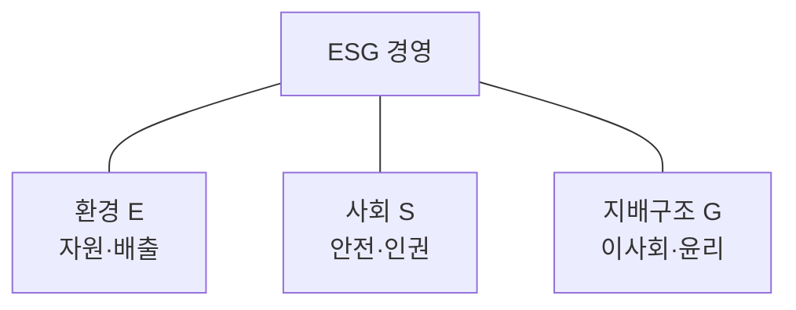

## 지식 로드맵 내 현재 위치

지식 위치: IT 전략·관리 → 지속가능 경영 → **ESG 경영**

## 30초 인출

- 본질: **ESG 경영**은 환경·사회·지배구조 요소를 기업의 의사결정과 운영에 반영하여 장기적 위험을 관리하고 지속가능성을 높이는 경영 방식
- 메커니즘: ESG 이슈 식별 → 목표·지표 설정 → 사업·운영에 반영 → 성과 측정·검증 → 개선·공시

핵심 용어

- **ESG 경영** : 환경·사회·지배구조의 위험과 성과를 경영 의사결정에 반영하는 활동
- **ESG(Environmental, Social, Governance)** : 환경·사회·지배구조를 뜻하는 경영·공시 관점
- **ESG 데이터 관리** : ESG 지표의 원천·산식·품질·승인 이력을 관리하는 정보관리 활동
- **공시 지표** : 외부 보고나 내부 의사결정에 사용할 항목과 계산 기준
- **데이터 계보(Data Lineage)** : 공시값이 어떤 원천·변환·산식·승인을 거쳤는지 잇는 기록
- **데이터 품질(Data Quality)** : 수집값의 정확성·완전성·일관성·적시성 등 사용 적합성
- **감사 추적(Audit Trail)** : 값·산식·승인의 변경 주체와 시점을 확인할 수 있는 이력
- **IFRS(International Financial Reporting Standards)** : 국제재무보고기준의 영문 명칭; 이 문서의 IFRS S1·S2는 재단 산하 ISSB가 제정한 지속가능성 공시기준
- **ISSB(International Sustainability Standards Board)** : IFRS 재단의 지속가능성 공시기준 제정 기구

---

## 1교시 예상문제 (10점)

> ESG 경영에 관하여 설명하시오. (예상)

---

## 1교시 10점 답안

### Ⅰ. ESG 경영의 개요

| 구분 | 핵심 |
|---|---|
| 정의 | **ESG 경영**은 환경·사회·지배구조 요소를 의사결정과 운영에 반영하는 경영 방식 |
| 목적 | 비재무 위험 관리와 지속가능한 기업 가치 창출 |

### Ⅱ. ESG의 구성과 추진

| 단계 | 핵심 활동 |
|---|---|
| 이슈·목표 | 주요 위험·이해관계자 요구를 파악해 목표 설정 |
| 실행·측정 | 업무에 반영하고 E·S·G 성과를 지표로 관리 |
| 검증·개선 | 성과를 확인하고 공시·개선에 반영 |

**제언:** 핵심 ESG 지표의 책임자·원천·산정 기준을 정해 성과와 공시의 신뢰성 확보

---

## 2~4교시 예상문제 (25점)

> ESG 경영의 개념과 환경·사회·지배구조 구성 요소를 설명하고, 추진 체계와 정보기술의 지원 역할을 제시하시오. (예상)

---

## 2~4교시 25점 답안

## Ⅰ. ESG 경영의 개요

| 구분 | 핵심 |
|---|---|
| 정의 | **ESG 경영**은 환경·사회·지배구조 요소를 의사결정과 운영에 반영하는 경영 방식 |
| 목적 | 비재무 위험 관리와 지속가능한 기업 가치 창출 |

| 관점 | 확인할 질문 |
|---|---|
| 경영 | E·S·G 중 무엇이 사업과 이해관계자에게 중요한가? |
| 성과 | 목표·책임·측정·개선을 어떻게 연결하는가? |

## Ⅱ. 환경·사회·지배구조의 구성

| 요소 | 핵심 범위 |
|---|---|
| 환경(E) | 에너지·자원 사용, 온실가스·오염 관리 |
| 사회(S) | 노동·안전·인권, 고객·지역사회 관계 |
| 지배구조(G) | 이사회, 윤리·준법, 내부통제와 책임 |

## Ⅲ. ESG 경영의 추진 체계

| 단계 | 경영 활동 | 주요 결과 |
|---|---|---|
| 이슈 식별 | 사업과 이해관계자에 중요한 E·S·G 이슈 선정 | 핵심 이슈 |
| 목표·책임 | 목표·지표와 담당 조직 설정 | 실행 계획 |
| 실행·측정 | 업무에 반영하고 성과 측정 | 성과 데이터 |
| 검증·개선 | 결과 검토, 공시와 개선 | 검증 결과·개선 과제 |

목표를 공시 문구로만 두지 않고 조직의 실행·측정·개선과 연결.

## Ⅳ. 정보기술의 지원 역할

| 영역 | 정보시스템의 역할 | 확인 사항 |
|---|---|---|
| 수집 | 설비·인사·구매 등 원천 연결 | 지표별 책임자·기간·단위 |
| 산정·검증 | 산식 적용과 품질 점검 | 계산 기준·변경 이력 |
| 보고 | 승인·공시값 관리 | 원천에서 보고값까지의 계보 |

ESG 경영의 성과를 신뢰할 수 있는 데이터로 설명하도록 지원하는 역할.

## Ⅴ. 외부 기준과 내부 데이터 모델의 연결

| 외부 기준의 역할 | 정보시스템의 대응 |
|---|---|
| **IFRS S1·S2**의 지속가능성·기후 공시 요구 | 요구 항목을 내부 지표 사전·공시값과 연결 |
| 온실가스 산정 기준의 조직·배출 경계 | 원천 시스템·책임 조직·산식 버전을 지표에 기록 |

**IFRS**의 풀네임과 **ISSB**의 역할은 구별하고, 기준의 효력일과 국내 의무 적용 여부는 관할권의 현행 결정으로 확인. 온실가스의 Scope 분류는 필요한 지표의 데이터 경계를 정할 때만 활용.

## Ⅵ. 문제점과 기술사적 제언

| 문제 | 해결 방안 |
|---|---|
| 같은 지표를 부서별로 다른 단위·산식으로 집계 | 지표 사전과 산식·계수 버전을 공통 관리 |
| 공시값의 원천·검토 이력 부재 | **데이터 계보**·증빙·승인 이력을 공시 항목에 연결 |
| 모든 ESG 데이터를 한꺼번에 정비하려다 핵심 공시값 검증 지연 | 공시에 쓰이고 여러 조직의 원천을 합치는 지표부터 재계산·대조 |

## 출제 이력과 검증 출처

- 한국산업인력공단 Q-Net, [제134회 정보관리기술사 문제지](https://www.q-net.or.kr/cst006.do?artlSeq=5213580&brdId=Q006&gSite=Q&id=cst00602) — ESG 정의·목표·주요 지표와 이를 지원하는 IT를 함께 요구한 기출
- IFRS Foundation, [IFRS S1](https://www.ifrs.org/issued-standards/ifrs-sustainability-standards-navigator/ifrs-s1-general-requirements/), [IFRS S2](https://www.ifrs.org/issued-standards/ifrs-sustainability-standards-navigator/ifrs-s2-climate-related-disclosures/)

## 연결 토픽

- 이전 토픽: [BPR](./010_bpr.md)
- 연관 토픽: [ISO/IEC 38500](./002_iso_iec_38500.md), [FinOps](./012_finops.md)
- 다음 토픽: [FinOps](./012_finops.md)
