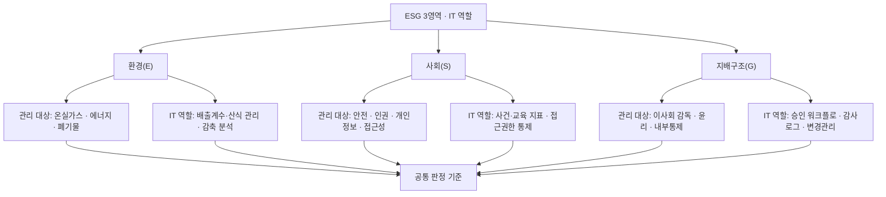
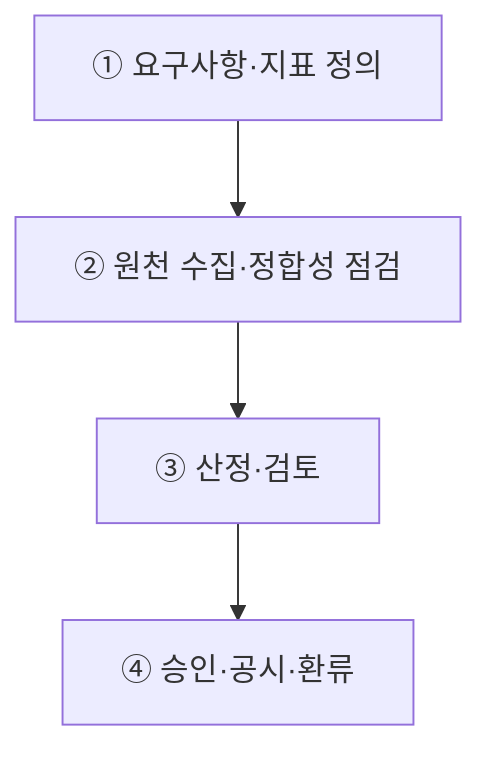
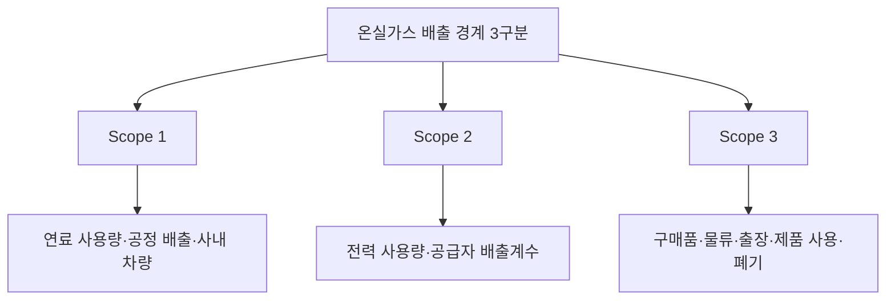
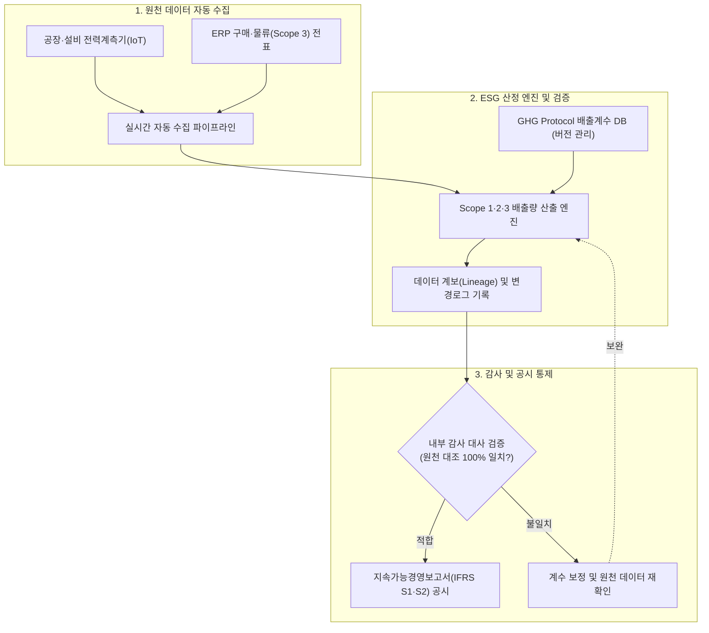

## 지식 로드맵 내 현재 위치

지식 위치: IT 전략·관리 → 지속가능 경영 → **ESG 경영과 IT**

## 30초 인출

- 본질: **ESG(Environmental, Social, Governance)**는 환경·사회·지배구조 위험과 기회가 기업에 미치는 영향을 경영 의사결정과 공시에 반영하는 관점이다.
- 메커니즘: 공시 요구사항 정의 → 원천 데이터 수집 → 산정·검증 → 승인·공시 → 목표·통제 환류한다.
- 산출물: ESG 지표 사전 · 온실가스 인벤토리 · 증빙·승인 이력 · 지속가능성 공시한다.

핵심 용어

- **ESG(Environmental, Social, Governance)**: 환경·사회·지배구조 위험과 기회를 경영 의사결정에 반영하는 관점이다.
- **ISSB(International Sustainability Standards Board)**: IFRS 지속가능성 공시기준을 제정하는 국제 기준 제정기구다.
- **IFRS S1**: 일반목적재무보고 이용자의 판단에 유용한 지속가능성 관련 재무정보의 일반 요구사항을 정한다.
- **IFRS S2**: 기업의 기후 관련 위험과 기회를 공시하기 위한 요구사항을 정한다.
- **GHG Protocol(Greenhouse Gas Protocol)**: 기업이 온실가스 배출량을 산정·분류·보고할 때 사용하는 표준 체계다.
- **Scope 1·2·3**: 직접배출, 구매 에너지에 따른 간접배출, 가치사슬의 그 밖의 간접배출을 구분하는 체계다.

## 예상문제

> ESG(Environment, Social, Governance) 경영에 대하여 설명하시오. 가. ESG 경영의 정의 및 목표 나. ESG 경영의 주요 지표 다. ESG 경영 목표 달성을 지원하기 위한 정보기술(IT) (제134회 정보관리기술사 2교시)

## Ⅰ. ESG 경영과 IT의 개요

- 정의: 기업의 비재무적 가치인 **환경(E)·사회(S)·지배구조(G)** 요소를 경영 의사결정과 공시에 반영하고, IT를 통해 데이터 수집·산정·검증의 **신뢰성(Data Lineage)**을 보장하는 경영 활동
- 목적: 기후·사회적 규제 리스크를 선제 통제하고 투명한 공시 증적을 확보하여 기업의 지속가능성을 달성하는 것

## Ⅱ. E·S·G 영역별 IT 역할

> 영역별 데이터와 통제 대상은 다르지만 공통 판정 기준은 **원천 근거**·책임자·**산식**·**변경 이력**을 추적할 수 있는지 여부임.

## Ⅲ. ESG 데이터 관리 흐름

> 공시 수치의 신뢰성은 최신 대시보드보다 원천에서 공시 항목까지 이어지는 데이터 계보와 재수행 가능한 산식으로 판정함.

| 단계 | 활동 | 산출 |
|---|---|---|
| ① 요구사항·지표 정의 | 적용 기준·중요 정보·조직경계/산정경계 결정 | 지표 사전·책임자·보고경계 |
| ② 원천 수집·정합성 점검 | 설비·업무시스템·협력사 자료 수집·누락/중복 점검 | 원천 데이터·품질 결과·증빙 링크 |
| ③ 산정·검토 | 배출계수·단위·환산식 적용·이전 기간 대비 변동 분석 | 지표 집계값·산식 버전·검토 이력 |
| ④ 승인·공시·환류 | 책임자 승인·공시 항목 연결·편차 원인 반영 | 공시 정보·감사증빙·개선 과제 |

## Ⅳ. 온실가스 Scope와 공시기준 적용

> Scope 분류는 배출원의 위치가 아니라 보고기업의 소유·통제와 **가치사슬** 관계로 구분하며, 공시 의무는 각 관할권의 채택 범위를 별도로 확인해야 함.

- **IFRS S1·S2**: **ISSB** 기준 자체의 효력일과 국내 의무 적용 시기는 구분하며, 적용 대상·시점은 관할권 결정 확인
- **GHG Protocol**: 조직경계·운영경계와 배출계수의 출처·버전을 함께 관리

## Ⅴ. ESG 데이터의 문제점·대응책

> 자동 수집만으로 신뢰성이 생기지 않으므로 경계·산식·증빙·승인의 통제를 함께 설계해야 함.

| 위험 | 대책 | 효과 |
|---|---|---|
| **경계·원천 누락** | 법인·사업장·가치사슬 범위와 책임자 등록 | 누락 식별 · 재집계 범위 명확화 |
| **산식·배출계수 불일치** | 단위·계수 출처·유효기간·버전 통제 | 기간·조직 간 수치 불일치 제거 |
| **협력사 자료 품질 편차** | 입력 규칙·증빙 첨부·표본 검토 | Scope 3 추정 근거 강화 |

## Ⅵ. 결론 — 감사 가능한 ESG 데이터 운영

> 플랫폼 도입보다 **지표 소유자**와 **데이터 계보**를 먼저 확정하고 고위험 지표부터 통제 수준을 높여야 함.

### 실전 답안용 기술사적 제언

- 문제: ESG 공시 데이터가 수작업 엑셀 취합에 의존하여 배출계수 왜곡 및 원천 증적 부재가 발생하고, 그린워싱(Greenwashing) 리스크와 외부 감사 불응 위험이 가중됨.
- 해결 방안: IoT/SCADA 및 ERP 연계 기반의 실시간 데이터 파이프라인을 구축하고, 온실가스 배출량 산식 버전 관리와 감사로그 기반 데이터 계보(Data Lineage) 추적 체계를 제도화함.

## 1교시 10점 답안 발췌

### 1. 정의·목적

- 정의: **ESG(Environmental, Social, Governance)**는 환경·사회·지배구조 위험과 기회를 경영 의사결정과 공시에 반영하는 비재무적 경영 관점
- 목적: 기후·사회적 규제 리스크 선제 대응 및 데이터 신뢰성 확보를 통한 기업 가치 제고

### 2. E·S·G 영역별 IT 역할

### 3. 핵심 공시 및 데이터 통제 방안

- **공시 표준 준수**: ISSB IFRS S1·S2 및 GHG Protocol 기반 Scope 1·2·3 경계 정의
- **데이터 계보(Data Lineage)**: 원천 데이터 수집부터 산출·공시까지 전 구간 감사 추적성 확보

## 출제 이력과 검증 출처

- 한국산업인력공단 Q-Net, [제134회 정보관리기술사 문제지](https://www.q-net.or.kr/cst006.do?artlSeq=5213580&brdId=Q006&gSite=Q&id=cst00602)
- IFRS Foundation, [IFRS S1 General Requirements for Disclosure of Sustainability-related Financial Information](https://www.ifrs.org/issued-standards/ifrs-sustainability-standards-navigator/ifrs-s1-general-requirements/)
- IFRS Foundation, [IFRS S2 Climate-related Disclosures](https://www.ifrs.org/issued-standards/ifrs-sustainability-standards-navigator/ifrs-s2-climate-related-disclosures/)
- GHG Protocol, [Corporate Value Chain (Scope 3) Accounting and Reporting Standard](https://ghgprotocol.org/corporate-value-chain-scope-3-standard)

## 학습 체크

- [ ] Ⅰ: ESG의 정의·목적과 IT가 필요한 이유를 설명할 수 있는가?
- [ ] Ⅱ: E·S·G 세 영역을 각각 관리 대상·IT 역할 두 하위 박스로 분기하고, 공통 판정 기준(원천 근거·책임자·산식·변경 이력)으로 모으는 트리를 재현할 수 있는가?
- [ ] Ⅲ: 요구사항·지표 정의부터 승인·공시·환류까지 네 단계의 활동·산출을 한 쌍으로 연결할 수 있는가?
- [ ] Ⅳ: Scope 1·2·3을 보고경계 기준으로 나누고 각 경계의 데이터 예시를 하위 박스로 재현할 수 있는가?
- [ ] Ⅴ: ESG 데이터 위험 세 가지와 대책·효과를 1:1로 대응시킬 수 있는가?
- [ ] Ⅵ: 실시간 데이터 파이프라인과 데이터 계보를 적용한 기술사적 문제 해결 방안을 제시할 수 있는가?

## 연결 토픽

- 이전 토픽: [BPR](./010_bpr.md)
- 연관 토픽: [ISO/IEC 38500](./002_iso_iec_38500.md), [FinOps](./012_finops.md)
- 다음 토픽: [FinOps](./012_finops.md)
