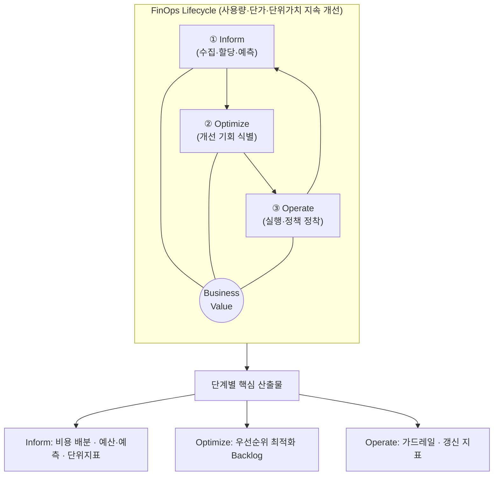
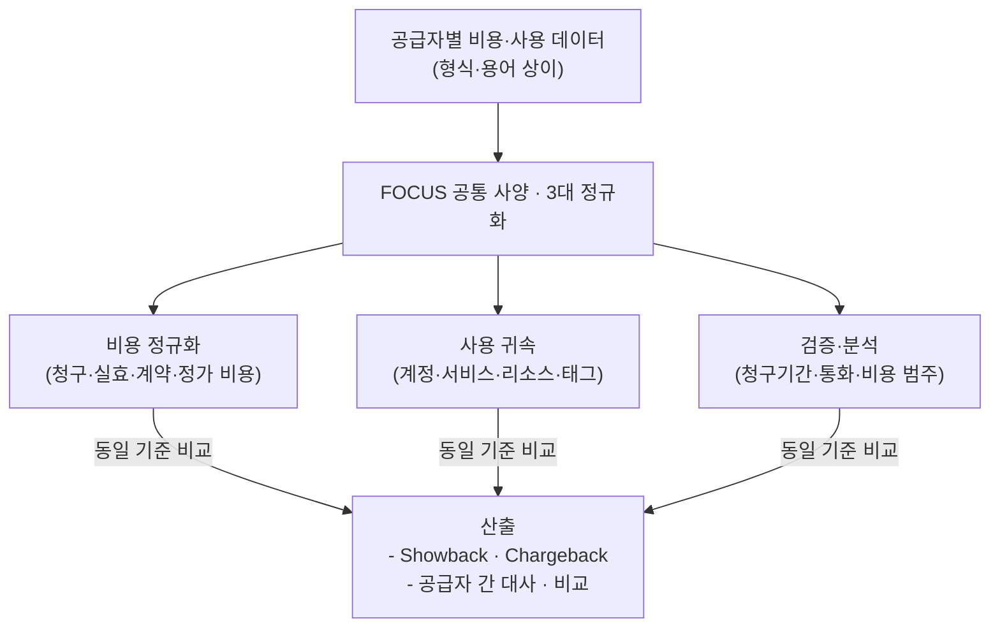
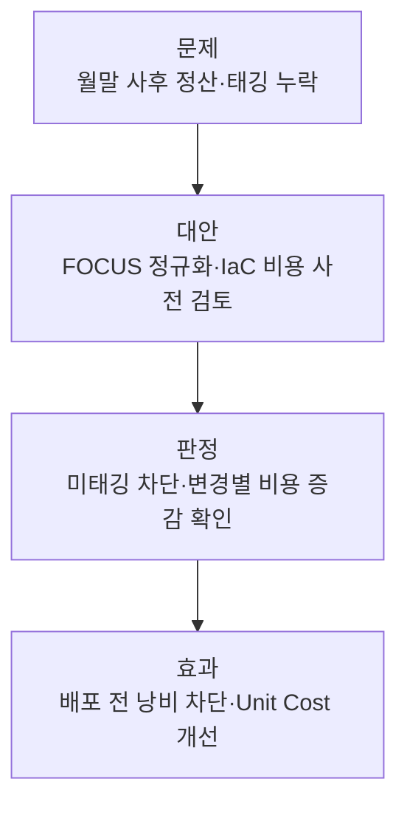

## 지식 로드맵 내 현재 위치

  IT 전략·관리
  클라우드 전략·재무
  <strong>FinOps</strong>

## 30초 인출

- 본질: **FinOps**는 엔지니어링·재무·비즈니스가 기술 사용과 비용의 책임을 공유하여 비즈니스 가치를 높이는 운영 프레임워크·문화
- 메커니즘: Inform → Optimize → Operate를 반복하며 사용량·단가·단위가치를 지속 개선
- 산출물: 할당된 비용 데이터 · 최적화 실행안 · 단위비용 지표 · 운영 정책

## 핵심 용어

핵심 용어

- **FinOps**: Finance와 DevOps의 합성어로, 기술 사용의 비즈니스 가치와 재무 책임을 높이는 운영 프레임워크·문화
- **FOCUS(FinOps Open Cost and Usage Specification)**: 기술 비용·사용 데이터를 공통 구조로 표현하는 공개 사양
- **Inform**: 기술 사용·비용·가치 데이터를 수집·할당·분석하는 단계
- **Optimize**: 사용량·단가·아키텍처의 개선 기회를 식별·우선순위화하는 단계
- **Operate**: 개선안을 실행하고 정책·자동화·책임체계로 정착시키는 단계
- **Rightsizing**: 워크로드의 실제 성능 요구량에 맞춰 인스턴스 크기와 사양을 재조정하는 기법
- **RI(Reserved Instances)**: 일정 기간 사용을 약정하여 온디맨드 대비 높은 할인율을 적용받는 구매 옵션
- **Savings Plans(절약 플랜)**: 시간당 일정 금액 지출을 약정하여 유연한 인스턴스 할인을 받는 가격 모델
- **Unit Economics(단위 경제성)**: 활성 사용자당 서버비, 결제 건당 인프라 비용 등 비즈니스 단위 성과와 비용을 결합한 지표
- **Shift-Left FinOps**: 인프라 배포 후 청구서를 보던 관행에서 벗어나 코드 작성 및 CI/CD 단계에서 비용을 사전 검증하는 기법

## 예상문제

> FinOps의 개념·원칙·3단계 라이프사이클을 설명하고 FOCUS 적용과 조직 정착방안을 제시하시오. (미출제 예상)

## Ⅰ. 기술 비용을 비즈니스 가치로 전환하는 FinOps의 개요

> **FinOps**는 비용 절감 조직이 아니라 기술 사용의 가치·속도·재무 책임을 함께 다루는 협업 운영체계임

- 정의: 엔지니어링·재무·비즈니스가 기술 사용과 비용의 책임을 공유하여 지출을 **비즈니스 가치** 기준으로 판단하는 운영 프레임워크·문화
- 목적: **데이터 기반 의사결정** · **단위비용** 기준 투자 판단

## Ⅱ. FinOps 라이프사이클·핵심 활동

> **Inform** → **Optimize** → **Operate**는 성숙도 순서가 아니라 각 조직·기술 범위에서 빠르게 반복하는 개선 주기이며, 한 바퀴의 성과는 다음 Inform의 입력이 되어야 환류가 성립함

## Ⅲ. 클라우드 비용 데이터 공통 사양 FOCUS

> **FOCUS(FinOps Open Cost and Usage Specification)**는 공급자마다 다른 비용·사용 데이터를 공통 구조로 표현하여 멀티클라우드 비용의 할당·대사·비교를 지원함. 최적화 판단은 이 공통 데이터와 함께 서비스 맥락·성능·계약 조건을 별도로 고려해야 함

## Ⅳ. FinOps vs 전통적 IT 재무관리(ITFM) 비교

> 전통적 **ITFM(IT Financial Management)**의 예산 집행 관점에 기술 사용량·단가·가치의 지속 피드백을 결합함

| 비교축 | 전통적 IT 재무관리(ITFM) | FinOps |
|---|---|---|
| 주기 | 연간·분기 예산 중심 | **지속 측정·개선** |
| 책임 | 재무·구매 중심 | 엔지니어링·재무·비즈니스 **공동 책임** |
| 판정 | 예산 대비 집행 | 기술 사용 대비 비즈니스 가치 |

## Ⅴ. FinOps의 문제점·대응책

> 태깅 누락으로 인한 블랙박스 비용을 차단하고, 배포 파이프라인에서 비용 증가를 사전 통제해야 함.

| 위험 | 대책 | 효과 |
|---|---|---|
| 비용 할당 불가 | 태그 강제 정책(**Policy-as-Code**) · FOCUS 기반 비용 배분 규칙 적용 | 미할당 리소스 비용 비율 감소 |
| 최적화 권고 방치 | **Rightsizing** 검토 책임자 지정 · 조치 기한 설정 | 최적화 권고 처리 지연 해소 · 유휴 자원 제거 |
| 약정 할인 과다·미달 | 수요 예측 기반 온디맨드·**약정(RI/SP)**·스팟 최적 포트폴리오 구성 | 약정 자원 유휴 감소 · 미사용 약정비용 억제 |

## Ⅵ. 결론 — Unit Economics 중심의 FinOps

> FinOps의 완성은 단순한 단가 절감이 아니라 트랜잭션당 인프라 비용을 낮춰 비즈니스 수익성을 견인하는 구조를 만드는 데 있음.

### 학습자 통찰 메모 — 답안 밖

- `[핵심 통찰]`: FinOps는 청구액을 줄이는 활동이 아니라 기술 사용량과 비즈니스 성과를 같은 단위로 연결해 더 나은 투자 결정을 만드는 운영 방식임.
- `나라면`: 비용 데이터를 FOCUS 구조로 정규화하고, 배포 전 비용 변화가 허용 범위를 넘으면 검토하도록 정책을 연결하겠음.

### 실전 답안용 기술사적 제언

- 판정: 개발·배포 전에 비용 변화를 예측하고 비즈니스 성과와 연결한 Unit Economics로 판단하는지 확인
- 대안: 비용·사용 데이터를 FOCUS로 정규화하고 IaC 변경에 비용 검토·태그 정책을 연결
- 검증: 미할당 비용·약정 사용·변경별 비용 증감과 단위비용 추세 점검
- 효과: 배포 전 비용 낭비 차단·기술 사용 대비 비즈니스 가치 가시화

## 1교시 10점 답안 발췌

### 1. 정의·목적

- 정의: **FinOps**는 엔지니어링·재무·비즈니스가 기술 사용의 가치를 높이고 재무 책임을 공유하는 운영 프레임워크·문화
- 목적: **데이터 기반 의사결정** · **단위비용** 기준 투자 판단

### 2. 라이프사이클과 단계별 산출물

### 3. 핵심 통제

- **FOCUS(FinOps Open Cost and Usage Specification)**: 공급자별 비용·사용 데이터를 공통 구조로 정규화하여 할당·비교·대사를 지원
- **Shift-Left FinOps**: CI/CD 단계에서 인프라 변경의 비용 영향을 사전 검토

## 출제 이력과 검증 출처

- [FinOps Foundation 공식 프레임워크 (FinOps Framework)](https://www.finops.org/framework/)
- [FinOps Foundation, What is FinOps?](https://www.finops.org/introduction/what-is-finops/)
- [Linux Foundation FOCUS 공식 사양 (FinOps Open Cost and Usage Specification)](https://focus.finops.org/)

## 학습 체크

- [ ] Ⅰ 개요: FinOps를 공동 책임·클라우드 가치·데이터 기반 의사결정으로 정의할 수 있는가?
- [ ] Ⅱ 라이프사이클: Inform·Optimize·Operate를 Business Value 중심의 원형 순환으로 그리고 단계별 산출물 3개를 연결할 수 있는가?
- [ ] Ⅲ FOCUS: 공급자별 데이터 → 정규화 3(비용 정규화·사용 귀속·검증·분석) → Showback·Chargeback 흐름을 재현할 수 있는가?
- [ ] Ⅳ 비교: ITFM과 FinOps의 비용 성격·주기·책임 차이를 설명할 수 있는가?
- [ ] Ⅴ 문제점·대응책: 비용 미할당·권고 방치·약정 불균형의 위험·대책·효과를 연결할 수 있는가?
- [ ] Ⅵ 결론: 비용 판단 시점을 배포 이전으로 옮기는 판정·대안·검증·효과를 제시할 수 있는가?

## 연결 토픽

- 이전 토픽: [ESG 경영과 IT](./011_esg.md)
- 연관 토픽: [공공부문 클라우드 네이티브 전환](./021_public_cloud_native_transition.md), [IT 투자평가·투자관리](./016_it_investment_evaluation.md)
- 다음 토픽: [애자일 대응 전략](./013_agile_response_strategy.md)
