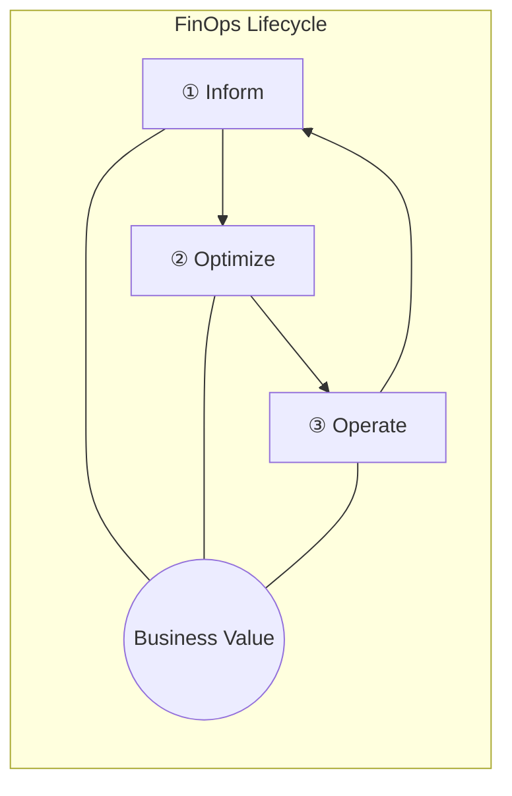
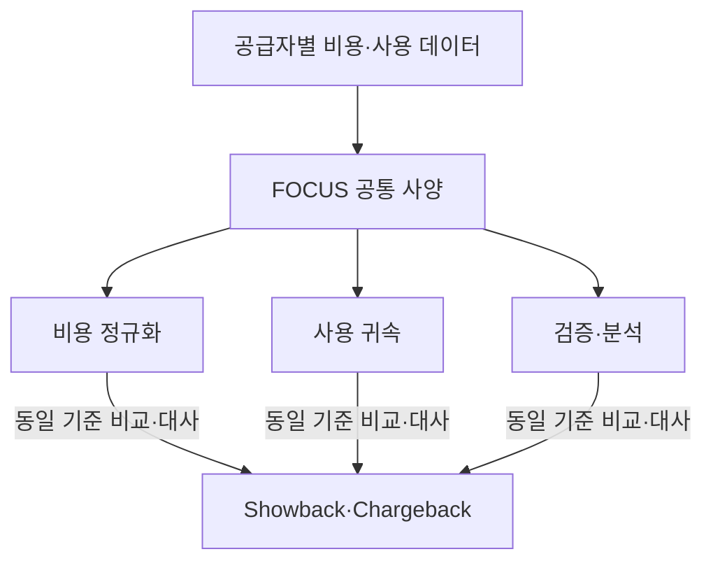
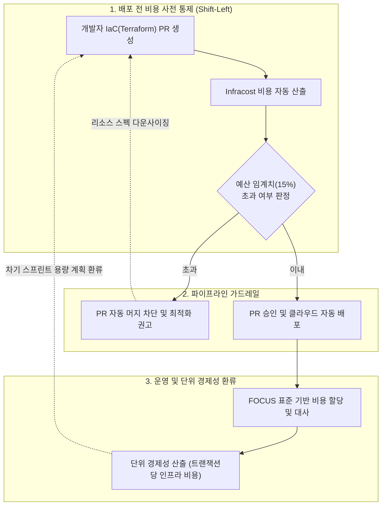

## 지식 로드맵 내 현재 위치

지식 위치: IT 전략·관리 → 클라우드 전략·재무 → **FinOps**

## 30초 인출

- 본질: **FinOps** 는 엔지니어링·재무·비즈니스가 기술 사용과 비용의 책임을 공유하여 비즈니스 가치를 높이는 운영 프레임워크·문화이다.
- 메커니즘: **Inform** → **Optimize** → **Operate** 를 반복하며 사용량·단가·단위가치를 지속 개선한다.
- 산출물: 할당된 비용 데이터 · 최적화 실행안 · 단위비용 지표 · 운영 정책이다.

핵심 용어

- **FinOps** : 엔지니어링·재무·비즈니스 부서가 협력하여 클라우드 비용 책임을 공유하고 비즈니스 가치를 극대화하는 운영 프레임워크
- **FOCUS(FinOps Open Cost and Usage Specification)** : 멀티 클라우드 비용 및 사용량 데이터를 표준화된 공통 스키마로 정의하는 오픈소스 규격
- **Inform(가시화)** : 클라우드 자원 사용량과 비용 데이터를 태깅·수집·배부하여 가시성을 확보하는 1단계
- **Optimize(최적화)** : 자원 라이트사이징, 약정 할인, 아키텍처 개선을 통해 비용 절감 기회를 도출하는 2단계
- **Operate(운영)** : 비용 정책 준수, 지속적 거버넌스, 자동화된 비용 추적 체계를 운영에 정착시키는 3단계
- **Rightsizing** : 워크로드의 실제 부하 패턴에 맞춰 클라우드 인스턴스 크기와 사양을 최적화하는 기법
- **RI(Reserved Instances)** : 일정 기간(1년/3년) 지속 사용을 약정하여 표준 요금 대비 대폭 할인을 적용받는 사전 구매 옵션
- **Savings Plans(절약 플랜)** : 시간당 일정 금액 지출 약정을 통해 인스턴스 패밀리 변경에도 유연하게 할인을 적용받는 요금 모델
- **Unit Economics(단위 경제성)** : 활성 사용자당 인프라 비용, 거래 건당 클라우드 원가 등 비즈니스 성과 단위와 비용을 결합한 핵심 지표
- **Shift-Left FinOps** : 사후 청구서 분석을 넘어 코드 작성(IaC) 및 CI/CD 배포 단계에서 인프라 비용을 사전 시뮬레이션·검증하는 엔지니어링 실천법

## 예상문제

> FinOps의 개념·원칙·3단계 라이프사이클을 설명하고 FOCUS 적용과 조직 정착방안을 제시하시오. (미출제 예상)

## Ⅰ. FinOps의 개요

- 정의: 클라우드 지출의 가치를 극대화하기 위해 엔지니어링, 재무, 비즈니스 조직이 협업하여 **재무적 책임(Financial Accountability)** 을 공유하고 데이터 기반의 빠른 의사결정을 실천하는 **운영 프레임워크이자 문화**
- 목적: 클라우드 비용의 투명한 가시성 확보 및 단위 경제성(Unit Economics) 기반의 비즈니스 가치 극대화

## Ⅱ. FinOps 라이프사이클·핵심 활동

> **Inform** → **Optimize** → **Operate** 는 성숙도 순서가 아니라 각 조직·기술 범위에서 빠르게 반복하는 개선 주기이며, 한 바퀴의 성과는 다음 Inform의 입력이 되어야 환류가 성립함

- Inform: 비용 배분 · 예산·예측 · 단위지표
- Optimize: 우선순위 최적화 Backlog
- Operate: 가드레일 · 갱신 지표

## Ⅲ. 클라우드 비용 데이터 공통 사양 FOCUS

> **FOCUS(FinOps Open Cost and Usage Specification)** 는 공급자마다 다른 비용·사용 데이터를 공통 구조로 표현하여 멀티클라우드 비용의 할당·대사·비교를 지원함. 최적화 판단은 이 공통 데이터와 함께 서비스 맥락·성능·계약 조건을 별도로 고려해야 함

| 정규화 축 | 대상 |
|---|---|
| 비용 정규화 | 청구·실효·계약·정가 비용 |
| 사용 귀속 | 계정·서비스·리소스·태그 |
| 검증·분석 | 청구기간·통화·비용 범주 |

## Ⅳ. FinOps vs 전통적 IT 재무관리(ITFM) 비교

> 전통적 **ITFM(IT Financial Management)** 의 예산 집행 관점에 기술 사용량·단가·가치의 지속 피드백을 결합함

| 비교축 | 전통적 IT 재무관리(ITFM) | FinOps |
|---|---|---|
| 주기 | 연간·분기 예산 중심 | **지속 측정·개선** |
| 책임 | 재무·구매 중심 | 엔지니어링·재무·비즈니스 **공동 책임** |
| 판정 | 예산 대비 집행 | 기술 사용 대비 비즈니스 가치 |

## Ⅴ. FinOps의 문제점·대응책

> 태깅 누락으로 인한 블랙박스 비용을 차단하고, 배포 파이프라인에서 비용 증가를 사전 통제해야 함.

| 위험 | 대책 | 효과 |
|---|---|---|
| 비용 할당 불가 | 태그 강제 정책( **Policy-as-Code** ) · FOCUS 기반 비용 배분 규칙 적용 | 미할당 리소스 비용 비율 감소 |
| 최적화 권고 방치 | **Rightsizing** 검토 책임자 지정 · 조치 기한 설정 | 최적화 권고 처리 지연 해소 · 유휴 자원 제거 |
| 약정 할인 과다·미달 | 수요 예측 기반 온디맨드· **약정(RI/SP)** ·스팟 최적 포트폴리오 구성 | 약정 자원 유휴 감소 · 미사용 약정비용 억제 |

## Ⅵ. 결론 — Unit Economics 중심의 FinOps

> FinOps의 완성은 단순한 단가 절감이 아니라 트랜잭션당 인프라 비용을 낮춰 비즈니스 수익성을 견인하는 구조를 만드는 데 있음.

### 실전 답안용 기술사적 제언

- 문제: 클라우드 비용 청구서가 월말 사후에나 확인되어 낭비 자원이 방치되고, 엔지니어링 팀이 비용 책임을 공유하지 않아 클라우드 비용이 통제 불능으로 급증함.
- 해결 방안: CI/CD 파이프라인에서 IaC(Terraform) 변경에 따른 예상 비용을 자동 산출하고 예산 초과 시 배포를 차단하는 Shift-Left FinOps 가드레일을 구축하며, 단위 경제성(Unit Economics) 기반의 쇼백/차지백(Showback/Chargeback) 체계를 정착시킴.

## 1교시 10점 답안 발췌

### 1. 정의·목적

- 정의: **FinOps** 는 엔지니어링·재무·비즈니스가 기술 사용의 가치를 높이고 재무 책임을 공유하는 클라우드 운영 프레임워크이자 문화
- 목적: 클라우드 지출 가시성 확보 및 단위 경제성(Unit Economics) 기반의 비즈니스 가치 극대화

### 2. 라이프사이클과 단계별 산출물

### 3. 핵심 통제 방안

- **FOCUS(FinOps Open Cost and Usage Specification)** : 멀티클라우드 비용 데이터를 공통 사양으로 정규화하여 쇼백/차지백 대사 지원
- **Shift-Left FinOps** : CI/CD 파이프라인에서 배포 전 예상 비용을 선제 검증하고 예산 가드레일 적용

## 출제 이력과 검증 출처

- [FinOps Foundation 공식 프레임워크 (FinOps Framework)](https://www.finops.org/framework/)
- [FinOps Foundation, What is FinOps?](https://www.finops.org/introduction/what-is-finops/)
- [Linux Foundation FOCUS 공식 사양 (FinOps Open Cost and Usage Specification)](https://focus.finops.org/)

## 학습 체크

- [ ] Ⅰ 개요: FinOps를 공동 책임·클라우드 가치·데이터 기반 의사결정으로 정의할 수 있는가?
- [ ] Ⅱ 라이프사이클: Inform·Optimize·Operate를 Business Value 중심의 원형 순환으로 그리고 단계별 산출물 3개를 연결할 수 있는가?
- [ ] Ⅲ FOCUS: 공급자별 데이터 → 정규화 3(비용 정규화·사용 귀속·검증·분석) → Showback·Chargeback 흐름을 재현할 수 있는가?
- [ ] Ⅳ 비교: ITFM과 FinOps의 비용 성격·주기·책임 차이를 설명할 수 있는가?
- [ ] Ⅴ 문제점·대응책: 비용 미할당·권고 방치·약정 불균형의 위험·대책·효과를 연결할 수 있는가?
- [ ] Ⅵ 제언: Shift-Left FinOps 및 단위 경제성을 적용한 기술사적 문제 해결 방안을 제시할 수 있는가?

## 연결 토픽

- 이전 토픽: [ESG 경영과 IT](./011_esg.md)
- 연관 토픽: [공공부문 클라우드 네이티브 전환](./021_public_cloud_native_transition.md), [IT 투자평가·투자관리](./016_it_investment_evaluation.md)
- 다음 토픽: [애자일 대응 전략](./013_agile_response_strategy.md)
