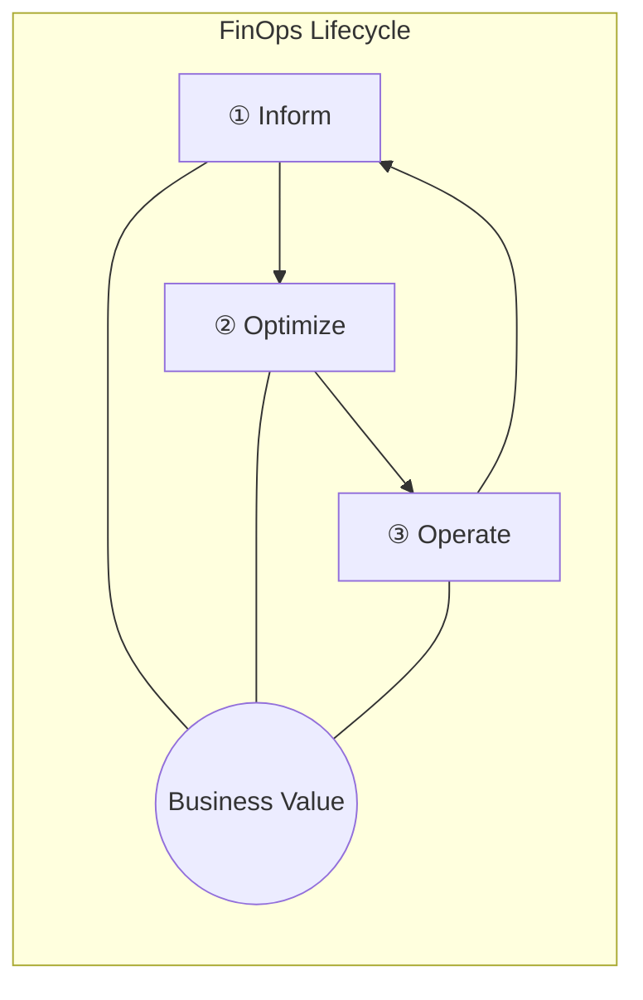

## 지식 로드맵 내 현재 위치

지식 위치: IT 전략·관리 → 클라우드 전략·재무 → **FinOps**

## 30초 인출

- 본질: FinOps는 클라우드 비용을 쓰는 기술팀과 예산을 보는 재무팀이 함께 사용량과 가치를 살펴 낭비를 줄이는 운영 방식이다.
- 메커니즘: **Inform** → **Optimize** → **Operate** 를 반복하며 사용량·단가·단위가치를 지속 개선한다.
- 산출물: 할당된 비용 데이터 · 최적화 실행안 · 단위비용 지표 · 운영 정책이다.

핵심 용어

- **FinOps** : 엔지니어링·재무·비즈니스 부서가 협력하여 클라우드 비용 책임을 공유하고 비즈니스 가치를 극대화하는 운영 프레임워크
- **FOCUS(FinOps Open Cost and Usage Specification)** : 기술 비용·사용 데이터를 공통 형식으로 나타내기 위한 사양
- **Inform(가시화)** : 기술 사용량·비용·가치를 배부·분석해 개선 대상을 찾는 반복 단계
- **Optimize(최적화)** : 사용량·요금·아키텍처 대안을 비교해 개선 방안을 선택하는 반복 단계
- **Operate(운영)** : 선택한 개선안을 실행하고 정책·지표로 효과를 확인하는 반복 단계
- **Rightsizing** : 워크로드의 실제 부하 패턴에 맞춰 클라우드 인스턴스 크기와 사양을 최적화하는 기법
- **Unit Economics(단위 경제성)** : 활성 사용자당 인프라 비용, 거래 건당 클라우드 원가 등 비즈니스 성과 단위와 비용을 결합한 핵심 지표

---

## 1교시 예상문제 (10점)

> FinOps의 개념과 Inform·Optimize·Operate 반복 구조를 설명하시오. (예상·10점)

---

## 1교시 10점 답안

### 1. 정의·목적

- 정의: **FinOps** 는 엔지니어링·재무·비즈니스가 기술 사용의 가치를 높이고 재무 책임을 공유하는 클라우드 운영 프레임워크이자 문화
- 목적: 클라우드 지출 가시성 확보 및 단위 경제성(Unit Economics) 기반의 비즈니스 가치 극대화

### 2. 라이프사이클

### 3. 핵심 통제 방안

- **FOCUS(FinOps Open Cost and Usage Specification)** : 멀티클라우드 비용 데이터를 공통 사양으로 정규화하여 쇼백/차지백 대사 지원
- **Shift-Left FinOps** : CI/CD 파이프라인에서 배포 전 예상 비용을 선제 검증하고 예산 가드레일 적용
- 한 줄 제언: 제품별 비용과 사용가치를 함께 공유하고 최적화 책임을 사업·재무·엔지니어링이 나눈다.

---

## 2~4교시 예상문제 (25점)

> FinOps의 개념·원칙·3단계 라이프사이클을 설명하고 FOCUS 적용과 조직 정착방안을 제시하시오. (미출제 예상·25점)

---

## 2~4교시 25점 답안

## Ⅰ. FinOps의 개요

- 정의: 엔지니어링·재무·비즈니스 조직이 기술 사용량과 비용·가치를 함께 판단하고 개선하는 운영 방식
- 목적: 클라우드 비용의 투명한 가시성 확보 및 단위 경제성(Unit Economics) 기반의 비즈니스 가치 극대화

## Ⅱ. FinOps 라이프사이클·핵심 활동

> **Inform** → **Optimize** → **Operate** 는 성숙도 순서가 아니라 각 조직·기술 범위에서 빠르게 반복하는 개선 주기이며, 한 바퀴의 성과는 다음 Inform의 입력이 되어야 환류가 성립함

- Inform: 비용 배분 · 예산·예측 · 단위지표
- Optimize: 사용량 최적화(불필요 자원·규모)와 요금 최적화(계약·할인)를 나눠 대안 비교
- Operate: 개선 실행 · 정책 가드레일 · 단위비용과 서비스 성과 재측정

## Ⅲ. 비용 데이터 활용

> **FOCUS(FinOps Open Cost and Usage Specification)** 는 공급자마다 다른 비용·사용 데이터를 공통 구조로 표현하여 멀티클라우드 비용의 할당·대사·비교를 지원함. 최적화 판단은 이 공통 데이터와 함께 서비스 맥락·성능·계약 조건을 별도로 고려해야 함

공급자별 비용·사용 데이터를 공통 형식으로 정리하면 배부와 비교가 쉬워진다. **FOCUS** 는 데이터 형식의 차이를 줄이며, 비용 최적화 자체를 대신하지 않는다.

| 데이터·판단 단계 | FOCUS의 역할 | 추가 확인 사항 |
|---|---|---|
| 비용·사용 데이터 수집 | 공급자별 필드를 공통 형식으로 정리 | 누락·중복 데이터 |
| 비용 배부·대사·비교 | 같은 기준으로 서비스별 비용 확인 | 조직·서비스 맥락 |
| 최적화 의사결정 | 비교 가능한 비용 정보를 제공 | 성능·계약 조건·사업 가치 |

## Ⅳ. FinOps vs 전통적 IT 재무관리(ITFM) 비교

> 전통적 **ITFM(IT Financial Management)** 의 예산 집행 관점에 기술 사용량·단가·가치의 지속 피드백을 결합함

| 비교축 | 전통적 IT 재무관리(ITFM) | FinOps |
|---|---|---|
| 주기 | 연간·분기 예산 중심 | **지속 측정·개선** |
| 책임 | 재무·구매 중심 | 엔지니어링·재무·비즈니스 **공동 책임** |
| 판정 | 예산 대비 집행 | 기술 사용 대비 비즈니스 가치 |

## Ⅴ. FinOps의 문제점·대응책

> 기술 사용량과 비용을 함께 보고 조치 책임을 정해야 분석이 실제 개선으로 이어짐.

| 위험 | 대책 | 효과 |
|---|---|---|
| 비용 귀속 불명확 | 사업·제품 단위로 비용 배부 기준과 책임자 지정 | 사용처와 비용 책임 식별 |
| 분석 후 조치 부재 | 최적화 선택·실행 책임을 엔지니어링과 합의 | 분석이 실제 변경으로 연결 |
| 비용 절감이 서비스 가치를 훼손 | 비용·성능·사업성과를 함께 비교 | 가치와 비용의 균형 |

## Ⅵ. 결론 — Unit Economics 중심의 FinOps

> FinOps의 완성은 단순한 단가 절감이 아니라 트랜잭션당 인프라 비용을 낮춰 비즈니스 수익성을 견인하는 구조를 만드는 데 있음.

### 실전 답안용 기술사적 제언

문제: 비용 데이터가 늦게 공유되고 엔지니어링이 비용 책임에서 빠지면 사용량 증가에 제때 대응하기 어렵다. 제언: 제품·업무별 비용을 사용량 및 서비스 성과와 함께 공유하고, 사업·재무·엔지니어링이 최적화 우선순위와 실행 책임을 공동으로 정한다.

| 문제 | 해결 방안 |
|---|---|
| 비용을 사용한 제품·업무를 알기 어려움 | 공통 배부 기준으로 비용을 귀속하고 담당 팀에 적시에 공유 |
| 절감 조치가 서비스 품질을 낮출 수 있음 | 비용만이 아니라 사용량·성능·사업 가치를 함께 비교해 조치 선택 |

## 출제 이력과 검증 출처

- [FinOps Foundation 공식 프레임워크 (FinOps Framework)](https://www.finops.org/framework/)
- [FinOps Foundation, What is FinOps?](https://www.finops.org/introduction/what-is-finops/)
- [Linux Foundation FOCUS 공식 사양 (FinOps Open Cost and Usage Specification)](https://focus.finops.org/)

## 연결 토픽

- 이전 토픽: [ESG 경영과 IT](./011_esg.md)
- 연관 토픽: [공공부문 클라우드 네이티브 전환](./021_public_cloud_native_transition.md), [IT 투자평가·투자관리](./016_it_investment_evaluation.md)
- 다음 토픽: [애자일 대응 전략](./013_agile_response_strategy.md)
