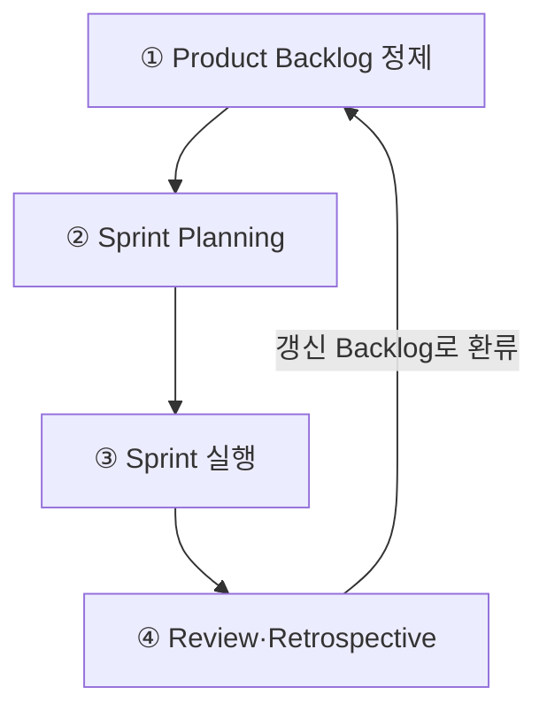
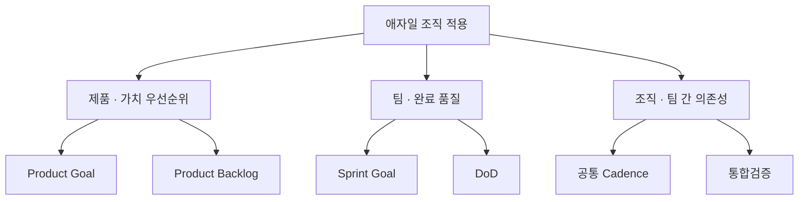

## 지식 로드맵 내 현재 위치

지식 위치: IT 전략·관리 → 개발 전략·방법론 → **애자일 대응 전략**

## 30초 인출

- 본질: **짧은 반복** 마다 작동하는 **증분** 을 검증하고 고객 피드백으로 다음 우선순위를 조정한다.
- 메커니즘: **Product Backlog → Sprint Goal → Increment → Review·Retrospective → Feedback** 을 짧은 주기로 순환한다.
- 판정 기준: **Definition of Done(DoD)** 충족 여부로 완료 품질을 확인하고 범위는 가치 순으로 조정한다.

핵심 용어

- **Agile(애자일)** : 변화에 대한 유연한 대응과 짧은 반복 주기를 통해 작동하는 소프트웨어를 점진 인도하는 개발 패러다임
- **Product Backlog(제품 백로그)** : 제품의 비즈니스 가치와 우선순위에 따라 정렬된 요구사항 및 작업 목록
- **Sprint(스프린트)** : 사전에 확정된 기간(Timebox, 통상 1~4주) 동안 증분을 개발하고 검토하는 반복 주기
- **Sprint Goal(스프린트 목표)** : 해당 스프린트에서 개발팀이 백로그를 구현하여 달성하고자 하는 단일 비즈니스 목표
- **Increment(증분)** : 이전 스프린트 결과물과 통합되어 즉시 배포 가능한 상태(DoD 충족)의 가치 있는 산출물
- **DoD(Definition of Done, 완료 정의)** : 증분이 배포 가능한 품질 기준을 충족했음을 객관적으로 판정하는 공식 수락 기준
- **Bimodal IT(바이모달 IT)** : 안정성 중심의 전통적 IT(Mode 1)와 신속성 중심의 애자일 IT(Mode 2)를 병행하는 운영 전략
- **SAFe(Scaled Agile Framework)** : 엔터프라이즈 전사 단위에서 다수 스크럼 팀의 일정과 의존성을 조율하는 대규모 확장 애자일 프레임워크

## 예상문제

> 애자일 대응 전략의 개념과 반복 구조를 설명하고, 전통적 개발 방식과의 차이 및 대규모 조직 적용 시 문제점과 대응책을 제시하시오. (미출제 예상·25점)

## Ⅰ. 애자일 대응 전략의 개요

- 정의: 불확실하고 급변하는 요구사항에 대응하기 위해 고정된 계획 대신 **짧은 반복(Iteration)** , **작동하는 증분(Increment)** , **지속적 고객 피드백** 을 중심으로 가치를 점진 전달하는 개발 및 프로젝트 관리 전략
- 목적: 비즈니스 가치 조기 실현, 변화 수용 비용 최소화 및 지속적 품질 내재화

## Ⅱ. 구성체계·반복 프로세스

> 백로그 우선순위를 스프린트 목표로 좁히고 DoD를 충족한 증분만 검토하여 다음 주기를 조정함.

| 단계 | 활동 | 산출 |
|---|---|---|
| ① Product Backlog 정제 | 요구 구체화·가치 우선순위 | Product Backlog |
| ② Sprint Planning | 목표 설정·작업 선택 | Sprint Goal·Sprint Backlog |
| ③ Sprint 실행 | 개발·통합·테스트·Daily Scrum | DoD 충족 Increment |
| ④ Review·Retrospective | 증분 검토·방식 개선 | 갱신 Backlog·개선 항목 |

## Ⅲ. 전통적 개발과 애자일 비교

> 두 방식은 우열보다 요구 안정성·검증 주기·계약 조건에 따라 선택·조합해야 함.

| 기준 | 전통적 개발 | 애자일 |
|---|---|---|
| **요구 관리** | 초기 Baseline · 변경통제 | Backlog 지속 정제 |
| **가치 전달** | 단계 종료 후 통합 인도 | 반복마다 Increment 전달 |
| **품질 통제** | 단계별 검토 · 후반 통합시험 | DoD · 지속 통합·시험 |

## Ⅳ. 조직 적용·확장 전략

> 팀의 반복 개발만 복제하지 말고 제품·투자·아키텍처 의사결정까지 같은 주기로 연결해야 함.

- 안정성이 우선인 핵심 업무는 **변경통제** 를 유지하고, 탐색 영역부터 반복 전달 적용
- 다수 팀은 공통 목표·통합주기·아키텍처 원칙만 맞추고 실행 방식은 팀에 위임 → 팀 단위 의사결정의 상위 승인 대기 제거
- **Bimodal IT(바이모달 IT)** · **SAFe(Scaled Agile Framework)** 는 조직 상황에 맞게 선택하는 보조 수단이며 애자일의 필수 구성요소가 아님

## Ⅴ. 문제점·대응책

> 형식적 행사·고정 범위 계약·품질 부채를 통제하지 않으면 반복 속도만 빨라지고 가치는 남지 않음.

| 위험 | 대책 | 효과 |
|---|---|---|
| **형식적 애자일** | 증분 가치·피드백 반영 여부로 성과 판정 | 행사 중심 운영 방지 |
| **고정 범위 계약 충돌** | 목표·기간 고정 · Backlog 범위 조정 규칙 명시 | 변경 분쟁 완화 |
| **기술 부채 누적** | DoD에 시험·보안·문서 기준 포함 | 품질 저하 차단 |

## Ⅵ. 결론 — 속도가 아닌 학습 주기의 통제

> 애자일의 성패는 반복 횟수가 아니라 DoD를 충족한 Increment가 고객 피드백을 거쳐 다음 우선순위를 바꾸는가로 판정함

### 실전 답안용 기술사적 제언

문제: 반복 주기만 운영하고 사용자 검토가 빠지면 요구 불일치를 늦게 발견할 수 있다. 제언: 검토 가능한 제품 증분을 주기적으로 제시하고, 피드백을 다음 우선순위에 반영한다.

| 문제 | 해결 방안 |
|---|---|
| 반복 개발과 사용자 검토가 분리됨 | 검토 가능한 증분을 제시해 사용자 피드백 수렴 |
| 피드백이 다음 작업에 반영되지 않음 | 제품 백로그 우선순위를 조정해 다음 반복에 반영 |

## 1교시 10점 답안 발췌

### 1. 정의·목적

- 정의: 불확실성에 대응하기 위해 **짧은 반복(Iteration)** , **작동하는 증분(Increment)** , **고객 피드백** 을 중심으로 가치를 점진 전달하는 개발 및 프로젝트 관리 전략
- 목적: 비즈니스 가치 조기 전달, 변경 비용 절감 및 지속적 품질 내재화

### 2. 반복 구조 — Feedback Loop

### 3. 핵심 통제 방안

- **Product Backlog** : 고객가치 중심 우선순위 동적 관리
- **Sprint Goal & DoD** : 반복의 목표 고정 및 엄격한 완료 정의(DoD) 기반 품질 게이트 통제
- 한 줄 제언: 짧은 주기의 사용자 피드백을 다음 우선순위와 작업에 반영한다.

## 출제 이력과 검증 출처

- 공식 문제지 원문으로 확인한 직접 기출 없음
- [Agile Manifesto](https://agilemanifesto.org/)
- [The Scrum Guide 2020](https://scrumguides.org/scrum-guide.html)

## 학습 체크

- [ ] Ⅰ: 애자일을 짧은 반복·고객 피드백·작동하는 증분으로 정의할 수 있는가?
- [ ] Ⅱ: ① Backlog 정제부터 ④ Review·Retrospective까지 네 단계의 활동·산출을 한 쌍으로 재현하고, Review 결과가 Backlog로 환류하는 고리를 그릴 수 있는가?
- [ ] Ⅲ: 전통적 개발과 애자일을 요구 관리·가치 전달·품질 통제 세 축으로 비교할 수 있는가?
- [ ] Ⅳ: 제품·팀·조직 세 수준의 핵심 통제와 각 수준의 적용 방식 2개씩을 트리로 재현할 수 있는가?
- [ ] Ⅴ: 형식화·계약 충돌·기술 부채의 위험·대책·효과 세 쌍을 연결할 수 있는가?
- [ ] Ⅵ: DoD 기반의 자동화 테스트와 백로그 환류를 적용한 기술사적 문제 해결 방안을 제시할 수 있는가?

## 연결 토픽

- 이전 토픽: [FinOps](./012_finops.md)
- 연계 토픽: [WBS](./007_wbs.md), [PMO](./004_pmo.md)
- 다음 토픽: [IT 투자평가·투자관리](./016_it_investment_evaluation.md)
