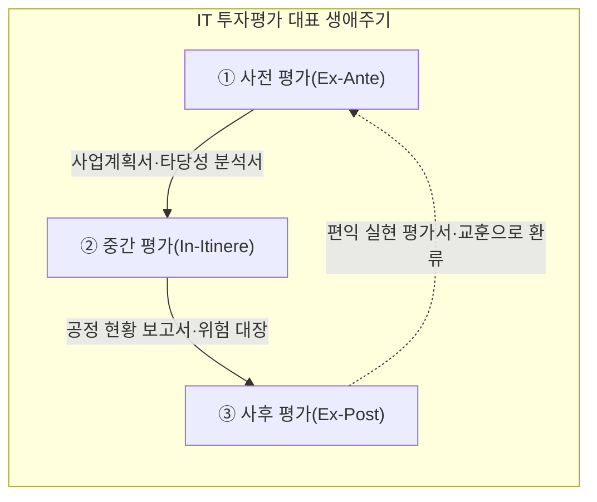
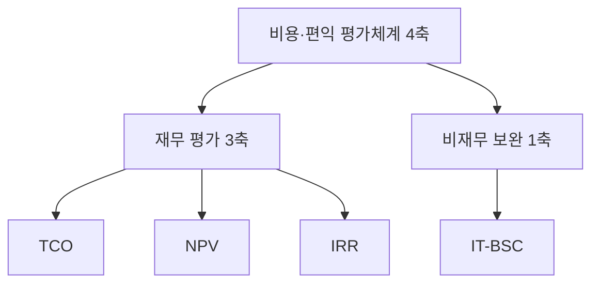
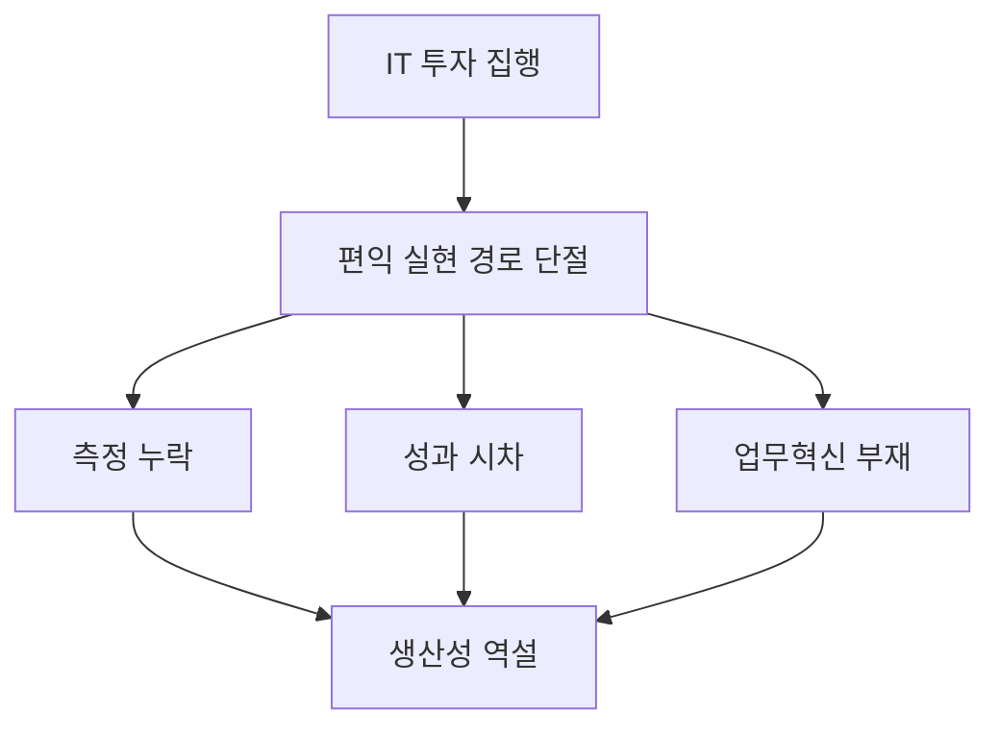
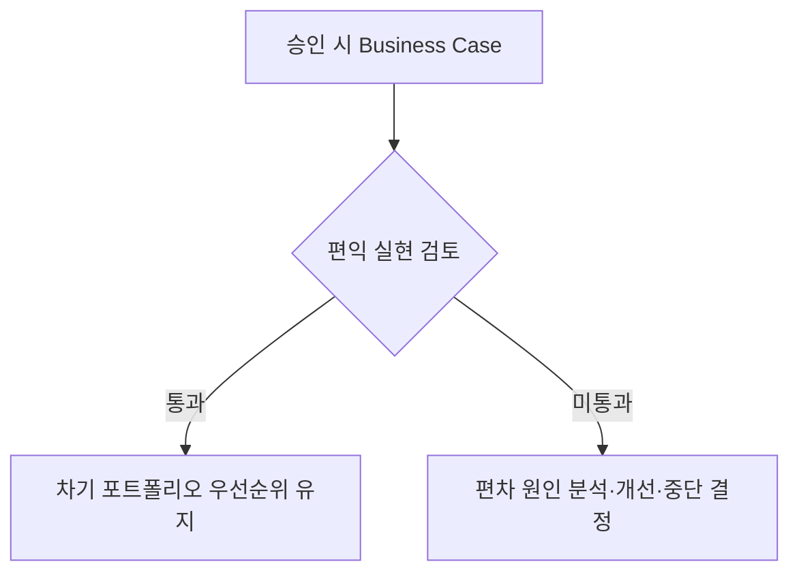

## 지식 로드맵 내 현재 위치

지식 위치: IT 전략·관리 → 투자·포트폴리오 관리 → **IT 투자평가·투자관리**

## 30초 인출

- 본질: 투자 승인보다 **비용·위험·편익**을 전 생애주기에서 검증하는 가치관리이다.
- 메커니즘: 사전 타당성 → 중간 집행통제 → 사후 편익검증 → 차기 투자 환류한다.
- 판정 기준: **TCO·NPV·IRR**로 재무성을 판단하고 **IT-BSC**로 비재무 가치를 보완한다.

## 핵심 용어

핵심 용어

- **IT 투자평가**: 전 생애주기에서 IT 비용과 기대 편익을 측정하고 투자 가치를 지속 관리하는 활동이다.
- **Productivity Paradox(생산성의 역설)**: IT 투자 규모는 커졌지만 거시적 생산성 향상이 통계상 뚜렷하게 나타나지 않는 현상이다.
- **TCO(Total Cost of Ownership)**: 도입 구매비와 운영·유지보수·다운타임 등 수명주기 비용을 합산한 총소유비용이다.
- **ROI(Return on Investment)**: 투자 비용 대비 순편익의 비율로, 화폐의 시간가치는 반영하지 않는 지표다.
- **NPV(Net Present Value)**: 미래 현금유입의 현재가치에서 현금유출의 현재가치를 차감한 순현재가치다.
- **IRR(Internal Rate of Return)**: NPV를 0으로 만드는 할인율이며 자본비용보다 높을 때 투자 매력이 있다고 판단한다.
- **EVM(Earned Value Management)**: 계획 가치(PV), 획득 가치(EV), 실제 원가(AC)를 대비하여 공정·예산을 실측 통제하는 기법. 이는 해당 용어의 역할과 작동을 설명한다.
- **IT-BSC(IT Balanced Scorecard)**: 기업 공헌·사용자·운영 우수성·미래지향 관점에서 IT 투자의 전략 정렬을 평가하는 균형성과표. 이는 해당 용어의 역할과 작동을 설명한다.
- **Val IT**: IT 투자의 비즈니스 가치 창출을 보증하기 위해 ISACA가 제정한 거버넌스 프레임워크. 이는 해당 용어의 역할과 작동을 설명한다.
- **Benefits Realization Review(편익 실현 검토)**: 시스템 운영 후 실제 편익과 비즈니스 목표 달성 여부를 계획값과 비교하는 사후 평가. 이는 해당 용어의 역할과 작동을 설명한다.

## 예상문제

> IT 투자평가의 생애주기와 평가기법을 설명하고, IT 생산성 역설의 문제점과 대응책을 제시하시오. **(미출제 예상·25점)**

## Ⅰ. IT 생산성 역설을 극복하는 IT 투자평가의 개요

> IT 투자평가는 IT 자본 배분의 정당성을 입증하고 전 생애주기 편익을 통제하며, 성패는 단순 시스템 개통이 아닌 **비즈니스 가치 실현율**로 판정함.

- 정의: 투자 대안의 **비용·위험·편익**을 비교하고 **생애주기** 동안 가치 실현을 통제하는 활동
- 목적: 투자 우선순위 결정 · 예산 낭비 방지 · **편익 실현**

## Ⅱ. IT 투자평가의 대표 생애주기

> 사전·중간·사후 평가는 투자관리의 대표 흐름이며, 조직의 의사결정 체계에 맞춰 활동·산출을 구체화함.

| 단계 | 활동 |
|---|---|
| ① 사전 평가(Ex-Ante) | 타당성 검토·우선순위 도출·TCO 산출·재무 분석(NPV/IRR) |
| ② 중간 평가(In-Itinere) | EVM 공정/예산 실측·마일스톤 감리·사업 지속성 심의 |
| ③ 사후 평가(Ex-Post) | 편익 실현율 검증·생산성 역설 진단·차기 계획 환류 |

## Ⅲ. 비용·편익 평가체계

> 초기 구축비뿐 아니라 운영·전환·중단 비용과 화폐의 시간가치를 함께 반영해야 하며, 재무 3축 **TCO**·**NPV**·**IRR**만으로는 잡히지 않는 가치는 **IT-BSC(IT Balanced Scorecard)**로 보완해야 판정이 닫힘.

| 기법 | 판정 기준 |
|---|---|
| TCO(총소유비용) | 구축·운영·전환·중단을 포함한 생애주기 총비용 최소화 |
| NPV(순현재가치) | 할인된 현금유입 − 유출 > 0 |
| IRR(내부수익률) | NPV=0이 되는 할인율 > 자본비용 |
| IT-BSC(IT 균형성과표) | 기업 공헌·사용자·운영 우수성·미래지향의 전략 정렬 검증 |

## Ⅳ. IT 생산성 역설의 원인·대응

> IT 투자가 성과로 보이지 않는 원인을 측정·시차·업무혁신 관점에서 분리해야 하며, 세 지점 중 어디가 끊겼는지 지목하지 못하면 대응은 구호로 끝남.

| 원인 | 대응 | 효과 |
|---|---|---|
| **측정 누락** | IT-BSC로 품질·고객 가치 보완 | 비재무 편익 가시화 |
| **성과 시차** | 단계별 목표와 사후 편익 추적 | 조기 단정 방지 |
| **업무혁신 부재** | BPR·변화관리 병행 | 자동화 효과 실현 |

## Ⅴ. IT 투자관리의 문제점·대응책

> 사전 평가의 장밋빛 왜곡과 사후 평가 부재를 방지하려면 승인 시 Business Case를 운영 후 실측 편익과 대조하는 판정 지점을 제도화해야 함.

| 위험 | 대책 | 효과 |
|---|---|---|
| **구축 후 운영비 폭증** | 생애주기 TCO(직접비·간접비·전환비·중단비용) 산정 | 운영비 누락 감소 |
| **사후 편익 평가 부재** | 운영 안정화 후 편익 실현 검토 시점·책임자 지정 | 목표 대비 편익 편차 확인 |
| **무형 가치 산정 왜곡** | AHP 다기준 평가 · IT-BSC로 평가 근거 기록 | 정성 평가 근거 사후 추적 가능 |

## Ⅵ. 결론 — 가치 거버넌스 중심의 투자관리

> IT 투자평가의 본질은 사업 착수를 승인받기 위한 장밋빛 보고서가 아니라 시스템 수명주기 내내 실제 업무 생산성과 비즈니스 편익을 증명하는 거버넌스 과정임.

### 학습자 통찰 메모 — 답안 밖

- `[핵심 통찰]`: IT 투자 실패는 기술 부족보다 승인 당시 Business Case와 운영 후 실측 편익이 단절되는 데서 발생한다. 승인 문서와 실측 결과를 대조할 주체가 없으면 생산성 역설은 원인 규명 없이 반복된다.
- `나라면`: 투자 승인 시 편익 책임자·측정 시점·중단 기준을 함께 확정하고, 사후 검토 결과를 다음 포트폴리오 우선순위 심의의 필수 입력으로 쓰겠다.

### 실전 답안용 기술사적 제언

- 판정: 승인 시 Business Case와 운영 후 실측 비용·편익·위험이 일치하는지 확인
- 대안: 생애주기 TCO와 NPV·IRR·IT-BSC를 결합하고 편익 책임자·측정 시점 지정
- 검증: 중간에는 EVM으로 집행을 확인하고 사후에는 편익 실현 검토로 목표 대비 편차 점검
- 효과: 부적격 투자 조기 조정과 차기 포트폴리오 판단 근거 확보

## 1교시 10점 답안 발췌

### 1. 정의·목적

- 정의: **비용·위험·편익**을 비교하고 생애주기 동안 가치 실현을 통제하는 활동
- 목적: 투자 우선순위 결정 · 예산 낭비 방지 · 편익 실현

### 2. 투자평가 3단계와 산출

### 3. 핵심 통제

- **TCO(Total Cost of Ownership)**: 도입비뿐 아니라 운영·전환·중단 비용을 생애주기 관점에서 계상
- 편익 실현 검토: 운영 안정화 후 Business Case와 실측 편익을 대조해 차기 투자에 환류

## 출제 이력과 검증 출처

- [ISACA Glossary: Val IT](https://www.isaca.org/resources/glossary)
- [NIA 국가정보화백서: 기획·예산·평가 연계](https://www.nia.or.kr/files/ko/nia2009/download/it/87.pdf)

## 학습 체크

- [ ] Ⅰ 개요: IT 투자평가를 전 생애주기 비용·위험·편익 통제로 정의하고 목적을 제시할 수 있는가?
- [ ] Ⅱ 생애주기: 사전·중간·사후 평가를 삼각 순환으로 그리고 각 단계의 활동·산출을 한 쌍으로 재현할 수 있는가?
- [ ] Ⅲ 평가체계: 재무 3축(TCO·NPV·IRR)과 비재무 보완 1축(IT-BSC)을 트리로 묶고 축별 판정 기준을 쓸 수 있는가?
- [ ] Ⅳ 생산성 역설: 측정 누락·성과 시차·업무혁신 부재의 세 단절 지점과 대응·효과를 연결할 수 있는가?
- [ ] Ⅴ 문제점·대응책: 편익 실현 검토의 통과·미통과 분기를 그리고 운영비 누락·사후평가 부재·무형가치 왜곡의 위험·대책·효과를 연결할 수 있는가?
- [ ] Ⅵ 결론: Business Case와 실측 편익을 연결한 판정·대안·검증·효과를 제시할 수 있는가?

## 연결 토픽

- 이전 토픽: [애자일 대응 전략](./013_agile_response_strategy.md)
- 연관 토픽: [BSC](./017_bsc.md), [FinOps](./012_finops.md), [ISMP](./001_ismp.md)
- 다음 토픽: [BSC](./017_bsc.md)
