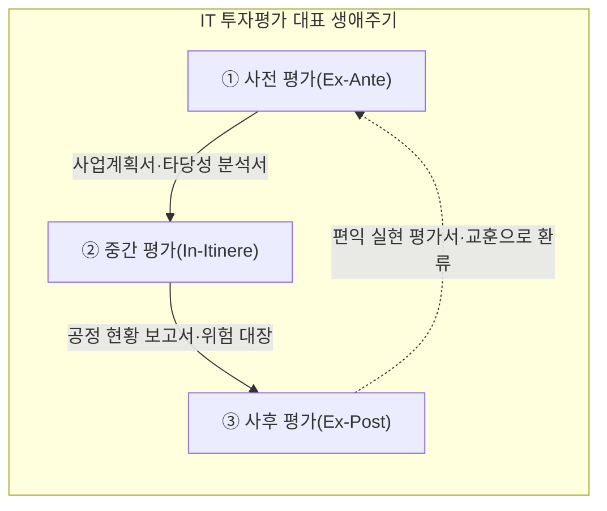
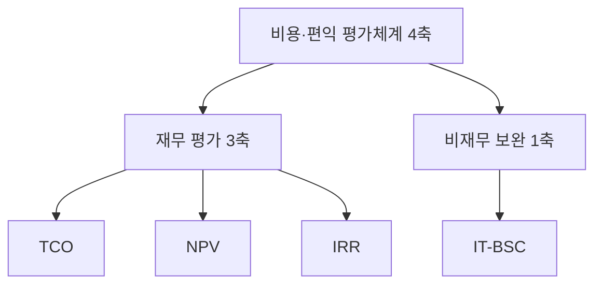
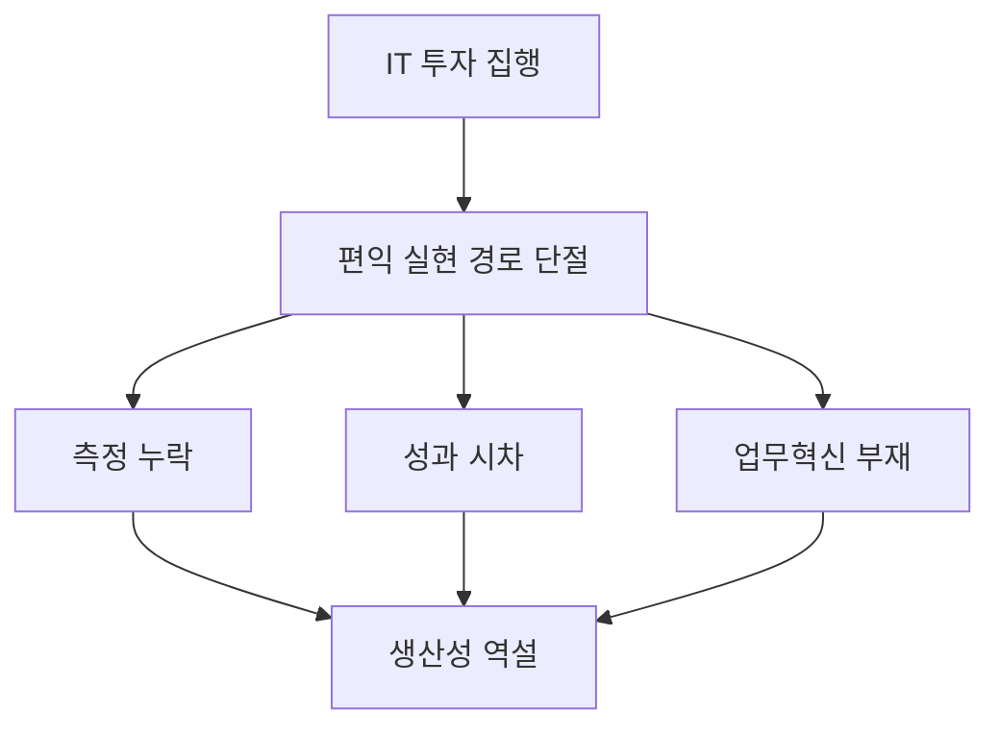
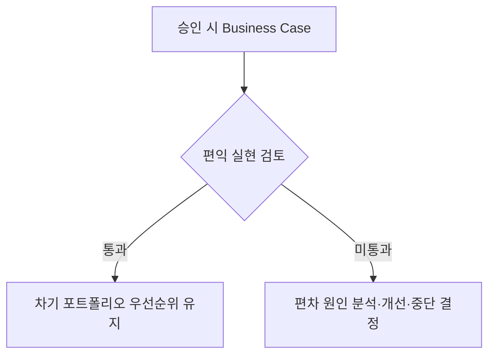
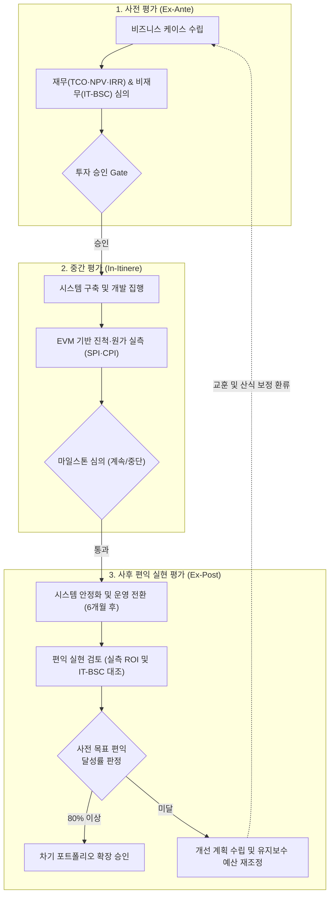

## 지식 로드맵 내 현재 위치

지식 위치: IT 전략·관리 → 투자·포트폴리오 관리 → **IT 투자평가·투자관리**

## 30초 인출

- 본질: 투자 승인보다 **비용·위험·편익** 을 전 생애주기에서 검증하는 가치관리이다.
- 메커니즘: 사전 타당성 → 중간 집행통제 → 사후 편익검증 → 차기 투자 환류한다.
- 판정 기준: **TCO·NPV·IRR** 로 재무성을 판단하고 **IT-BSC** 로 비재무 가치를 보완한다.

핵심 용어

- **IT 투자평가** : 전 생애주기(사전·중간·사후)에 걸쳐 IT 비용과 편익 및 위험을 측정·통제하는 가치 거버넌스 활동
- **Productivity Paradox(생산성의 역설)** : IT 투자의 급격한 증가에도 불구하고 기업 및 국가 차원의 생산성 향상이 뚜렷하게 나타나지 않는 현상
- **TCO(Total Cost of Ownership)** : 초기 획득 비용과 운영·유지보수·폐기 등 수명주기 전체에 걸쳐 발생하는 직·간접 비용의 총합
- **ROI(Return on Investment)** : 투자 비용 대비 회수되는 순이익의 비율을 백분율로 나타낸 단순 투자수익률 지표
- **NPV(Net Present Value)** : 현금 유입의 현재가치에서 현금 유출의 현재가치를 차감한 순현재가치
- **IRR(Internal Rate of Return)** : 순현재가치(NPV)를 0으로 만드는 할인율로서 기대수익률을 의미하는 내부수익률
- **EVM(Earned Value Management)** : 계획 가치(PV)·획득 가치(EV)·실제 원가(AC)를 비교하여 사업의 공정과 원가를 정량 통제하는 기법
- **IT-BSC(IT Balanced Scorecard)** : 기업 기여·사용자·내부 프로세스·미래 지향 관점에서 IT 전략 정렬 및 성과를 측정하는 균형성과표
- **Val IT** : IT 투자 관리, 포트폴리오 관리, 편익 실현을 체계화한 ISACA의 IT 투자 거버넌스 프레임워크
- **Benefits Realization Review(편익 실현 검토)** : 시스템 가동 후 계획된 비즈니스 편익의 실현 여부와 목표 달성도를 측정·환류하는 사후 평가

## 예상문제

> IT 투자평가의 생애주기와 평가기법을 설명하고, IT 생산성 역설의 문제점과 대응책을 제시하시오. (미출제 예상·25점)

## Ⅰ. IT 투자평가·투자관리의 개요

- 정의: IT 투자 의사결정의 합리성을 확보하고 비즈니스 가치를 극대화하기 위해 정보시스템 전 생애주기(사전-중간-사후)에 걸쳐 **비용·위험·편익** 을 종합 측정·통제하는 **가치 거버넌스 활동**
- 목적: IT 투자 우선순위 결정, 예산 낭비 차단 및 IT 생산성 역설(Productivity Paradox) 극복

## Ⅱ. IT 투자평가의 대표 생애주기

> 사전·중간·사후 평가는 투자관리의 대표 흐름이며, 조직의 의사결정 체계에 맞춰 활동·산출을 구체화함.

| 단계 | 활동 |
|---|---|
| ① 사전 평가(Ex-Ante) | 타당성 검토·우선순위 도출·TCO 산출·재무 분석(NPV/IRR) |
| ② 중간 평가(In-Itinere) | EVM 공정/예산 실측·마일스톤 감리·사업 지속성 심의 |
| ③ 사후 평가(Ex-Post) | 편익 실현율 검증·생산성 역설 진단·차기 계획 환류 |

## Ⅲ. 비용·편익 평가체계

> 초기 구축비뿐 아니라 운영·전환·중단 비용과 화폐의 시간가치를 함께 반영해야 하며, 재무 3축 **TCO** · **NPV** · **IRR** 만으로는 잡히지 않는 가치는 **IT-BSC(IT Balanced Scorecard)** 로 보완해야 판정이 닫힘.

| 기법 | 판정 기준 |
|---|---|
| TCO(총소유비용) | 구축·운영·전환·중단을 포함한 생애주기 총비용 최소화 |
| NPV(순현재가치) | 할인된 현금유입 − 유출 > 0 |
| IRR(내부수익률) | NPV=0이 되는 할인율 > 자본비용 |
| IT-BSC(IT 균형성과표) | 기업 공헌·사용자·운영 우수성·미래지향의 전략 정렬 검증 |

## Ⅳ. IT 생산성 역설의 원인·대응

> IT 투자가 성과로 보이지 않는 원인을 측정·시차·업무혁신 관점에서 분리해야 하며, 세 지점 중 어디가 끊겼는지 지목하지 못하면 대응은 구호로 끝남.

| 원인 | 대응 | 효과 |
|---|---|---|
| **측정 누락** | IT-BSC로 품질·고객 가치 보완 | 비재무 편익 가시화 |
| **성과 시차** | 단계별 목표와 사후 편익 추적 | 조기 단정 방지 |
| **업무혁신 부재** | BPR·변화관리 병행 | 자동화 효과 실현 |

## Ⅴ. IT 투자관리의 문제점·대응책

> 사전 평가의 장밋빛 왜곡과 사후 평가 부재를 방지하려면 승인 시 Business Case를 운영 후 실측 편익과 대조하는 판정 지점을 제도화해야 함.

| 위험 | 대책 | 효과 |
|---|---|---|
| **구축 후 운영비 폭증** | 생애주기 TCO(직접비·간접비·전환비·중단비용) 산정 | 운영비 누락 감소 |
| **사후 편익 평가 부재** | 운영 안정화 후 편익 실현 검토 시점·책임자 지정 | 목표 대비 편익 편차 확인 |
| **무형 가치 산정 왜곡** | AHP 다기준 평가 · IT-BSC로 평가 근거 기록 | 정성 평가 근거 사후 추적 가능 |

## Ⅵ. 결론 — 가치 거버넌스 중심의 투자관리

> IT 투자평가의 본질은 사업 착수를 승인받기 위한 장밋빛 보고서가 아니라 시스템 수명주기 내내 실제 업무 생산성과 비즈니스 편익을 증명하는 거버넌스 과정임.

### 실전 답안용 기술사적 제언

- 문제: 사업 승인을 위해 사전 타당성 분석에서 기대 편익이 과대 포장되고, 구축 완료 후 실질적 편익 실현 검토가 누락되어 막대한 IT 투자에도 생산성 향상이 체감되지 않는 생산성 역설이 발생함.
- 해결 방안: 사업 승인 시 수립한 비즈니스 케이스(Business Case)를 기준으로 운영 6개월/1년 차에 사후 편익 실현 검토(Benefits Realization Review)를 의무화하고, IT-BSC 기반의 정량/정성 성과 미달 시 개선 또는 차기 투자 중단(Kill Switch)을 연계하는 투자 거버넌스를 구축함.

## 1교시 10점 답안 발췌

### 1. 정의·목적

- 정의: IT 투자 의사결정의 합리성을 확보하고 비즈니스 가치를 극대화하기 위해 정보시스템 전 생애주기 동안 **비용·위험·편익** 을 종합 평가·통제하는 활동
- 목적: 투자 우선순위 결정, 예산 낭비 방지 및 실질적 비즈니스 편익 실현

### 2. 투자평가 3단계와 산출

### 3. 핵심 통제 방안

- **생애주기 TCO** : 구축비뿐 아니라 운영·유지보수·전환·폐기 비용까지 총소유비용에 반영
- **편익 실현 검토(BRR)** : 구축 후 Business Case 대비 실제 비즈니스 편익 달성도를 대조해 차기 투자 우선순위에 환류

## 출제 이력과 검증 출처

- [ISACA Glossary: Val IT](https://www.isaca.org/resources/glossary)
- [NIA 국가정보화백서: 기획·예산·평가 연계](https://www.nia.or.kr/files/ko/nia2009/download/it/87.pdf)

## 학습 체크

- [ ] Ⅰ 개요: IT 투자평가를 전 생애주기 비용·위험·편익 통제로 정의하고 목적을 제시할 수 있는가?
- [ ] Ⅱ 생애주기: 사전·중간·사후 평가를 삼각 순환으로 그리고 각 단계의 활동·산출을 한 쌍으로 재현할 수 있는가?
- [ ] Ⅲ 평가체계: 재무 3축(TCO·NPV·IRR)과 비재무 보완 1축(IT-BSC)을 트리로 묶고 축별 판정 기준을 쓸 수 있는가?
- [ ] Ⅳ 생산성 역설: 측정 누락·성과 시차·업무혁신 부재의 세 단절 지점과 대응·효과를 연결할 수 있는가?
- [ ] Ⅴ 문제점·대응책: 편익 실현 검토의 통과·미통과 분기를 그리고 운영비 누락·사후평가 부재·무형가치 왜곡의 위험·대책·효과를 연결할 수 있는가?
- [ ] Ⅵ 제언: Business Case와 실측 편익 실현 검토(BRR)를 연계한 기술사적 문제 해결 방안을 제시할 수 있는가?

## 연결 토픽

- 이전 토픽: [애자일 대응 전략](./013_agile_response_strategy.md)
- 연관 토픽: [BSC](./017_bsc.md), [FinOps](./012_finops.md), [ISMP](./001_ismp.md)
- 다음 토픽: [BSC](./017_bsc.md)
