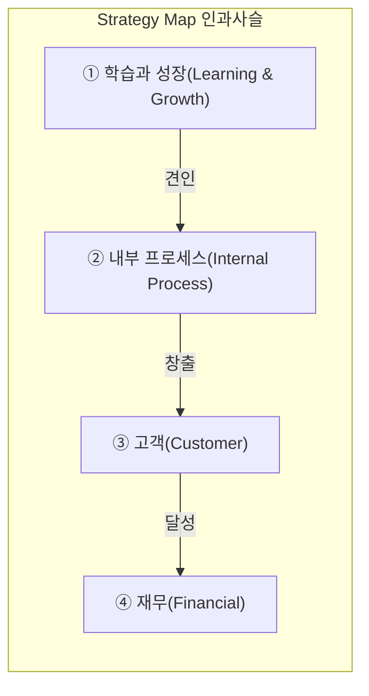
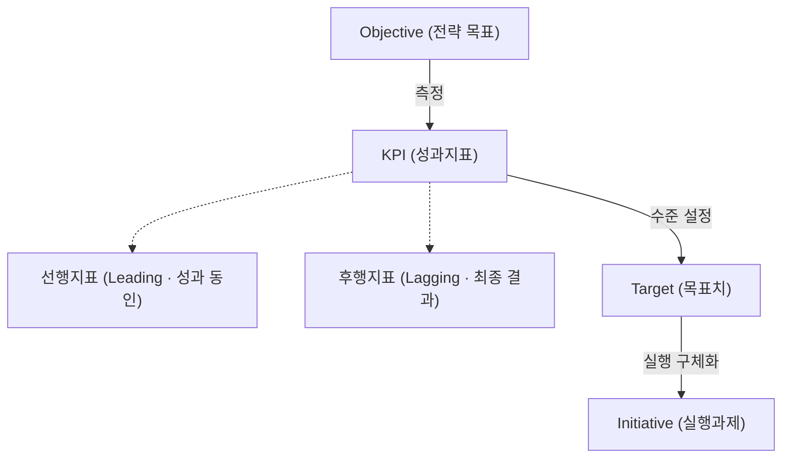
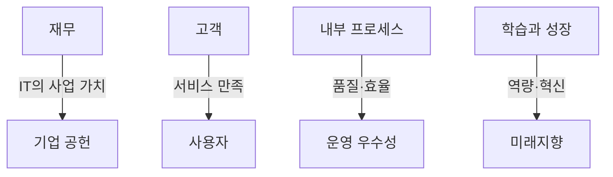
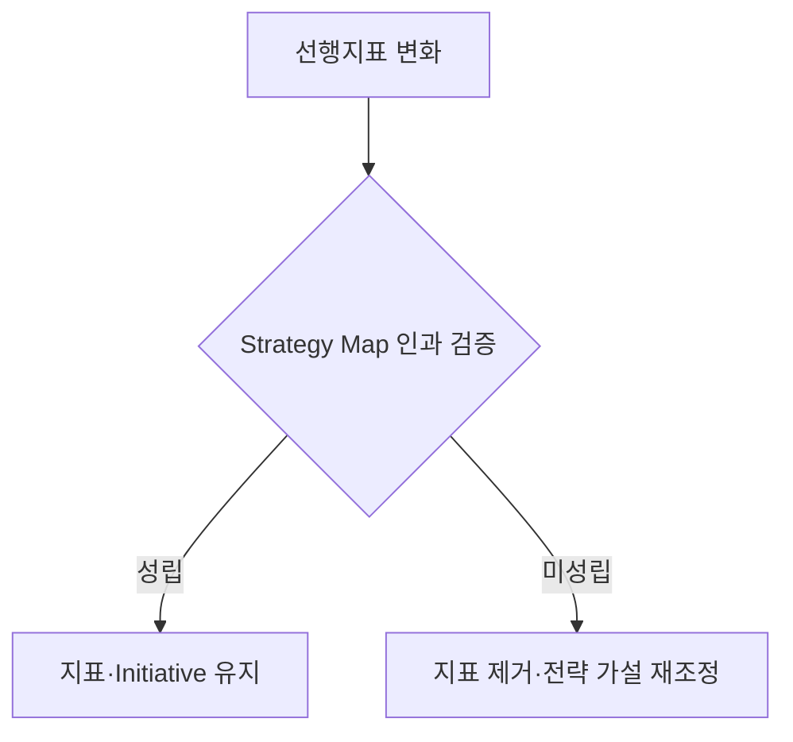
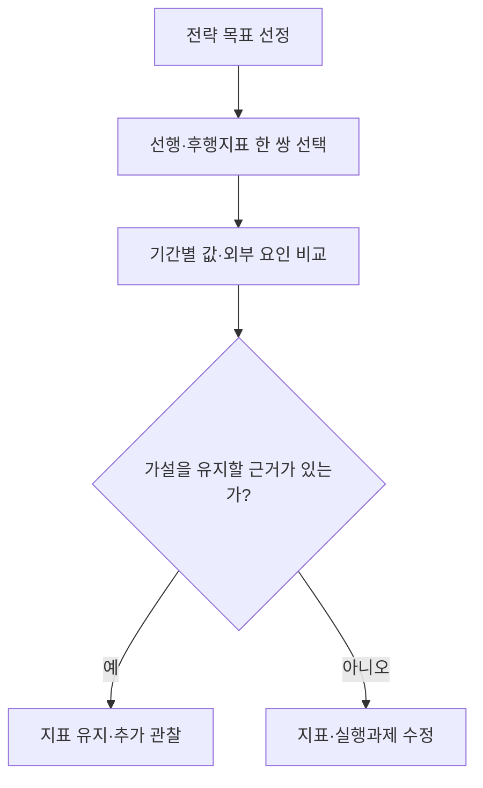

## 지식 로드맵 내 현재 위치

지식 위치: IT 전략·관리 → 경영 전략·성과관리 → **BSC**

## 30초 인출

- 본질: BSC(Balanced Scorecard, 균형성과표)는 재무 결과뿐 아니라 고객 만족, 업무 과정, 구성원의 성장도 함께 살펴 전략이 성과로 이어지는지 관리하는 방법이다.
- 메커니즘: 학습·성장 역량이 내부 프로세스를 바꾸고 고객·재무 성과로 이어지는 인과관계를 검증한다.
- 산출물: **Strategy Map** , 목표·지표·목표치· **Initiative** 이다.

핵심 용어

- **BSC(Balanced Scorecard)** : 재무·고객·내부 프로세스·학습과 성장의 4대 관점을 인과사슬로 연결한 균형 성과관리 프레임워크
- **Strategy Map(전략 체계도)** : 4대 관점의 전략 목표 간 인과관계를 단절 없는 시각적 흐름으로 표현한 전략 맵
- **IT-BSC** : 기업 공헌·사용자·내부 프로세스·미래 지향 관점에서 IT 부서의 전략 정렬과 성과를 측정하는 모델
- **선행지표(Leading Indicator)** : 직원 교육 시간, 개발 리드타임 등 미래 성과 달성을 견인하는 성과 동인 지표
- **후행지표(Lagging Indicator)** : 매출액, 영업이익률 등 과거 활동의 최종 결과를 사후에 나타내는 결과 지표
- **CSF(Critical Success Factor)** : 비전 및 전략 목표 달성을 위해 반드시 성공시켜야 하는 핵심 성공 요인
- **KPI(Key Performance Indicator)** : CSF의 달성 수준을 객관적·정량적으로 측정하기 위한 핵심 성과 지표
- **Initiative(실행 과제)** : 목표 KPI를 달성하기 위해 예산과 인력을 투입하여 실행하는 구체적 추진 프로젝트

---

## 1교시 예상문제 (10점)

> BSC의 네 관점과 전략 목표의 인과관계를 설명하시오. (예상·10점)

---

## 1교시 10점 답안

### Ⅰ. 개요

| 구분 | 핵심 |
|---|---|
| 정의 | **BSC** 는 전략 목표를 재무·고객·내부 프로세스·학습과 성장의 네 관점으로 연결해 관리하는 성과관리 체계다. |
| 목적 | 재무·비재무 성과를 균형 있게 관리해 전략 실행을 돕는다. |

### Ⅱ. 4대 관점의 인과사슬과 산출

### Ⅲ. 핵심 통제 방안

| 적용 도구 | 확인할 관계 |
|---|---|
| **Strategy Map** | 학습·프로세스의 선행지표가 고객·재무 성과로 이어지는지 검증 |
| **IT-BSC** | IT 활동을 기업 공헌·사용자·운영·미래 관점으로 평가 |

**제언:** 전략목표와 연결되지 않는 지표는 재검토하고 결과를 실행과제에 반영한다.

---

## 2~4교시 예상문제 (25점)

> BSC(Balanced Scorecard)의 개념과 4대 관점의 인과관계를 설명하고, IT-BSC 적용 및 운영상 문제점과 대응책을 제시하시오. (미출제 예상·25점)

---

## 2~4교시 25점 답안

## Ⅰ. BSC의 개요

| 구분 | 핵심 |
|---|---|
| 정의 | **BSC** 는 전략 목표를 재무·고객·내부 프로세스·학습과 성장의 네 관점으로 연결해 관리하는 성과관리 체계다. |
| 목적 | 재무·비재무 성과를 균형 있게 관리해 전략 실행을 돕는다. |

## Ⅱ. BSC 4대 관점 구성체계와 상향식 인과사슬

> 역량과 인프라(학습·성장)가 갖추어져야 프로세스가 혁신되고, 우수한 프로세스가 고객을 만족시켜 최종 재무 성과를 견인하는 사슬을 형성함.

| 관점 | 활동 예 | 산출(대표 지표) |
|---|---|---|
| ① 학습과 성장 | 핵심 역량 교육·IT 신기술 인프라 확충·학습 문화 | 직원 역량 지수·클라우드 도입률 |
| ② 내부 프로세스 | 운영 프로세스 혁신·사이클 타임 단축·품질 관리 | 개발 리드타임 단축·무장애 가동률 |
| ③ 고객 | 고객 만족도 제고·브랜드 신뢰도 구축·고객 유치 | 순추천지수(NPS) 향상·이탈률 감소 |
| ④ 재무 | 매출 성장·운영 원가 절감·주주가치 제고 | 영업이익률·ROI·EVA |

## Ⅲ. BSC 구성요소

> 각 관점은 전략 목표를 **KPI(Key Performance Indicator)** · 목표치 · 실행과제로 전개하는 같은 문법으로 설계하며, 측정 단계에서 **선행지표(Leading)** · **후행지표(Lagging)** 쌍을 배치해야 인과 검증이 가능함.

선행지표가 좋아졌다고 후행 성과가 자동으로 개선되는 것은 아니다. 예를 들어 교육 이수 후 업무 처리시간과 고객 만족도가 함께 변했는지 확인해 전략지도에 그린 인과 가설을 검증한다.

## Ⅳ. 일반 경영 BSC와 IT-BSC의 관점 대응

> **IT-BSC** 는 IT 조직을 단순한 **비용 센터(Cost Center)** 가 아닌 전략적 **가치 창출자(Value Enabler)** 로 재정의함.

## Ⅴ. BSC 운영의 문제점·대응책

> 지표 난립과 인과 단절로 인한 평가 무용화를 방어하기 위해 선행지표의 변화가 후행지표로 이어지는지 먼저 판정하고, 통과하지 못한 지표는 관점에서 제거해야 함.

| 위험 | 대책 | 효과 |
|---|---|---|
| **관점 간 인과관계 단절** | 전략 체계도(Strategy Map) 의무화로 'If-Then' 인과 연계 검증 | 관점 간 연결 누락 차단 |
| **측정 지표 과다** | 전략 목표별 소수 KPI 선정 · 중복 지표 제거 | 핵심 과제 집중 · 관리부담 감소 |
| **목표치 왜곡·실적 조작** | 선행·후행지표 결합 · 산식·원천 검증 | 지표 조작 가능성 완화 |

## Ⅵ. 기술사적 제언 — 선행지표 한 쌍의 인과 가설 검증

> 제안: 전략체계도의 모든 화살표를 인과관계로 단정하지 말고, 중요한 **선행지표·후행지표 한 쌍** 을 골라 기간별 변화를 함께 검토한다.

Ⅴ절은 지표 운영의 여러 문제를 다뤘다. 이 제안은 **전략체계도의 연결 하나를 어떻게 검증할지** 정한다. 동반 변화만으로 인과가 입증되지는 않으므로 외부 요인과 업무 맥락을 함께 본다.

## 출제 이력과 검증 출처

- [Harvard Business Review: The Balanced Scorecard](https://hbr.org/2005/07/the-balanced-scorecard-measures-that-drive-performance)
- [ISACA: COBIT 2019 and the IT Balanced Scorecard](https://www.isaca.org/resources/isaca-journal/issues/2021/volume-3/lost-in-the-woods-cobit-2019-and-the-it-balanced-scorecard)

## 연결 토픽

- 이전 토픽: [IT 투자평가·투자관리](./016_it_investment_evaluation.md)
- 연관 토픽: [SLA](./006_sla.md), [ISO/IEC 38500](./002_iso_iec_38500.md)
- 다음 토픽: [RTO·RPO](./018_rpo.md)
