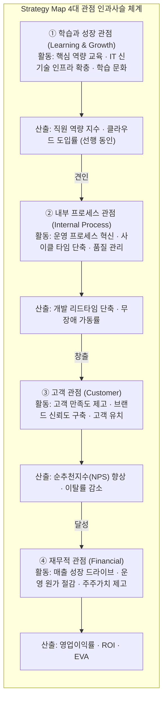
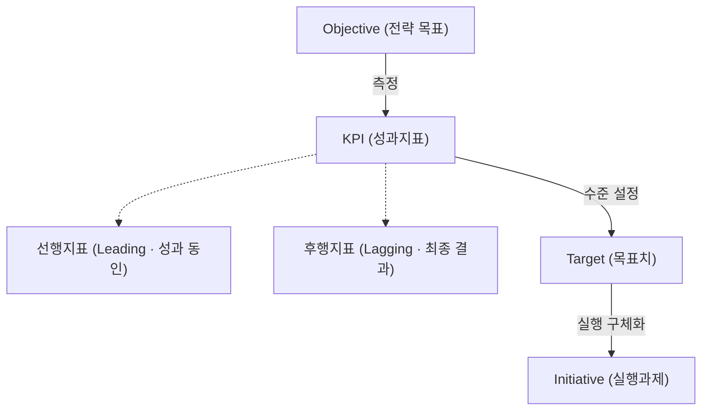
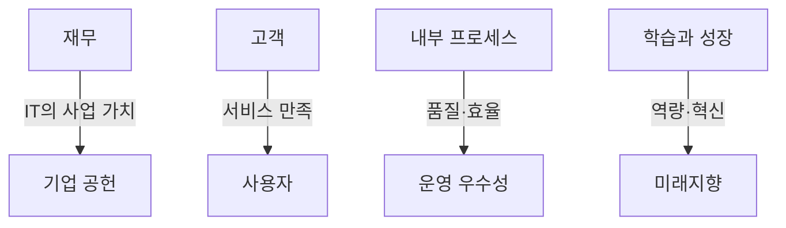
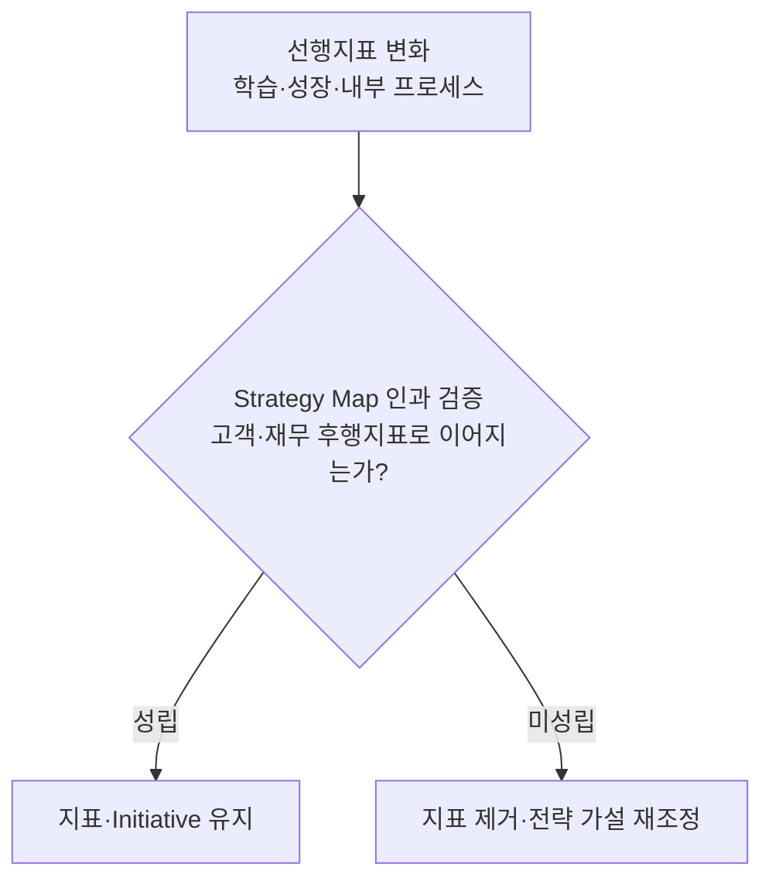
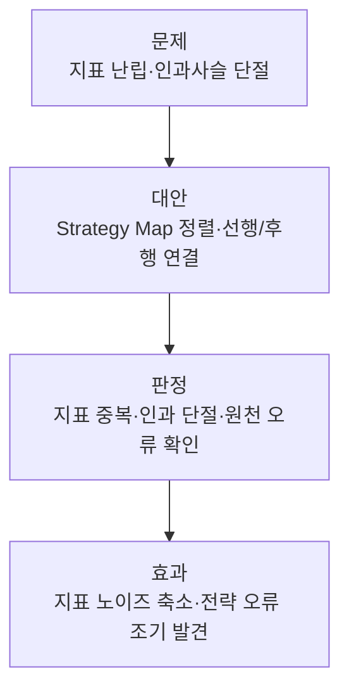

## 지식 로드맵 내 현재 위치

  IT 전략·관리
  경영 전략·성과관리
  <strong>BSC</strong>

## 30초 인출

- 본질: 재무·고객·프로세스·학습성장 관점을 인과관계로 연결한 전략 실행체계
- 메커니즘: 학습·성장 → 내부 프로세스 → 고객 → 재무
- 산출물: **Strategy Map**, 목표·지표·목표치·Initiative

## 핵심 용어

핵심 용어

- **BSC(Balanced Scorecard)**: 재무와 비재무, 단기와 장기, 선행과 후행의 균형을 추구하는 성과관리 체계
- **Strategy Map(전략 체계도)**: 4대 관점의 전략 목표들을 원인과 결과(Cause-and-Effect)의 화살표로 연결한 지도
- **IT-BSC**: 기업공헌도, 사용자, 운영 우수성, 미래지향 관점으로 특화하여 비즈니스 정렬을 측정하는 모델
- **선행지표(Leading Indicator)**: 미래 성과를 유발하는 동인 지표(교육 시간, 리드타임 단축 등)
- **후행지표(Lagging Indicator)**: 최종 달성 결과를 나타내는 결과 지표(매출액, 영업이익률, 고객만족도 등)
- **CSF(Critical Success Factor)**: 전략 목표 달성을 위해 조직이 반드시 탁월하게 수행해야 할 핵심 성공 요인
- **KPI(Key Performance Indicator)**: CSF의 달성도를 정량적으로 측정하기 위해 선정한 핵심 성과 지표
- **Initiative(실행 과제)**: 목표 KPI를 달성하기 위해 예산과 자원을 투입하여 실행하는 구체적인 프로젝트

## 예상문제

> BSC(Balanced Scorecard)의 개념과 4대 관점의 인과관계를 설명하고, IT-BSC 적용 및 운영상 문제점과 대응책을 제시하시오. **(미출제 예상·25점)**

## Ⅰ. 균형 잡힌 전략 실행의 프레임워크, BSC의 개요

> BSC는 단기 재무 지표의 한계를 넘어 **4대 관점**을 **If-Then 인과사슬**로 정렬하며, 성패는 단순 점수 측정이 아닌 전사 전략의 **실행력(Actionability)**으로 판정함.

- 정의: 재무·고객·프로세스·학습성장 관점을 인과관계로 연결해 전략을 목표와 지표로 전환하는 체계
- 목적: 전략 정렬 · 단기 재무 편중 방지 · 전략과 현장 지표의 단절 제거

## Ⅱ. BSC 4대 관점 구성체계와 상향식 인과사슬

> 역량과 인프라(학습·성장)가 갖추어져야 프로세스가 혁신되고, 우수한 프로세스가 고객을 만족시켜 최종 재무 성과를 견인하는 사슬을 형성함.

## Ⅲ. BSC 구성요소

> 각 관점은 전략 목표를 **KPI(Key Performance Indicator)** · 목표치 · 실행과제로 전개하는 같은 문법으로 설계하며, 측정 단계에서 **선행지표(Leading)**·**후행지표(Lagging)** 쌍을 배치해야 인과 검증이 가능함.

## Ⅳ. 일반 경영 BSC와 IT-BSC의 관점 대응

> **IT-BSC**는 IT 조직을 단순한 **비용 센터(Cost Center)**가 아닌 전략적 **가치 창출자(Value Enabler)**로 재정의함.

## Ⅴ. BSC 운영의 문제점·대응책

> 지표 난립과 인과 단절로 인한 평가 무용화를 방어하기 위해 선행지표의 변화가 후행지표로 이어지는지 먼저 판정하고, 통과하지 못한 지표는 관점에서 제거해야 함.

| 위험 | 대책 | 효과 |
|---|---|---|
| **관점 간 인과관계 단절** | 전략 체계도(Strategy Map) 의무화로 'If-Then' 인과 연계 검증 | 관점 간 연결 누락 차단 |
| **측정 지표 과다** | 전략 목표별 소수 KPI 선정 · 중복 지표 제거 | 핵심 과제 집중 · 관리부담 감소 |
| **목표치 왜곡·실적 조작** | 선행·후행지표 결합 · 산식·원천 검증 | 지표 조작 가능성 완화 |

## Ⅵ. 결론 — Strategy Map 중심의 BSC 운영

> BSC의 성공은 연말 점수 산출이 아니라 **선행지표**의 변화가 고객·재무 **후행지표**로 이어지는지를 **Strategy Map**으로 상시 검증하는 운영에 있으며, 검증을 통과하지 못한 지표는 관리 대상에서 덜어 내야 함.

### 학습자 통찰 메모 — 답안 밖

- `[핵심 통찰]`: BSC의 실패는 KPI 수가 부족해서가 아니라 선행지표의 변화가 고객·재무 성과로 이어지는 인과관계를 검증하지 않아서 발생함.
- `나라면`: Strategy Map에 없는 지표는 제거하고, 선행·후행지표의 추세를 주기적으로 검증해 전략 가설이 틀리면 목표와 Initiative를 함께 조정하겠음.

### 실전 답안용 기술사적 제언

- 판정: 선행지표 변화가 고객·재무 후행지표 변화로 이어지는지 확인
- 대안: Strategy Map에 없는 지표를 제거하고 IT-BSC 관점으로 IT 성과를 사업 가치와 연결
- 검증: 선행·후행지표 추세와 Initiative 실행 결과를 함께 점검
- 효과: 지표 난립·평가 왜곡 감소와 전략 가설 오류 조기 발견

## 1교시 10점 답안 발췌

### 1. 정의·목적

- 정의: **BSC(Balanced Scorecard)**는 재무·고객·프로세스·학습성장 관점을 인과관계로 연결한 전략 실행체계
- 목적: 전략 정렬 · 단기 재무 편중 방지 · 전략과 현장 지표의 단절 제거

### 2. 4대 관점의 인과사슬과 산출

### 3. 핵심 통제

- **Strategy Map(전략 체계도)**: 선행지표(학습/프로세스)에서 후행지표(고객/재무)로 이어지는 If-Then 인과관계 검증
- IT-BSC: 기업공헌도, 사용자, 운영 우수성, 미래지향 관점으로 특화하여 IT 거버넌스 확립

## 출제 이력과 검증 출처

- [Harvard Business Review: The Balanced Scorecard](https://hbr.org/2005/07/the-balanced-scorecard-measures-that-drive-performance)
- [ISACA: COBIT 2019 and the IT Balanced Scorecard](https://www.isaca.org/resources/isaca-journal/issues/2021/volume-3/lost-in-the-woods-cobit-2019-and-the-it-balanced-scorecard)

## 학습 체크

- [ ] Ⅰ 개요: BSC를 4대 관점의 전략 실행 체계로 정의하고 목적 세 가지를 쓸 수 있는가?
- [ ] Ⅱ 인과사슬: 학습과 성장 → 내부 프로세스 → 고객 → 재무를 견인·창출·달성 방향으로 그리고 각 관점의 활동·산출을 한 쌍으로 재현할 수 있는가?
- [ ] Ⅲ 구성요소: Objective → KPI → Target → Initiative 전개를 그리고 KPI를 선행지표·후행지표로 분기할 수 있는가?
- [ ] Ⅳ 대응: 일반 BSC 네 관점을 IT-BSC의 기업 공헌·사용자·운영 우수성·미래지향에 초점과 함께 대응시킬 수 있는가?
- [ ] Ⅴ 문제점·대응책: 인과 검증 게이트의 성립·미성립 분기를 그리고 인과 단절·지표 과다·실적 조작의 위험·대책·효과를 연결할 수 있는가?
- [ ] Ⅵ 결론: 인과 검증을 판정으로 삼아 대안·검증·효과를 역산해 제시할 수 있는가?

## 연결 토픽

- 이전 토픽: [IT 투자평가·투자관리](./016_it_investment_evaluation.md)
- 연관 토픽: [SLA](./006_sla.md), [ISO/IEC 38500](./002_iso_iec_38500.md)
- 다음 토픽: [RTO·RPO](./018_rpo.md)
