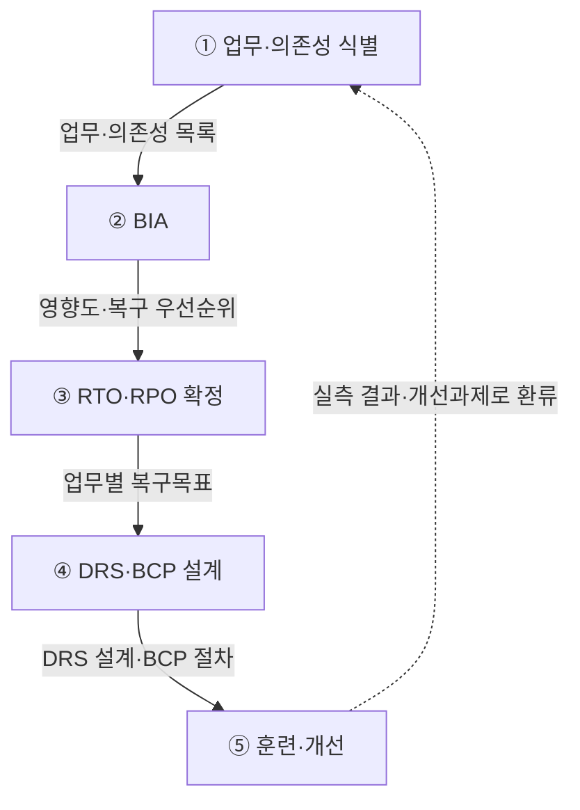
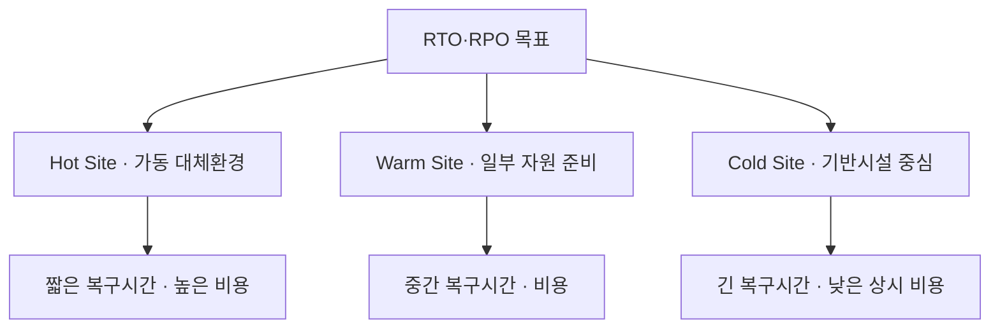
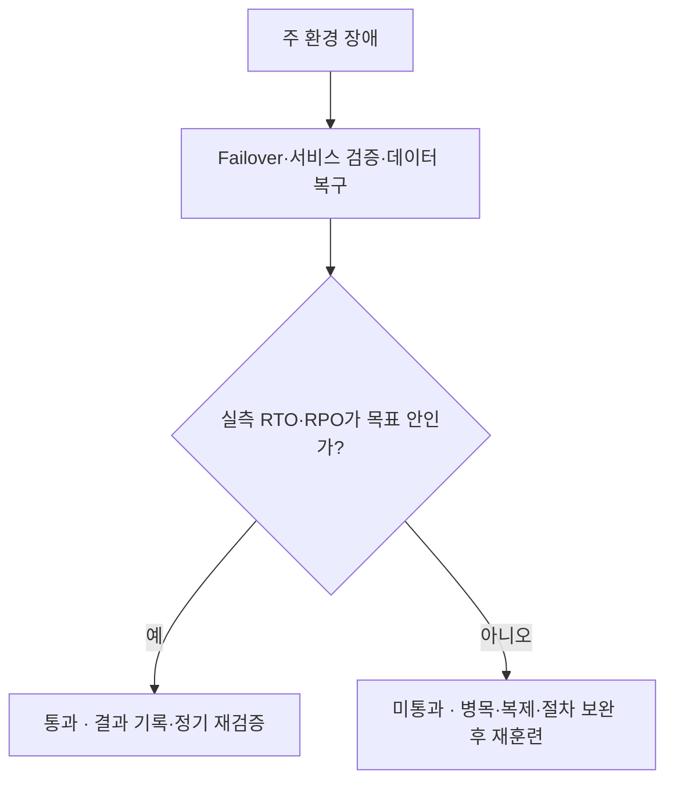

## 지식 로드맵 내 현재 위치

지식 위치: IT 전략·관리 → 업무연속성·재해복구 → **RTO·RPO**

## 30초 인출

- 본질: **RTO(Recovery Time Objective)**는 허용 가능한 서비스 중단시간, **RPO(Recovery Point Objective)**는 허용 가능한 데이터 손실 시점이다.
- 메커니즘: BIA → 복구목표 설정 → 복제·대체환경 설계 → 전환·복귀 훈련 → 실측 결과 환류한다.
- 산출물: 업무별 RTO·RPO 정의서 · DRS 설계 · BCP 절차 · 훈련 결과이다.

## 핵심 용어

핵심 용어

- **RTO(Recovery Time Objective)**: 재해 발생 후 업무나 서비스를 목표 수준으로 재개하기까지 허용하는 시간이다.
- **RPO(Recovery Point Objective)**: 재해 시 복구해야 할 데이터의 기준 시점으로, 허용 가능한 데이터 손실 범위를 나타낸다.
- **BIA(Business Impact Analysis)**: 업무 중단의 시간대별 영향을 분석해 복구 우선순위와 목표를 정하는 활동. 이는 해당 용어의 역할과 작동을 설명한다.
- **BCP(Business Continuity Plan)**: 재난 시 핵심 업무를 지속·복구하기 위한 조직·절차·자원 계획. 이는 해당 용어의 역할과 작동을 설명한다.
- **DRS(Disaster Recovery System)**: 주 시스템 장애 시 대체 환경에서 서비스를 복구하도록 구성한 시스템. 이는 해당 용어의 역할과 작동을 설명한다.
- **Failover(장애 조치)**: 장애가 난 주 시스템의 역할을 대기 시스템으로 전환하는 동작. 이는 해당 용어의 역할과 작동을 설명한다.
- **Failback(복귀)**: 주 시스템 복구 후 서비스와 데이터를 원래 환경으로 되돌리는 동작. 이는 해당 용어의 역할과 작동을 설명한다.

## 예상문제

> RTO(Recovery Time Objective)와 RPO(Recovery Point Objective)를 비교하고, BIA 기반 수립절차와 DRS 적용 시 문제점·대응책을 설명하시오. (25점)

## Ⅰ. 서비스 중단과 데이터 손실의 목표선

> RTO와 RPO는 낮을수록 무조건 좋은 수치가 아니라 업무 중단 영향·기술 가능성·비용을 함께 반영한 복구 설계 기준임

- 정의: 재난·장애 시 허용 가능한 서비스 중단시간인 **RTO(Recovery Time Objective)**와 데이터 손실 시점인 **RPO(Recovery Point Objective)**를 정하는 복구목표
- 목적: **BIA(Business Impact Analysis)** 결과에 맞춰 복구 우선순위·복제방식·대체환경을 결정하는 것

## Ⅱ. BIA 기반 RTO·RPO 수립 흐름

> 업무 영향과 시스템 의존성을 먼저 분석하고 복구목표를 확정한 뒤 기술 대안을 매핑하며, 목표 달성은 전환훈련 실측으로 확인함

| 단계 | 활동 |
|---|---|
| ① 업무·의존성 식별 | 핵심 업무·시스템·외부 서비스 연결 |
| ② BIA | 중단 시간별 재무·운영·법적 영향 평가 |
| ③ RTO·RPO 확정 | 영향·규제·비용·기술 가능성 조정 |
| ④ DRS·BCP 설계 | 복제·대체환경·전환·복귀 절차 설계 |
| ⑤ 훈련·개선 | Failover·Failback·데이터 검증 |

## Ⅲ. RTO·RPO 비교

> RTO는 서비스를 언제 다시 열 것인지, RPO는 어느 시점의 데이터까지 되살릴 것인지를 결정하므로 구현 수단과 검증값이 다름

| 기준 | RTO | RPO |
|---|---|---|
| 통제 | 서비스 중단 | 데이터 손실 |
| 구간 | 재해 발생 → 서비스 재개 | 마지막 복구 가능 시점 → 재해 발생 |
| 수단 | 대체환경·Failover·복구절차 | Backup·Snapshot·복제 |
| 검증 | 실제 복구 소요시간 | 복구 데이터 시점·정합성 |

## Ⅳ. 복구전략 선택과 트레이드오프

> 짧은 복구목표일수록 준비된 대체환경·빈번한 복제·자동화가 필요해 비용과 운영 복잡성이 커지므로 업무별로 차등 설계함

- 사이트 명칭만으로 RTO·RPO가 보장되지 않으며 복제 지연·네트워크·의존 서비스·전환·복귀 절차를 함께 시험해야 함

## Ⅴ. RTO·RPO 운영의 문제점·대응책

> 문서상 목표와 실제 복구능력의 차이는 전환·복귀·데이터 정합성을 함께 실측해야 드러남

| 위험 | 대책 | 효과 |
|---|---|---|
| 짧은 RPO를 위한 복제 지연 | 핵심 업무만 동기·준동기 복제 검토 | 성능과 데이터 손실 목표 균형 |
| Failover·Failback 실패 | 전환·복귀·의존 서비스까지 훈련 | 실제 복구 가능성 확인 |
| 과잉 복구 투자 | BIA 기반 업무별 복구수준 차등화 | 중요도가 낮은 업무의 과잉 설계 감소 |

## Ⅵ. 결론 — 훈련 실측으로 닫는 복구목표

> RTO·RPO는 설계서의 숫자가 아니라 동일 시나리오를 반복 훈련해 달성해야 하는 운영 성능임

### 학습자 통찰 메모 — 답안 밖

- `[핵심 통찰]`: 훈련 실측값이 없는 RTO·RPO는 검증된 목표가 아니다. 서비스가 열렸더라도 데이터 정합성과 외부 의존성이 복구되지 않으면 업무 복구가 완료된 것이 아니다.
- `나라면`: 업무별 영향에 맞춰 복구수준을 차등화하고 전환·복귀 훈련에서 실측한 시간과 데이터 손실을 다음 설계의 입력으로 되돌리겠다.

### 실전 답안용 기술사적 제언

- 판정: 서비스·데이터·외부 의존성을 포함한 훈련 실측값이 업무별 RTO·RPO를 충족하는지 확인
- 대안: BIA 기반 복구수준 차등화와 Failover·Failback 자동화·절차 정비
- 검증: 복구시간·복구 데이터 시점·정합성·의존 서비스 동작을 함께 측정
- 효과: 과잉 DRS 투자와 실제 재해 시 복구 실패 가능성 감소

## 1교시 10점 답안 발췌

### 1. 정의·목적

- **RTO(Recovery Time Objective)**: 재해 발생 후 서비스 재개까지 허용되는 목표 시간
- **RPO(Recovery Point Objective)**: 재해 발생 시 복구해야 하는 데이터의 목표 시점
- 목적: 업무 영향에 맞는 복구 우선순위·복제·대체환경 결정

### 2. BIA 기반 수립절차

- 결론: 목표 달성은 문서가 아니라 전환·복귀 훈련의 실측 복구시간과 데이터 정합성으로 판정함

## 출제 이력과 검증 출처

- 공식 문제지 원문으로 확인한 직접 기출 없음
- [ISO 22301:2019 Security and resilience — Business continuity management systems](https://www.iso.org/standard/75106.html)
- [NIST SP 800-34 Rev. 1, Contingency Planning Guide for Federal Information Systems](https://csrc.nist.gov/pubs/sp/800/34/r1/final)

## 학습 체크

- [ ] Ⅰ: RTO와 RPO를 서비스 중단·데이터 손실 목표로 구분할 수 있는가?
- [ ] Ⅱ: BIA부터 DRS·BCP와 훈련까지 활동·산출을 연결할 수 있는가?
- [ ] Ⅲ: 시간축에서 RPO·RTO 구간을 그리고 통제·수단·검증값으로 비교할 수 있는가?
- [ ] Ⅳ: Hot·Warm·Cold Site의 준비 수준과 비용·복구시간 트레이드오프를 설명할 수 있는가?
- [ ] Ⅴ~Ⅵ: 전환 판정 분기와 판정·대안·검증·효과를 제시할 수 있는가?

## 연결 토픽

- 이전 토픽: [BSC](./017_bsc.md)
- 연관 토픽: [SLA](./006_sla.md), [국가정보자원관리원 화재 분석](./023_national_information_resources_service_fire.md)
- 다음 토픽: [디지털 트랜스포메이션(DX)](./020_digital_transformation.md)
