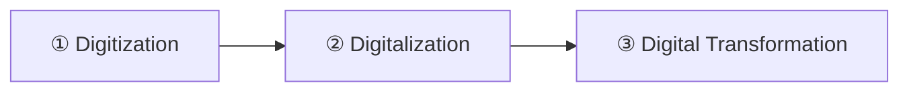
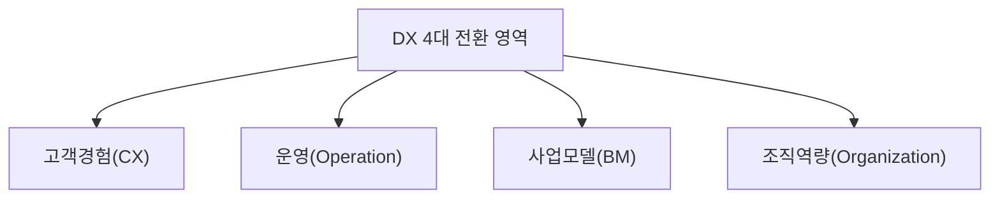

## 지식 로드맵 내 현재 위치

  IT 전략·관리
  디지털 혁신·전략
  <strong>디지털 트랜스포메이션(DX)</strong>

## 30초 인출

- 본질: **DX(Digital Transformation)**는 문서를 전산화(Digitization)하거나 업무를 자동화(Digitalization)하는 데서 멈추지 않고 사업모델과 조직까지 바꾸는 경영 혁신
- 메커니즘: 현업 문제 정의 → MVP 가치 검증 → 제품화 → 표준·플랫폼 재사용
- 산출물: 신규 디지털 수익원 · 통합 고객 접점(CX) · 데이터 기반 제품 조직

## 핵심 용어

핵심 용어

- **DX(Digital Transformation)**: 디지털 기술을 핵심 동력으로 삼아 비즈니스 모델과 기업 문화를 전면 재창조하는 경영 혁신
- **Digitization(전산화)**: 아날로그 문서, 아날로그 신호를 0과 1의 디지털 포맷으로 변환하는 정보 전산화 단계
- **Digitalization(프로세스 디지털화)**: 디지털화된 데이터를 활용하여 기존 업무 프로세스를 최적화하고 자동화하는 단계
- **CoE(Center of Excellence)**: 클라우드, 데이터, AI 등 디지털 신기술 표준, 거버넌스, 교육을 전담 지원하는 전문 핵심 조직
- **CX(Customer Experience)**: 고객이 제품·서비스와 상호작용하는 모든 접점에서 느끼는 종합적인 디지털 경험
- **XaaS(Everything as a Service)**: 하드웨어 판매 중심에서 벗어나 클라우드 기반 구독형 서비스로 전환하는 사업 모델
- **PoC(Proof of Concept)**: 신기술의 비즈니스 타당성을 검증하는 실증 단계로 본 사업 연계 실패 시 'PoC의 무덤' 발생
- **MVP(Minimum Viable Product)**: 최소 기능만으로 고객 가치 가설을 조기 검증하는 제품 형태 → 본투자 여부를 가르는 판단 근거

## 예상문제

> 디지털 트랜스포메이션(DX)의 개념과 전환 영역을 설명하고, 추진 시 문제점과 대응책을 제시하시오. **(미출제 예상·25점)**

## Ⅰ. 기업 체질을 근본적으로 재창조하는 DX의 개요

> DX는 단순한 IT 도구 도입이 아닌 **비즈니스 모델과 조직 문화의 근본적 전환**이며, 성패는 기술 스펙이 아닌 **고객 가치와 지속적 수익 창출력**으로 판정함.

- 정의: 디지털 기술로 **고객가치·운영·사업모델·조직문화**를 함께 바꾸는 경영 혁신
- 목적: 고객 접점 재설계 · 데이터 기반 운영 · 제품 판매 외 반복 수익 발생

## Ⅱ. 디지털 전환의 개념 구분·대표 확산 흐름

> Digitization·Digitalization·DX는 변화 범위를 구분하는 개념이며, 모든 조직이 같은 고정 단계로 진행하는 것은 아님.

| 단계 | 활동 | 산출 |
|---|---|---|
| ① Digitization(정보 전산화) | 아날로그 문서·신호 변환 | 디지털 정보 |
| ② Digitalization(업무 프로세스 전환) | ERP/CRM 고도화·RPA 자동화·데이터 분석 | 자동 처리 업무 절차 |
| ③ Digital Transformation(비즈니스 모델 재창조) | 구독 경제(XaaS) 전환·CX 개인화·플랫폼 구축 | 구독형 신규 서비스·개인화 고객경험 |

## Ⅲ. DX의 4대 전환 영역과 검증 지표

> 4대 영역 **고객경험(CX)**·**운영 프로세스**·**사업모델(BM)**·**조직역량**은 각각 무엇이 무엇으로 바뀌는지가 분명해야 하며, 영역별 검증 지표가 없으면 전환은 도구 도입으로 끝남.

| 영역 | 전환 | 검증 지표 |
|---|---|---|
| 고객경험(CX) | 채널·고객여정 재설계 | 만족도·전환율 |
| 운영(Operation) | 수작업 → 자동화·데이터 기반 결정 | 처리 시간·품질 |
| 사업모델(BM) | 제품 판매 → 플랫폼·구독 | 신규 매출·고객가치 |
| 조직역량(Organization) | 기능 조직 → 제품팀·CoE 지원 | 학습·전달 주기 |

## Ⅳ. Digitization vs Digitalization vs Digital Transformation 비교

> **Digitization**이 정보의 형태 변환, **Digitalization**이 일하는 방식의 효율화라면, **DX**는 회사의 존재 이유와 수익 창출 방식을 바꾸는 기업 체질 전환임.

| 기준 | Digitization | Digitalization | DX |
|---|---|---|---|
| 대상 | 정보 형태 | 업무 프로세스 | 사업모델·조직 |
| 목적 | 저장·활용 | 효율·품질 | 고객가치·신수익 |
| 범위 | 업무 단위 | 프로세스 단위 | 전사·생태계 |

## Ⅴ. DX 추진의 문제점·대응책

> 비즈니스 가치 없는 기술 과시와 현업 저항을 방어하기 위해 CoE 거버넌스와 Quick Win 과제를 결합해야 함.

| 위험 | 대책 | 효과 |
|---|---|---|
| **기술 과시형 PoC 반복** | 현업 문제 중심 과제 선정 · MVP 가치 검증 후 본투자 | 본투자 여부를 가치 검증 결과로 결정 |
| **현업 조직의 변화 저항** | 경영진 스폰서십 기반 변화관리(Change Management) · 리스킬링 교육 | 현업 참여 확대 · 디지털 역량 내재화 |
| **IT-비즈니스 협업 사일로** | 비즈니스 PO와 개발자의 제품 중심 교차기능팀 전환 | 릴리즈 리드타임 단축 · 비즈니스 가치 즉시 연계 |

## Ⅵ. 결론 — CoE·제품 중심 조직의 DX

> DX의 완성은 거대한 턴키 용역 계약이 아니라 현업 제품팀이 비즈니스 성과를 소유하고 **CoE(Center of Excellence)** 전담 조직이 기술 표준·플랫폼을 받치는 체질 전환에 있음.

### 학습자 통찰 메모 — 답안 밖

- `[핵심 통찰]`: DX가 좌초하는 지점은 기술 선택이 아니라 업무 절차·의사결정 권한·성과 책임이 함께 옮겨가지 않는 데 있다. 도구만 바뀌면 조직은 예전 방식 그대로 새 시스템을 쓴다.
- `나라면`: 전사 빅뱅 대신 고객 문제가 분명한 한 도메인에서 MVP로 가치를 검증하고, 검증된 자산만 CoE 표준으로 옮겨 다른 도메인에 재사용하겠다.

### 실전 답안용 기술사적 제언

- 판정: 현업 제품팀이 고객·사업 성과를 소유하고 MVP 결과가 제품화·확산 결정으로 이어지는지 확인
- 대안: 고객 문제가 분명한 도메인에서 MVP로 가치를 검증하고 CoE가 표준·플랫폼 재사용 지원
- 검증: 고객·운영·수익 지표 변화와 검증 자산의 제품 반영·재사용 여부 점검
- 효과: 기술 과시형 PoC 반복과 현업-IT 사일로 감소

## 1교시 10점 답안 발췌

### 1. 정의·목적

- 정의: **디지털 트랜스포메이션(DX)**은 디지털 신기술로 **고객 경험(CX)** · 운영 프로세스 · **비즈니스 모델(BM)** · 조직 문화를 전면 재창조하는 **전사 경영 혁신 전략**
- 목적: 데이터 기반 신수익원 창출 · 디지털 경쟁자로의 고객 접점 이탈 차단

### 2. 단계별 전환과 산출

### 3. 핵심 통제

- **4대 전환 영역**: 고객경험(CX) · 운영 프로세스 · 사업모델(BM) · 조직역량
- **CoE(Center of Excellence)**: 기술 표준·플랫폼 지원으로 'PoC의 무덤'을 막고 검증 자산을 전사에 재사용
- **MVP(Minimum Viable Product)**: 현업 문제 정의 → MVP 가치 검증 → 제품화·확산 판단

## 출제 이력과 검증 출처

- [OECD Going Digital Toolkit 가이드라인](https://goingdigital.oecd.org/)
- [ISO 56002 혁신경영시스템 국제표준](https://www.iso.org/standard/68221.html)

## 학습 체크

- [ ] Ⅰ 개요: DX를 고객경험·운영·사업모델·조직문화 전환으로 정의할 수 있는가?
- [ ] Ⅱ 개념 구분: Digitization·Digitalization·DX 세 단계의 활동·산출을 한 쌍으로 쓰고, 현업 문제 정의부터 CoE 전사 확산까지의 처리 흐름을 이을 수 있는가?
- [ ] Ⅲ 영역: 4대 전환 영역을 하위 박스로 분기해 각 영역이 무엇에서 무엇으로 바뀌는지와 검증 지표를 짝지을 수 있는가?
- [ ] Ⅳ 비교: 세 개념을 대상·목적·범위 세 축으로 비교할 수 있는가?
- [ ] Ⅴ 문제점·대응책: PoC 반복·변화 저항·협업 사일로의 위험·대책·효과를 연결할 수 있는가?
- [ ] Ⅵ 결론: 제품팀 성과 소유·CoE 자산 재사용의 판정·대안·검증·효과와 현행 한계 → 실행 효과 흐름을 재현할 수 있는가?

## 연결 토픽

- 이전 토픽: [RTO·RPO](./018_rpo.md)
- 연관 토픽: [애자일 대응 전략](./013_agile_response_strategy.md), [공공부문 클라우드 네이티브 전환](./021_public_cloud_native_transition.md)
- 다음 토픽: [공공부문 클라우드 네이티브 전환](./021_public_cloud_native_transition.md)
