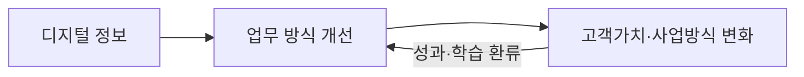

## 지식 로드맵 내 현재 위치

IT 전략·관리 → 디지털 혁신·전략 → **디지털 트랜스포메이션(DX)**

## 30초 인출

- 본질: 디지털 전환(DX, Digital Transformation)은 새 기술을 도입하는 데서 끝나지 않고, 그 기술로 고객에게 가치를 주는 방식과 조직의 일하는 방식을 바꾸는 일이다.
- 메커니즘: 현업 문제 정의 → MVP 가치 검증 → 제품화·확산 여부를 판단한다.
- 판정 기준: 기술 도입량이 아니라 고객·업무 성과의 변화를 확인한다.

핵심 용어

- **Digitization(전산화)** : 아날로그 정보를 디지털 데이터로 변환하는 것
- **Digitalization(디지털화)** : 디지털 기술로 기존 업무 수행방식을 개선하는 것
- **DX(Digital Transformation)** : 디지털 기술을 활용해 고객가치와 사업·운영 방식을 지속적으로 바꾸는 것
- **MVP(Minimum Viable Product)** : 핵심 가설을 검증할 수 있도록 최소 기능을 갖춘 제품
- **운영모델(Operating Model)** : 제품·업무·데이터·조직의 책임과 의사결정 방식을 연결해 고객가치를 전달하는 구조

---

## 1교시 예상문제 (10점)

> 전산화·디지털화·디지털 전환의 차이와 DX 추진 시 유의점을 설명하시오. (예상·10점)

---

## 1교시 10점 답안

### 1. 정의·목적

- 정의: **DX** 는 디지털 기술을 활용해 고객가치와 사업·운영 방식을 바꾸는 경영 혁신
- 목적: 변화하는 환경에서 고객에게 가치를 제공하고 조직의 성과를 높임

### 2. 전환 범위

전산화는 정보 형태, 디지털화는 기존 업무방식, DX는 고객가치와 사업·운영방식의 변화를 대상으로 한다.

| 구분 | 변화 대상 | 판단 질문 |
|---|---|---|
| 전산화 | 정보의 형태 | 아날로그 정보가 디지털화됐는가? |
| 디지털화 | 기존 업무 수행방식 | 디지털 기술로 업무가 개선됐는가? |
| DX | 고객가치·사업·조직의 운영방식 | 가치 제공 또는 사업 수행방식이 달라졌는가? |

- 한 줄 제언: 현업 문제와 성과 기준을 먼저 정하고 검증된 변화만 단계적으로 확산한다.

---

## 2~4교시 예상문제 (25점)

> 디지털 트랜스포메이션의 개념을 설명하고, 추진 시 유의점과 대응방안을 제시하시오. (예상·25점)

---

## 2~4교시 25점 답안

## Ⅰ. DX의 범위

- 정의: **DX** 는 디지털 기술을 활용해 고객가치와 사업·운영 방식을 바꾸는 경영 혁신이다.
- 목적: 변화하는 환경에서 고객에게 가치를 제공하고 조직의 성과를 높인다.

전산화·업무 디지털화는 DX의 기반이 될 수 있지만 그 자체로 사업·조직의 전환을 뜻하지는 않는다.

| 구분 | 변화 대상 | 판단 질문 |
|---|---|---|
| 전산화 | 정보의 형태 | 아날로그 정보가 디지털화됐는가? |
| 디지털화 | 기존 업무 수행방식 | 디지털 기술로 업무가 개선됐는가? |
| DX | 고객가치·사업·조직의 운영방식 | 가치 제공 또는 사업 수행방식이 달라졌는가? |

전환 대상은 기술 하나가 아니라 **고객 접점·업무 프로세스·제품/서비스·데이터·조직 운영** 중 문제와 연결된 범위다. 예를 들어 고객 응대를 디지털화했다면 처리시간 감소만 보지 않고, 고객 문제 해결률과 담당자의 후속 처리 방식이 함께 바뀌었는지 확인한다.

## Ⅱ. 추진 시 유의점

| 추진 위험 | 대응 기준 |
|---|---|
| 기술 중심 PoC 반복 | 해결할 문제와 확산 기준을 먼저 정하고 성과 확인 후 확대 |
| 현업 참여 부족 | 담당자·고객 요구를 과제 정의와 성과 측정에 반영 |
| 성과 측정 부재 | 도입 건수 대신 고객·업무 성과를 기준선과 비교 |
| 실험 후 운영 단절 | 운영 책임자·데이터 연계·예산·변경 권한을 정해 MVP 성과를 정착 |

## Ⅲ. 결론 — 문제와 성과에 기반한 전환

DX는 기술 도입량이 아니라 고객과 업무에 생긴 변화로 평가한다. 현업 문제를 작게 검증하고, 확인된 개선을 운영과 사업모델에 정착시킨다.

### 실전 답안용 기술사적 제언

| 문제 | 해결 방안 |
|---|---|
| 기술 검증이 현업 성과와 분리됨 | 현업 문제와 성과 기준을 먼저 정하고 MVP 결과로 확산 여부 판단 |

## 출제 이력과 검증 출처

- 공식 문제지 원문으로 확인한 직접 기출 없음
- [OECD Going Digital Toolkit](https://goingdigital.oecd.org/)
- [ISO 56002 — Innovation management system](https://www.iso.org/standard/68221.html)

## 연결 토픽

- 이전 토픽: [RTO·RPO](./018_rpo.md)
- 연관 토픽: [애자일 대응 전략](./013_agile_response_strategy.md), [공공부문 클라우드 네이티브 전환](./021_public_cloud_native_transition.md)
