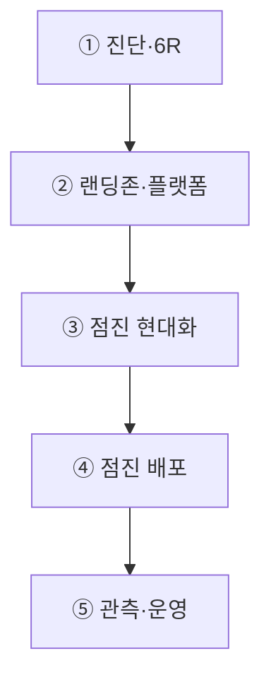
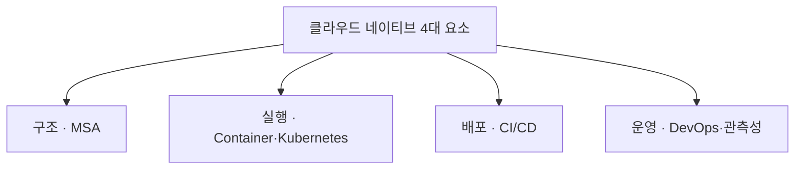
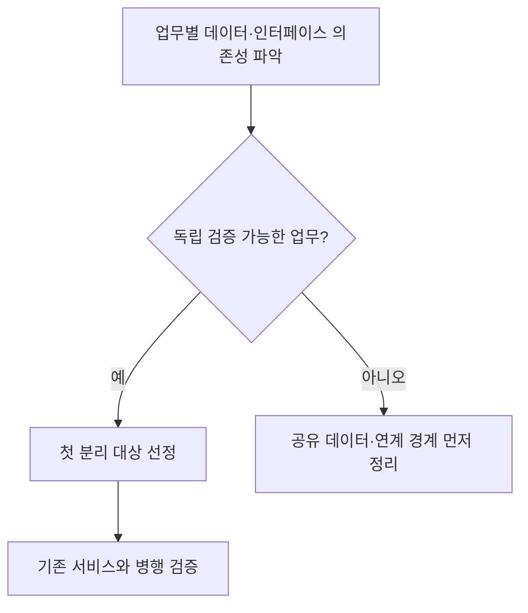

## 지식 로드맵 내 현재 위치

지식 위치: IT 전략·관리 → 공공 디지털 혁신 → **공공부문 클라우드 네이티브 전환**

## 30초 인출

- 본질: 공공부문 클라우드 네이티브 전환은 공공 서비스를 클라우드에 맞게 다시 설계·운영하는 일이다. 서버만 옮기는 것과 달리 애플리케이션과 배포 방식도 바꾼다.
- 메커니즘: **6R** 진단 → 랜딩존 구축 → Strangler Fig 기반 점진 현대화 → Canary 배포 → **SRE** 운영 검증 순으로 전환한다.
- 산출물: 서비스 중요도·보안등급별 **6R** 전략서 · 마이크로서비스 API 명세서 · SLO 기반 관측성 대시보드이다.

핵심 용어

- **Cloud Native(클라우드 네이티브)** : 클라우드의 탄력성과 복원력을 극대화하여 신속한 서비스 배포와 장애 격리를 달성하는 현대화 아키텍처
- **Lift & Shift(Rehost)** : 기존 온프레미스 워크로드를 아키텍처 변경 없이 IaaS 가상머신으로 단순 마이그레이션하는 이전 방식
- **MSA(Microservices Architecture)** : 비즈니스 도메인을 독립적인 소규모 서비스 단위로 분할하여 개별 배포와 확장을 지원하는 아키텍처
- **Container** : 애플리케이션과 실행 런타임을 함께 격리 패키징하여 환경 일관성과 신속한 기동성을 보장하는 경량 가상화 기술
- **Kubernetes(쿠버네티스/K8s)** : 대규모 컨테이너의 자동 배포, 스케일링, 복구 및 로드밸런싱을 전담하는 표준 오케스트레이션 플랫폼
- **CI/CD** : 지속적 통합과 지속적 배포를 통해 소스코드 커밋부터 운영 반영까지 전 과정을 자동화한 파이프라인
- **6R** : Rehost·Replatform·Repurchase·Refactor·Retain·Retire로 구성된 클라우드 전환 전략 프레임워크
- **Strangler Fig 패턴** : 기존 모놀리식 시스템 외곽부터 점진적으로 마이크로서비스로 분리·대체해 나가는 현대화 전환 패턴
- **CSAP(Cloud Security Assurance Program)** : 공공기관에 도입되는 민간 클라우드 서비스의 안전성과 신뢰성을 검증하는 보안인증제도
- **SRE(Site Reliability Engineering)** : 소프트웨어 엔지니어링 방법론을 운영에 접목하여 SLO와 에러 예산 기반으로 대규모 시스템 가용성을 보증하는 운영 체계

---

## 1교시 예상문제 (10점)

> 공공부문 클라우드 네이티브 전환의 구성체계와 점진 전환 시 핵심 통제를 설명하시오. (예상·10점)

---

## 1교시 10점 답안

### Ⅰ. 정의·목적

- 정의: 공공 정보시스템의 애플리케이션·데이터·운영을 클라우드의 탄력성·회복성·자동화에 맞게 현대화하는 전략
- 목적: 변화 대응력 향상 · 장애영향 축소 · 운영 자동화

### Ⅱ. 구성체계 및 방법론

### Ⅲ. 핵심 통제

- **대표 구현요소** : MSA(서비스 분리), Container·K8s(오케스트레이션), CI/CD(배포 자동화), DevOps·관측성(운영 피드백)
- Strangler Fig 점진 전환: 빅뱅 일괄 전환 대신 가치 중심 단위 모듈부터 순차적으로 분리하여 전환 리스크 최소화

---

## 2~4교시 예상문제 (25점)

> 공공부문 클라우드 네이티브 전환의 개념과 핵심 요소를 설명하고, 단순 이전과의 차이 및 전환상 문제점·대응책을 제시하시오.

---

## 2~4교시 25점 답안

## Ⅰ. 대국민 서비스 안정성과 민첩성을 확보하는 공공 클라우드 네이티브의 개요

> 공공 클라우드 네이티브 전환은 단순 IaaS 서버 이전을 넘어 **애플리케이션과 운영 체계의 전면 현대화** 이며, 성패는 공공서비스의 **탄력적 가용성과 무중단 배포 역량** 으로 판정함.

| 구분 | 핵심 |
|---|---|
| 정의 | 공공 정보시스템의 **애플리케이션** , **컨테이너·Kubernetes** , **CI/CD** 운영을 클라우드의 탄력성·회복성에 맞게 현대화하는 **Cloud Native** 전략 |
| 목적 | **SRE(Site Reliability Engineering)** 기반 관측성과 자동화로 변화 대응력을 높이고 장애영향을 줄이는 것 |

## Ⅱ. 공공 클라우드 네이티브의 대표 전환 흐름

> 다음은 진단부터 상시 운영까지를 압축한 대표 흐름이며, 모든 사업에 동일한 공식 5단계를 강제하지 않음.

| 단계 | 활동 | 산출 |
|---|---|---|
| ① 진단·6R | 자원·업무영향 분석 | 전환 전략 |
| ② 랜딩존·플랫폼 | 계정·네트워크·보안 설계 | 플랫폼 표준 |
| ③ 점진 현대화 | 서비스·데이터 경계 분리 | API·아키텍처 |
| ④ 점진 배포 | 카나리·롤백 검증 | 전환 결과 |
| ⑤ 관측·운영 | SLI·SLO 운영 | 관측 대시보드 |

- **Traceability** : 정보자원 분류 ↔ 6R 결정 ↔ 배포 방식 ↔ 운영 SLO의 전주기 추적

## Ⅲ. 클라우드 네이티브 4대 핵심 구현요소

> 4대 요소 **MSA** · **Container(K8s)** · **CI/CD** · **DevOps/관측성** 이 유기적으로 결합되어야 장애 격리, 탄력적 오토스케일링, 무중단 배포가 공공 행정 시스템에서 실현됨.

| 요소 | 역할 | 효과 |
|---|---|---|
| **MSA(Microservices Architecture)** | 업무 경계별 독립 배포 | 변경·장애 범위 축소 |
| **Container·Kubernetes** | 실행환경 표준화·오케스트레이션 | 이식성·탄력성 |
| **CI/CD(Continuous Integration/Continuous Delivery)** | 빌드·시험·배포 자동화 | 변경 리드타임 단축 |
| **DevOps·Observability** | 개발·운영 협업과 신호 통합 | 운영 피드백 단축 |

## Ⅳ. 단순 클라우드 이전(Lift & Shift) vs 클라우드 네이티브 전환 비교

> **Lift & Shift(Rehost)** 가 하드웨어 장소만 바꾼 인프라 이전이라면, **클라우드 네이티브(Cloud Native)** 는 소프트웨어 아키텍처와 배포·운영 문화를 전면 혁신하는 것임.

| 기준 | Lift & Shift | Cloud Native |
|---|---|---|
| 범위 | 인프라 중심 | 애플리케이션·데이터·운영 |
| 확장 | 기존 확장 방식 유지 | 자동 수평 확장 |
| 배포 | 기존 배포 방식 유지 | **CI/CD** 기반 점진 배포 |
| 선택 | 코드 변경 제약·신속 이전 | 탄력성·빈번한 변경 요구 |

## Ⅴ. 공공부문 전환의 문제점·대응책

> 모놀리식 데이터베이스의 강결합과 단일 턴키 발주 관행을 극복하기 위해 **Strangler Fig 패턴** 과 단계적 분할 발주 거버넌스를 적용해야 함.

| 위험 | 대책 | 효과 |
|---|---|---|
| **데이터베이스 강결합** | 바운디드 컨텍스트 도출 · **CDC(Change Data Capture)** 기반 동기화 검증 | 정합성을 확인하며 점진 분리 |
| **일괄 발주와 점진 전환 충돌** | 플랫폼·업무서비스의 책임·인터페이스·통합검증 기준 명시 | 단계별 분할 발주 및 검수 가능 |
| **상용 COTS 패키지 전환 불가** | 패키지 시스템은 Replatform/Rehost로 존치하고 래퍼 API로 **MSA** 연계 | 레거시 인터페이스 무결성 유지 및 연계 지연 차단 |

## Ⅵ. 기술사적 제언 — 첫 분리 대상을 의존성으로 선정

> 제안: 전환의 첫 대상은 유행하는 기술보다 **데이터·인터페이스 의존성** 을 기준으로 고른다. 독립적으로 배포·검증할 수 있는 업무를 먼저 시범 전환해 분리 방식의 적합성을 확인한다.

Ⅴ절은 전환 과정의 여러 위험을 비교했다. 이 제안은 **어떤 업무를 먼저 분리할지** 정한다. 병행 검증 결과가 충족되지 않으면 전환 범위를 늘리지 않는다.

## 출제 이력과 검증 출처

- [국가법령정보센터: 클라우드컴퓨팅법 제20조](https://www.law.go.kr/lsLinkCommonInfo.do?chrClsCd=010202&lsJoLnkSeq=1033532191)
- [KISA: 클라우드서비스 보안인증(CSAP)](https://www.kisa.or.kr/1050603)

## 연결 토픽

- 이전 토픽: [디지털 트랜스포메이션(DX)](./020_digital_transformation.md)
- 연관 토픽: [FinOps](./012_finops.md), [RTO·RPO](./018_rpo.md)
- 다음 토픽: [국가정보자원관리원 화재 분석](./023_national_information_resources_service_fire.md)
