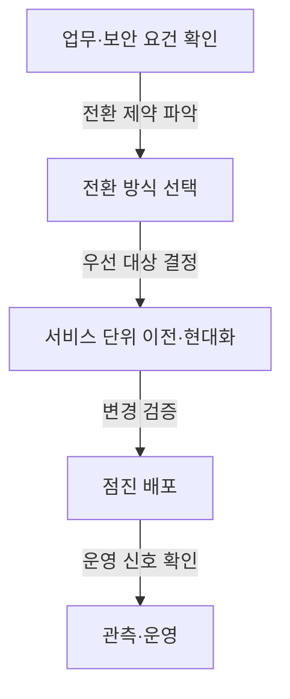

## 지식 로드맵 내 현재 위치

지식 위치: IT 전략·관리 → 공공 디지털 혁신 → **공공부문 클라우드 네이티브 전환**

## 30초 인출

- 본질: 공공부문 클라우드 네이티브 전환은 공공 정보시스템의 애플리케이션·운영을 클라우드 환경에 맞게 현대화하는 전략.
- 메커니즘: 업무·보안 요건 확인 → 전환 방식 선택 → 경계가 분명한 서비스부터 이전·현대화 → 배포·운영 결과 검증.

핵심 용어

- **공공부문 클라우드 네이티브 전환**: 공공 정보시스템의 애플리케이션과 운영을 클라우드 환경에 맞게 현대화하는 전략
- **Cloud Native(클라우드 네이티브)** : 클라우드 환경을 고려한 애플리케이션 개발·배포·운영 접근 방식.
- **Lift & Shift(Rehost)** : 큰 구조 변경 없이 기존 애플리케이션을 다른 인프라로 옮기는 이전 방식.
- **6R** : Rehost·Replatform·Repurchase·Refactor·Retain·Retire에 따른 이전·현대화 방식 분류 기준.
- **MSA(Microservices Architecture)** : 애플리케이션을 업무 기능별 독립 배포 가능 서비스로 나누는 구조.
- **CSAP(Cloud Security Assurance Program)** : 클라우드컴퓨팅서비스의 보안인증 기준 적합성을 평가·인증하는 제도.
- **Strangler Fig 패턴** : 기존 시스템을 유지하며 기능을 새 시스템으로 점진 이전하는 현대화 방식.

---

## 1교시 예상문제 (10점)

> 공공부문 클라우드 네이티브 전환의 구성체계와 점진 전환 시 핵심 통제를 설명하시오. (예상·10점)

---

## 1교시 10점 답안

### Ⅰ. 정의·목적

| 구분 | 핵심 |
|---|---|
| 정의 | **공공부문 클라우드 네이티브 전환**은 공공 정보시스템의 애플리케이션·운영을 클라우드 환경에 맞게 현대화하는 전략 |
| 목적 | 서비스 변경·장애 대응을 위한 배포·운영 역량 강화 |

### Ⅱ. 구성체계 및 방법론

### Ⅲ. 공공 적용 통제

| 판단 대상 | 통제 |
|---|---|
| 전환 방식 | 업무 요건·기존 시스템 의존성을 기준으로 **6R** 중 선택 |
| 클라우드 보안 | 공공 이용 요건과 서비스 유형에 맞는 보안인증·보안 통제 확인 |
| 배포·운영 | 점진 배포와 롤백을 준비하고 서비스 신호로 변경 결과 확인 |

- 제언: 서비스 경계·데이터 의존성 확인 후 독립 배포·검증이 가능한 업무부터 전환.

---

## 2~4교시 예상문제 (25점)

> 공공부문 클라우드 네이티브 전환의 개념과 핵심 요소를 설명하고, 단순 이전과의 차이 및 전환상 문제점·대응책을 제시하시오. (예상)

---

## 2~4교시 25점 답안

## Ⅰ. 정의·목적

| 구분 | 핵심 |
|---|---|
| 정의 | **공공부문 클라우드 네이티브 전환**은 공공 정보시스템의 애플리케이션·운영을 클라우드 환경에 맞게 현대화하는 전략 |
| 목적 | 서비스 변경·장애 대응을 위한 배포·운영 역량 강화 |

## Ⅱ. 전환 흐름

> 사업 요건에 따라 조정하는 대표 흐름.

## Ⅲ. 클라우드 네이티브 구성 요소

> 서비스 구조·실행환경·배포·운영 관점에 따른 구성 요소 구분과 시스템 요구에 맞춘 조합.

| 관점 | 핵심 구성 | 역할 |
|---|---|---|
| 서비스 구조 | **MSA** 등 서비스 경계 | 변경 가능한 업무 단위 구성 |
| 실행환경 | 컨테이너·오케스트레이션 | 일관된 배포·자원 관리 |
| 배포 | **CI/CD** | 빌드·시험·배포 반복 자동화 |
| 운영 | 관측성·신뢰성 관리 | 서비스 상태 확인과 장애 대응 |

## Ⅳ. 단순 이전과 현대화 비교

| 기준 | Lift & Shift | Cloud Native |
|---|---|---|
| 변경 범위 | 기존 애플리케이션을 큰 변경 없이 이전 | 애플리케이션 구조·배포·운영 방식까지 조정 가능 |
| 우선 목표 | 이전 기간·호환성 제약 대응 | 클라우드 기능을 활용한 변경·운영 개선 |
| 선택 고려 | 빠른 이전, 변경 여력 부족 | 서비스 분리·자동화 투자 여력과 필요성 |

## Ⅴ. 공공부문 전환 위험과 대응

| 위험 | 대책 | 효과 |
|---|---|---|
| 데이터·업무 경계 결합 | 서비스 경계 확인과 동기화·이행 계획 검증 | 일괄 분리에 따른 데이터 불일치 위험 감소 |
| 단계적 전환과 계약 범위 불일치 | 단계별 책임·인터페이스·통합시험 기준의 계약·수행계획 반영 | 단계별 인수와 통합 검증 가능성 |
| 패키지 시스템의 변경 제약 | 패키지 변경 가능 범위 확인 후 연계·이전 방식 별도 결정 | 불필요한 재개발 회피와 의존성 관리 |

## Ⅵ. 기술사적 제언

| 문제 | 해결 방안 |
|---|---|
| 장비 교체·기술 유행만을 기준으로 전환할 때 업무 중단·데이터 이행 위험이 큰 서비스가 우선될 가능성 | 업무·데이터 의존성이 낮고 독립 배포·검증이 가능한 서비스의 시범 전환, 운영 결과 확인 후 다음 서비스 범위 선정 |

## 출제 이력과 검증 출처

- [국가법령정보센터: 클라우드컴퓨팅법 제20조](https://www.law.go.kr/lsLinkCommonInfo.do?chrClsCd=010202&lsJoLnkSeq=1033532191)
- [국가법령정보센터: 행정기관 및 공공기관의 클라우드컴퓨팅서비스 이용 기준 및 안전성 확보 등에 관한 고시](https://www.law.go.kr/LSW/admRulInfoP.do?admRulSeq=2100000270616&chrClsCd=010201)
- [KISA: 클라우드서비스 보안인증(CSAP)](https://www.kisa.or.kr/1050603)

## 연결 토픽

- 이전 토픽: [디지털 트랜스포메이션(DX)](./020_digital_transformation.md)
- 연관 토픽: [FinOps](./012_finops.md), [RTO·RPO](./018_rpo.md)
- 다음 토픽: [국가정보자원관리원 화재 분석](./023_national_information_resources_service_fire.md)
