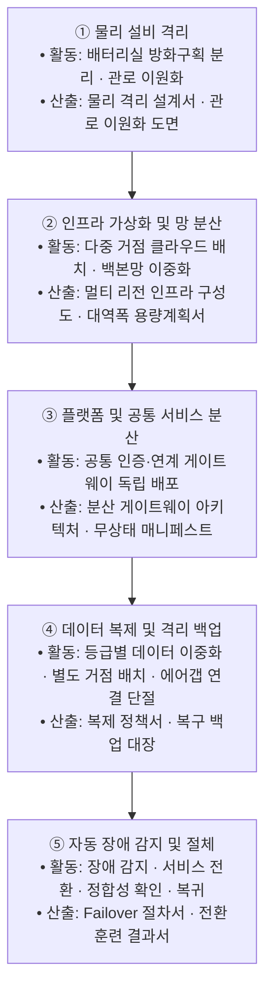
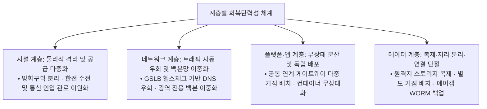
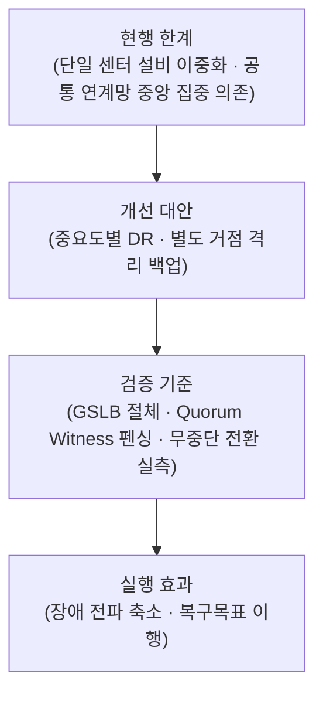

## 지식 로드맵 내 현재 위치

IT 전략·관리 → 재해복구·서비스 연속성 → **국가정보자원관리원 화재와 공공 디지털서비스 회복탄력성**

## 30초 인출

- 본질: **국정자원 화재와 공공 회복탄력성**은 단일 데이터센터 물리 설비 집중(SPOF)의 한계를 극복하고, 센터 상실 시에도 대민 행정서비스를 무중단 유지하는 다중 거점 연속성 체계
- 메커니즘: 설비·거점의 지리적 분리 → GSLB 트래픽 우회 → 무상태(Stateless) 앱 분산 → 데이터 복제와 네트워크 단절형 에어갭 백업 → 자동 절체(Failover)
- 산출물: 업무등급별 RTO·RPO 목표정의서 · Active-Active DR 구성도 · 실전 모의전환 검증 결과서

핵심 용어

- **SPOF(Single Point of Failure)**: 단일 구성요소 고장이 시스템 전체 마비로 파급되는 단일 실패점
- **공통원인 장애(Common Cause Failure)**: 하나의 물리적 사건(화재·정전)이 공유 인프라를 통해 다수 서비스로 전파되는 장애
- **GSLB(Global Server Load Balancing)**: DNS 기반 헬스체크를 통해 장애 센터를 배제하고 정상 거점으로 트래픽을 자동 분산
- **Active-Active DR(이중운영체계)**: 복수 거점이 서비스를 운영하여 대기형 DR보다 전환시간을 줄이는 구성
- **RTO(Recovery Time Objective)**: 재해 발생 시 서비스가 정상 수준으로 복구되기까지 허용되는 최대 시간
- **RPO(Recovery Point Objective)**: 재해 발생 시 유실을 허용할 수 있는 최대 데이터 시점 간격
- **에어갭(Air-Gap)**: 백업 저장소의 네트워크 연결을 물리적·논리적으로 단절해 악성코드와 원격 침해의 전파를 차단하는 방식. 센터 화재 등 물리 재난에는 별도 거점의 지리적 분리가 필요함
- **Split-Brain**: 네트워크 단절 시 양 센터가 상호 다운으로 오판하여 독자 쓰기를 수행하며 발생하는 데이터 불일치 현상

## 예상문제

> 국가정보자원관리원 화재로 드러난 공공 디지털서비스의 연속성 문제를 분석하고, 시스템 등급별 재해복구체계와 검증 방안을 제시하시오.

## Ⅰ. 물리적 설비 방호에서 디지털 회복탄력성으로의 전환 개요

> 데이터센터 물리 재난 시 핵심 서비스의 무중단 제공 능력을 확보하며, 성패는 단순 설비 내구성이 아닌 **다중 거점 서비스 다중화**와 **RTO·RPO 단축**으로 판정함.

- 정의: 재난에도 핵심 서비스를 허용 수준으로 유지하고 정해진 목표 안에 복구하는 **회복탄력성(Resilience)** 역량
- 목적: 장애영향 축소 · 행정서비스 연속성 확보 · 복구능력 검증

## Ⅱ. 장애 전파 차단·회복탄력성의 대표 흐름

> 화재 전파 경로를 계층별로 차단하고 `물리격리 → 가상화망 → 공통분산 → 동기복제 → 자동절체` 파이프라인으로 연결해야 서비스가 지속됨.

- **Traceability**: 재난 감지 ↔ 트래픽 우회 ↔ 데이터 정합성 ↔ 서비스 복구 결과 추적

## Ⅲ. 단순 설비 이중화 vs 분산 서비스 다중화 비교

> 단순 설비 이중화는 상면 전소 시 무력화되므로, 센터를 초월한 **서비스 다중화**로 패러다임을 전환해야 함.

| 기준 | 단일센터 설비 이중화 | 다중거점 서비스 연속성 |
|---|---|---|
| **보호 범위** | 장비·설비 장애 | 센터 상실·광역 재난 |
| **서비스 배치** | 단일 거점 집중 | 이중운영 또는 대기형 DR |
| **데이터 보호** | 센터 내부 이중화 | 원격 복제·격리 백업 |
| **검증** | 부품·설비 시험 | 서비스 전환·복귀 훈련 |

## Ⅳ. 계층별 회복탄력성 아키텍처 및 핵심 통제

> 물리·네트워크·플랫폼·데이터의 공유 의존성을 분리해야 공통원인 장애의 전파 범위를 원천 차단할 수 있음.

| 계층 | 대책 | 검증 |
|---|---|---|
| **시설** | 방화구획 · 전력·통신 경로 분리 | 설비 점검·재난 시나리오 |
| **서비스** | 중요도별 이중운영·대기형 DR | 전환 후 핵심기능 확인 |
| **데이터** | 원격 복제 · 격리 백업 | 정합성·복원 시험 |
| **운영** | 전환·복귀 절차와 책임 명시 | RTO·RPO 실측 |

## Ⅴ. 다중거점 전환의 문제점·대응책

> 다중 거점 분산 환경에서는 동기 복제 지연과 **Split-Brain** 방지가 아키텍처의 최대 공학적 난제임.

| 위험 | 대책 | 효과 |
|---|---|---|
| **Split-Brain 발생** | 독립 **Quorum Witness** · 펜싱(Fencing) 통제 | 동시 쓰기 차단 · 데이터 충돌 방지 |
| **원격 동기 복제 지연** | 핵심 DB 동기 복제, 비정형 데이터 비동기 파이프라인 분리 | 주 센터 트랜잭션 성능 저하 억제 및 가용성 유지 |
| **공통 연계망 단절** | 행정연계 게이트웨이의 **Active-Active** 다중 거점화 | 타 부처 및 대국민 연계 서비스 연속성 보증 |
| **비상 절체(Failover) 실패** | IaC 기반 복구 자동화 · 정기 전환훈련 | 목표 **RTO·RPO** 달성 가능성 확인 |

## Ⅵ. 결론 — 무상태 분산·전환훈련 기반 회복탄력성

> 완벽한 건물이 아닌 언제든 한쪽 센터를 즉시 버릴 수 있는 **무상태(Stateless) 분산 구조**와 **실전 불시 절체 검증**이 회복탄력성의 본질임.

### 실전 답안용 기술사적 제언

- 판정: 단일 센터 물리 의존을 탈피하고 서비스 중요도별 거점 분산과 불시 실측 검증 체계를 확보하였는가
- 대안: 최고 중요도 서비스 **Active-Active DR** 우선 적용 · 지리적으로 분리된 거점에 네트워크 단절형 **에어갭(Air-Gap)** 백업 보관
- 검증: **GSLB** 자동 절체 · **Quorum Witness** 펜싱 · 업무별 RTO·RPO 실측
- 효과: 센터 단위 장애의 서비스 전파 축소 · 복구목표 이행 근거 확보

## 1교시 10점 답안 발췌

### 1. 정의·목적

- 정의: 재난에도 핵심 서비스를 허용 수준으로 유지하고 정해진 목표 안에 복구하는 **회복탄력성(Resilience)** 역량
- 목적: 장애영향 축소 · 행정서비스 연속성 확보 · 복구능력 검증

### 2. 구성체계 및 방법론

### 3. 핵심 통제

- **이중운영(Active-Active DR)**: 복수 거점이 서비스를 운영하여 전환시간을 줄이는 방식
- **대기형(Active-Standby DR)**: 주 시스템 장애 시 보조 시스템으로 전환하는 방식
- **전환훈련**: 서비스·데이터·연계 기능을 전환하고 복귀하여 RTO·RPO를 실측

## 출제 이력과 검증 출처

- [행정안전부: 국정자원 혁신 ISP 착수](https://www.mois.go.kr/frt/bbs/type010/commonSelectBoardArticle.do?bbsId=BBSMSTR_000000000008&nttId=126568)
- [행정안전부: 국정자원 DR 구축 ISP 착수](https://www.mois.go.kr/frt/bbs/type010/commonSelectBoardArticle.do%3Bjsessionid%3DFAiZ7-yPmlD1qtA3xJmCFCFZXV3liaV5TYPLvJZv.node10?bbsId=BBSMSTR_000000000008&nttId=126963)

## 학습 체크

- [ ] Ⅰ 개요: 공통원인 장애와 서비스 회복탄력성의 관계를 설명할 수 있는가?
- [ ] Ⅱ 흐름: 물리격리부터 자동 절체까지 활동·산출을 연결할 수 있는가?
- [ ] Ⅲ 비교: 설비 이중화와 다중거점 서비스 다중화의 보호대상·범위를 비교할 수 있는가?
- [ ] Ⅳ 계층 통제: 시설·네트워크·플랫폼·데이터별 취약점과 통제를 연결할 수 있는가?
- [ ] Ⅴ 문제점·대응책: Split-Brain·복제 지연·연계망 단절·절체 실패의 위험·대책·효과를 연결할 수 있는가?
- [ ] Ⅵ 결론: 전환훈련 중심의 판정·대안·검증·효과를 제시할 수 있는가?

## 연결 토픽

- 이전 토픽: [공공부문 클라우드 네이티브 전환](./021_public_cloud_native_transition.md)
- 연관 토픽: [액티브-액티브 스토리지 DR](./027_active_active_storage_dr.md), [RTO·RPO](./018_rpo.md), [DRS](./042_drs.md)
- 다음 토픽: [국가 AI 전략](./024_korea_ai_action_plan.md)
