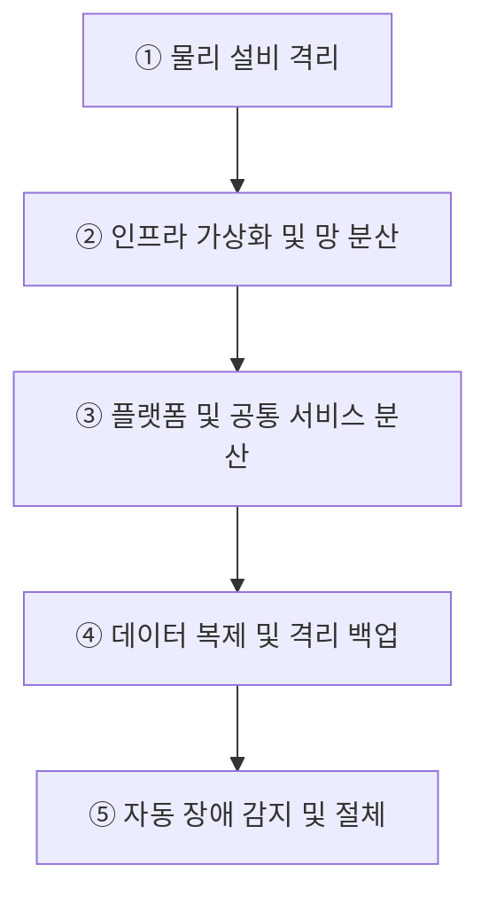
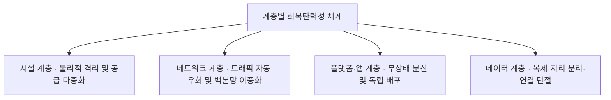
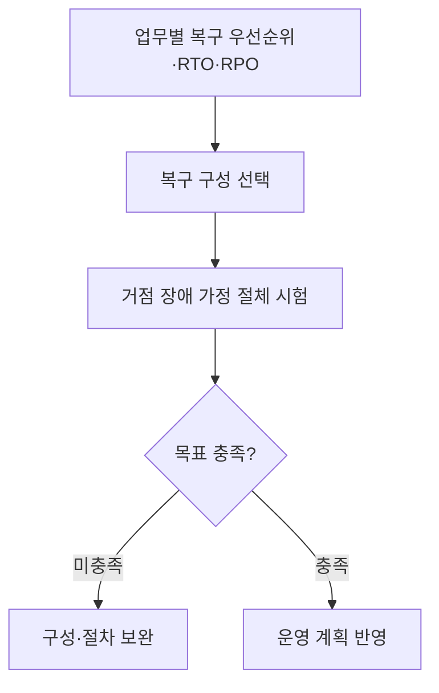

## 지식 로드맵 내 현재 위치

지식 위치: IT 전략·관리 → 재해복구·서비스 연속성 → **국가정보자원관리원 화재와 공공 디지털서비스 회복탄력성**

## 30초 인출

- 본질: 공공 디지털서비스 회복탄력성은 한 센터에 장애가 나도 핵심 서비스를 계속 제공하거나 신속히 복구하는 능력이다. 국정자원 화재는 거점 분리와 복구훈련의 필요성을 보여 준다.
- 메커니즘: 설비·거점의 지리적 분리 → **GSLB** 트래픽 우회 → 무상태(Stateless) 앱 분산 → 데이터 복제와 네트워크 단절형 **에어갭** 백업 → 자동 절체(Failover)한다.
- 산출물: 업무등급별 **RTO** · **RPO** 목표정의서 · **Active-Active DR** 구성도 · 실전 모의전환 검증 결과서이다.

핵심 용어

- **SPOF(Single Point of Failure)** : 단일 구성요소의 결함이나 장애가 시스템 전체 마비로 파급되는 단일 장애점
- **공통원인 장애(Common Cause Failure)** : 화재·정전 등 단일 물리적 사건이 공유 인프라를 통해 복수 시스템으로 동시 전파되는 장애
- **GSLB(Global Server Load Balancing)** : DNS 기반 헬스체크를 통해 장애 데이터센터를 격리하고 정상 거점으로 트래픽을 자동 절체하는 기술
- **Active-Active DR(이중운영체계)** : 둘 이상의 데이터센터가 동시에 트래픽을 처리하여 RTO를 0에 수렴시키는 무중단 재해복구 구성
- **RTO(Recovery Time Objective)** : 재해 발생 후 업무 및 서비스를 정상 수준으로 재개하기까지 허용되는 최대 중단 시간
- **RPO(Recovery Point Objective)** : 재해 발생 시 복구 기준 시점으로 허용되는 최대 데이터 손실 시점
- **에어갭(Air-Gap)** : 백업 데이터를 운영 네트워크로부터 물리적·논리적으로 완전 격리하여 보관하는 데이터 보호 방식
- **Split-Brain** : 센터 간 통신 단절 시 양측이 모두 주 센터로 오판하여 독자 쓰기를 수행함에 따라 발생하는 데이터 불일치 현상

---

## 1교시 예상문제 (10점)

> 공공 디지털서비스의 회복탄력성 확보 절차와 재해복구 검증 방안을 설명하시오. (예상·10점)

---

## 1교시 10점 답안

### Ⅰ. 정의·목적

- 정의: 재난에도 핵심 서비스를 허용 수준으로 유지하고 정해진 목표 안에 복구하는 **회복탄력성(Resilience)** 역량
- 목적: 장애영향 축소 · 행정서비스 연속성 확보 · 복구능력 검증

### Ⅱ. 구성체계 및 방법론

### Ⅲ. 핵심 통제

- **이중운영(Active-Active DR)** : 복수 거점이 서비스를 운영하여 전환시간을 줄이는 방식
- **대기형(Active-Standby DR)** : 주 시스템 장애 시 보조 시스템으로 전환하는 방식
- **전환훈련** : 서비스·데이터·연계 기능을 전환하고 복귀하여 RTO·RPO를 실측

---

## 2~4교시 예상문제 (25점)

> 국가정보자원관리원 화재로 드러난 공공 디지털서비스의 연속성 문제를 분석하고, 시스템 등급별 재해복구체계와 검증 방안을 제시하시오.

---

## 2~4교시 25점 답안

## Ⅰ. 물리적 설비 방호에서 디지털 회복탄력성으로의 전환 개요

> 데이터센터 물리 재난 시 핵심 서비스의 무중단 제공 능력을 확보하며, 성패는 단순 설비 내구성이 아닌 **다중 거점 서비스 다중화** 와 **RTO·RPO 단축** 으로 판정함.

| 구분 | 핵심 |
|---|---|
| 정의 | 재난에도 핵심 서비스를 허용 수준으로 유지하고 정해진 목표 안에 복구하는 **회복탄력성(Resilience)** 역량 |
| 목적 | 장애영향 축소 · 행정서비스 연속성 확보 · 복구능력 검증 |

## Ⅱ. 장애 전파 차단·회복탄력성의 대표 흐름

> 화재 전파 경로를 계층별로 차단하고 `물리격리 → 가상화망 → 공통분산 → 동기복제 → 자동절체` 파이프라인으로 연결해야 서비스가 지속됨.

| 단계 | 활동 | 산출 |
|---|---|---|
| ① 물리 설비 격리 | 배터리실 방화구획 분리·관로 이원화 | 물리 격리 설계서·관로 이원화 도면 |
| ② 인프라 가상화 및 망 분산 | 다중 거점 클라우드 배치·백본망 이중화 | 멀티 리전 인프라 구성도·대역폭 용량계획서 |
| ③ 플랫폼 및 공통 서비스 분산 | 공통 인증·연계 게이트웨이 독립 배포 | 분산 게이트웨이 아키텍처·무상태 매니페스트 |
| ④ 데이터 복제 및 격리 백업 | 등급별 데이터 이중화·별도 거점 배치·에어갭 연결 단절 | 복제 정책서·복구 백업 대장 |
| ⑤ 자동 장애 감지 및 절체 | 장애 감지·서비스 전환·정합성 확인·복귀 | Failover 절차서·전환훈련 결과서 |

- **Traceability** : 재난 감지 ↔ 트래픽 우회 ↔ 데이터 정합성 ↔ 서비스 복구 결과 추적

## Ⅲ. 단순 설비 이중화 vs 분산 서비스 다중화 비교

> 단순 설비 이중화는 상면 전소 시 무력화되므로, 센터를 초월한 **서비스 다중화** 로 패러다임을 전환해야 함.

| 기준 | 단일센터 설비 이중화 | 다중거점 서비스 연속성 |
|---|---|---|
| **보호 범위** | 장비·설비 장애 | 센터 상실·광역 재난 |
| **서비스 배치** | 단일 거점 집중 | 이중운영 또는 대기형 DR |
| **데이터 보호** | 센터 내부 이중화 | 원격 복제·격리 백업 |
| **검증** | 부품·설비 시험 | 서비스 전환·복귀 훈련 |

## Ⅳ. 계층별 회복탄력성 아키텍처 및 핵심 통제

> 물리·네트워크·플랫폼·데이터의 공유 의존성을 분리해야 공통원인 장애의 전파 범위를 줄일 수 있음.

| 계층 | 대책 | 검증 |
|---|---|---|
| **시설** | 방화구획 · 전력·통신 경로 분리 | 설비 점검·재난 시나리오 |
| **서비스** | 중요도별 이중운영·대기형 DR | 전환 후 핵심기능 확인 |
| **데이터** | 원격 복제 · 격리 백업 | 정합성·복원 시험 |
| **운영** | 전환·복귀 절차와 책임 명시 | RTO·RPO 실측 |

## Ⅴ. 다중거점 전환의 문제점·대응책

> 다중 거점 분산 환경에서는 동기 복제 지연과 **Split-Brain** 방지가 아키텍처의 최대 공학적 난제임.

| 위험 | 대책 | 효과 |
|---|---|---|
| **Split-Brain 발생** | 독립 **Quorum Witness** · 펜싱(Fencing) 통제 | 동시 쓰기 차단 · 데이터 충돌 방지 |
| **원격 동기 복제 지연** | 핵심 DB 동기 복제, 비정형 데이터 비동기 파이프라인 분리 | 주 센터 트랜잭션 성능 저하 억제 및 가용성 유지 |
| **공통 연계망 단절** | 행정연계 게이트웨이의 **Active-Active** 다중 거점화 | 타 부처 및 대국민 연계 서비스 연속성 보증 |
| **비상 절체(Failover) 실패** | IaC 기반 복구 자동화 · 정기 전환훈련 | 목표 **RTO·RPO** 달성 가능성 확인 |

## Ⅵ. 기술사적 제언 — 복구 우선순위를 절체 시험으로 확인

> 제안: 모든 시스템을 일률적으로 액티브-액티브로 만들기보다 업무영향분석에서 정한 **복구 우선순위와 RTO·RPO** 에 따라 복구 구성을 선택하고, 실제 절체 시험으로 목표 달성 여부를 확인한다.

Ⅴ절은 다중 거점의 기술 위험을 비교했다. 이 제안은 **어떤 시스템에 어느 수준의 복구 구성을 적용할지** 업무 중요도와 시험 결과로 결정한다. 절체 시 무중단이나 0초 복구를 보장한다고 쓰지 않는다.

## 출제 이력과 검증 출처

- [행정안전부: 국정자원 혁신 ISP 착수](https://www.mois.go.kr/frt/bbs/type010/commonSelectBoardArticle.do?bbsId=BBSMSTR_000000000008&nttId=126568)
- [행정안전부: 국정자원 DR 구축 ISP 착수](https://www.mois.go.kr/frt/bbs/type010/commonSelectBoardArticle.do%3Bjsessionid%3DFAiZ7-yPmlD1qtA3xJmCFCFZXV3liaV5TYPLvJZv.node10?bbsId=BBSMSTR_000000000008&nttId=126963)

## 연결 토픽

- 이전 토픽: [공공부문 클라우드 네이티브 전환](./021_public_cloud_native_transition.md)
- 연관 토픽: [액티브-액티브 스토리지 DR](./027_active_active_storage_dr.md), [RTO·RPO](./018_rpo.md), [DRS](./042_drs.md)
- 다음 토픽: [국가 AI 전략](./024_korea_ai_action_plan.md)
