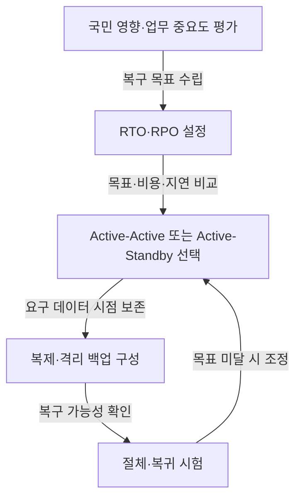

## 지식 로드맵 내 현재 위치

지식 위치: IT 전략·관리 → 재해복구·서비스 연속성 → **국가정보자원관리원 화재와 공공 디지털서비스 회복탄력성**

## 30초 인출

- 본질: 공공 디지털서비스 회복탄력성은 재난·장애 때 핵심 서비스를 유지하거나 정한 복구목표에 맞춰 회복하는 능력.
- 메커니즘: 국민 영향·업무 복구목표 설정 → 복구 방식 선택 → 서비스·데이터 보호 → 실제 절체·복귀 시험.

핵심 용어

- **공공 디지털서비스 회복탄력성**: 재난·장애 때 핵심 서비스를 유지하거나 정한 복구목표에 맞춰 회복하는 능력
- **RTO(Recovery Time Objective)** : 서비스 중단 후 업무 복구까지 허용하는 목표 시간.
- **RPO(Recovery Point Objective)** : 복구 데이터가 도달해야 할 시점으로 표현하는 허용 데이터 손실량.
- **Active-Active DR** : 복수 거점이 함께 서비스를 처리하는 재해복구 구성. 데이터 동기화·충돌 처리 설계 필요.
- **Active-Standby DR** : 평상시 주 시스템을 운영하고 장애 때 대기 시스템으로 전환하는 구성.
- **격리 백업** : 운영 환경과 분리된 매체·계정·네트워크에 복구 가능한 백업본을 보관하는 방식.
- **Split-Brain** : 연결 단절 뒤 복수 노드가 동시에 쓰기 주체로 동작해 데이터 불일치가 발생한 상태.
- **공통원인 장애** : 하나의 사건이 공유 전원·망·시설을 통해 여러 시스템에 함께 영향을 주는 장애.

---

## 1교시 예상문제 (10점)

> 국가정보자원관리원 화재 사례의 정보시스템 운영상 쟁점과 재해복구 시사점을 설명하시오. (예상·10점)

---

## 1교시 10점 답안

### Ⅰ. 정의·목적

| 구분 | 핵심 |
|---|---|
| 정의 | **공공 디지털서비스 회복탄력성**은 재난·장애 때 핵심 서비스를 유지하거나 정한 복구목표에 맞춰 회복하는 능력 |
| 목적 | 국민에게 필요한 행정서비스의 중단·데이터 손실 감소 |

### Ⅱ. 구성체계 및 방법론

### Ⅲ. 복구 통제

| 통제 대상 | 확인 내용 |
|---|---|
| **RTO·RPO** | 업무 영향과 데이터 손실 허용수준을 기준으로 목표 설정 |
| 복구 구성 | Active-Active와 Active-Standby의 비용·지연·전환 조건 비교 |
| 복구 시험 | 서비스 전환·데이터 정합성·업무 연계·원복 여부 확인 |

- 제언: 시스템 중요도와 실제 절체 시험 결과를 함께 고려한 복구 구성 조정.

---

## 2~4교시 예상문제 (25점)

> 국가정보자원관리원 화재로 드러난 공공 디지털서비스의 연속성 문제를 분석하고, 시스템 중요도별 재해복구체계와 검증 방안을 제시하시오. (예상)

---

## 2~4교시 25점 답안

## Ⅰ. 정의·목적

| 구분 | 핵심 |
|---|---|
| 정의 | **공공 디지털서비스 회복탄력성**은 재난·장애 때 핵심 서비스를 유지하거나 정한 복구목표에 맞춰 회복하는 능력 |
| 목적 | 국민에게 필요한 행정서비스의 중단·데이터 손실 감소 |

## Ⅱ. 화재 사례와 시사점

> 행정안전부 발표 기준 2025년 9월 26일 대전 본원 배터리 화재와 입주 정부 서비스 중단. 사고 사실과 구분할 복구체계 설계 기준: 서비스 중요도·의존성·목표.

| 확인된 사실 | 설계상 질문 |
|---|---|
| 대전 본원 배터리 화재와 정부 서비스 중단 | 같은 거점의 전원·망·공통 플랫폼 의존 여부 |
| 2026년 공공 정보시스템 등급의 국민 영향 중심 A1~A4 재분류 | 서비스 중요도의 복구 우선순위·목표 반영 여부 |
| 행안부가 재분류 배경으로 설명한 일부 저등급 시스템의 복구 지연 | 이용자 수·국민 생활 영향의 동시 고려 여부 |
| 행안부의 2026년 6월 일부 시스템 이중운영·대기형 DR 구축 ISP 착수 발표 | 계획·구축과 실제 복구 능력 검증의 구분 여부 |

## Ⅲ. 복구 설계와 검증 흐름

> 업무 중요도에서 시험 결과까지 이어지는 설계·검증 절차.

## Ⅳ. Active-Active와 Active-Standby 비교

| 기준 | Active-Active | Active-Standby |
|---|---|---|
| 평상시 | 복수 거점에서 서비스 처리 | 주 시스템 중심 운영, 보조계는 대기 |
| 장애 전환 | 트래픽·데이터 처리 연속성을 구성에 맞춰 전환 | 보조계 기동·전환 절차 수행 |
| 설계 부담 | 데이터 일관성·동시 쓰기·운영 복잡성 검토 | 복구 시간·대기계 최신성·전환 절차 검토 |
| 적합성 | 짧은 중단 목표와 투자 여건을 함께 검토 | 복구 허용시간과 비용 제약을 고려 |

## Ⅴ. 공통원인 장애와 복구 위험 대응

| 위험 | 대책 | 효과 |
|---|---|---|
| 공통 전원·통신·플랫폼 의존 | 거점·경로의 공통 의존성 분석과 분리 대안 검토 | 단일 사건의 복수 시스템 영향 감소 |
| **Split-Brain**·복제 지연 | 업무별 복제 방식·쓰기 주체·정합성 확인 절차 설계 | 데이터 손실·중복 쓰기 위험의 조기 식별 |
| 계획과 실제 복구 능력의 차이 | 서비스·외부 연계까지 포함한 절체·복귀 시험 | 목표 미달·절차 누락 확인 |

## Ⅵ. 기술사적 제언

| 한계 | 해결 방안 |
|---|---|
| 시스템 등급만으로 정해지지 않는 연계 서비스 복구 순서·종단 간 복구목표 | 등급별 핵심 업무·선행 시스템에 따른 복구 순서 설정과 실제 이용자 시나리오 기반의 종단 간 절체·복귀 검증 |

## 출제 이력과 검증 출처

- [행정안전부: 2025년 국가정보자원관리원 화재 및 정부 서비스 중단](https://www.mois.go.kr/frt/bbs/type010/commonSelectBoardArticle.do?bbsId=BBSMSTR_000000000008&nttId=120963)
- [행정안전부: 국가정보자원관리원 재해복구시스템(DR) 구축 ISP 착수](https://www.mois.go.kr/frt/bbs/type010/commonSelectBoardArticle.do?bbsId=BBSMSTR_000000000008&nttId=126963)
- [행정안전부: 공공 정보시스템 등급 전면 재조정](https://www.mois.go.kr/frt/bbs/type010/commonSelectBoardArticle.do?bbsId=BBSMSTR_000000000008&nttId=129047)

## 연결 토픽

- 이전 토픽: [공공부문 클라우드 네이티브 전환](./021_public_cloud_native_transition.md)
- 연관 토픽: [액티브-액티브 스토리지 DR](./027_active_active_storage_dr.md), [RTO·RPO](./018_rpo.md), [DRS](./042_drs.md)
- 다음 토픽: [국가 AI 전략](./024_korea_ai_action_plan.md)
