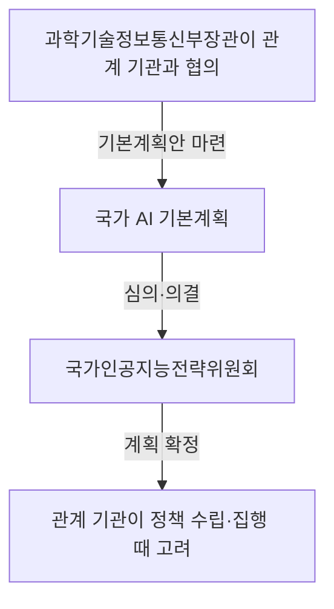

## 지식 로드맵 내 현재 위치

지식 위치: IT 전략·관리 → 국가 디지털정책·거버넌스 → **국가 AI 전략과 인공지능 행동계획**

## 30초 인출

- 본질: 국가 AI 전략은 AI 정책의 우선순위를 정하고 기본계획·관계 기관 사업으로 실행하는 정책 체계.
- 메커니즘: 과학기술정보통신부장관의 관계 기관 협의·3년 주기 기본계획 수립, **국가인공지능전략위원회**의 심의·의결, 관계 기관 정책 수립·집행 시 기본계획 고려.
- 핵심: 계획과 사업·예산·성과지표 간 연결, 법정 역할과 담당 기관 책임의 구분.

핵심 용어

- **국가 AI 전략과 인공지능 행동계획**: 국가 AI 정책의 우선순위를 기본계획과 관계 기관의 사업으로 실행하는 체계
- **인공지능 기본계획**: 과학기술정보통신부장관이 관계 기관과 협의해 3년마다 수립하는 국가 AI 정책 기본계획
- **국가인공지능전략위원회**: 국가 AI 정책의 주요 사항을 심의·의결하는 대통령 소속 위원회
- **인공지능기본법**: 인공지능의 건전한 발전과 신뢰 기반 조성을 위한 기본 법률
- **고영향 인공지능**: 사람의 생명·신체 안전 또는 기본권에 중대한 영향을 미치거나 위험을 초래할 우려가 있는 인공지능
- **성과지표(KPI)**: 정책·사업의 목표 달성 정도를 확인하기 위해 정한 지표

---

## 1교시 예상문제 (10점)

> 인공지능기본법상 국가 AI 기본계획의 수립·심의 체계와 실행상의 유의점을 설명하시오. (예상·10점)

---

## 1교시 10점 답안

### Ⅰ. 개요

| 구분 | 핵심 |
|---|---|
| 정의 | **국가 AI 전략과 인공지능 행동계획**은 AI 정책의 우선순위를 정하고 기본계획·관계 기관 사업으로 실행하는 정책 체계 |
| 목적 | 국가 정책의 일관성 제고와 관계 기관 사업·자원의 국가 AI 목표 연계 |

### Ⅱ. 법정 계획 수립·실행 흐름

### Ⅲ. 실행 관리

- **인공지능 기본계획** 목표와 관계 기관 사업·예산·측정 가능한 성과지표 간 연결.
- 계획 수립 주체·위원회 심의·의결·개별 사업 집행 주체의 역할 구분.
- **고영향 인공지능** 사업의 법률 적용 요건·의무 확인, 계획 성과와 법정 준수 여부의 분리 점검.

제언: 공통 사업·자원에서 관계 기관 간 중복 여부와 성과지표의 우선 검토.

---

## 2~4교시 예상문제 (25점)

> 인공지능기본법상 국가 AI 추진체계를 설명하고, 기본계획의 실행·성과관리상 문제점과 대응책을 제시하시오. (예상·25점)

---

## 2~4교시 25점 답안

## Ⅰ. 국가 AI 기본계획의 개요

| 구분 | 핵심 |
|---|---|
| 정의 | **국가 AI 전략과 인공지능 행동계획**은 AI 정책의 우선순위를 정하고 기본계획·관계 기관 사업으로 실행하는 정책 체계 |
| 목적 | 국가 정책의 일관성 제고와 관계 기관 사업·자원의 국가 AI 목표 연계 |

## Ⅱ. 기본계획 수립과 관계 기관의 실행

인공지능기본법 제6조에 따른 과학기술정보통신부장관의 관계 중앙행정기관장·지방자치단체장 협의와 3년 주기 기본계획 수립. **국가인공지능전략위원회**의 심의·의결, 관계 기관장의 정책 수립·집행 시 계획 고려. 10점 답안의 핵심 도해 재사용. 다음 계획 검토를 위한 이행 실적 활용.

## Ⅲ. 실행관리의 핵심 연결

기본계획 과제의 실제 사업화를 위한 목표·사업 책임자·예산·일정·성과지표의 연결. 법령상 고정 서식이 아닌 계획 이행 점검용 관리 기준.

| 관리 요소 | 확인 내용 | 근거 자료 |
|---|---|---|
| 목표 | 정책 목표와 사업 산출·성과의 연결 여부 | 계획·사업계획 |
| 책임 | 주관 기관·협조 기관 간 역할 구분 여부 | 기관별 업무분장 |
| 자원 | 예산·인력·데이터·연산자원의 일정 내 확보 여부 | 예산·조달·운영 기록 |
| 성과 | 산출량과 정책 효과의 구분 측정 여부 | 성과지표·평가 자료 |

## Ⅳ. 성과관리의 주요 문제와 대응

| 문제 | 대응 | 확인 기준 |
|---|---|---|
| 기관별 계획·예산 분리에 따른 중복 사업 | 공통 목표·기존 사업 대조와 협업·통합 가능성의 계획 검토 반영 | 중복 사업 검토 기록 |
| 투입액·서비스 건수 중심의 정책 성과 판단 | 산출지표와 이용자·산업·공공서비스 결과지표의 분리 설정 | 지표 정의·기준선·측정 주기 |
| 차기 계획과 분리된 연도별 사업 실적 | 성과 원인·미달 요인의 기록과 다음 계획·사업 설계 반영 | 이행 점검·개선 조치 |
| 법령상 신뢰 의무와 정책 성과의 혼합 | **고영향 인공지능** 해당 여부·적용 의무 확인, 준수 증거·정책 성과의 별도 관리 | 적용성 검토·준수 자료 |

## Ⅴ. 국가 AI 계획의 실행 관점

기본계획 과제 실행 시 진흥·기반·확산·신뢰 관점의 병행 검토. 답안의 분석 틀이며 법정 계획의 공식 분류명은 아님.

| 관점 | 점검할 내용 |
|---|---|
| 진흥 | 연구개발·인재·산업 생태계 목표와 사업 연계 |
| 기반 | 데이터·컴퓨팅·실증 환경의 확보와 공동 활용 |
| 확산 | 산업·공공 현장의 도입 여건과 이용 성과 |
| 신뢰 | 안전·투명성·책임 및 법령 적용 여부 |

## Ⅵ. 기술사적 제언 — 공통 사업·자원 우선 검토

| 문제 | 해결 방안 |
|---|---|
| 기존 공통 사업·자원과 분리된 기관별 사업 기획에 따른 중복 투자 가능성 | 신규 사업 검토 초기의 공통 자원 재사용 가능성·성능·보안 적합성·담당 기관 비교, 별도 구축 시 부족 요건·근거 기록 |

우선 검토 절차라는 제안의 성격, 법정 예산 심의·기관별 권한의 비대체성.

## 출제 이력과 검증 출처

- 공식 문제지 원문으로 확인한 직접 기출 없음
- [국가법령정보센터: 인공지능 발전과 신뢰 기반 조성 등에 관한 기본법 제6조](https://www.law.go.kr/lsLinkCommonInfo.do?lsJoLnkSeq=1031810275)
- [국가법령정보센터: 같은 법 제7조 국가인공지능전략위원회](https://www.law.go.kr/lsLinkCommonInfo.do?chrClsCd=010202&lsJoLnkSeq=1031809535)
- [국가법령정보센터: 같은 법 제35조 고영향 인공지능 영향평가](https://www.law.go.kr/lsLinkCommonInfo.do?chrClsCd=010202&lsJoLnkSeq=1031810855)

## 연결 토픽

- 이전 토픽: [국가정보자원관리원 화재](./023_national_information_resources_service_fire.md)
- 연관 토픽: [범정부 AI 공통기반](./025_pan_government_ai_common_infrastructure.md), [AI 거버넌스 플랫폼](./050_ai_governance_platform.md), [AI 고속도로](./051_ai_highway.md), [NIST AI RMF](./036_nist_ai_rmf.md)
- 다음 토픽: [범정부 AI 공통기반](./025_pan_government_ai_common_infrastructure.md)
