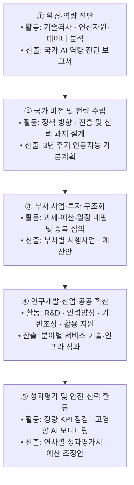
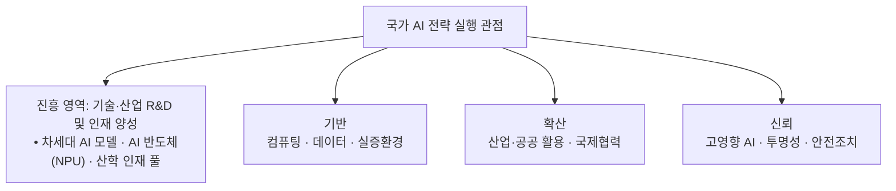
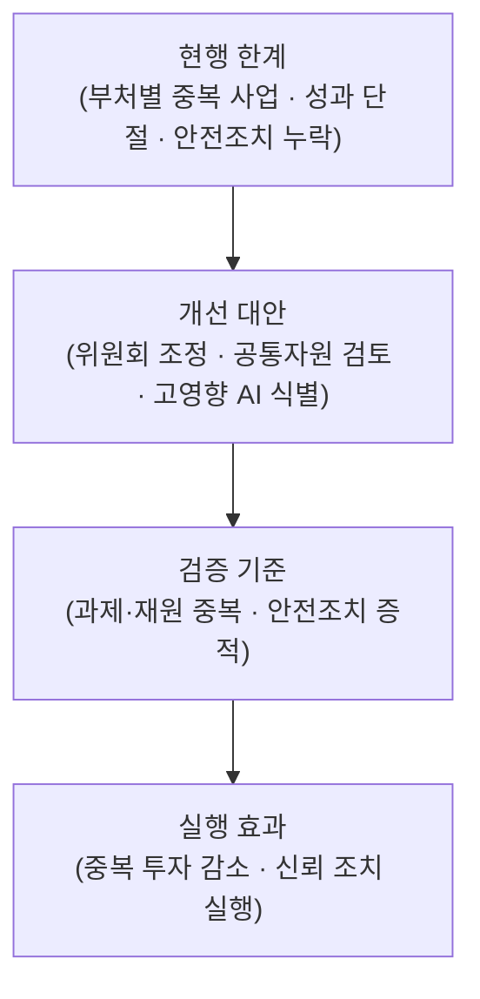

## 지식 로드맵 내 현재 위치

IT 전략·관리 → 국가 디지털정책·거버넌스 → **국가 AI 전략과 인공지능 행동계획**

## 30초 인출

- 본질: **국가 AI 전략과 인공지능 행동계획**은 국가 AI 정책 방향을 3년 주기 법정 기본계획과 관계기관 사업으로 연결하는 범정부 추진체계
- 메커니즘: 과기정통부 기본계획 수립 → 대통령 직속 국가인공지능전략위원회 심의·의결 → 부처별 시행사업 편성 및 예산 배분 → 연차별 이행점검 및 신뢰 환류
- 산출물: 3년 주기 인공지능 기본계획서 · 부처별 연차 시행계획서 · 고영향 AI 위험평가 및 KPI 성과점검서

핵심 용어

- **국가인공지능전략위원회**: 대통령 소속으로 AI 주요 정책을 심의·의결하는 위원회
- **인공지능 기본계획**: 과학기술정보통신부장관이 3년마다 수립하고 위원회 심의·의결을 거치는 법정 계획
- **AX(AI Transformation)**: 전 산업 및 공공 업무 전반에 인공지능을 내재화하여 생산성을 혁신하는 전환
- **인공지능기본법**: AI 산업 육성 지원과 고영향 AI 안전·신뢰성 확보 의무를 법제화한 기본 법령
- **고영향 AI(High-impact AI)**: 사람의 생명·신체·기본권에 중대한 영향을 미쳐 강화된 안전성 검증이 요구되는 AI
- **NPU(Neural Processing Unit)**: 딥러닝 연산에 최적화된 저전력·고효율 인공지능 전용 반도체
- **KPI(Key Performance Indicator)**: 정책 및 세부 사업의 목표 달성도를 정량 측정하는 핵심성과지표
- **소버린 AI(Sovereign AI)**: 외산 빅테크에 종속되지 않고 자국의 데이터와 인프라로 자체 AI 역량을 보유하는 전략

## 예상문제

> 인공지능기본법상 국가 AI 추진체계를 설명하고, 기본계획의 실행·성과관리상 문제점과 대응책을 제시하시오.

## Ⅰ. 국가 비전을 사업 단위로 구체화하는 국가 AI 전략의 개요

> 국가 비전을 법정 기본계획과 부처 사업으로 연결하고 이행점검 결과를 다음 정책에 환류해야 함.

- 정의: AI 진흥과 신뢰 기반 조성을 위해 기본계획·위원회·부처 사업을 연결하는 국가 정책체계
- 목적: 정책 정합성 확보 · 투자 조정 · 산업 진흥·신뢰 균형

## Ⅱ. 국가 AI 전략·행동계획의 대표 실행 흐름

> 다음은 전략을 사업·성과로 연결하는 대표 흐름이며, 법령이 정한 공식 고정 5단계가 아님.

- **Traceability**: 정책 방향 ↔ 기본계획 ↔ 실행과제 ↔ 성과지표의 양방향 연계

## Ⅲ. 기본계획을 읽는 4개 실행 관점

> 법정 기본계획의 다양한 내용을 **진흥**·**기반**·**확산**·**신뢰** 관점으로 묶으면 사업과 성과의 연결을 빠르게 점검할 수 있음.

| 영역 | 핵심 과제 | 확인사항 |
|---|---|---|
| **진흥** | 기술·산업 · 연구개발 · 인력양성 | 국가경쟁력 기여 |
| **기반** | 데이터 · 컴퓨팅 · 실증환경 | 공동활용·접근성 |
| **확산** | 산업·공공 활용 · 국제협력 | 현장 성과 |
| **신뢰** | 고영향 AI · 투명성 · 안전조치 | 법정 의무 이행 |

## Ⅳ. 인공지능 기본계획과 부처 시행사업 비교

> **인공지능 기본계획**이 국가적 방향성과 전략적 우선순위를 정의한다면, **부처 시행사업**은 구체적 예산·일정·수행 주체와 측정 가능한 성과를 실행하는 단위임.

| 기준 | 인공지능 기본계획 | 부처 시행사업 |
|---|---|---|
| **범위** | 국가 비전·중장기 정책 가이드라인 | 개별 부처별 단위 과제·세부 사업 |
| **책임** | 과기정통부 총괄 수립 · 위원회 심의·의결 | 관계 중앙행정기관 및 전담 기관 |
| **통제** | 정책·투자 정합성 및 중복성 검토 | 예산 집행율·일정 준수·성과 KPI 달성 |

## Ⅴ. 국가 AI 전략 실행의 문제점·대응책

> 부처별 분절 개발과 외산 독점 의존은 국가 AI 생태계의 최대 위험이므로 거버넌스적 통제와 **소버린 AI** 자립화가 필수적임.

| 위험 | 대책 | 효과 |
|---|---|---|
| 부처별 중복 발주 | 공통자원 재사용 검토 · 전략위원회 조정 | 중복 투자 감소 · 상호운용성 개선 |
| 컴퓨팅 인프라 병목 | 공동활용 자원 배분 · **NPU** 등 대안 실증 | 연산 접근성 확대 · 공급 집중 완화 |
| 고영향 AI 위험 | 법정 위험관리·설명·사람의 감독 · 영향평가 검토 | 안전조치 이행 증적 확보 |
| 데이터 활용 제약 | 적법한 가명처리·결합 · 합성데이터 검증 | 활용 범위 확대 · 재식별 위험 통제 |

## Ⅵ. 결론 — 법정 거버넌스·성과 환류 중심 실행

> 국가 AI 전략의 성공은 화려한 비전 선포가 아니라 **국가인공지능전략위원회** 중심의 부처 간 칸막이 제거와 **인공지능기본법**상 안전·신뢰 조치가 사업 기획 단계부터 관통되는 데 있음.

### 실전 답안용 기술사적 제언

- 판정: 부처 간 중복 투자를 사전 차단하고 고영향 AI 안전 의무를 사업 전주기에 반영하였는가
- 대안: **국가인공지능전략위원회** 조정 · 기존 공통자원 재사용 검토 · 고영향 AI 사전 식별
- 검증: 과제·재원 중복 여부 · 법정 안전조치·영향평가 검토 증적 확인
- 효과: 중복 투자 감소 · 안전·신뢰 조치의 실행력 확보

## 1교시 10점 답안 발췌

### 1. 정의·목적

- 정의: AI 진흥과 신뢰 기반 조성을 위해 기본계획·위원회·부처 사업을 연결하는 국가 정책체계
- 목적: 정책 정합성 확보 · 투자 조정 · 산업 진흥·신뢰 균형

### 2. 구성체계 및 방법론

### 3. 핵심 통제

- **국가인공지능전략위원회**: 국가 AI 주요 정책 심의·의결과 관계기관 정책 조정
- **범정부 AI 공통기반**: 공통 기능·컴퓨팅 자원의 공동 활용 후보
- **인공지능기본법**: 고영향 AI 사업자의 위험관리·설명·이용자 보호·사람의 감독·문서화 의무, 영향평가 노력 규정

## 출제 이력과 검증 출처

- [국가법령정보센터: 인공지능기본법 제6조 기본계획](https://www.law.go.kr/lsInfoP.do?lsiSeq=276241)
- [국가법령정보센터: 국가인공지능전략위원회 설치·운영 규정](https://www.law.go.kr/LSW/lsInfoP.do?ancYnChk=0&chrClsCd=010202&efYd=20260102&lsiSeq=280929&urlMode=lsInfoP)

## 학습 체크

- [ ] Ⅰ 개요: 국가 AI 전략의 비전·거버넌스·실행체계를 설명할 수 있는가?
- [ ] Ⅱ 실행 흐름: 진단부터 성과 환류까지 활동·산출을 연결할 수 있는가?
- [ ] Ⅲ 전략 축: 인프라·데이터·AX·안전·신뢰의 과제를 구분할 수 있는가?
- [ ] Ⅳ 비교: 국가 전략과 행동계획의 성격·책임·통제 차이를 비교할 수 있는가?
- [ ] Ⅴ 문제점·대응책: 중복 투자·인프라 병목·고영향 AI·데이터 제약의 위험·대책·효과를 연결할 수 있는가?
- [ ] Ⅵ 결론: 법정 거버넌스와 성과 환류의 판정·대안·검증·효과를 제시할 수 있는가?

## 연결 토픽

- 이전 토픽: [국가정보자원관리원 화재](./023_national_information_resources_service_fire.md)
- 연관 토픽: [범정부 AI 공통기반](./025_pan_government_ai_common_infrastructure.md), [AI 거버넌스 플랫폼](./050_ai_governance_platform.md), [AI 고속도로](./051_ai_highway.md), [NIST AI RMF](./036_nist_ai_rmf.md)
- 다음 토픽: [범정부 AI 공통기반](./025_pan_government_ai_common_infrastructure.md)
