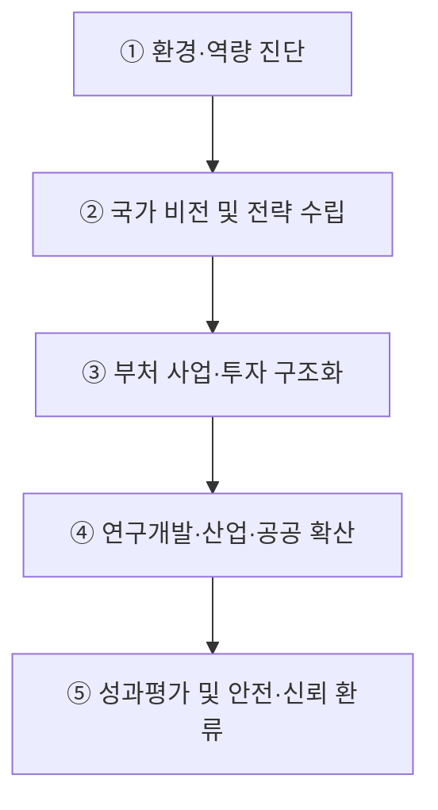
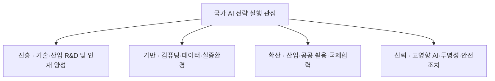
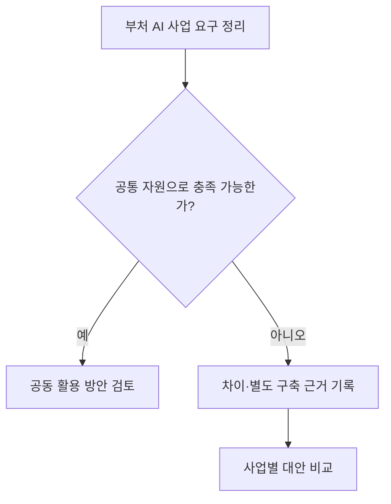

## 지식 로드맵 내 현재 위치

지식 위치: IT 전략·관리 → 국가 디지털정책·거버넌스 → **국가 AI 전략과 인공지능 행동계획**

## 30초 인출

- 본질: 국가 AI 전략과 인공지능 행동계획은 국가의 AI 정책 방향을 기본계획과 부처별 사업으로 옮기는 추진 계획이다.
- 메커니즘: 과기정통부 기본계획 수립 → 대통령 직속 **국가인공지능전략위원회** 심의·의결 → 부처별 시행사업 편성 및 예산 배분 → 연차별 이행점검 및 신뢰 환류한다.
- 산출물: 3년 주기 **인공지능 기본계획** 서 · 부처별 연차 시행계획서 · **고영향 AI** 위험평가 및 **KPI** 성과점검서이다.

핵심 용어

- **국가인공지능전략위원회** : 국가 AI 정책 및 전략을 심의·의결하는 대통령 직속 최상위 의사결정 거버넌스 기구
- **인공지능 기본계획** : 과기정통부장관이 3년마다 수립하여 국가인공지능전략위원회 심의를 거치는 법정 중장기 기본계획
- **AX(AI Transformation)** : 전 산업과 공공 영역에 AI를 내재화하여 업무 방식과 비즈니스 모델을 재혁신하는 AI 전환
- **인공지능기본법** : AI 산업 진흥 및 혁신 기반 조성과 고영향 AI의 안전성·신뢰성 확보 의무를 규정한 기본 법률
- **고영향 AI(High-impact AI)** : 인간의 생명·신체·기본권에 중대한 영향을 미칠 우려가 있어 안전성 확보 조치가 요구되는 AI
- **NPU(Neural Processing Unit)** : 딥러닝 추론 및 학습 연산에 최적화된 저전력·고효율 인공지능 전용 신경망 처리 장치
- **KPI(Key Performance Indicator)** : 정책 과제와 세부 사업의 목표 달성도를 정량적으로 측정·평가하는 핵심 성과 지표
- **소버린 AI(Sovereign AI)** : 국가의 독자적 데이터·인프라·파운데이션 모델을 기반으로 기술 주권과 안보를 확보하는 전략

---

## 1교시 예상문제 (10점)

> 국가 AI 전략과 인공지능 행동계획의 실행 체계 및 성과 통제를 설명하시오. (예상·10점)

---

## 1교시 10점 답안

### Ⅰ. 정의·목적

- 정의: AI 진흥과 신뢰 기반 조성을 위해 기본계획·위원회·부처 사업을 연결하는 국가 정책체계
- 목적: 정책 정합성 확보 · 투자 조정 · 산업 진흥·신뢰 균형

### Ⅱ. 구성체계 및 방법론

### Ⅲ. 핵심 통제

- **국가인공지능전략위원회** : 국가 AI 주요 정책 심의·의결과 관계기관 정책 조정
- **범정부 AI 공통기반** : 공통 기능·컴퓨팅 자원의 공동 활용 후보
- **인공지능기본법** : 고영향 AI 사업자의 위험관리·설명·이용자 보호·사람의 감독·문서화 의무, 영향평가 노력 규정

---

## 2~4교시 예상문제 (25점)

> 인공지능기본법상 국가 AI 추진체계를 설명하고, 기본계획의 실행·성과관리상 문제점과 대응책을 제시하시오.

---

## 2~4교시 25점 답안

## Ⅰ. 국가 비전을 사업 단위로 구체화하는 국가 AI 전략의 개요

> 국가 AI 전략을 기본계획과 부처 사업에 반영하고, 추진 결과를 확인해 다음 계획에 반영한다.

| 구분 | 핵심 |
|---|---|
| 정의 | **인공지능 기본계획** , **국가인공지능전략위원회** , 부처별 시행사업을 연결해 AI 진흥과 신뢰를 추진하는 국가 정책체계 |
| 목적 | 정책 정합성을 확보하고 **고영향 AI** 안전·신뢰와 산업 진흥 사이의 투자를 조정하는 것 |

## Ⅱ. 국가 AI 전략·행동계획의 대표 실행 흐름

> 다음은 전략을 사업·성과로 연결하는 대표 흐름이며, 법령이 정한 공식 고정 5단계가 아님.

| 단계 | 활동 | 산출 |
|---|---|---|
| ① 환경·역량 진단 | 기술격차·연산자원·데이터 분석 | 국가 AI 역량 진단 보고서 |
| ② 국가 비전 및 전략 수립 | 정책 방향·진흥 및 신뢰 과제 설계 | 3년 주기 인공지능 기본계획 |
| ③ 부처 사업·투자 구조화 | 과제-예산-일정 매핑 및 중복 심의 | 부처별 시행사업·예산안 |
| ④ 연구개발·산업·공공 확산 | R&D·인력양성·기반조성·활용 지원 | 분야별 서비스·기술·인프라 성과 |
| ⑤ 성과평가 및 안전·신뢰 환류 | 정량 KPI 점검·고영향 AI 모니터링 | 연차별 성과평가서·예산 조정안 |

- **Traceability** : 정책 방향 ↔ 기본계획 ↔ 실행과제 ↔ 성과지표의 양방향 연계

## Ⅲ. 기본계획을 읽는 4개 실행 관점

> 법정 기본계획의 다양한 내용을 **진흥** · **기반** · **확산** · **신뢰** 관점으로 묶으면 사업과 성과의 연결을 빠르게 점검할 수 있음.

| 영역 | 핵심 과제 | 확인사항 |
|---|---|---|
| **진흥** | 기술·산업 · 연구개발 · 인력양성 | 국가경쟁력 기여 |
| **기반** | 데이터 · 컴퓨팅 · 실증환경 | 공동활용·접근성 |
| **확산** | 산업·공공 활용 · 국제협력 | 현장 성과 |
| **신뢰** | 고영향 AI · 투명성 · 안전조치 | 법정 의무 이행 |

## Ⅳ. 인공지능 기본계획과 부처 시행사업 비교

> **인공지능 기본계획** 이 국가적 방향성과 전략적 우선순위를 정의한다면, **부처 시행사업** 은 구체적 예산·일정·수행 주체와 측정 가능한 성과를 실행하는 단위임.

| 기준 | 인공지능 기본계획 | 부처 시행사업 |
|---|---|---|
| **범위** | 국가 비전·중장기 정책 가이드라인 | 개별 부처별 단위 과제·세부 사업 |
| **책임** | 과기정통부 총괄 수립 · 위원회 심의·의결 | 관계 중앙행정기관 및 전담 기관 |
| **통제** | 정책·투자 정합성 및 중복성 검토 | 예산 집행율·일정 준수·성과 KPI 달성 |

## Ⅴ. 국가 AI 전략 실행의 문제점·대응책

> 부처별 분절 개발과 외산 독점 의존은 국가 AI 생태계의 최대 위험이므로 거버넌스적 통제와 **소버린 AI** 자립화가 필수적임.

| 위험 | 대책 | 효과 |
|---|---|---|
| 부처별 중복 발주 | 공통자원 재사용 검토 · 전략위원회 조정 | 중복 투자 감소 · 상호운용성 개선 |
| 컴퓨팅 인프라 병목 | 공동활용 자원 배분 · **NPU** 등 대안 실증 | 연산 접근성 확대 · 공급 집중 완화 |
| 고영향 AI 위험 | 법정 위험관리·설명·사람의 감독 · 영향평가 검토 | 안전조치 이행 증적 확보 |
| 데이터 활용 제약 | 적법한 가명처리·결합 · 합성데이터 검증 | 활용 범위 확대 · 재식별 위험 통제 |

## Ⅵ. 기술사적 제언 — 공통 자원 재사용 가능성부터 판단

> 제안: 부처별 신규 AI 사업을 검토할 때 기존 공동 활용 자원으로 요구 성능·보안 조건을 충족할 수 있는지 먼저 확인하고, 충족하지 못하는 부분에만 별도 구축 근거를 요구한다.

Ⅴ절은 국가 전략 실행의 여러 위험을 다뤘다. 이 제안은 **중복 투자 가능성을 어떤 순서로 판단할지** 정한 사업 기획 방법이며, 특정 기관의 법정 예산 심의 절차를 새로 만든다는 뜻은 아니다.

## 출제 이력과 검증 출처

- [국가법령정보센터: 인공지능기본법 제6조 기본계획](https://www.law.go.kr/lsInfoP.do?lsiSeq=276241)
- [국가법령정보센터: 국가인공지능전략위원회 설치·운영 규정](https://www.law.go.kr/LSW/lsInfoP.do?ancYnChk=0&chrClsCd=010202&efYd=20260102&lsiSeq=280929&urlMode=lsInfoP)

## 연결 토픽

- 이전 토픽: [국가정보자원관리원 화재](./023_national_information_resources_service_fire.md)
- 연관 토픽: [범정부 AI 공통기반](./025_pan_government_ai_common_infrastructure.md), [AI 거버넌스 플랫폼](./050_ai_governance_platform.md), [AI 고속도로](./051_ai_highway.md), [NIST AI RMF](./036_nist_ai_rmf.md)
- 다음 토픽: [범정부 AI 공통기반](./025_pan_government_ai_common_infrastructure.md)
