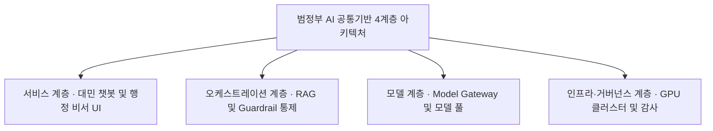
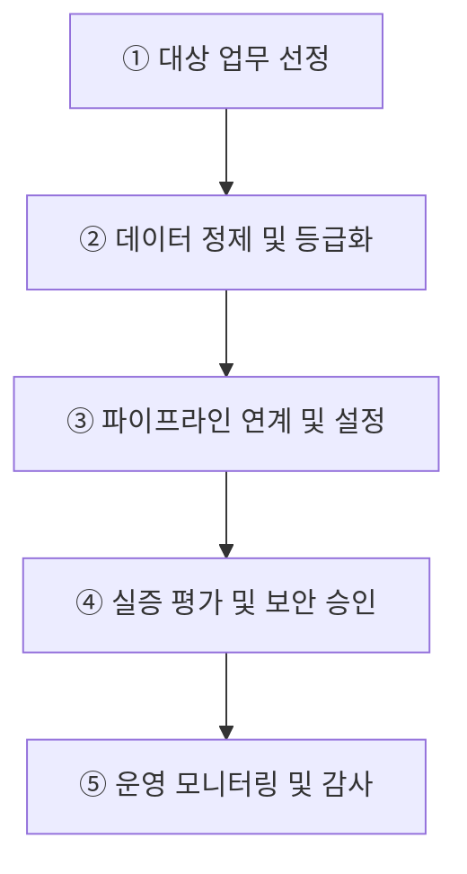
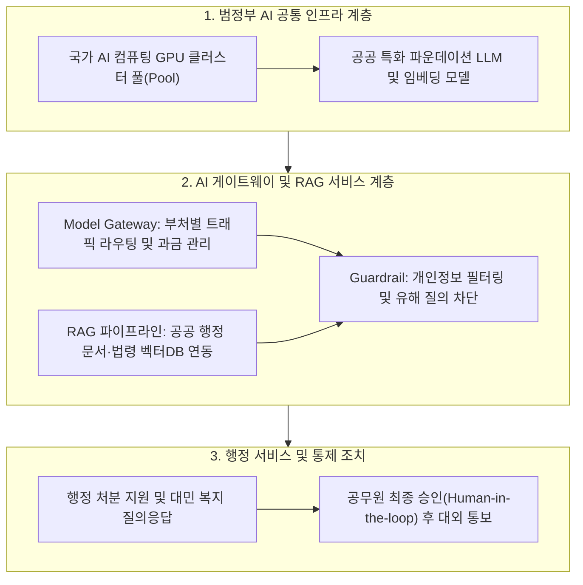

## 지식 로드맵 내 현재 위치

지식 위치: IT 전략·관리 → 공공 디지털정책·AI 플랫폼 → **범정부 AI 공통기반**

## 30초 인출

- 본질: 범정부 AI 공통기반은 공공기관이 AI 모델과 연산자원·개발 도구를 함께 쓰도록 제공하는 플랫폼이다. 기관별 중복 구축을 줄이고 사용을 관리한다.
- 메커니즘: 행정 수요 발굴 → 공공 지식 데이터 **RAG** 벡터화 → **Model Gateway** 라우팅 및 안전 **가드레일** ( **Guardrail** ) 통제 → 파운데이션 모델 추론 → 기관별 업무절차·권한통제 연계한다.
- 산출물: 공공 AI 서비스 연계 표준 규격서 · 공공 지식 벡터 인덱스 · 책임성 보증을 위한 감사로그 및 **RACI** 매트릭스이다.

핵심 용어

- **LLM(Large Language Model)** : 방대한 텍스트 코퍼스를 사전 학습하여 인간 수준의 언어 이해와 생성 능력을 제공하는 거대 언어 모델
- **sLLM(Small Language Model)** : 매개변수 규모를 경량화하여 특정 행정 도메인에 특화 및 온프레미스 구축이 용이한 소형 언어 모델
- **RAG(Retrieval-Augmented Generation)** : 외부 공공 지식베이스를 벡터 검색하여 최신성 확보와 할루시네이션을 방지하는 검색 증강 생성 기법
- **Model Gateway** : 다중 파운데이션 모델에 대해 통합 진입점을 제공하고 라우팅·캐싱·로드밸런싱·폴백을 관장하는 중계 게이트웨이
- **Guardrail(가드레일)** : 사용자 프롬프트와 모델 출력의 유해성·개인정보 유출·탈옥 시도를 실시간 필터링하는 안전 제어 장치
- **API(Application Programming Interface)** : 개별 공공시스템이 공통기반의 AI 서비스를 유연하게 호출하고 연동하기 위한 표준 인터페이스 규격
- **TCO(Total Cost of Ownership)** : 부처별 AI 개별 구축에 따른 중복투자를 방지하고 공동 활용을 통해 절감하는 총 소유비용
- **RACI** : 공공 AI 도입 및 운영 과정에서 실무자(R)·책임자(A)·자문자(C)·통보자(I)의 행정적 책무를 명확화하는 책임 매트릭스

---

## 1교시 예상문제 (10점)

> 범정부 AI 공통기반의 활용 절차와 행정 책임·검증 통제를 설명하시오. (예상·10점)

---

## 1교시 10점 답안

### 1. 정의·목적

- 정의: 행정·공공기관이 AI 모델·GPU 등 AI 자원을 공동 활용하도록 지원하는 도입·활용 체계
- 목적: 중복투자 완화 · 도입기간 단축 · 안전한 공공 활용

### 2. 구성체계 및 방법론

### 3. 핵심 통제

- **RAG(Retrieval-Augmented Generation)** : 공공 행정 문서 기반 지식 검색 결합을 통한 환각 방지
- **Guardrail** : 유해 프롬프트, 개인정보(PII) 유출, 적대적 공격 실시간 필터링
- **기술사적 제언 — Human-in-the-loop** : 개별 법령·업무절차에 맞춰 권한 있는 담당자의 검토와 예외처리를 두는 공학적 안전대책

---

## 2~4교시 예상문제 (25점)

> 범정부 AI 공통기반의 개념과 활용 절차를 설명하고, 데이터 보호·결과 검증·행정 책임 관점의 문제점과 대응책을 제시하시오.

---

## 2~4교시 25점 답안

## Ⅰ. 공공 AX 촉진과 중복투자 방지를 위한 범정부 AI 공통기반의 개요

> 개별 기관의 자체 LLM 구축에 따른 예산 낭비를 차단하며, 성패는 단순 API 제공이 아닌 **공공 RAG 정확도** 와 **행정 데이터 격리** 로 판정함.

| 구분 | 핵심 |
|---|---|
| 정의 | 행정·공공기관이 **LLM(Large Language Model)** , **GPU** , **RAG(Retrieval-Augmented Generation)** 를 공동 활용하는 범정부 AI 플랫폼 체계 |
| 목적 | **Model Gateway** 와 **Guardrail** 로 중복투자를 줄이고 안전한 공공 AI 활용을 지원하는 것 |

## Ⅱ. 범정부 AI 공통기반의 대표 활용 흐름

> 다음은 공공부문 AI 도입·활용 가이드를 답안용으로 압축한 대표 흐름임.

| 단계 | 활동 | 산출 |
|---|---|---|
| ① 대상 업무 선정 | 행정 수요 발굴·AI 적합성 및 ROI 분석 | 업무 적용 타당성 평가서 |
| ② 데이터 정제 및 등급화 | 공공문서 수집·비식별화 및 벡터화 | 공공 지식 데이터셋·보안 등급표 |
| ③ 파이프라인 연계 및 설정 | 공통 API 연동·프롬프트 및 Guardrail 설정 | 서비스 연계 설정서 |
| ④ 실증 평가 및 보안 승인 | 환각률·편향성 시험 및 보안 승인 | 신뢰성 평가 보고서 |
| ⑤ 운영 모니터링 및 감사 | 모델 드리프트·토큰 FinOps·감사로그 | 월간 운영 및 비용 분석서 |

- **Traceability** : 행정 수요 ↔ API 호출 ↔ RAG 근거 ↔ 승인·감사로그의 양방향 추적

## Ⅲ. 범정부 AI 공통기반 4계층 참조 아키텍처

> 서비스 인터페이스부터 기반 인프라까지 4계층으로 분리하여 **공통자원의 재사용성** 과 **기관별 데이터 격리 보안** 을 동시에 달성함.

| 계층 | 구성 | 통제 |
|---|---|---|
| **서비스** | 행정업무·대민서비스 | 이용자 확인 · 적법한 업무절차·권한 연계 |
| **AI 기능** | 모델 호출 · RAG · Workflow | 출처·품질 검증 |
| **공통자원** | AI 모델 · GPU · API | 기관·데이터 격리 |
| **거버넌스** | Guardrail · 권한 · Log | 보안·감사·책임 |

## Ⅳ. 개별 기관 독자 구축 vs 범정부 AI 공통기반 활용 비교

> 개별 기관 독자 구축의 예산 중복과 운영 부담을 해소하고, 공통자원 재사용과 기관별 데이터 보안 격리의 최적 균형점을 확보해야 함.

| 기준 | 개별 기관 독자 구축 | 범정부 AI 공통기반 활용 |
|---|---|---|
| 조달 | 기관별 모델·연산자원 확보 | 공통 모델·연산자원 공동 활용 |
| 도입 | 인프라부터 개별 구축 | 표준 API·공통 기능 재사용 |
| 책임 | 기관별 기술·업무 통제 | 공통 기술통제 + 이용기관의 법정 권한·책임에 따른 업무 판단 |
| 비용 | 운영·라이선스 중복 가능 | **TCO(Total Cost of Ownership)** 통합 관리 |

## Ⅴ. 공공 AI 실무 위험 및 거버넌스 통제 방안

> 공공 행정 특유의 법적·윤리적 부작용을 통제하기 위해 공학적 안전망과 관리적 책임을 결합해야 함.

| 위험 | 대책 | 효과 |
|---|---|---|
| 근거 없는 응답 | **RAG(Retrieval-Augmented Generation)** · 출처 표시 · 불확실 응답 보류 | 근거 확인 없는 업무 적용 감소 |
| 개인정보 유출 | 입력 마스킹 · 접근통제 · DLP 연계 | 민감정보 노출 경로 축소 |
| 프롬프트 인젝션 | 입력·출력 **Guardrail** · 도구 권한 최소화 | 비인가 데이터·도구 접근 차단 |
| 책임 소재 모호 | 플랫폼 운영책임, 행정청의 처분 권한·책임, 담당자 검토절차를 **RACI** 로 구분 | 기술 운영과 행정 판단 책임 구분 |

## Ⅵ. 결론 — 권한·책임 분리와 사람 검토 중심의 기술사적 제언

> 행정청의 처분 권한·책임과 담당자의 검토 행위는 구별해야 한다. 자동적 처분의 허용 여부와 사람 검토의 필요 수준은 개별 법령·업무절차에 따라 판단하고, 고영향·권리영향 업무에는 **Human-in-the-loop** 를 공학적 안전대책으로 우선 검토한다.

### 실전 답안용 기술사적 제언

- 문제: 공공기관별 초거대 AI 도입 시 고가의 GPU 인프라 중복 구축과 AI 생성 답변의 환각(Hallucination)으로 인한 행정 오류 및 데이터 유출 리스크가 발생함.
- 해결 방안: 범정부 AI 공통기반을 통해 고성능 GPU와 표준 LLM API를 중앙 집약적으로 제공하고, 행정 신뢰도 확보를 위한 법령·내부 규정 기반 RAG(검색증강생성)와 주요 처분에 대한 공무원의 Human-in-the-loop 검토를 제도화함.

## 출제 이력과 검증 출처

- 공식 문제지 원문으로 확인한 직접 기출 없음
- [NIA: 공공부문 AI 도입·활용 가이드](https://www.nia.or.kr/site/nia_kor/ex/bbs/View.do?bcIdx=29526&cbIdx=37989)
- [행정안전부: 범정부 AI 공통기반 서비스 개시](https://www.mois.go.kr/frt/bbs/type010/commonSelectBoardArticle.do?bbsId=BBSMSTR_000000000008&nttId=121943)
- [행정안전부: AI 법령 비서 시범 개시](https://www.mois.go.kr/frt/bbs/type010/commonSelectBoardArticle.do?bbsId=BBSMSTR_000000000008&nttId=127770)

## 연결 토픽

- 이전 토픽: [국가 AI 전략과 인공지능 행동계획](./024_korea_ai_action_plan.md)
- 연관 토픽: [AI 거버넌스 플랫폼](./050_ai_governance_platform.md), [AI 고속도로](./051_ai_highway.md), [공공부문 클라우드 네이티브 전환](./021_public_cloud_native_transition.md)
- 다음 토픽: [소프트웨어 사업 대가산정](./026_software_cost_estimation.md)
