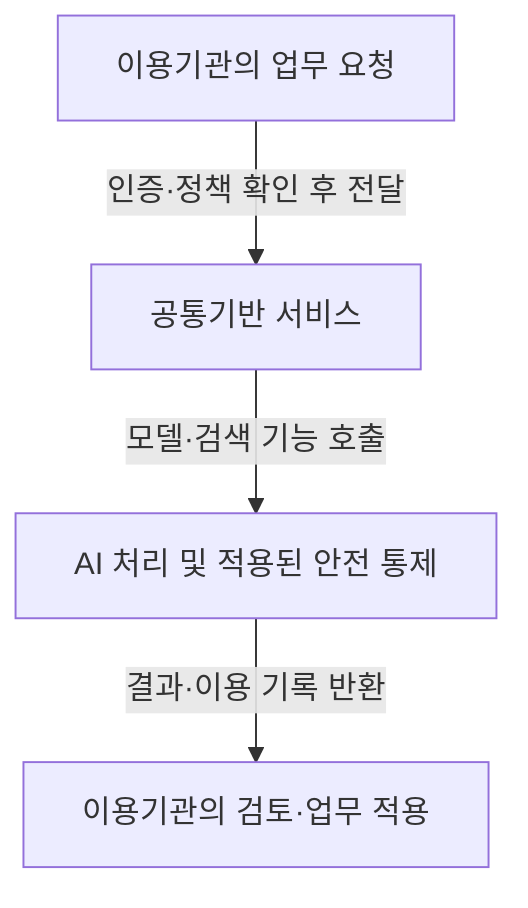

## 지식 로드맵 내 현재 위치

지식 위치: IT 전략·관리 → 공공 디지털정책·AI 플랫폼 → **범정부 AI 공통기반**

## 30초 인출

- 본질: 범정부 AI 공통기반은 여러 행정기관이 AI 서비스·기반 자원을 공동 활용하도록 지원하는 공공 플랫폼.
- 메커니즘: 이용기관의 서비스 호출과 플랫폼의 모델·검색 기능·안전 통제 적용, 결과 반환.
- 핵심: 공통 기술 운영과 개별 행정업무의 적법성·최종 판단 책임 구분, 데이터 접근·이용 기록 관리.

핵심 용어

- **범정부 AI 공통기반**: 여러 행정기관이 공통 AI 서비스와 기반 자원을 공동 활용하도록 제공하는 플랫폼
- **대규모 언어모델(LLM)**: 대량의 언어 자료로 학습해 문장을 이해하고 생성하는 모델
- **검색증강생성(RAG)**: 외부 자료를 검색해 그 근거를 생성 모델 입력에 함께 사용하는 방식
- **모델 게이트웨이(Model Gateway)**: 요청을 적절한 모델이나 AI 서비스로 전달하고 호출을 관리하는 중계 기능
- **가드레일(Guardrail)**: 입력·출력 또는 도구 호출에 정해진 안전 정책을 적용하는 통제 기능
- **역할·책임 매트릭스(RACI)**: 업무의 수행·최종 책임·자문·통보 역할을 구분하는 표

---

## 1교시 예상문제 (10점)

> 범정부 AI 공통기반에 관하여 설명하시오. (예상·10점)

---

## 1교시 10점 답안

### Ⅰ. 개요

| 구분 | 핵심 |
|---|---|
| 정의 | **범정부 AI 공통기반**은 여러 행정기관이 AI 서비스·기반 자원을 공동 활용하도록 지원하는 공공 플랫폼 |
| 목적 | 기관별 중복 구축 완화와 공통 AI 서비스의 안전·책임 있는 이용 지원 |

### Ⅱ. 요청 처리의 핵심 흐름

### Ⅲ. 책임 구분

- 플랫폼 운영자의 공통 서비스 접근통제·운영기록·보안 설정 관리.
- 이용기관의 데이터 이용 적법성·업무 적용 조건·결과 검토·행정상 최종 판단 관리.
- **역할·책임 매트릭스(RACI)** 등을 통한 업무별 책임자·승인 절차 명확화.

제언: 공통기반 이용 전 기관별 데이터 경계·결과 검토 책임자 지정.

---

## 2~4교시 예상문제 (25점)

> 범정부 AI 공통기반의 구성과 이용 흐름을 설명하고, 데이터 보호·결과 검증·행정 책임의 위험 및 대응책을 제시하시오. (예상·25점)

---

## 2~4교시 25점 답안

## Ⅰ. 범정부 AI 공통기반의 개요

| 구분 | 핵심 |
|---|---|
| 정의 | **범정부 AI 공통기반**은 여러 행정기관이 AI 서비스·기반 자원을 공동 활용하도록 지원하는 공공 플랫폼 |
| 목적 | 기관별 중복 구축 완화와 공통 AI 서비스의 안전·책임 있는 이용 지원 |

## Ⅱ. 공통기반의 요청 처리와 이용기관의 업무 적용

요청에 따른 플랫폼의 공통 기능 제공과 이용기관의 결과 수신·업무 적용. AI 출력만으로 플랫폼에 이전되지 않는 행정 판단·법적 책임.

| 처리 지점 | 주요 확인 |
|---|---|
| 요청 전 | 이용자·업무 권한, 입력 데이터의 이용 근거, 민감정보 포함 여부 |
| 공통기반 내부 | 접근통제, 선택 모델·검색 기능, 적용 안전 정책·호출 기록 |
| 결과 활용 | 근거 확인, 오류·편향 검토, 업무 담당자의 수정·승인 |

## Ⅲ. 공통기반의 논리 구성

기능상 구분 가능한 서비스 인터페이스·AI 기능·공통 자원·운영 통제. 아래 표는 참조 관점이며 모든 구현에 동일한 계층 구조를 요구하지 않음.

| 구성 영역 | 예시 | 관리 초점 |
|---|---|---|
| 이용 서비스 | 기관 업무 시스템·사용자 화면 | 사용자·업무 권한 |
| AI 기능 | 모델 호출·검색·업무 흐름 | 정확도·근거·안전 정책 |
| 공통 자원 | 모델·연산 자원·API | 용량·가용성·기관별 격리 |
| 운영 통제 | 계정·정책·로그·감사 | 접근·변경·사고 추적 |

## Ⅳ. 개별 구축과 공통기반 활용의 비교

| 기준 | 기관별 개별 구축 | 범정부 공통기반 활용 |
|---|---|---|
| 자원 | 기관별 조달·운영 | 공통 자원의 재사용 가능 |
| 변경 | 기관 요구에 맞춰 자체 조정 | 공통 기능과 기관별 요구의 조정 필요 |
| 데이터 | 기관 내부에서 직접 통제 | 전달 범위·저장·처리 경계 확인 필요 |
| 책임 | 기관이 기술·업무 운영을 함께 부담 | 플랫폼 운영과 이용기관 업무 판단의 책임을 구분 |

## Ⅴ. 주요 위험과 통제

| 위험 | 대응 | 확인 자료 |
|---|---|---|
| 권한 없는 데이터의 요청 포함 | 최소 수집, 역할 기반 접근, 민감정보 처리 기준 적용 | 권한·접근 기록 |
| 부정확한 생성 결과·불명확한 근거 | 필요한 경우 **검색증강생성(RAG)** 적용, 출처 확인·사람 검토 | 검색 근거·검토 기록 |
| 모델 출력의 정책 우회·외부 도구 오용 | 입력·출력 정책·도구 권한 제한과 시험 | 정책 설정·시험 결과 |
| 플랫폼 운영·행정 판단 책임의 혼재 | **역할·책임 매트릭스(RACI)** 등을 통한 운영·검토·승인 주체 구분 | 책임 분장·승인 기록 |

## Ⅵ. 기술사적 제언 — 업무 적용 전 데이터 경계 확인

| 문제 | 해결 방안 |
|---|---|
| 공통기반 연결 후 데이터 전달·보관 경계 확인에 따른 불필요한 노출 위험 | 업무 연계 전 데이터 항목별 이용 근거·전달 대상·보관 여부·기간·접근 주체 지정, 필요한 최소 항목만 호출 경로에 포함 |

연계 설계 우선순위에 관한 제안으로, 각 기관의 법령상 데이터 처리 의무를 대체하지 않음.

## 출제 이력과 검증 출처

- 공식 문제지 원문으로 확인한 직접 기출 없음
- [NIA: 공공부문 AI 도입·활용 가이드](https://www.nia.or.kr/site/nia_kor/ex/bbs/View.do?bcIdx=29526&cbIdx=37989)
- [행정안전부: 범정부 AI 공통기반 서비스 개시](https://www.mois.go.kr/frt/bbs/type010/commonSelectBoardArticle.do?bbsId=BBSMSTR_000000000008&nttId=121943)
- [행정안전부: AI 법령 비서 시범 개시](https://www.mois.go.kr/frt/bbs/type010/commonSelectBoardArticle.do?bbsId=BBSMSTR_000000000008&nttId=127770)

## 연결 토픽

- 이전 토픽: [국가 AI 전략과 인공지능 행동계획](./024_korea_ai_action_plan.md)
- 연관 토픽: [AI 거버넌스 플랫폼](./050_ai_governance_platform.md), [AI 고속도로](./051_ai_highway.md), [공공부문 클라우드 네이티브 전환](./021_public_cloud_native_transition.md)
- 다음 토픽: [소프트웨어 사업 대가산정](./026_software_cost_estimation.md)
