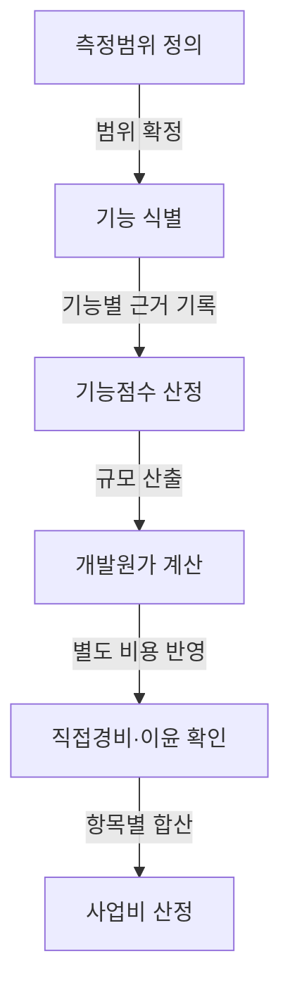
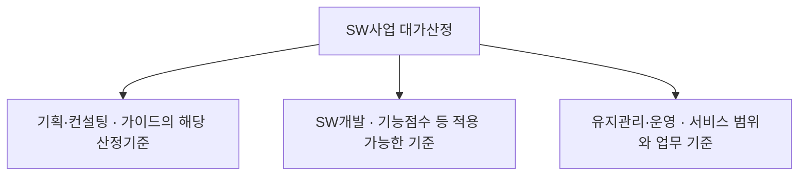

## 지식 로드맵 내 현재 위치

지식 위치: IT 전략·관리 → 공공 SW사업 관리 → **SW사업 대가산정**

## 30초 인출

- 본질: SW사업 대가산정은 사업 유형과 범위에 맞는 기준을 적용해 적정 사업 대가를 산출하는 활동이다.
- 메커니즘: 사업 유형·범위 확정 → 적합한 산정방식 선택 → 원가 항목과 산출근거 계산 → 예산·계약에 반영 → 과업 변경 시 영향 검토.

핵심 용어

- **SW사업 대가산정**: 사업 유형과 범위에 맞는 기준을 적용해 적정 사업 대가를 산출하는 활동
- **FP(Function Point, 기능점수)**: 사용자가 인식하는 기능 규모를 정량화하는 소프트웨어 규모 측정 단위
- **ILF(Internal Logical File, 내부논리파일)**: 측정 대상 시스템이 유지·관리하는 논리 데이터 그룹
- **EIF(External Interface File, 외부연계파일)**: 측정 대상 시스템이 참조하지만 다른 시스템이 유지·관리하는 논리 데이터 그룹
- **EI(External Input, 외부입력)**: 경계 밖에서 들어와 내부 논리 파일을 유지하는 기능
- **EO(External Output, 외부출력)**: 경계 밖으로 나가는 계산·파생 정보를 제공하는 기능
- **EQ(External Inquiry, 외부조회)**: 경계 밖 요청에 계산·파생 데이터 없이 정보를 제공하는 조회 기능
- **과업심의위원회**: 소프트웨어사업 과업의 확정·변경 등 법령에서 정한 사항을 심의하는 위원회

---

## 1교시 예상문제 (10점)

> SW사업 대가산정의 사업유형별 방식과 산정·변경 통제를 설명하시오. (예상·10점)

---

## 1교시 10점 답안

### Ⅰ. 개요

| 구분 | 핵심 |
|---|---|
| 정의 | **SW사업 대가산정**은 사업 유형과 범위에 맞는 기준을 적용해 적정 사업 대가를 산출하는 활동이다. |
| 목적 | 사업비 산출근거를 분명히 해 합리적인 예산·계약과 과업 변경 관리를 지원한다. |

### Ⅱ. 산정의 기본 흐름

### Ⅲ. 핵심 통제

- 요구사항, 산정 내역, 예산·계약 범위 사이의 추적성을 유지해 변경 영향을 확인한다.
- **과업심의위원회**는 법령에 정한 과업의 확정·변경 사항을 심의한다. 법정 개최 요건과 계약 조정은 별도로 확인한다.

---

## 2~4교시 예상문제 (25점)

> SW사업 대가산정의 개념과 유형별 산정방식을 설명하고, 기능점수 기반 개발비 산정 및 과업 변경 관리 방안을 제시하시오. (예상·25점)

---

## 2~4교시 25점 답안

## Ⅰ. 적정 대가 지급을 위한 SW사업 대가산정의 개요

> 대가산정은 사업 유형·범위와 원가 근거를 연결해 합리적인 사업비와 계약 기준을 정하는 활동이다.

| 구분 | 핵심 |
|---|---|
| 정의 | **SW사업 대가산정**은 사업 유형과 범위에 맞는 기준을 적용해 적정 사업 대가를 산출하는 활동이다. |
| 목적 | 사업비 산출근거를 분명히 해 합리적인 예산·계약과 과업 변경 관리를 지원한다. |

「소프트웨어 진흥법」 제46조는 국가기관등이 소프트웨어사업 계약에서 적정한 수준의 대가를 지급하도록 노력할 것을 정한다. 산정 방식과 기준은 최신 **SW사업 대가산정 가이드**에서 사업 유형에 맞춰 확인한다.

## Ⅱ. 사업유형별 대가산정 체계

> 사업 유형과 측정 가능한 범위에 따라 가이드의 산정 방식을 선택한다. 기능점수와 투입공수를 모든 사업에 임의로 대체 적용하지 않는다.

## Ⅲ. 기능점수 기반 SW개발비 산정 절차

> 요구사항이 기능 단위로 식별되어야 규모를 측정할 수 있으며, 각 단계의 활동과 산출근거를 함께 남겨야 함.

| 구성 | 산정 관점 | 합산 관계 |
|---|---|---|
| 개발원가 | 기능규모, 단가와 보정요소를 적용한 개발비용 | SW개발비의 원가 부분 |
| 직접경비 | 사업 수행에 직접 필요한 별도 비용 | 개발원가와 구분하여 합산 |
| 이윤 | 관련 산정기준에 따라 개발원가를 기초로 산정 | 개발원가·직접경비와 구분하여 합산 |
| SW개발비 | 개발 사업의 최종 대가 | **개발원가 + 직접경비 + 이윤** |

## Ⅳ. FP 방식과 투입공수 방식 비교

> 기능범위가 명확하면 **기능점수(FP)** , 기능 식별이 곤란하고 전문가 작업량이 핵심이면 투입공수가 적합함.

| 기준 | FP 방식 | 투입공수 방식 |
|---|---|---|
| **측정대상** | 사용자 관점 기능규모 | 인력 등급 및 투입 기간(M/M) |
| **적합사업** | 요구사항이 구체화된 신규 개발 | 기획·컨설팅 · 기능 식별 곤란 고난도 연구 |
| **강점** | 기술·생산성과 분리된 객관적 규모 비교 | 직무별 작업량 중심의 신속한 예산 산정 |
| **통제** | 기능 누락·중복 제거 및 복잡도 검증 | 투입 인력 자격·일정 준수·산출물 검증 |

## Ⅴ. 대가산정의 문제점·대응책

> 오차 자체보다 산정근거가 계약과 단절될 때 무상과업·예산초과·분쟁으로 확대됨.

| 위험 | 대책 | 확인 자료 |
|---|---|---|
| 요구 범위와 측정 범위가 다름 | 요구사항과 기능 목록을 대조하고 산정 가정·제외 항목을 기록 | 범위표·기능 목록 |
| 산정 방식·단가 적용 근거가 불분명함 | 사업 유형별 최신 가이드 기준과 적용 근거를 함께 제시 | 산정 내역·기준 출처 |
| 계약 후 과업이 바뀌어 비용·일정 영향이 누락됨 | 변경 내용을 기록하고 법정 심의 대상·개최 요건을 확인해 비용·일정 영향을 검토 | 변경요청·심의 결과·계약 자료 |

## Ⅵ. 기술사적 제언 — 산정방식 선택을 발주 전에 기록

| 문제 | 해결 방안 |
|---|---|
| 계약 후 산정방식의 전제와 측정 한계가 드러나면, 발주자·사업자가 같은 규모 기준으로 대가를 검토하기 어렵다. | 발주 전에 사업유형, 산정 범위, 적용할 가이드 기준, 추정이 필요한 항목과 근거를 산정계획서에 기록하고, 입찰·계약 자료와 함께 관리한다. |

이는 발주 준비 단계의 관리 제안이며, 가이드가 정한 산정방식이나 법정 심의 요건을 대체하지 않는다.

## 출제 이력과 검증 출처

- 공식 문제지 원문으로 확인한 직접 기출 없음
- [KOSA: SW사업 대가산정 가이드 2025년 개정판](https://www.sw.or.kr/site/sw/ex/board/View.do?bcIdx=63607&cbIdx=276)
- [국가법령정보센터: 소프트웨어 진흥법 제46조 적정 대가 지급](https://law.go.kr/lsLinkCommonInfo.do?chrClsCd=010202&lsJoLnkSeq=1031494133)
- [국가법령정보센터: 소프트웨어 진흥법 제50조 과업심의위원회](https://law.go.kr/lsLinkCommonInfo.do?chrClsCd=010202&lsJoLnkSeq=1031614467)

## 연결 토픽

- 이전 토픽: [범정부 AI 공통기반](./025_pan_government_ai_common_infrastructure.md)
- 연관 토픽: [ISMP](./001_ismp.md), [RFP](./049_rfp.md), [공공 SW사업 발주·계약](./039_public_sw_contract.md)
- 다음 토픽: [Active-Active 스토리지 DR](./027_active_active_storage_dr.md)
