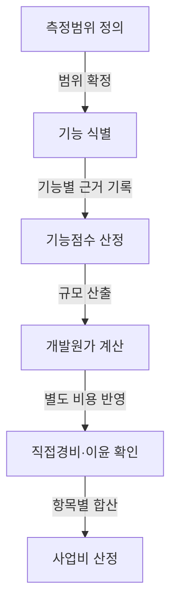

## 지식 로드맵 내 현재 위치

지식 위치: IT 전략·관리 → 공공 SW사업 관리 → **SW사업 대가산정**

## 30초 인출

- 본질: SW사업 대가산정은 사업 유형·범위에 맞는 기준으로 적정 사업 대가를 산출하는 활동.
- 메커니즘: 사업 유형·범위 확정 → 적합한 산정방식 선택 → 원가 항목과 산출근거 계산 → 예산·계약에 반영 → 과업 변경 시 영향 검토.

핵심 용어

- **SW사업 대가산정**: 사업 유형과 범위에 맞는 기준을 적용해 적정 사업 대가를 산출하는 활동
- **FP(Function Point, 기능점수)**: 사용자가 인식하는 기능 규모를 정량화하는 소프트웨어 규모 측정 단위
- **ILF(Internal Logical File, 내부논리파일)**: 측정 대상 시스템이 유지·관리하는 논리 데이터 그룹
- **EIF(External Interface File, 외부연계파일)**: 측정 대상 시스템이 참조하지만 다른 시스템이 유지·관리하는 논리 데이터 그룹
- **EI(External Input, 외부입력)**: 경계 밖에서 들어와 내부 논리 파일을 유지하는 기능
- **EO(External Output, 외부출력)**: 경계 밖으로 나가는 계산·파생 정보를 제공하는 기능
- **EQ(External Inquiry, 외부조회)**: 경계 밖 요청에 계산·파생 데이터 없이 정보를 제공하는 조회 기능
- **과업심의위원회**: 소프트웨어사업 과업의 확정·변경 등 법령에서 정한 사항을 심의하는 위원회

---

## 1교시 예상문제 (10점)

> SW사업 대가산정에 관하여 설명하시오. (예상·10점)

---

## 1교시 10점 답안

### Ⅰ. 개요

| 구분 | 핵심 |
|---|---|
| 정의 | **SW사업 대가산정**은 사업 유형·범위에 맞는 기준으로 적정 사업 대가를 산출하는 활동 |
| 목적 | 사업비 산출근거의 명확화와 합리적인 예산·계약·과업 변경 관리 지원 |

### Ⅱ. 사업 유형별 산정 관점

| 사업 유형 | 산정 관점 |
|---|---|
| 기획·컨설팅 | 세부 유형에 따라 컨설팅 업무량 또는 투입공수 방식 적용 |
| SW개발 | 기능점수(FP) 방식 중심. 기능점수 적용 예외 사업에는 투입공수 방식 적용 |
| SW운영·유지관리 | 유지관리비는 요율제 등 해당 가이드 방식, 운영비는 업무·직무별 투입공수 기준 |

유형별 산정의 세부 조건·단가는 계약 시점의 최신 가이드 확인

### Ⅲ. FP 기반 개발비 산정 흐름

### Ⅳ. 핵심 통제

- 요구사항·산정 내역·예산·계약 범위 간 추적성 유지와 변경 영향 확인.
- 법령상 과업 확정·변경 사항을 심의하는 **과업심의위원회**. 법정 개최 요건·계약 조정의 별도 확인.

- 한 줄 제언: 발주 전 산정 범위·방식·근거를 기록해 예산·계약 기준의 공통 인식 확보

---

## 2~4교시 예상문제 (25점)

> SW사업 대가산정의 개념과 사업 유형별 산정 방법을 설명하고, 비용 산정·변경 시 유의사항을 제시하시오. (예상·25점)

---

## 2~4교시 25점 답안

## Ⅰ. 적정 대가 지급을 위한 SW사업 대가산정의 개요

> 사업 유형·범위와 원가 근거의 연결을 통한 합리적 사업비·계약 기준 설정.

| 구분 | 핵심 |
|---|---|
| 정의 | **SW사업 대가산정**은 사업 유형·범위에 맞는 기준으로 적정 사업 대가를 산출하는 활동 |
| 목적 | 사업비 산출근거의 명확화와 합리적인 예산·계약·과업 변경 관리 지원 |

「소프트웨어 진흥법」 제46조의 국가기관등에 대한 적정 대가 지급 노력 의무. 사업 유형별 산정 방식·기준의 확인 자료인 최신 **SW사업 대가산정 가이드**.

## Ⅱ. 사업유형별 대가산정 체계

> 사업 유형·측정 가능 범위에 따른 가이드 산정방식 선택, 기능점수·투입공수의 무분별한 대체 적용 방지.

| 사업 유형 | 적용 관점·기준 |
|---|---|
| 기획·컨설팅 | 세부 유형에 따라 컨설팅 업무량 또는 투입공수 방식 적용 |
| SW개발 | 기능점수(FP) 방식 중심. 기능점수 적용 예외 사업에는 투입공수 방식 적용 |
| SW운영·유지관리 | 유지관리비는 요율제 등 해당 가이드 방식, 운영비는 업무·직무별 투입공수 기준 |

유형별 세부 조건·단가는 발주·계약 시점의 최신 가이드 확인.

2025년 가이드 적용 사례: 개발·운영 통합사업은 개발비(FP)와 운영·유지관리비(투입공수)의 합산, AI 도입사업은 서비스 이용료·커스터마이징 작업비·구축/개발비의 구분 산정

## Ⅲ. 기능점수 기반 SW개발비 산정 절차

> 기능 단위 요구사항 식별에 따른 규모 측정, 단계별 활동·산출근거의 기록.

| 구성 | 산정 관점 | 합산 관계 |
|---|---|---|
| 개발원가 | 기능규모, 단가와 보정요소를 적용한 개발비용 | SW개발비의 원가 부분 |
| 직접경비 | 사업 수행에 직접 필요한 별도 비용 | 개발원가와 구분하여 합산 |
| 이윤 | 관련 산정기준에 따라 개발원가를 기초로 산정 | 개발원가·직접경비와 구분하여 합산 |
| SW개발비 | 개발 사업의 최종 대가 | **개발원가 + 직접경비 + 이윤** |

## Ⅳ. FP 방식과 투입공수 방식 비교

> 명확한 기능범위에 적합한 **기능점수(FP)** , 기능 식별이 어렵고 전문가 작업량이 핵심인 사업에 적합한 투입공수.

| 기준 | FP 방식 | 투입공수 방식 |
|---|---|---|
| **측정대상** | 사용자 관점 기능규모 | 인력 등급 및 투입 기간(M/M) |
| **적합사업** | 요구사항이 구체화된 신규 개발 | 기획·컨설팅 · 기능 식별 곤란 고난도 연구 |
| **강점** | 기술·생산성과 분리된 객관적 규모 비교 | 직무별 작업량 중심의 신속한 예산 산정 |
| **통제** | 기능 누락·중복 제거 및 복잡도 검증 | 투입 인력 자격·일정 준수·산출물 검증 |

## Ⅴ. 대가산정의 문제점·대응책

> 산정 오차보다 계약과 단절된 산정근거에 따른 무상과업·예산초과·분쟁 위험.

| 위험 | 대책 | 확인 자료 |
|---|---|---|
| 요구 범위와 측정 범위가 다름 | 요구사항과 기능 목록을 대조하고 산정 가정·제외 항목을 기록 | 범위표·기능 목록 |
| 산정 방식·단가 적용 근거가 불분명함 | 사업 유형별 최신 가이드 기준과 적용 근거를 함께 제시 | 산정 내역·기준 출처 |
| 계약 후 과업이 바뀌어 비용·일정 영향이 누락됨 | 변경 내용을 기록하고 법정 심의 대상·개최 요건을 확인해 비용·일정 영향을 검토 | 변경요청·심의 결과·계약 자료 |

## Ⅵ. 기술사적 제언 — 산정방식 선택을 발주 전에 기록

| 문제 | 해결 방안 |
|---|---|
| 계약 후 드러나는 산정방식 전제·측정 한계에 따른 발주자·사업자 간 규모 기준 불일치 | 발주 전 사업유형·산정 범위·적용 가이드 기준·추정 항목과 근거를 산정계획서에 기록하고 입찰·계약 자료와 함께 관리 |

발주 준비 단계의 관리 제안이며, 가이드상 산정방식·법정 심의 요건과 별개로 적용할 보완 조치.

## 출제 이력과 검증 출처

- 공식 문제지 원문으로 확인한 직접 기출 없음
- [KOSA: SW사업 대가산정 가이드 2025년 개정판](https://www.sw.or.kr/site/sw/ex/board/View.do?bcIdx=63607&cbIdx=276)
- [KOSA: 사업 유형에 따른 산정 방식·적용 범위 안내](https://www.sw.or.kr/site/sw/ex/board/View.do?bcIdx=57880&cbIdx=276)
- [국가법령정보센터: 소프트웨어 진흥법 제46조 적정 대가 지급](https://law.go.kr/lsLinkCommonInfo.do?chrClsCd=010202&lsJoLnkSeq=1031494133)
- [국가법령정보센터: 소프트웨어 진흥법 제50조 과업심의위원회](https://law.go.kr/lsLinkCommonInfo.do?chrClsCd=010202&lsJoLnkSeq=1031614467)

## 연결 토픽

- 이전 토픽: [범정부 AI 공통기반](./025_pan_government_ai_common_infrastructure.md)
- 연관 토픽: [ISMP](./001_ismp.md), [RFP](./049_rfp.md), [공공 SW사업 발주·계약](./039_public_sw_contract.md)
- 다음 토픽: [Active-Active 스토리지 DR](./027_active_active_storage_dr.md)
